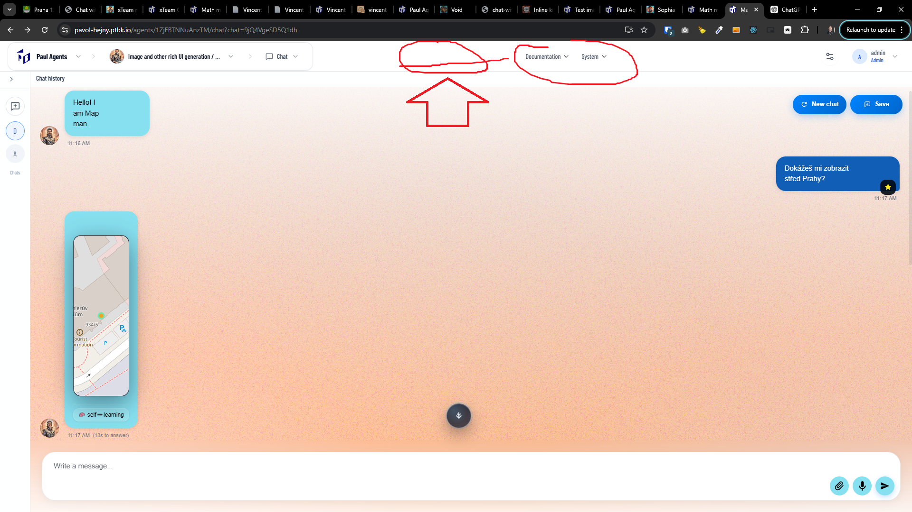
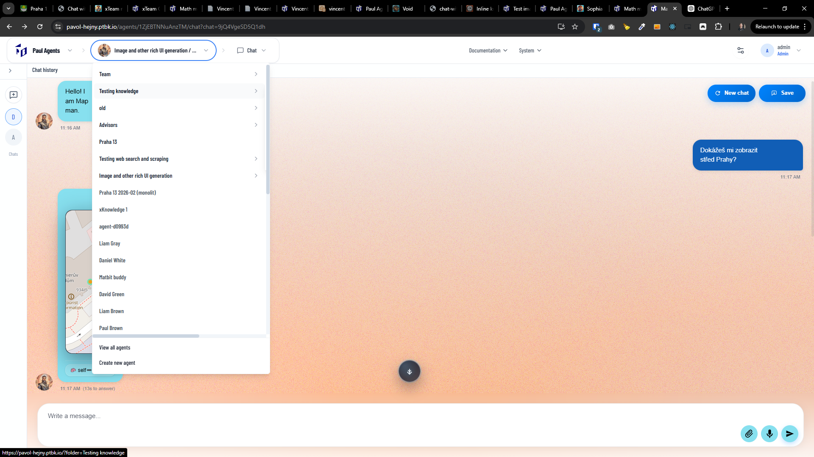

[x] ~$0.08 4 minutes by OpenAI Codex `gpt-5.1-codex-mini`

[✨🛷] Center the middle menu items in the middle of the entire width of the panel, not only their section.

-   Keep in mind the DRY _(don't repeat yourself)_ principle.
-   Do a proper analysis of the current functionality before you start implementing.
-   You are working with the [Agents Server](apps/agents-server)

---

[x] ~$0.21 11 minutes by OpenAI Codex `gpt-5.1-codex-mini`

[✨🛷] Fix the subitems in the menu.

-   There is a system for the subitems in the menu, but these subitems are rendered behind the hidden part of their parent item container.
-   This menu should work as any other multi-level menu in a Windows application or another system.
-   Keep in mind the DRY _(don't repeat yourself)_ principle.
-   Do a proper analysis of the current functionality before you start implementing.
-   You are working with the [Agents Server](apps/agents-server)

---

[-]

[✨🛷] foo

-   Keep in mind the DRY _(don't repeat yourself)_ principle.
-   Do a proper analysis of the current functionality before you start implementing.
-   You are working with the [Agents Server](apps/agents-server)
-   Add the changes into the [changelog](changelog/_current-preversion.md)

---

[-]

[✨🛷] foo

-   Keep in mind the DRY _(don't repeat yourself)_ principle.
-   Do a proper analysis of the current functionality before you start implementing.
-   You are working with the [Agents Server](apps/agents-server)
-   Add the changes into the [changelog](changelog/_current-preversion.md)

