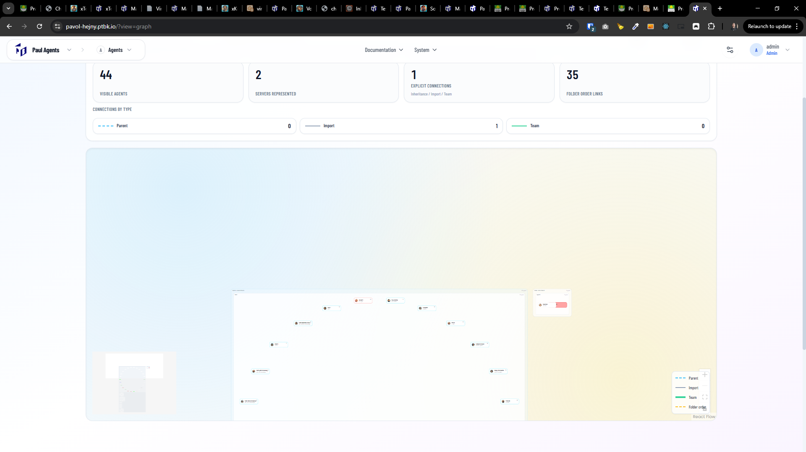

[x] ~$0.16 5 minutes by OpenAI Codex `gpt-5.1-codex-mini`

[✨🚄] Try to enhance the graph on the agents server homepage.

-   Do a proper analysis of the current graph before you start implementing.
-   You are working with the [Agents Server](apps/agents-server)

---

[ ]

[✨🚄] Try to enhance the graph on the agents server homepage.

-   Do a proper analysis of the current graph before you start implementing.
-   When there are a lot of agents, they are arranged in a circle. This looks very bad. Try to arrange them freely or by their relationships and folders.
-   There should be a clear hierarchy. The current server should be in the middle, and there should be clear subsets there should be folders and agents.
-   The arrows between agents are going freely through the folder and server boundary.
-   But the agents, servers, and folders are clearly in the clear subsets.
-   Folders aren't arranged vertically but freely in the graph.
-   You are working with the [Agents Server](apps/agents-server) with [homepage graph view](https://pavol-hejny.ptbk.io/?view=graph)

---

[-]

[✨🚄] bar

-   Keep in mind the DRY _(don't repeat yourself)_ principle.
-   Do a proper analysis of the current functionality before you start implementing.
-   You are working with the [Agents Server](apps/agents-server)
-   Add the changes into the [changelog](changelog/_current-preversion.md)

---

[-]

[✨🚄] bar

-   Keep in mind the DRY _(don't repeat yourself)_ principle.
-   Do a proper analysis of the current functionality before you start implementing.
-   You are working with the [Agents Server](apps/agents-server)
-   Add the changes into the [changelog](changelog/_current-preversion.md)
