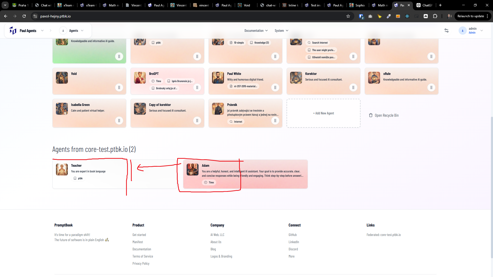

[ ]

[✨😄] Federated agents should be in the same grid with the same width as agents on the current server.

-   Federated agents have currently bigger width than local agents
-   Keep in mind the DRY _(don't repeat yourself)_ principle.
-   Do a proper analysis of the current implementation of homepage and agent list view before you start implementing.
-   You are working with the [Agents Server](apps/agents-server)

---

[-]

[✨😄] baz

-   Keep in mind the DRY _(don't repeat yourself)_ principle.
-   Do a proper analysis of the current functionality before you start implementing.
-   You are working with the [Agents Server](apps/agents-server)
-   Add the changes into the [changelog](changelog/_current-preversion.md)

---

[-]

[✨😄] baz

-   Keep in mind the DRY _(don't repeat yourself)_ principle.
-   Do a proper analysis of the current functionality before you start implementing.
-   You are working with the [Agents Server](apps/agents-server)
-   Add the changes into the [changelog](changelog/_current-preversion.md)

---

[-]

[✨😄] baz

-   Keep in mind the DRY _(don't repeat yourself)_ principle.
-   Do a proper analysis of the current functionality before you start implementing.
-   You are working with the [Agents Server](apps/agents-server)
-   Add the changes into the [changelog](changelog/_current-preversion.md)
