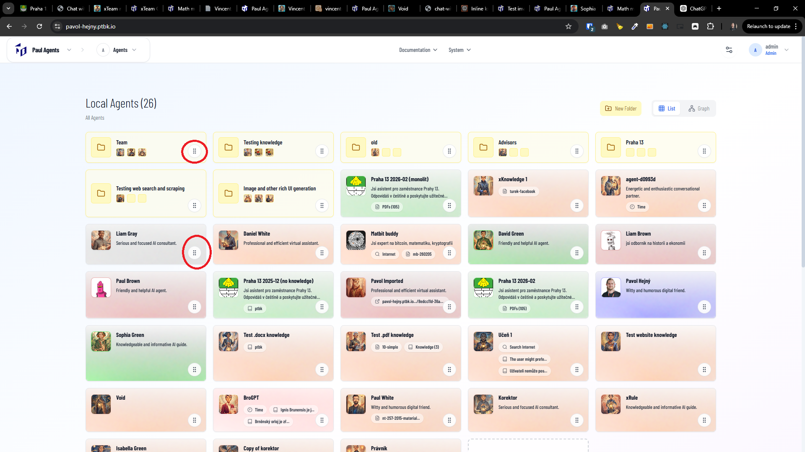

[x] ~$0.00 26 minutes by OpenAI Codex `gpt-5.1-codex-mini`

[✨🧗] In the desktop, allow to drag agents (and folders) on a home page to reorder / put into the folders by their entire area, not only the drag handle.

-   Also hide the drag handles.
-   This is relevant only for desktop. For the mobile and touch screens, keep the current behavior.
-   Keep in mind the DRY _(don't repeat yourself)_ principle.
-   Do a proper analysis of the current implementation of homepage and agent list view and drag-and-drop functionality before you start implementing.
-   You are working with the [Agents Server](apps/agents-server)

---

[-]

[✨🧗] qux

-   Keep in mind the DRY _(don't repeat yourself)_ principle.
-   Do a proper analysis of the current functionality before you start implementing.
-   You are working with the [Agents Server](apps/agents-server)
-   Add the changes into the [changelog](changelog/_current-preversion.md)

---

[-]

[✨🧗] qux

-   Keep in mind the DRY _(don't repeat yourself)_ principle.
-   Do a proper analysis of the current functionality before you start implementing.
-   You are working with the [Agents Server](apps/agents-server)
-   Add the changes into the [changelog](changelog/_current-preversion.md)

---

[-]

[✨🧗] qux

-   Keep in mind the DRY _(don't repeat yourself)_ principle.
-   Do a proper analysis of the current functionality before you start implementing.
-   You are working with the [Agents Server](apps/agents-server)
-   Add the changes into the [changelog](changelog/_current-preversion.md)

