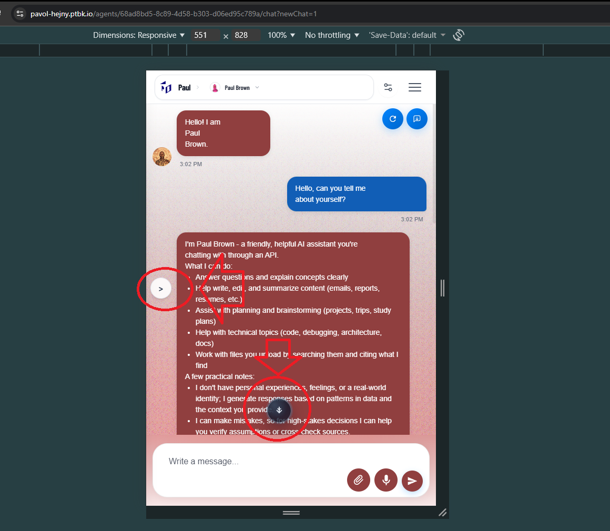
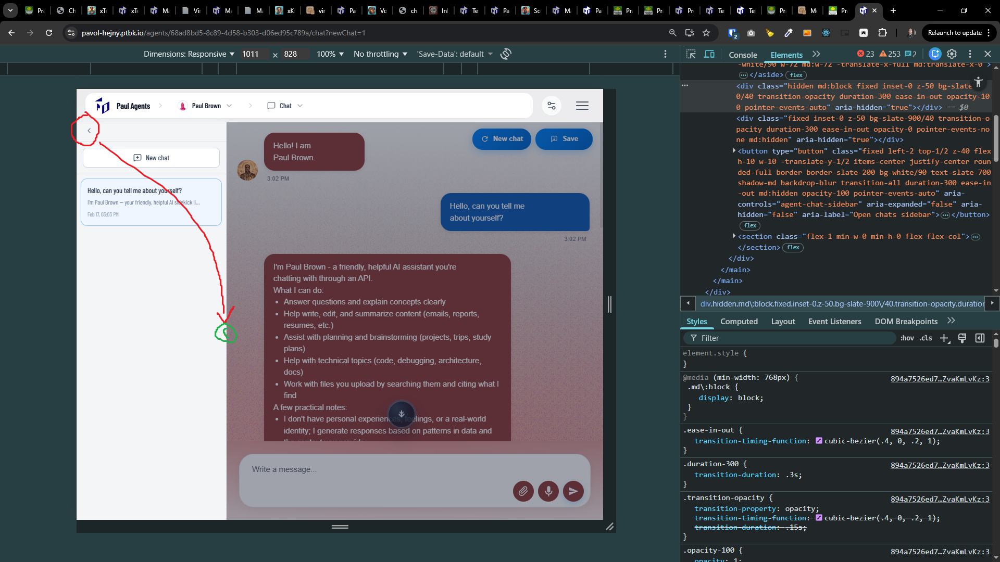

[ ]

[✨🤓] There should be only one component of Arrow which should be reused across the agent server.

-   Currently, there are multiple implementations of arrows in the agent server, and they are not consistent. There should be only one implementation of the arrow component, and it should be reused across the agent server
-   You are working with the [Agents Server](apps/agents-server)

---

[ ]

[✨🤓] Show the open/closing arrow in the middle of the chat's left panel.

-   Keep in mind the DRY _(don't repeat yourself)_ principle.
-   Do a proper analysis of the current functionality before you start implementing.
-   You are working with the [Agents Server](apps/agents-server)
-   Add the changes into the [changelog](changelog/_current-preversion.md)

---

[-]

[✨🤓] bar

-   Keep in mind the DRY _(don't repeat yourself)_ principle.
-   Do a proper analysis of the current functionality before you start implementing.
-   You are working with the [Agents Server](apps/agents-server)
-   Add the changes into the [changelog](changelog/_current-preversion.md)

---

[-]

[✨🤓] bar

-   Keep in mind the DRY _(don't repeat yourself)_ principle.
-   Do a proper analysis of the current functionality before you start implementing.
-   You are working with the [Agents Server](apps/agents-server)
-   Add the changes into the [changelog](changelog/_current-preversion.md)
