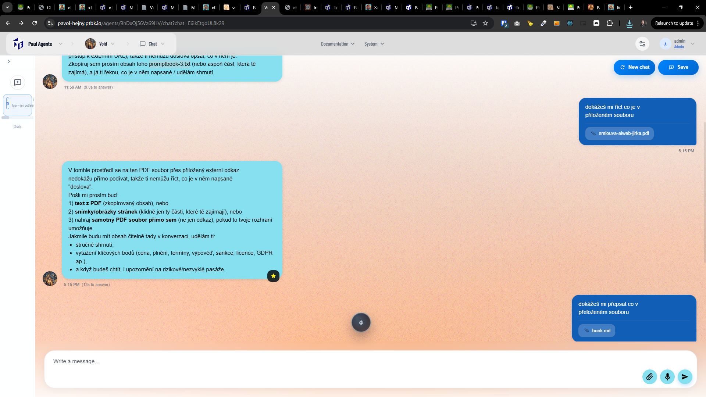
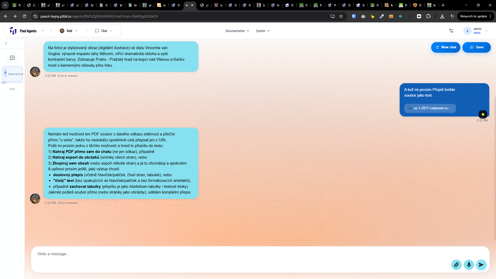

[ ]

[✨👡] The agent should be able to read files which are attached by the user.

-   Keep in mind the DRY _(don't repeat yourself)_ principle.
-   Do a proper analysis of the current functionality of the file attachments before you start implementing.
-   You are working with the [Agents Server](apps/agents-server)

### Knowledge vs. attached files

There are two similar concepts you should know and shouldn't confuse you:

-   **Knowledge** Is a capability of an agent to have some `KNOWLEDGE` section in the source book.
-   **Attached files** Is a capability of an agent to read files which are attached by the user in the chat.

---

[-]

[✨👡] qux

-   Keep in mind the DRY _(don't repeat yourself)_ principle.
-   Do a proper analysis of the current functionality before you start implementing.
-   You are working with the [Agents Server](apps/agents-server)
-   Add the changes into the [changelog](changelog/_current-preversion.md)

---

[-]

[✨👡] qux

-   Keep in mind the DRY _(don't repeat yourself)_ principle.
-   Do a proper analysis of the current functionality before you start implementing.
-   You are working with the [Agents Server](apps/agents-server)
-   Add the changes into the [changelog](changelog/_current-preversion.md)

---

[-]

[✨👡] qux

-   Keep in mind the DRY _(don't repeat yourself)_ principle.
-   Do a proper analysis of the current functionality before you start implementing.
-   You are working with the [Agents Server](apps/agents-server)
-   Add the changes into the [changelog](changelog/_current-preversion.md)
