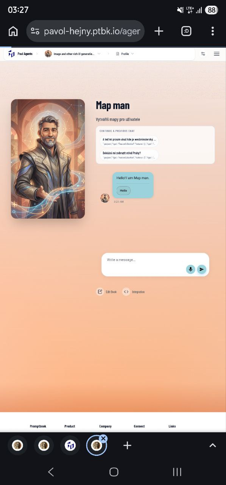

[ ]

[✨☹️] Enhance the design of my chats preview on the agent profile page.

-   Usually, it should be much more fitting into the agent profile.
-   Do a proper analysis of the current agent profile page before you start implementing.
-   You are working with the [Agents Server](apps/agents-server)

### My chats panel in agent profile page

-   The My chats panel in the agent chat page shows the list of chats with this agent, It is ordered by the last chat update time, and shows the name of the chat, the last message and the time of the last update.

---

[-]

[✨☹️] brr

-   Keep in mind the DRY _(don't repeat yourself)_ principle.
-   Do a proper analysis of the current functionality before you start implementing.
-   You are working with the [Agents Server](apps/agents-server)
-   Add the changes into the [changelog](changelog/_current-preversion.md)

---

[-]

[✨☹️] brr

-   Keep in mind the DRY _(don't repeat yourself)_ principle.
-   Do a proper analysis of the current functionality before you start implementing.
-   You are working with the [Agents Server](apps/agents-server)
-   Add the changes into the [changelog](changelog/_current-preversion.md)

---

[-]

[✨☹️] brr

-   Keep in mind the DRY _(don't repeat yourself)_ principle.
-   Do a proper analysis of the current functionality before you start implementing.
-   You are working with the [Agents Server](apps/agents-server)
-   Add the changes into the [changelog](changelog/_current-preversion.md)
