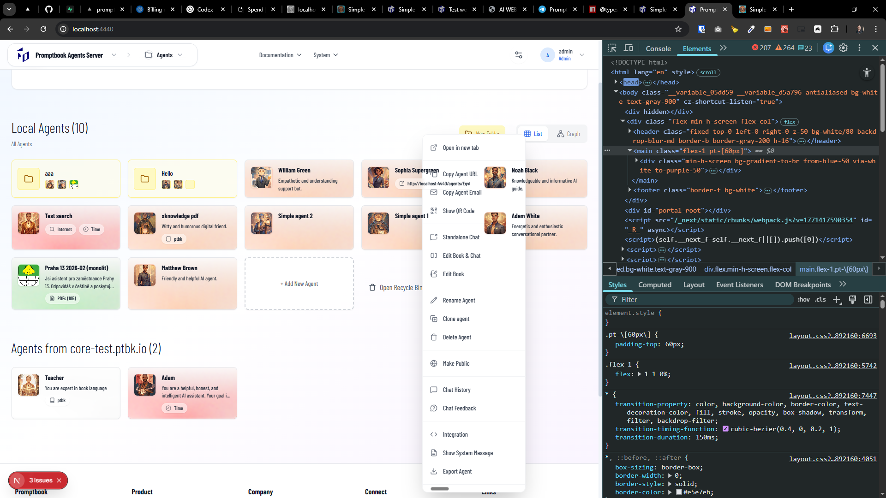
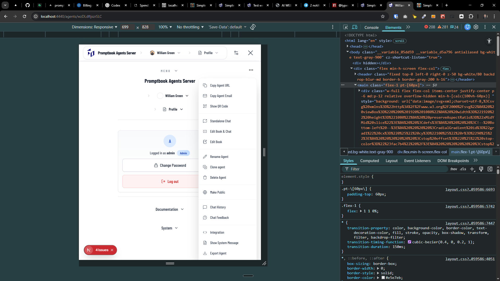

[x] ~$0.77 37 minutes by OpenAI Codex `gpt-5.3-codex`

[✨🚣] Menus in the Agent Server application aren't in the right order (z-index).

-   The agent context menu should be always above the agent items in the folder list view. (For example in http://localhost:4440/)
-   The hamburger menu content should be always above the context menu or any other element which is connected with the agent. (For example in http://localhost:4440/agents/wzDLdftjszrSLC)
-   Do a proper analysis of the current layouts before you start implementing.
-   You are working with the [Agents Server](apps/agents-server)

---

[-]

[✨🚣] baz

-   Keep in mind the DRY _(don't repeat yourself)_ principle.
-   Do a proper analysis of the current functionality before you start implementing.
-   You are working with the [Agents Server](apps/agents-server)
-   Add the changes into the [changelog](changelog/_current-preversion.md)

---

[-]

[✨🚣] baz

-   Keep in mind the DRY _(don't repeat yourself)_ principle.
-   Do a proper analysis of the current functionality before you start implementing.
-   You are working with the [Agents Server](apps/agents-server)
-   Add the changes into the [changelog](changelog/_current-preversion.md)

---

[-]

[✨🚣] baz

-   Keep in mind the DRY _(don't repeat yourself)_ principle.
-   Do a proper analysis of the current functionality before you start implementing.
-   You are working with the [Agents Server](apps/agents-server)
-   Add the changes into the [changelog](changelog/_current-preversion.md)

