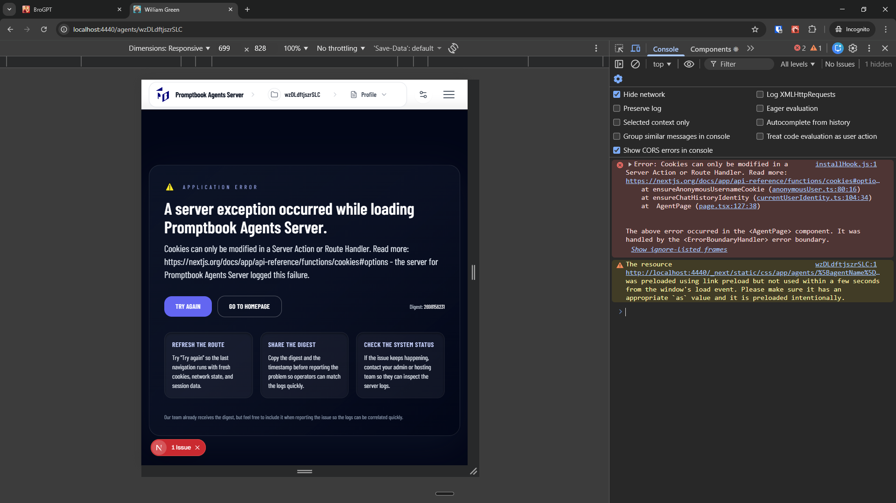

[x] ~$0.19 5 minutes by OpenAI Codex `gpt-5.3-codex`

[✨😬] Fix the application error which occurs in the private window in the agent profile page

```log
installHook.js:1 Error: Cookies can only be modified in a Server Action or Route Handler. Read more: https://nextjs.org/docs/app/api-reference/functions/cookies#options
    at ensureAnonymousUsernameCookie (anonymousUser.ts:80:16)
    at ensureChatHistoryIdentity (currentUserIdentity.ts:104:34)
    at  AgentPage (page.tsx:127:38)

The above error occurred in the <AgentPage> component. It was handled by the <ErrorBoundaryHandler> error boundary.
```

-   This error is occurring on page for example http://localhost:4440/agents/wzDLdftjszrSLC
-   You are working with the [Agents Server](apps/agents-server)



---

[-]

[✨😬] qux

-   Keep in mind the DRY _(don't repeat yourself)_ principle.
-   Do a proper analysis of the current functionality before you start implementing.
-   You are working with the [Agents Server](apps/agents-server)
-   Add the changes into the [changelog](changelog/_current-preversion.md)

---

[-]

[✨😬] qux

-   Keep in mind the DRY _(don't repeat yourself)_ principle.
-   Do a proper analysis of the current functionality before you start implementing.
-   You are working with the [Agents Server](apps/agents-server)
-   Add the changes into the [changelog](changelog/_current-preversion.md)

---

[-]

[✨😬] qux

-   Keep in mind the DRY _(don't repeat yourself)_ principle.
-   Do a proper analysis of the current functionality before you start implementing.
-   You are working with the [Agents Server](apps/agents-server)
-   Add the changes into the [changelog](changelog/_current-preversion.md)

