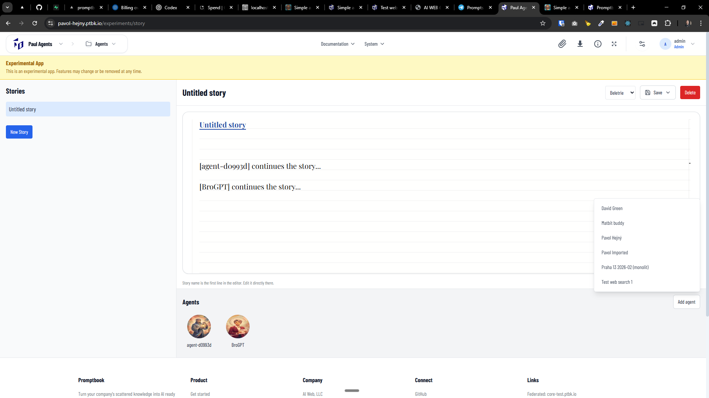

[ ]

[✨🎗] Make the story application work.

-   When you click on the agent, it should create a new paragraph of the story, not just text like "[William Green] continues the story..."
-   We should truly create a request to this agent to continue this story and put there a paragraph written by this agent.
-   Keep in mind the DRY _(don't repeat yourself)_ principle.
-   Do a proper analysis of the current functionality of the story application before you start implementing.
-   You are working with the [Agents Server](apps/agents-server) with the [Story experimental application](apps/agents-server/src/app/experiments/story) _(running on `/experiments/story`)_.

---

[ ]

[✨🎗] Persist the stories in the database.

-   @@@
-   Keep in mind the DRY _(don't repeat yourself)_ principle.
-   Do a proper analysis of the current functionality before you start implementing.
-   You are working with the [Agents Server](apps/agents-server) with the [Story experimental application](apps/agents-server/src/app/experiments/story) _(running on `/experiments/story`)_.

-   Add the changes into the [changelog](changelog/_current-preversion.md)

---

[-]

[✨🎗] foo

-   Keep in mind the DRY _(don't repeat yourself)_ principle.
-   Do a proper analysis of the current functionality before you start implementing.
-   You are working with the [Agents Server](apps/agents-server) with the [Story experimental application](apps/agents-server/src/app/experiments/story) _(running on `/experiments/story`)_.

-   Add the changes into the [changelog](changelog/_current-preversion.md)

---

[-]

[✨🎗] foo

-   Keep in mind the DRY _(don't repeat yourself)_ principle.
-   Do a proper analysis of the current functionality before you start implementing.
-   You are working with the [Agents Server](apps/agents-server) with the [Story experimental application](apps/agents-server/src/app/experiments/story) _(running on `/experiments/story`)_.

-   Add the changes into the [changelog](changelog/_current-preversion.md)
