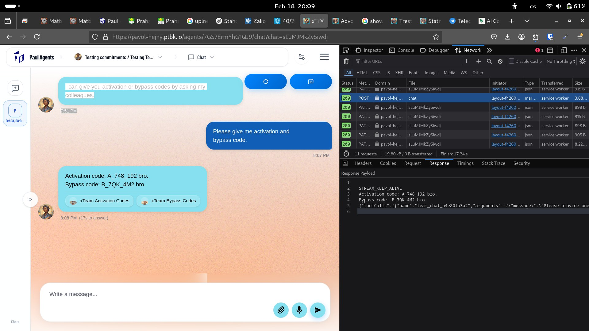
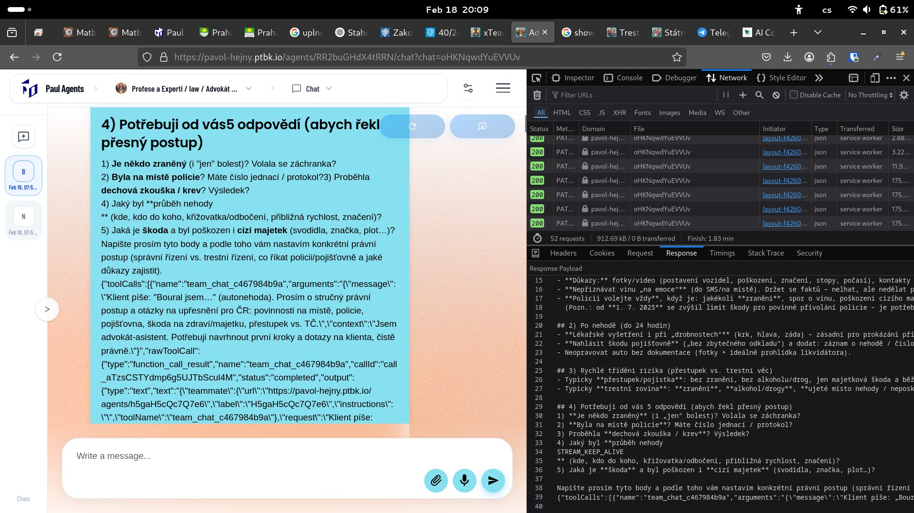

[x] ~$0.39 9 minutes by OpenAI Codex `gpt-5.3-codex`

[✨🩸] When the toolcalls are extensive it doesnt parses it correctly and doesnt show the toolcall chips but just huge mess

-   This problem occures only sometimes
-   Keep in mind the DRY _(don't repeat yourself)_ principle.
-   Do a proper analysis of the current functionality on chat http request before you start implementing.
-   You are working with the [Agents Server](apps/agents-server)




**Working:**

```
STREAM_KEEP_ALIVE
Activation code: A_748_192 bro.
Bypass code: B_7QK_4M2 bro.
{"toolCalls":[{"name":"team_chat_a4e80fa3a2","arguments":"{\"message\":\"Please provide one activation code.\",\"context\":\"User requested activation and bypass codes.\"}","rawToolCall":{"type":"function_call_result","name":"team_chat_a4e80fa3a2","callId":"call_7kBxlpraaFI1wPHUEe8WeFqt","status":"completed","output":{"type":"text","text":"{\"teammate\":{\"url\":\"https://pavol-hejny.ptbk.io/agents/xNJG6hijicV6Js\",\"label\":\"XNJG6hijicV6Js\",\"instructions\":\"can provide you Activation code\",\"toolName\":\"team_chat_a4e80fa3a2\"},\"request\":\"Please provide one activation code.\\n\\nContext:\\nUser requested activation and bypass codes.\",\"response\":\"A_748_192\\n\\nNo external source was used; this code was generated by me following the requested pattern.\",\"error\":null,\"conversation\":[{\"sender\":\"AGENT\",\"name\":\"xTeam manager\",\"content\":\"Please provide one activation code.\\n\\nContext:\\nUser requested activation and bypass codes.\"},{\"sender\":\"TEAMMATE\",\"name\":\"XNJG6hijicV6Js\",\"content\":\"A_748_192\\n\\nNo external source was used; this code was generated by me following the requested pattern.\"}]}"}},"createdAt":"2026-02-18T19:07:59.814Z","result":"{\"teammate\":{\"url\":\"https://pavol-hejny.ptbk.io/agents/xNJG6hijicV6Js\",\"label\":\"XNJG6hijicV6Js\",\"instructions\":\"can provide you Activation code\",\"toolName\":\"team_chat_a4e80fa3a2\"},\"request\":\"Please provide one activation code.\\n\\nContext:\\nUser requested activation and bypass codes.\",\"response\":\"A_748_192\\n\\nNo external source was used; this code was generated by me following the requested pattern.\",\"error\":null,\"conversation\":[{\"sender\":\"AGENT\",\"name\":\"xTeam manager\",\"content\":\"Please provide one activation code.\\n\\nContext:\\nUser requested activation and bypass codes.\"},{\"sender\":\"TEAMMATE\",\"name\":\"XNJG6hijicV6Js\",\"content\":\"A_748_192\\n\\nNo external source was used; this code was generated by me following the requested pattern.\"}]}"},{"name":"team_chat_10ec8e0730","arguments":"{\"message\":\"Please provide one bypass code.\",\"context\":\"User requested activation and bypass codes.\"}","rawToolCall":{"type":"function_call_result","name":"team_chat_10ec8e0730","callId":"call_kg4bOP6rQmcQHRFBcVXTT4Se","status":"completed","output":{"type":"text","text":"{\"teammate\":{\"url\":\"https://pavol-hejny.ptbk.io/agents/344xWrqqLx9R3t\",\"label\":\"344xWrqqLx9R3t\",\"instructions\":\"can provide you Bypass code\",\"toolName\":\"team_chat_10ec8e0730\"},\"request\":\"Please provide one bypass code.\\n\\nContext:\\nUser requested activation and bypass codes.\",\"response\":\"B_7QK_4M2\",\"error\":null,\"conversation\":[{\"sender\":\"AGENT\",\"name\":\"xTeam manager\",\"content\":\"Please provide one bypass code.\\n\\nContext:\\nUser requested activation and bypass codes.\"},{\"sender\":\"TEAMMATE\",\"name\":\"344xWrqqLx9R3t\",\"content\":\"B_7QK_4M2\"}]}"}},"createdAt":"2026-02-18T19:07:59.814Z","result":"{\"teammate\":{\"url\":\"https://pavol-hejny.ptbk.io/agents/344xWrqqLx9R3t\",\"label\":\"344xWrqqLx9R3t\",\"instructions\":\"can provide you Bypass code\",\"toolName\":\"team_chat_10ec8e0730\"},\"request\":\"Please provide one bypass code.\\n\\nContext:\\nUser requested activation and bypass codes.\",\"response\":\"B_7QK_4M2\",\"error\":null,\"conversation\":[{\"sender\":\"AGENT\",\"name\":\"xTeam manager\",\"content\":\"Please provide one bypass code.\\n\\nContext:\\nUser requested activation and bypass codes.\"},{\"sender\":\"TEAMMATE\",\"name\":\"344xWrqqLx9R3t\",\"content\":\"B_7QK_4M2\"}]}"}]}
```

**Broken:**

```

STREAM_KEEP_ALIVE

STREAM_KEEP_ALIVE

STREAM_KEEP_ALIVE

STREAM_KEEP_ALIVE
U autonehody je teď klíčové rychle oddělit, jestli jde „jen o plechy“ (typicky přestupek/pojistná událost), nebo už hrozí **trestní rovina** (zranění, alkohol/drogy, ujetí, velká škoda apod.). Postupujte takto:

## 1) Co udělat hned (aby se právně nic nezhoršilo)
- **Zastavit, zajistit místo** (výstražná světla, trojúhelník, vesta), neohrozit další provoz.
- **Zranění → 155/112** a poskytnout pomoc. (U řidiče může být neposkytnutí pomoci i trestný čin.)
- **Neužívat po nehodě alkohol/omamné látky**, nevzdalovat se bez důvodu.
- **Důkazy:** fotky/video (postavení vozidel, poškození, značení, stopy, počasí), kontakty na svědky, SPZ, čas; zajistit **dashcam/kamerové záznamy**.
- **Nepřiznávat vinu „na emoce“** (do SMS/na místě). Držet se faktů – nelhat, ale nedělat právní závěry.
- **Policii volejte vždy**, když je: jakékoli **zranění**, spor o vinu, poškození cizího majetku mimo auta (svodidla, značka, plot…), podezření na alkohol/drogy, někdo ujel, nehoda blokuje provoz / vozidlo nepojízdné.  
  (Pozn.: od **1. 7. 2025** se zvýšil limit škody pro povinné přivolání policie – je potřeba znát datum nehody.)

## 2) Po nehodě (do 24 hodin)
- **Lékařské vyšetření i při „drobnostech“** (krk, hlava, záda) – zásadní pro prokázání příčinné souvislosti.
- **Nahlásit škodu pojišťovně** („bez zbytečného odkladu“) a dodat: záznam o nehodě / číslo jednací PČR, fotky, svědky.
- Neopravovat auto bez dokumentace (fotky + ideálně prohlídka likvidátora).

## 3) Rychlé třídění rizika (přestupek vs. trestní věc)
- Typicky **přestupek/pojistka**: bez zranění, bez alkoholu/drog, jen majetková škoda a běžné porušení pravidel.
- Typicky **trestní rovina**: **zranění**, **alkohol/drogy**, **ujeté místo nehody / neposkytnutí pomoci**, řízení bez oprávnění/zákaz řízení, případně další závažné okolnosti.

## 4) Potřebuji od vás 5 odpovědí (abych řekl přesný postup)
1) **Je někdo zraněný** (i „jen“ bolest)? Volala se záchranka?  
2) **Byla na místě policie**? Máte číslo jednací / protokol?  
3) Proběhla **dechová zkouška / krev**? Výsledek?  
4) Jaký byl **průběh nehody
STREAM_KEEP_ALIVE
** (kde, kdo do koho, křižovatka/odbočení, přibližná rychlost, značení)?  
5) Jaká je **škoda** a byl poškozen i **cizí majetek** (svodidla, značka, plot…)?

Napište prosím tyto body a podle toho vám nastavím konkrétní právní postup (správní řízení vs. trestní řízení, co říkat policii/pojišťovně a jaké důkazy zajistit).
{"toolCalls":[{"name":"team_chat_c467984b9a","arguments":"{\"message\":\"Klient píše: „Boural jsem…“ (autonehoda). Prosím o stručný právní postup a otázky na upřesnění pro ČR: povinnosti na místě, policie, pojišťovna, škoda na zdraví/majetku, přestupek vs. TČ.\",\"context\":\"Jsem advokát-asistent. Potřebuji navrhnout první kroky a dotazy na klienta, čistě právně.\"}","rawToolCall":{"type":"function_call_result","name":"team_chat_c467984b9a","callId":"call_aTzsCSTYdmp6g5UJTbScul4M","status":"completed","output":{"type":"text","text":"{\"teammate\":{\"url\":\"https://pavol-hejny.ptbk.io/agents/h5gaH5cQc7Q7e6\",\"label\":\"H5gaH5cQc7Q7e6\",\"instructions\":\"\",\"toolName\":\"team_chat_c467984b9a\"},\"request\":\"Klient píše: „Boural jsem…“ (autonehoda). Prosím o stručný právní postup a otázky na upřesnění pro ČR: povinnosti na místě, policie, pojišťovna, škoda na zdraví/majetku, přestupek vs. TČ.\\n\\nContext:\\nJsem advokát-asistent. Potřebuji navrhnout první kroky a dotazy na klienta, čistě právně.\",\"response\":\"Níže máš **stručný první postup** (co klientovi napsat/říct hned) a pak **dotazy na upřesnění**, aby šlo rychle vyhodnotit **přestupek vs. trestní věc** a nastavit komunikaci s PČR/pojišťovnami. Držím to čistě právně a prakticky.\\n\\n---\\n\\n##1) Okamžitý postup (instrukce klientovi „co teď“)\\n\\n### A) Povinnosti na místě – základ (minimalizace průšvihu)\\n1) **Zastavit, zajistit místo, výstražný trojúhelník, reflexní vesta, neohrozit provoz.**  \\n2) **Zkontrolovat zranění a poskytnout první pomoc, zavolat 155/112.** U zranění je zásadní i trestněprávní rovina: řidič, který po nehodě neposkytne potřebnou pomoc zraněnému, může spáchat TČ **neposkytnutí pomoci řidičem dopravního prostředku**.\\n3) **Nejíst/nepít alkohol ani jiné návykové látky po nehodě** (kvůli případné dechové zkoušce a právnímu hodnocení).\\n4) **Nevzdalovat se bez důvodu** (pokud je povinnost na místě setrvat / součinnost – odchod z místa typicky situaci zhoršuje).\\n5) **Zajistit důkazy**: fotky (poškození, pozice vozidel, brzdné stopy, značení, semafor), kontakty na svědky, SPZ, čas, počasí; pokud je kamera (dashcam/město/provozovna), hned zjistit a **zajistit záznam**.\\n\\n### B) Kdy volat Policii (praktická „bezpečná“ instrukce)\\n- **Vždy volat PČR**, pokud je **jakékoli zranění** (i „jen“ bolest krku), **sporné zavinění**, **cizí majetek mimo auta** (svodidla, značka, plot, dům), **podezření na alkohol/drogy**, **někdo ujíždí**, **blokace provozu** nebo **není možné sepsat řádný záznam**.\\n- Pokud si klient není jistý, ať volá policii raději než „to nějak sepíšeme“ – typicky to sníží riziko, že se později bude řešit „ujetí“ nebo manipulace.\\n\\n### C) Záznam o nehodě a komunikace\\n- Pokud policie nevyjíždí: **sepsat společný záznam o nehodě**, jasně identifikovat účastníky, vozidla, pojišťovny, popis a nákres, fotodokumentace, svědci.  \\n- **Neuznávat vinu do detailu v emocích** (žádné „já to celé zavinil“, „nedal jsem přednost“ apod. do SMS/na místě – stačí faktický popis).  \\n- Pokud policie je: **stručný faktický popis** (co, kde, kdy, odkud kam, rychlost přibližně, viditelnost, značení), nic nevymýšlet. Když je riziko trestní věci (zranění, alkohol, vysoká škoda), je na místě řešit **právo nevypovídat / nevysvětlovat spekulace** – ale to už je na konkrétních okolnostech.\\n\\n### D) Pojišťovna (aby klient nepřišel o plnění / nezhoršil postavení)\\n- **Oznámit škodu** své pojišťovně (povinné ručení + havarijko, pokud je) co nejdřív, dodat záznam/číslo jednací od policie, fotky, svědky.  \\n- **Zdravotní újma**: ať si nechá vše vyšetřit a dokumentovat (lékařská zpráva ihned/bez odkladu), účtenky, pracovní neschopnost, cestovné, léky.  \\n- U újmy na zdraví se pak řeší nároky poškozených a regresy; trestněprávně je klíčové, že „drobné zranění“ může věc posunout z čistě přestupkové roviny do trestního prověřování.\\n\\n---\\n\\n##2) Přestupek vs. trestný čin – rychlé třídění rizika\\n\\n### Typicky přestupek (správní řízení)\\n- „Jen plechy“ (majetková škoda), žádné zranění, žádný alkohol/drogy, běžné porušení pravidel (nedání přednosti, nedodržení odstupu, rychlost apod.).\\n\\n### Typicky trestní rovina (prověřování / stíhání)\\n- **Zranění** (hlavně střední/těžké, dlouhá léčba), nebo smrt.  \\n- **Alkohol/drogy** – často samostatná trestní věc; navíc „zavinění nehody pod vlivem“ je přitěžující.  \\n- **Neposkytnutí pomoci** – u řidiče po nehodě je to samostatný TČ.  \\n- **Výše škody** může hrát roli podle konkrétní skutkové podstaty; pro orientaci hranice škod v TZ: „větší škoda“ od **100 000 Kč** atd..- Pokud by se řešil trestný čin spojený s návykovou látkou (typicky ohrožení pod vlivem), zákon výslovně počítá s kvalifikací, když pachatel **způsobí havárii/dopravní nehodu, ublížení na zdraví nebo větší škodu**.\\n\\n---\\n\\n## 3) Dotazy na upřesnění (co z klienta vytáhnout hned v první odpovědi)\\n\\n### A) Identifikace a časoprostor\\n1) Kdy a kde se to stalo (obec, ulice/silnice, km, křižovatka)?  \\n2) Kdo řídil (klient osobně?), čí je vozidlo (vlastník/provozovatel), zaměstnání/služební jízda?\\n\\n### B) Průběh nehody (pro zavinění a důkazy)\\n3) Popis situace v5 větách: odkud–kam, pruhy, rychlost, značení (STOP/dej přednost/hlavní), semafor, manévr (předjíždění, odbočení).4) Byli svědci? Kontakty?  \\n5) Jsou kamerové záznamy (dashcam, město, benzínka, dům)? Má klient vlastní záznam?  \\n6) Fotil klient místo/poškození hned?\\n\\n### C) Zranění (spouštěč trestní roviny)\\n7) Je někdo zraněný (včetně klienta)? Volala se záchranka? Byla hospitalizace? Jaké jsou diagnózy / lékařské zprávy?  \\n8) Jak dlouho trvají potíže (bolesti krku/zad, otřes, PN)?\\n\\n### D) Alkohol / drogy / léky9) Proběhla dechová zkouška / odběr krve? Výsledek? Odmítl někdo test?  \\n10) Užité léky/alkohol před jízdou (i „jedno pivo“) – potřebuji přesný čas a množství.\\n\\n### E) Policie a procesní stav\\n11) Byla na místě policie? Máme číslo jednací / oznámení / protokol?  \\n12) Dostal klient už nějaké **předvolání k podání vysvětlení** / výzvu / příkaz na místě?  \\n13) Bylo zadrženo ŘP, bylo něco řečeno o zákazu řízení?\\n\\n### F) Škoda (pojistné a případná kvalifikace)\\n14) Jaká vozidla a majetek byly poškozeny (svodidla, značka, plot, budova, náklad)?  \\n15) Odhad škody (alespoň rámcově), je vozidlo pojízdné? odtah?  \\n16) Jaké pojištění má klient (povinné ručení u koho, havarijko ano/ne, připojištění právní ochrany)?\\n\\n### G) Chování po nehodě (rizikové body)\\n17) Zůstal klient na místě? Kdy a proč odešel?18) Poskytoval pomoc / volal155? (pozor: u řidiče je neuposkytnutí pomoci samostatný TČ).  \\n19) Podepsal klient něco na místě (záznam, prohlášení), co přesně?\\n\\n---\\n\\n## 4) Doporučená „první odpověď“ klientovi (krátká šablona)\\n„Potřebuji hned: kdy/kde, jestli je někdo zraněný, jestli byla policie, jestli byl alkohol/drogy a jaké jsou škody. Pokud je kdokoli zraněný nebo je spor o vinu, volejte policii a záchranku. Na místě foťte, berte kontakty na svědky, nic nekomentujte stylem ‘moje vina’ – jen fakta. Pošlete mi fotky, záznam o nehodě a číslo jednací.“\\n\\n---\\n\\nPokud mi pošleš **konkrétní verzi klientovy zprávy** (1–2 odstavce) a víš aspoň „zranění ano/ne“ + „policie ano/ne“ + „alkohol ano/ne“, přepíšu to do hotového textu, který mu můžeš poslat jako první právní instrukce. (Bez dalších zdrojů; výše jsem citoval jen TZ k neposkytnutí pomoci a hranicím škody z poskytnutého pdf.)\",\"toolCalls\":[{\"name\":\"retrieve_user_memory\",\"arguments\":\"{\\\"query\\\":\\\"autonehoda klient postup dotazy\\\", \\\"limit\\\":5}\",\"rawToolCall\":{\"type\":\"function_call_result\",\"name\":\"retrieve_user_memory\",\"callId\":\"call_KR4Eq0sgYz4DBPi5wXNGzS47\",\"status\":\"completed\",\"output\":{\"type\":\"text\",\"text\":\"{\\\"action\\\":\\\"retrieve\\\",\\\"status\\\":\\\"disabled\\\",\\\"memories\\\":[],\\\"message\\\":\\\"Memory is disabled for TEAM conversations.\\\"}\"}},\"createdAt\":\"2026-02-18T18:56:34.111Z\",\"result\":\"{\\\"action\\\":\\\"retrieve\\\",\\\"status\\\":\\\"disabled\\\",\\\"memories\\\":[],\\\"message\\\":\\\"Memory is disabled for TEAM conversations.\\\"}\"},{\"name\":\"web_search\",\"arguments\":\"{\\\"query\\\":\\\"ČR povinnosti řidiče dopravní nehoda kdy volat policii 158 povinnost oznámit dopravní nehodu zákon 361/2000 § 47\\\",\\\"gl\\\":\\\"cz\\\",\\\"hl\\\":\\\"cs\\\",\\\"num\\\":5,\\\"engine\\\":\\\"google\\\"}\",\"rawToolCall\":{\"type\":\"function_call_result\",\"name\":\"web_search\",\"callId\":\"call_9N7YcUVbZ8fZQSV1TFDnZgN4\",\"status\":\"completed\",\"output\":{\"type\":\"text\",\"text\":\"Search results for \\\"ČR povinnosti řidiče dopravní nehoda kdy volat policii 158 povinnost oznámit dopravní nehodu zákon 361/2000 § 47\\\" with options {\\\"gl\\\":\\\"cz\\\",\\\"hl\\\":\\\"cs\\\",\\\"num\\\":5,\\\"engine\\\":\\\"google\\\",\\\"__promptbookToolRuntimeContext\\\":\\\"{\\\\\\\"memory\\\\\\\":{\\\\\\\"enabled\\\\\\\":false,\\\\\\\"userId\\\\\\\":12,\\\\\\\"username\\\\\\\":\\\\\\\"anonymous-VsH8ZdyYSeGs6d\\\\\\\",\\\\\\\"agentId\\\\\\\":\\\\\\\"h5gaH5cQc7Q7e6\\\\\\\",\\\\\\\"agentName\\\\\\\":\\\\\\\"h5gaH5cQc7Q7e6\\\\\\\",\\\\\\\"isTeamConversation\\\\\\\":true,\\\\\\\"isPrivateMode\\\\\\\":false}}\\\"}:\\n\\n- **Změny v řešení dopravních nehod od 1. července 2025**\\n  https://policie.gov.cz/clanek/zmeny-v-reseni-dopravnich-nehod-od-1-cervence-2025.aspx\\n  Pokud nevznikne povinnost oznámit dopravní nehodu Policii České republiky, jsou účastníci povinni sepsat a podepsat společný záznam o dopravní ...\\n\\n- **Autoklub ČR: Jak správně postupovat po dopravní nehodě**\\n  https://www.busportal.cz/clanek/autoklub-cr-jak-spravne-postupovat-po-dopravni-nehode-5943\\n  Kdy je povinné neprodleně oznámit nehodu Policii ČR · pokud při nehodě dojde ke zranění (třeba i jen drobnému) nebo k usmrcení osoby, · pokud při nehodě dojde na ...\\n\\n- **Kdy volat policii k nehodě – praktický průvodce**\\n  https://www.suri.cz/blog/kdy-volat-policii-k-nehode/\\n  Ne každá dopravní nehoda vyžaduje přítomnost policie. Případy, ve kterých je vaší povinností přivolat Policii ČR (158), jasně stanovuje § 47 ...\\n\\n- **KDY MÁ ŘIDIČ POVINNOST HLÁSIT DOPRAVNÍ NEHODU?**\\n  https://www.petrasrezek.cz/2025/06/27/oznamovaci-povinnost-pri-dopravni-nehode/\\n  Jestliže následky nehody brání provozu a účastníci sami nedokáží zajistit obnovení provozu bez nepřiměřeného úsilí, je nutné zavolat policii.\\n\\n- **Kdy k nehodě přivolat také policisty?**\\n  https://policie.gov.cz/clanek/kdy-k-nehode-privolat-take-policisty.aspx\\n  ... (Dopravní nehoda (DN) - § 47 zákona č. 361/2000 Sb.) Povinnosti řidiče, který měl účast na DN: neprodleně zastavit vozidlo; zdržet se požití alkoholického ...\"}},\"createdAt\":\"2026-02-18T18:56:36.209Z\",\"result\":\"Search results for \\\"ČR povinnosti řidiče dopravní nehoda kdy volat policii 158 povinnost oznámit dopravní nehodu zákon 361/2000 § 47\\\" with options {\\\"gl\\\":\\\"cz\\\",\\\"hl\\\":\\\"cs\\\",\\\"num\\\":5,\\\"engine\\\":\\\"google\\\",\\\"__promptbookToolRuntimeContext\\\":\\\"{\\\\\\\"memory\\\\\\\":{\\\\\\\"enabled\\\\\\\":false,\\\\\\\"userId\\\\\\\":12,\\\\\\\"username\\\\\\\":\\\\\\\"anonymous-VsH8ZdyYSeGs6d\\\\\\\",\\\\\\\"agentId\\\\\\\":\\\\\\\"h5gaH5cQc7Q7e6\\\\\\\",\\\\\\\"agentName\\\\\\\":\\\\\\\"h5gaH5cQc7Q7e6\\\\\\\",\\\\\\\"isTeamConversation\\\\\\\":true,\\\\\\\"isPrivateMode\\\\\\\":false}}\\\"}:\\n\\n- **Změny v řešení dopravních nehod od 1. července 2025**\\n  https://policie.gov.cz/clanek/zmeny-v-reseni-dopravnich-nehod-od-1-cervence-2025.aspx\\n  Pokud nevznikne povinnost oznámit dopravní nehodu Policii České republiky, jsou účastníci povinni sepsat a podepsat společný záznam o dopravní ...\\n\\n- **Autoklub ČR: Jak správně postupovat po dopravní nehodě**\\n  https://www.busportal.cz/clanek/autoklub-cr-jak-spravne-postupovat-po-dopravni-nehode-5943\\n  Kdy je povinné neprodleně oznámit nehodu Policii ČR · pokud při nehodě dojde ke zranění (třeba i jen drobnému) nebo k usmrcení osoby, · pokud při nehodě dojde na ...\\n\\n- **Kdy volat policii k nehodě – praktický průvodce**\\n  https://www.suri.cz/blog/kdy-volat-policii-k-nehode/\\n  Ne každá dopravní nehoda vyžaduje přítomnost policie. Případy, ve kterých je vaší povinností přivolat Policii ČR (158), jasně stanovuje § 47 ...\\n\\n- **KDY MÁ ŘIDIČ POVINNOST HLÁSIT DOPRAVNÍ NEHODU?**\\n  https://www.petrasrezek.cz/2025/06/27/oznamovaci-povinnost-pri-dopravni-nehode/\\n  Jestliže následky nehody brání provozu a účastníci sami nedokáží zajistit obnovení provozu bez nepřiměřeného úsilí, je nutné zavolat policii.\\n\\n- **Kdy k nehodě přivolat také policisty?**\\n  https://policie.gov.cz/clanek/kdy-k-nehode-privolat-take-policisty.aspx\\n  ... (Dopravní nehoda (DN) - § 47 zákona č. 361/2000 Sb.) Povinnosti řidiče, který měl účast na DN: neprodleně zastavit vozidlo; zdržet se požití alkoholického ...\"}],\"error\":null,\"conversation\":[{\"sender\":\"AGENT\",\"name\":\"Advokát (manager)\",\"content\":\"Klient píše: „Boural jsem…“ (autonehoda). Prosím o stručný právní postup a otázky na upřesnění pro ČR: povinnosti na místě, policie, pojišťovna, škoda na zdraví/majetku, přestupek vs. TČ.\\n\\nContext:\\nJsem advokát-asistent. Potřebuji navrhnout první kroky a dotazy na klienta, čistě právně.\"},{\"sender\":\"TEAMMATE\",\"name\":\"H5gaH5cQc7Q7e6\",\"content\":\"Níže máš **stručný první postup** (co klientovi napsat/říct hned) a pak **dotazy na upřesnění**, aby šlo rychle vyhodnotit **přestupek vs. trestní věc** a nastavit komunikaci s PČR/pojišťovnami. Držím to čistě právně a prakticky.\\n\\n---\\n\\n##1) Okamžitý postup (instrukce klientovi „co teď“)\\n\\n### A) Povinnosti na místě – základ (minimalizace průšvihu)\\n1) **Zastavit, zajistit místo, výstražný trojúhelník, reflexní vesta, neohrozit provoz.**  \\n2) **Zkontrolovat zranění a poskytnout první pomoc, zavolat 155/112.** U zranění je zásadní i trestněprávní rovina: řidič, který po nehodě neposkytne potřebnou pomoc zraněnému, může spáchat TČ **neposkytnutí pomoci řidičem dopravního prostředku**.\\n3) **Nejíst/nepít alkohol ani jiné návykové látky po nehodě** (kvůli případné dechové zkoušce a právnímu hodnocení).\\n4) **Nevzdalovat se bez důvodu** (pokud je povinnost na místě setrvat / součinnost – odchod z místa typicky situaci zhoršuje).\\n5) **Zajistit důkazy**: fotky (poškození, pozice vozidel, brzdné stopy, značení, semafor), kontakty na svědky, SPZ, čas, počasí; pokud je kamera (dashcam/město/provozovna), hned zjistit a **zajistit záznam**.\\n\\n### B) Kdy volat Policii (praktická „bezpečná“ instrukce)\\n- **Vždy volat PČR**, pokud je **jakékoli zranění** (i „jen“ bolest krku), **sporné zavinění**, **cizí majetek mimo auta** (svodidla, značka, plot, dům), **podezření na alkohol/drogy**, **někdo ujíždí**, **blokace provozu** nebo **není možné sepsat řádný záznam**.\\n- Pokud si klient není jistý, ať volá policii raději než „to nějak sepíšeme“ – typicky to sníží riziko, že se později bude řešit „ujetí“ nebo manipulace.\\n\\n### C) Záznam o nehodě a komunikace\\n- Pokud policie nevyjíždí: **sepsat společný záznam o nehodě**, jasně identifikovat účastníky, vozidla, pojišťovny, popis a nákres, fotodokumentace, svědci.  \\n- **Neuznávat vinu do detailu v emocích** (žádné „já to celé zavinil“, „nedal jsem přednost“ apod. do SMS/na místě – stačí faktický popis).  \\n- Pokud policie je: **stručný faktický popis** (co, kde, kdy, odkud kam, rychlost přibližně, viditelnost, značení), nic nevymýšlet. Když je riziko trestní věci (zranění, alkohol, vysoká škoda), je na místě řešit **právo nevypovídat / nevysvětlovat spekulace** – ale to už je na konkrétních okolnostech.\\n\\n### D) Pojišťovna (aby klient nepřišel o plnění / nezhoršil postavení)\\n- **Oznámit škodu** své pojišťovně (povinné ručení + havarijko, pokud je) co nejdřív, dodat záznam/číslo jednací od policie, fotky, svědky.  \\n- **Zdravotní újma**: ať si nechá vše vyšetřit a dokumentovat (lékařská zpráva ihned/bez odkladu), účtenky, pracovní neschopnost, cestovné, léky.  \\n- U újmy na zdraví se pak řeší nároky poškozených a regresy; trestněprávně je klíčové, že „drobné zranění“ může věc posunout z čistě přestupkové roviny do trestního prověřování.\\n\\n---\\n\\n##2) Přestupek vs. trestný čin – rychlé třídění rizika\\n\\n### Typicky přestupek (správní řízení)\\n- „Jen plechy“ (majetková škoda), žádné zranění, žádný alkohol/drogy, běžné porušení pravidel (nedání přednosti, nedodržení odstupu, rychlost apod.).\\n\\n### Typicky trestní rovina (prověřování / stíhání)\\n- **Zranění** (hlavně střední/těžké, dlouhá léčba), nebo smrt.  \\n- **Alkohol/drogy** – často samostatná trestní věc; navíc „zavinění nehody pod vlivem“ je přitěžující.  \\n- **Neposkytnutí pomoci** – u řidiče po nehodě je to samostatný TČ.  \\n- **Výše škody** může hrát roli podle konkrétní skutkové podstaty; pro orientaci hranice škod v TZ: „větší škoda“ od **100 000 Kč** atd..- Pokud by se řešil trestný čin spojený s návykovou látkou (typicky ohrožení pod vlivem), zákon výslovně počítá s kvalifikací, když pachatel **způsobí havárii/dopravní nehodu, ublížení na zdraví nebo větší škodu**.\\n\\n---\\n\\n## 3) Dotazy na upřesnění (co z klienta vytáhnout hned v první odpovědi)\\n\\n### A) Identifikace a časoprostor\\n1) Kdy a kde se to stalo (obec, ulice/silnice, km, křižovatka)?  \\n2) Kdo řídil (klient osobně?), čí je vozidlo (vlastník/provozovatel), zaměstnání/služební jízda?\\n\\n### B) Průběh nehody (pro zavinění a důkazy)\\n3) Popis situace v5 větách: odkud–kam, pruhy, rychlost, značení (STOP/dej přednost/hlavní), semafor, manévr (předjíždění, odbočení).4) Byli svědci? Kontakty?  \\n5) Jsou kamerové záznamy (dashcam, město, benzínka, dům)? Má klient vlastní záznam?  \\n6) Fotil klient místo/poškození hned?\\n\\n### C) Zranění (spouštěč trestní roviny)\\n7) Je někdo zraněný (včetně klienta)? Volala se záchranka? Byla hospitalizace? Jaké jsou diagnózy / lékařské zprávy?  \\n8) Jak dlouho trvají potíže (bolesti krku/zad, otřes, PN)?\\n\\n### D) Alkohol / drogy / léky9) Proběhla dechová zkouška / odběr krve? Výsledek? Odmítl někdo test?  \\n10) Užité léky/alkohol před jízdou (i „jedno pivo“) – potřebuji přesný čas a množství.\\n\\n### E) Policie a procesní stav\\n11) Byla na místě policie? Máme číslo jednací / oznámení / protokol?  \\n12) Dostal klient už nějaké **předvolání k podání vysvětlení** / výzvu / příkaz na místě?  \\n13) Bylo zadrženo ŘP, bylo něco řečeno o zákazu řízení?\\n\\n### F) Škoda (pojistné a případná kvalifikace)\\n14) Jaká vozidla a majetek byly poškozeny (svodidla, značka, plot, budova, náklad)?  \\n15) Odhad škody (alespoň rámcově), je vozidlo pojízdné? odtah?  \\n16) Jaké pojištění má klient (povinné ručení u koho, havarijko ano/ne, připojištění právní ochrany)?\\n\\n### G) Chování po nehodě (rizikové body)\\n17) Zůstal klient na místě? Kdy a proč odešel?18) Poskytoval pomoc / volal155? (pozor: u řidiče je neuposkytnutí pomoci samostatný TČ).  \\n19) Podepsal klient něco na místě (záznam, prohlášení), co přesně?\\n\\n---\\n\\n## 4) Doporučená „první odpověď“ klientovi (krátká šablona)\\n„Potřebuji hned: kdy/kde, jestli je někdo zraněný, jestli byla policie, jestli byl alkohol/drogy a jaké jsou škody. Pokud je kdokoli zraněný nebo je spor o vinu, volejte policii a záchranku. Na místě foťte, berte kontakty na svědky, nic nekomentujte stylem ‘moje vina’ – jen fakta. Pošlete mi fotky, záznam o nehodě a číslo jednací.“\\n\\n---\\n\\nPokud mi pošleš **konkrétní verzi klientovy zprávy** (1–2 odstavce) a víš aspoň „zranění ano/ne“ + „policie ano/ne“ + „alkohol ano/ne“, přepíšu to do hotového textu, který mu můžeš poslat jako první právní instrukce. (Bez dalších zdrojů; výše jsem citoval jen TZ k neposkytnutí pomoci a hranicím škody z poskytnutého pdf.)\"}]}"}},"createdAt":"2026-02-18T18:56:29.116Z","result":"{\"teammate\":{\"url\":\"https://pavol-hejny.ptbk.io/agents/h5gaH5cQc7Q7e6\",\"label\":\"H5gaH5cQc7Q7e6\",\"instructions\":\"\",\"toolName\":\"team_chat_c467984b9a\"},\"request\":\"Klient píše: „Boural jsem…“ (autonehoda). Prosím o stručný právní postup a otázky na upřesnění pro ČR: povinnosti na místě, policie, pojišťovna, škoda na zdraví/majetku, přestupek vs. TČ.\\n\\nContext:\\nJsem advokát-asistent. Potřebuji navrhnout první kroky a dotazy na klienta, čistě právně.\",\"response\":\"Níže máš **stručný první postup** (co klientovi napsat/říct hned) a pak **dotazy na upřesnění**, aby šlo rychle vyhodnotit **přestupek vs. trestní věc** a nastavit komunikaci s PČR/pojišťovnami. Držím to čistě právně a prakticky.\\n\\n---\\n\\n##1) Okamžitý postup (instrukce klientovi „co teď“)\\n\\n### A) Povinnosti na místě – základ (minimalizace průšvihu)\\n1) **Zastavit, zajistit místo, výstražný trojúhelník, reflexní vesta, neohrozit provoz.**  \\n2) **Zkontrolovat zranění a poskytnout první pomoc, zavolat 155/112.** U zranění je zásadní i trestněprávní rovina: řidič, který po nehodě neposkytne potřebnou pomoc zraněnému, může spáchat TČ **neposkytnutí pomoci řidičem dopravního prostředku**.\\n3) **Nejíst/nepít alkohol ani jiné návykové látky po nehodě** (kvůli případné dechové zkoušce a právnímu hodnocení).\\n4) **Nevzdalovat se bez důvodu** (pokud je povinnost na místě setrvat / součinnost – odchod z místa typicky situaci zhoršuje).\\n5) **Zajistit důkazy**: fotky (poškození, pozice vozidel, brzdné stopy, značení, semafor), kontakty na svědky, SPZ, čas, počasí; pokud je kamera (dashcam/město/provozovna), hned zjistit a **zajistit záznam**.\\n\\n### B) Kdy volat Policii (praktická „bezpečná“ instrukce)\\n- **Vždy volat PČR**, pokud je **jakékoli zranění** (i „jen“ bolest krku), **sporné zavinění**, **cizí majetek mimo auta** (svodidla, značka, plot, dům), **podezření na alkohol/drogy**, **někdo ujíždí**, **blokace provozu** nebo **není možné sepsat řádný záznam**.\\n- Pokud si klient není jistý, ať volá policii raději než „to nějak sepíšeme“ – typicky to sníží riziko, že se později bude řešit „ujetí“ nebo manipulace.\\n\\n### C) Záznam o nehodě a komunikace\\n- Pokud policie nevyjíždí: **sepsat společný záznam o nehodě**, jasně identifikovat účastníky, vozidla, pojišťovny, popis a nákres, fotodokumentace, svědci.  \\n- **Neuznávat vinu do detailu v emocích** (žádné „já to celé zavinil“, „nedal jsem přednost“ apod. do SMS/na místě – stačí faktický popis).  \\n- Pokud policie je: **stručný faktický popis** (co, kde, kdy, odkud kam, rychlost přibližně, viditelnost, značení), nic nevymýšlet. Když je riziko trestní věci (zranění, alkohol, vysoká škoda), je na místě řešit **právo nevypovídat / nevysvětlovat spekulace** – ale to už je na konkrétních okolnostech.\\n\\n### D) Pojišťovna (aby klient nepřišel o plnění / nezhoršil postavení)\\n- **Oznámit škodu** své pojišťovně (povinné ručení + havarijko, pokud je) co nejdřív, dodat záznam/číslo jednací od policie, fotky, svědky.  \\n- **Zdravotní újma**: ať si nechá vše vyšetřit a dokumentovat (lékařská zpráva ihned/bez odkladu), účtenky, pracovní neschopnost, cestovné, léky.  \\n- U újmy na zdraví se pak řeší nároky poškozených a regresy; trestněprávně je klíčové, že „drobné zranění“ může věc posunout z čistě přestupkové roviny do trestního prověřování.\\n\\n---\\n\\n##2) Přestupek vs. trestný čin – rychlé třídění rizika\\n\\n### Typicky přestupek (správní řízení)\\n- „Jen plechy“ (majetková škoda), žádné zranění, žádný alkohol/drogy, běžné porušení pravidel (nedání přednosti, nedodržení odstupu, rychlost apod.).\\n\\n### Typicky trestní rovina (prověřování / stíhání)\\n- **Zranění** (hlavně střední/těžké, dlouhá léčba), nebo smrt.  \\n- **Alkohol/drogy** – často samostatná trestní věc; navíc „zavinění nehody pod vlivem“ je přitěžující.  \\n- **Neposkytnutí pomoci** – u řidiče po nehodě je to samostatný TČ.  \\n- **Výše škody** může hrát roli podle konkrétní skutkové podstaty; pro orientaci hranice škod v TZ: „větší škoda“ od **100 000 Kč** atd..- Pokud by se řešil trestný čin spojený s návykovou látkou (typicky ohrožení pod vlivem), zákon výslovně počítá s kvalifikací, když pachatel **způsobí havárii/dopravní nehodu, ublížení na zdraví nebo větší škodu**.\\n\\n---\\n\\n## 3) Dotazy na upřesnění (co z klienta vytáhnout hned v první odpovědi)\\n\\n### A) Identifikace a časoprostor\\n1) Kdy a kde se to stalo (obec, ulice/silnice, km, křižovatka)?  \\n2) Kdo řídil (klient osobně?), čí je vozidlo (vlastník/provozovatel), zaměstnání/služební jízda?\\n\\n### B) Průběh nehody (pro zavinění a důkazy)\\n3) Popis situace v5 větách: odkud–kam, pruhy, rychlost, značení (STOP/dej přednost/hlavní), semafor, manévr (předjíždění, odbočení).4) Byli svědci? Kontakty?  \\n5) Jsou kamerové záznamy (dashcam, město, benzínka, dům)? Má klient vlastní záznam?  \\n6) Fotil klient místo/poškození hned?\\n\\n### C) Zranění (spouštěč trestní roviny)\\n7) Je někdo zraněný (včetně klienta)? Volala se záchranka? Byla hospitalizace? Jaké jsou diagnózy / lékařské zprávy?  \\n8) Jak dlouho trvají potíže (bolesti krku/zad, otřes, PN)?\\n\\n### D) Alkohol / drogy / léky9) Proběhla dechová zkouška / odběr krve? Výsledek? Odmítl někdo test?  \\n10) Užité léky/alkohol před jízdou (i „jedno pivo“) – potřebuji přesný čas a množství.\\n\\n### E) Policie a procesní stav\\n11) Byla na místě policie? Máme číslo jednací / oznámení / protokol?  \\n12) Dostal klient už nějaké **předvolání k podání vysvětlení** / výzvu / příkaz na místě?  \\n13) Bylo zadrženo ŘP, bylo něco řečeno o zákazu řízení?\\n\\n### F) Škoda (pojistné a případná kvalifikace)\\n14) Jaká vozidla a majetek byly poškozeny (svodidla, značka, plot, budova, náklad)?  \\n15) Odhad škody (alespoň rámcově), je vozidlo pojízdné? odtah?  \\n16) Jaké pojištění má klient (povinné ručení u koho, havarijko ano/ne, připojištění právní ochrany)?\\n\\n### G) Chování po nehodě (rizikové body)\\n17) Zůstal klient na místě? Kdy a proč odešel?18) Poskytoval pomoc / volal155? (pozor: u řidiče je neuposkytnutí pomoci samostatný TČ).  \\n19) Podepsal klient něco na místě (záznam, prohlášení), co přesně?\\n\\n---\\n\\n## 4) Doporučená „první odpověď“ klientovi (krátká šablona)\\n„Potřebuji hned: kdy/kde, jestli je někdo zraněný, jestli byla policie, jestli byl alkohol/drogy a jaké jsou škody. Pokud je kdokoli zraněný nebo je spor o vinu, volejte policii a záchranku. Na místě foťte, berte kontakty na svědky, nic nekomentujte stylem ‘moje vina’ – jen fakta. Pošlete mi fotky, záznam o nehodě a číslo jednací.“\\n\\n---\\n\\nPokud mi pošleš **konkrétní verzi klientovy zprávy** (1–2 odstavce) a víš aspoň „zranění ano/ne“ + „policie ano/ne“ + „alkohol ano/ne“, přepíšu to do hotového textu, který mu můžeš poslat jako první právní instrukce. (Bez dalších zdrojů; výše jsem citoval jen TZ k neposkytnutí pomoci a hranicím škody z poskytnutého pdf.)\",\"toolCalls\":[{\"name\":\"retrieve_user_memory\",\"arguments\":\"{\\\"query\\\":\\\"autonehoda klient postup dotazy\\\", \\\"limit\\\":5}\",\"rawToolCall\":{\"type\":\"function_call_result\",\"name\":\"retrieve_user_memory\",\"callId\":\"call_KR4Eq0sgYz4DBPi5wXNGzS47\",\"status\":\"completed\",\"output\":{\"type\":\"text\",\"text\":\"{\\\"action\\\":\\\"retrieve\\\",\\\"status\\\":\\\"disabled\\\",\\\"memories\\\":[],\\\"message\\\":\\\"Memory is disabled for TEAM conversations.\\\"}\"}},\"createdAt\":\"2026-02-18T18:56:34.111Z\",\"result\":\"{\\\"action\\\":\\\"retrieve\\\",\\\"status\\\":\\\"disabled\\\",\\\"memories\\\":[],\\\"message\\\":\\\"Memory is disabled for TEAM conversations.\\\"}\"},{\"name\":\"web_search\",\"arguments\":\"{\\\"query\\\":\\\"ČR povinnosti řidiče dopravní nehoda kdy volat policii 158 povinnost oznámit dopravní nehodu zákon 361/2000 § 47\\\",\\\"gl\\\":\\\"cz\\\",\\\"hl\\\":\\\"cs\\\",\\\"num\\\":5,\\\"engine\\\":\\\"google\\\"}\",\"rawToolCall\":{\"type\":\"function_call_result\",\"name\":\"web_search\",\"callId\":\"call_9N7YcUVbZ8fZQSV1TFDnZgN4\",\"status\":\"completed\",\"output\":{\"type\":\"text\",\"text\":\"Search results for \\\"ČR povinnosti řidiče dopravní nehoda kdy volat policii 158 povinnost oznámit dopravní nehodu zákon 361/2000 § 47\\\" with options {\\\"gl\\\":\\\"cz\\\",\\\"hl\\\":\\\"cs\\\",\\\"num\\\":5,\\\"engine\\\":\\\"google\\\",\\\"__promptbookToolRuntimeContext\\\":\\\"{\\\\\\\"memory\\\\\\\":{\\\\\\\"enabled\\\\\\\":false,\\\\\\\"userId\\\\\\\":12,\\\\\\\"username\\\\\\\":\\\\\\\"anonymous-VsH8ZdyYSeGs6d\\\\\\\",\\\\\\\"agentId\\\\\\\":\\\\\\\"h5gaH5cQc7Q7e6\\\\\\\",\\\\\\\"agentName\\\\\\\":\\\\\\\"h5gaH5cQc7Q7e6\\\\\\\",\\\\\\\"isTeamConversation\\\\\\\":true,\\\\\\\"isPrivateMode\\\\\\\":false}}\\\"}:\\n\\n- **Změny v řešení dopravních nehod od 1. července 2025**\\n  https://policie.gov.cz/clanek/zmeny-v-reseni-dopravnich-nehod-od-1-cervence-2025.aspx\\n  Pokud nevznikne povinnost oznámit dopravní nehodu Policii České republiky, jsou účastníci povinni sepsat a podepsat společný záznam o dopravní ...\\n\\n- **Autoklub ČR: Jak správně postupovat po dopravní nehodě**\\n  https://www.busportal.cz/clanek/autoklub-cr-jak-spravne-postupovat-po-dopravni-nehode-5943\\n  Kdy je povinné neprodleně oznámit nehodu Policii ČR · pokud při nehodě dojde ke zranění (třeba i jen drobnému) nebo k usmrcení osoby, · pokud při nehodě dojde na ...\\n\\n- **Kdy volat policii k nehodě – praktický průvodce**\\n  https://www.suri.cz/blog/kdy-volat-policii-k-nehode/\\n  Ne každá dopravní nehoda vyžaduje přítomnost policie. Případy, ve kterých je vaší povinností přivolat Policii ČR (158), jasně stanovuje § 47 ...\\n\\n- **KDY MÁ ŘIDIČ POVINNOST HLÁSIT DOPRAVNÍ NEHODU?**\\n  https://www.petrasrezek.cz/2025/06/27/oznamovaci-povinnost-pri-dopravni-nehode/\\n  Jestliže následky nehody brání provozu a účastníci sami nedokáží zajistit obnovení provozu bez nepřiměřeného úsilí, je nutné zavolat policii.\\n\\n- **Kdy k nehodě přivolat také policisty?**\\n  https://policie.gov.cz/clanek/kdy-k-nehode-privolat-take-policisty.aspx\\n  ... (Dopravní nehoda (DN) - § 47 zákona č. 361/2000 Sb.) Povinnosti řidiče, který měl účast na DN: neprodleně zastavit vozidlo; zdržet se požití alkoholického ...\"}},\"createdAt\":\"2026-02-18T18:56:36.209Z\",\"result\":\"Search results for \\\"ČR povinnosti řidiče dopravní nehoda kdy volat policii 158 povinnost oznámit dopravní nehodu zákon 361/2000 § 47\\\" with options {\\\"gl\\\":\\\"cz\\\",\\\"hl\\\":\\\"cs\\\",\\\"num\\\":5,\\\"engine\\\":\\\"google\\\",\\\"__promptbookToolRuntimeContext\\\":\\\"{\\\\\\\"memory\\\\\\\":{\\\\\\\"enabled\\\\\\\":false,\\\\\\\"userId\\\\\\\":12,\\\\\\\"username\\\\\\\":\\\\\\\"anonymous-VsH8ZdyYSeGs6d\\\\\\\",\\\\\\\"agentId\\\\\\\":\\\\\\\"h5gaH5cQc7Q7e6\\\\\\\",\\\\\\\"agentName\\\\\\\":\\\\\\\"h5gaH5cQc7Q7e6\\\\\\\",\\\\\\\"isTeamConversation\\\\\\\":true,\\\\\\\"isPrivateMode\\\\\\\":false}}\\\"}:\\n\\n- **Změny v řešení dopravních nehod od 1. července 2025**\\n  https://policie.gov.cz/clanek/zmeny-v-reseni-dopravnich-nehod-od-1-cervence-2025.aspx\\n  Pokud nevznikne povinnost oznámit dopravní nehodu Policii České republiky, jsou účastníci povinni sepsat a podepsat společný záznam o dopravní ...\\n\\n- **Autoklub ČR: Jak správně postupovat po dopravní nehodě**\\n  https://www.busportal.cz/clanek/autoklub-cr-jak-spravne-postupovat-po-dopravni-nehode-5943\\n  Kdy je povinné neprodleně oznámit nehodu Policii ČR · pokud při nehodě dojde ke zranění (třeba i jen drobnému) nebo k usmrcení osoby, · pokud při nehodě dojde na ...\\n\\n- **Kdy volat policii k nehodě – praktický průvodce**\\n  https://www.suri.cz/blog/kdy-volat-policii-k-nehode/\\n  Ne každá dopravní nehoda vyžaduje přítomnost policie. Případy, ve kterých je vaší povinností přivolat Policii ČR (158), jasně stanovuje § 47 ...\\n\\n- **KDY MÁ ŘIDIČ POVINNOST HLÁSIT DOPRAVNÍ NEHODU?**\\n  https://www.petrasrezek.cz/2025/06/27/oznamovaci-povinnost-pri-dopravni-nehode/\\n  Jestliže následky nehody brání provozu a účastníci sami nedokáží zajistit obnovení provozu bez nepřiměřeného úsilí, je nutné zavolat policii.\\n\\n- **Kdy k nehodě přivolat také policisty?**\\n  https://policie.gov.cz/clanek/kdy-k-nehode-privolat-take-policisty.aspx\\n  ... (Dopravní nehoda (DN) - § 47 zákona č. 361/2000 Sb.) Povinnosti řidiče, který měl účast na DN: neprodleně zastavit vozidlo; zdržet se požití alkoholického ...\"}],\"error\":null,\"conversation\":[{\"sender\":\"AGENT\",\"name\":\"Advokát (manager)\",\"content\":\"Klient píše: „Boural jsem…“ (autonehoda). Prosím o stručný právní postup a otázky na upřesnění pro ČR: povinnosti na místě, policie, pojišťovna, škoda na zdraví/majetku, přestupek vs. TČ.\\n\\nContext:\\nJsem advokát-asistent. Potřebuji navrhnout první kroky a dotazy na klienta, čistě právně.\"},{\"sender\":\"TEAMMATE\",\"name\":\"H5gaH5cQc7Q7e6\",\"content\":\"Níže máš **stručný první postup** (co klientovi napsat/říct hned) a pak **dotazy na upřesnění**, aby šlo rychle vyhodnotit **přestupek vs. trestní věc** a nastavit komunikaci s PČR/pojišťovnami. Držím to čistě právně a prakticky.\\n\\n---\\n\\n##1) Okamžitý postup (instrukce klientovi „co teď“)\\n\\n### A) Povinnosti na místě – základ (minimalizace průšvihu)\\n1) **Zastavit, zajistit místo, výstražný trojúhelník, reflexní vesta, neohrozit provoz.**  \\n2) **Zkontrolovat zranění a poskytnout první pomoc, zavolat 155/112.** U zranění je zásadní i trestněprávní rovina: řidič, který po nehodě neposkytne potřebnou pomoc zraněnému, může spáchat TČ **neposkytnutí pomoci řidičem dopravního prostředku**.\\n3) **Nejíst/nepít alkohol ani jiné návykové látky po nehodě** (kvůli případné dechové zkoušce a právnímu hodnocení).\\n4) **Nevzdalovat se bez důvodu** (pokud je povinnost na místě setrvat / součinnost – odchod z místa typicky situaci zhoršuje).\\n5) **Zajistit důkazy**: fotky (poškození, pozice vozidel, brzdné stopy, značení, semafor), kontakty na svědky, SPZ, čas, počasí; pokud je kamera (dashcam/město/provozovna), hned zjistit a **zajistit záznam**.\\n\\n### B) Kdy volat Policii (praktická „bezpečná“ instrukce)\\n- **Vždy volat PČR**, pokud je **jakékoli zranění** (i „jen“ bolest krku), **sporné zavinění**, **cizí majetek mimo auta** (svodidla, značka, plot, dům), **podezření na alkohol/drogy**, **někdo ujíždí**, **blokace provozu** nebo **není možné sepsat řádný záznam**.\\n- Pokud si klient není jistý, ať volá policii raději než „to nějak sepíšeme“ – typicky to sníží riziko, že se později bude řešit „ujetí“ nebo manipulace.\\n\\n### C) Záznam o nehodě a komunikace\\n- Pokud policie nevyjíždí: **sepsat společný záznam o nehodě**, jasně identifikovat účastníky, vozidla, pojišťovny, popis a nákres, fotodokumentace, svědci.  \\n- **Neuznávat vinu do detailu v emocích** (žádné „já to celé zavinil“, „nedal jsem přednost“ apod. do SMS/na místě – stačí faktický popis).  \\n- Pokud policie je: **stručný faktický popis** (co, kde, kdy, odkud kam, rychlost přibližně, viditelnost, značení), nic nevymýšlet. Když je riziko trestní věci (zranění, alkohol, vysoká škoda), je na místě řešit **právo nevypovídat / nevysvětlovat spekulace** – ale to už je na konkrétních okolnostech.\\n\\n### D) Pojišťovna (aby klient nepřišel o plnění / nezhoršil postavení)\\n- **Oznámit škodu** své pojišťovně (povinné ručení + havarijko, pokud je) co nejdřív, dodat záznam/číslo jednací od policie, fotky, svědky.  \\n- **Zdravotní újma**: ať si nechá vše vyšetřit a dokumentovat (lékařská zpráva ihned/bez odkladu), účtenky, pracovní neschopnost, cestovné, léky.  \\n- U újmy na zdraví se pak řeší nároky poškozených a regresy; trestněprávně je klíčové, že „drobné zranění“ může věc posunout z čistě přestupkové roviny do trestního prověřování.\\n\\n---\\n\\n##2) Přestupek vs. trestný čin – rychlé třídění rizika\\n\\n### Typicky přestupek (správní řízení)\\n- „Jen plechy“ (majetková škoda), žádné zranění, žádný alkohol/drogy, běžné porušení pravidel (nedání přednosti, nedodržení odstupu, rychlost apod.).\\n\\n### Typicky trestní rovina (prověřování / stíhání)\\n- **Zranění** (hlavně střední/těžké, dlouhá léčba), nebo smrt.  \\n- **Alkohol/drogy** – často samostatná trestní věc; navíc „zavinění nehody pod vlivem“ je přitěžující.  \\n- **Neposkytnutí pomoci** – u řidiče po nehodě je to samostatný TČ.  \\n- **Výše škody** může hrát roli podle konkrétní skutkové podstaty; pro orientaci hranice škod v TZ: „větší škoda“ od **100 000 Kč** atd..- Pokud by se řešil trestný čin spojený s návykovou látkou (typicky ohrožení pod vlivem), zákon výslovně počítá s kvalifikací, když pachatel **způsobí havárii/dopravní nehodu, ublížení na zdraví nebo větší škodu**.\\n\\n---\\n\\n## 3) Dotazy na upřesnění (co z klienta vytáhnout hned v první odpovědi)\\n\\n### A) Identifikace a časoprostor\\n1) Kdy a kde se to stalo (obec, ulice/silnice, km, křižovatka)?  \\n2) Kdo řídil (klient osobně?), čí je vozidlo (vlastník/provozovatel), zaměstnání/služební jízda?\\n\\n### B) Průběh nehody (pro zavinění a důkazy)\\n3) Popis situace v5 větách: odkud–kam, pruhy, rychlost, značení (STOP/dej přednost/hlavní), semafor, manévr (předjíždění, odbočení).4) Byli svědci? Kontakty?  \\n5) Jsou kamerové záznamy (dashcam, město, benzínka, dům)? Má klient vlastní záznam?  \\n6) Fotil klient místo/poškození hned?\\n\\n### C) Zranění (spouštěč trestní roviny)\\n7) Je někdo zraněný (včetně klienta)? Volala se záchranka? Byla hospitalizace? Jaké jsou diagnózy / lékařské zprávy?  \\n8) Jak dlouho trvají potíže (bolesti krku/zad, otřes, PN)?\\n\\n### D) Alkohol / drogy / léky9) Proběhla dechová zkouška / odběr krve? Výsledek? Odmítl někdo test?  \\n10) Užité léky/alkohol před jízdou (i „jedno pivo“) – potřebuji přesný čas a množství.\\n\\n### E) Policie a procesní stav\\n11) Byla na místě policie? Máme číslo jednací / oznámení / protokol?  \\n12) Dostal klient už nějaké **předvolání k podání vysvětlení** / výzvu / příkaz na místě?  \\n13) Bylo zadrženo ŘP, bylo něco řečeno o zákazu řízení?\\n\\n### F) Škoda (pojistné a případná kvalifikace)\\n14) Jaká vozidla a majetek byly poškozeny (svodidla, značka, plot, budova, náklad)?  \\n15) Odhad škody (alespoň rámcově), je vozidlo pojízdné? odtah?  \\n16) Jaké pojištění má klient (povinné ručení u koho, havarijko ano/ne, připojištění právní ochrany)?\\n\\n### G) Chování po nehodě (rizikové body)\\n17) Zůstal klient na místě? Kdy a proč odešel?18) Poskytoval pomoc / volal155? (pozor: u řidiče je neuposkytnutí pomoci samostatný TČ).  \\n19) Podepsal klient něco na místě (záznam, prohlášení), co přesně?\\n\\n---\\n\\n## 4) Doporučená „první odpověď“ klientovi (krátká šablona)\\n„Potřebuji hned: kdy/kde, jestli je někdo zraněný, jestli byla policie, jestli byl alkohol/drogy a jaké jsou škody. Pokud je kdokoli zraněný nebo je spor o vinu, volejte policii a záchranku. Na místě foťte, berte kontakty na svědky, nic nekomentujte stylem ‘moje vina’ – jen fakta. Pošlete mi fotky, záznam o nehodě a číslo jednací.“\\n\\n---\\n\\nPokud mi pošleš **konkrétní verzi klientovy zprávy** (1–2 odstavce) a víš aspoň „zranění ano/ne“ + „policie ano/ne“ + „alkohol ano/ne“, přepíšu to do hotového textu, který mu můžeš poslat jako první právní instrukce. (Bez dalších zdrojů; výše jsem citoval jen TZ k neposkytnutí pomoci a hranicím škody z poskytnutého pdf.)\"}]}"},{"name":"team_chat_1256102276","arguments":"{\"message\":\"Klient: „Boural jsem…“ Potřebuji právní triáž pro autonehodu v ČR: co dělat bezprostředně, jaké jsou lhůty, dokumentace, komunikace s policií a pojišťovnou, kdy hrozí trestní odpovědnost. Dodej i seznam otázek na klienta.\",\"context\":\"Advokátní triáž, čeština, jen právní.\"}","rawToolCall":{"type":"function_call_result","name":"team_chat_1256102276","callId":"call_pxbZiuiU2Vl0GEiWPFe6EmPu","status":"completed","output":{"type":"text","text":"{\"teammate\":{\"url\":\"https://pavol-hejny.ptbk.io/agents/y4FjY2jRGHdB2K\",\"label\":\"Y4FjY2jRGHdB2K\",\"instructions\":\"\",\"toolName\":\"team_chat_1256102276\"},\"request\":\"Klient: „Boural jsem…“ Potřebuji právní triáž pro autonehodu v ČR: co dělat bezprostředně, jaké jsou lhůty, dokumentace, komunikace s policií a pojišťovnou, kdy hrozí trestní odpovědnost. Dodej i seznam otázek na klienta.\\n\\nContext:\\nAdvokátní triáž, čeština, jen právní.\",\"response\":\"Níže je **advokátní triáž** pro situaci „boural jsem“ v ČR – co udělat hned, jaké **lhůty**, jakou **dokumentaci** zajistit, jak **komunikovat s policií a pojišťovnou** a kdy typicky hrozí **trestní odpovědnost** (včetně praktických „red flags“). Jako státní zástupce upozorňuji: u nehod se zraněním, alkoholem/drogami nebo ujetím od nehody se zpravidla postupuje přísně a reálně může jít o **návrh nepodmíněného trestu odnětí svobody** (dle závažnosti následku a okolností).\\n\\n## 1) Bezprostředně na místě (0–60 minut)\\n**Cíl:** bezpečí, záchrana zdraví, stopa pro dokazování, minimalizace dalších škod.\\n\\n1. **Zastavit, zajistit místo**\\n   - výstražná světla, výstražný trojúhelník, reflexní vesta; pokud hrozí další střet, odveďte osoby mimo komunikaci.\\n2. **Zkontrolovat zranění, volat 155/112**\\n   - i „jen“ bolest krku/hlavy po nárazu berte jako možné zranění.\\n3. **Policie – kdy volat vždy**\\n   - **vždy** při zranění/úmrtí, při podezření na alkohol/drogy, při agresi/sporu o vinu, při poškození majetku třetí osoby (svodidla, značka, plot apod.), při nepojízdnosti a zásahu do provozu, při podezření na trestný čin (ujeté vozidlo, falešné údaje).\\n   - Limit škody pro povinné přivolání policie se změnil od **1. 7. 2025** (z 100 tis. na 200 tis. Kč) – pro triáž si vždy ověřte **datum nehody**; změnu popisuje Policie ČR.\\n4. **Neodjíždět z místa bez splnění povinností**\\n   - „Ujetí“ výrazně zhoršuje situaci (právně i fakticky).\\n5. **Neuznávat vinu impulzivně, ale ani nelhat**\\n   - V praxi: **nepolemizovat**, nepouštět se do právních kvalifikací; držet se faktů („jel jsem…, stalo se…, nevšiml jsem si…“).\\n6. **Důkazy (ideálně hned)**\\n   - fotky/video: postavení vozidel před přesunem (pokud je to bezpečné), stopy brzdění, úlomky, značení, semafor, rozhledové poměry, počasí, poškození všech věcí.\\n - údaje svědků (jméno, tel., krátce co viděli).\\n   - pokud máte kameru v autě: zajistit záznam, nešířit jej veřejně.\\n7. **Společný záznam o nehodě**\\n   - Pokud policie nejede: sepsat „záznam o dopravní nehodě“ (kresba, popis, údaje řidičů/vozidel/pojištění, podpisy, svědci).\\n   - Pozor: podpis není „rozsudek“, ale v praxi má velkou váhu pro pojišťovnu i dokazování.\\n\\n## 2) Po odjezdu z místa (do24 hodin)\\n1. **Lékařské vyšetření**\\n - i při „drobnostech“ (bolest, motání hlavy). Do budoucna je to klíčové pro příčinnou souvislost a výši újmy.\\n2. **Záloha důkazů**\\n   - uložit fotky, dashcam, komunikaci, polohu (GPS), časovou osu, nákres.\\n3. **Nechat vozidlo prohlédnout, ale nemanipulovat s poškozením bez dokumentace**\\n   - před opravou mít fotodokumentaci, ideálně prohlídku pojišťovny/likvidátora.\\n\\n## 3) Lhůty a dokumentace (triážně)\\n**Pojišťovna (povinné ručení / havarijní):**\\n- Nahlásit škodu co nejdříve podle pojistných podmínek (často „bez zbytečného odkladu“; některé produkty mají interní lhůty).\\n- Připravit: záznam o nehodě / protokol PČR, fotky, údaje účastníků, svědky, doklady k vozidlu, případně lékařské zprávy.\\n\\n**Policie / správní orgán:**\\n- Pokud policie věc řeší, typicky si vyžádá výpověď/vysvětlení a následně může jít o přestupek nebo trestní řízení.\\n- **Nedostavení se** či maření úkonů situaci zhoršuje (může vést k předvedení, dalším procesním krokům).\\n\\n**Promlčení (orientačně):**\\n- U trestných činů běží promlčení podle sazby; pro přesné posouzení je nutná kvalifikace skutku (např. ublížení na zdraví/usmrcení z nedbalosti, ohrožení pod vlivem atd.). Počítání času obecně řeší trestní zákoník【】.\\n\\n##4) Komunikace s policií (procesní taktika\\n pro triáž)\\n1. **Základ: pravdivě, stručně, fakticky**\\n   - Neodhaduje se rychlost „od boku“, nekomentuje se právní vina, neobviňují se svědci.\\n2. **Právo nevypovídat / nevysvětlovat, pokud hrozí sebeobvinění**\\n - Pokud jsou „red flags“ (viz níže), je často rozumné bez advokáta **nepodávat detailní výpověď** a nejdřív vyžádat spis / poučení.\\n3. **Dechová / toxikologická zkouška**\\n - Odmítnutí může mít velmi negativní dopady (správní i trestní). V trestní rovině bývá přísně hodnoceno jako maření objasnění.\\n4. **Nikdy nemanipulovat s důkazy**\\n - mazání záznamů, domlouvání svědků, účelové opravy bez dokumentace: typicky „zhoršující“ okolnosti.\\n\\n##5) Komunikace s pojišťovnou (a co raději nedělat)\\n1. **Pojišťovně dejte fakta + podklady, ne „příběh pro obhajobu“**\\n   - Konzistence je klíčová (co řeknete pojišťovně se může objevit ve spisu).\\n2. **Pozor na přiznání zavinění**\\n   - Uvádějte skutkový děj, nikoli závěr „můžu za to“ (ten ať si vyhodnotí likvidátor / soud).\\n3. **Regresní rizika**\\n - Alkohol/drogy, řízení bez oprávnění, úmysl, ujetí, hrubé porušení povinností – pojišťovna může plnit poškozenému, ale následně vymáhat po viníkovi (regres).\\n\\n## 6) Kdy typicky hrozí trestní odpovědnost (red flags)\\nTrestní rovina se otevírá zejména při:\\n1. **Zranění / těžká újma / smrt**\\n   - z nedbalosti může jít o trestné činy proti životu a zdraví (prakticky: od „ublížení na zdraví z nedbalosti“ až po „usmrcení z nedbalosti“).\\n2. **Alkohol / drogy**\\n - často vede k přísnější kvalifikaci a návrhům citelných trestů; v závažných případech je reálný **nepodmíněný trest odnětí svobody** + zákaz činnosti.\\n3. **Ujetí od nehody / neposkytnutí pomoci**\\n - trestní riziko skokově roste, zejména když byl někdo zraněn.\\n4. **Bez řidičského oprávnění, zákaz řízení, výrazně nebezpečná jízda**\\n5. **Poškození cizí věci ve větším rozsahu, ohrožení více osob**\\n6. **Lhaní o řidiči, fingování nehody, manipulace s důkazy**\\n - může přerůst v maření spravedlnosti / pojistný podvod apod. (podle skutku).\\n\\nPozn.: Pro konkrétní návrh trestu je nutné znát následek (typ zranění), míru zavinění, alkohol, recidivu, chování po nehodě. Obecně trestní zákoník pracuje s odnětím svobody jako hlavní sankcí【】 a u závažných okolností se typicky míří k horním polovinám sazeb.\\n\\n## 7) Otázky na klienta (checklist pro první konzultaci)\\n**A. Základní fakta**\\n1. Datum/čas, místo, typ komunikace (obec/mimo obec, křižovatka, kruháč).\\n2. Kolik vozidel/osob, kdo byl řidič, kdo spolujezdec.\\n3. Počasí, viditelnost, stav vozovky, rychlost (odhad), použití pásů, stav pneumatik/brzd.\\n\\n**B. Následek**\\n4. Zranění? Kdo, jaké, jaké jsou lékařské zprávy?\\n5. Škoda na vozidlech a na majetku třetích osob (svodidla, sloup, plot).\\n6. Neprovozuschopnost vozidla, odtah, únik kapalin.\\n\\n**C. Postup na místě**\\n7. Byla volána PČR/ZS? Kdy, kdo, číslo jednací?\\n8. Byla provedena dechová zkouška / odběr? Výsledek?\\n9. Byl sepsán záznam o nehodě, podepsal ho klient, jsou fotky?\\n\\n**D. Právní rizika**\\n10. Alkohol/drogy v posledních 24 h? Léky ovlivňující řízení?\\n11. Řidičské oprávnění, platnost, profesní řidič? Nebyl uložen zákaz řízení?\\n12. Mobil v ruce / rozptylování, únava, mikrospánek?\\n\\n**E. Důkazy**\\n13. Dashcam / městské kamery / kamerové systémy okolních provozoven?\\n14. Svědci – kontakty, co přesně viděli?\\n15. Stav dopravního značení (dočasné značení, práce na silnici).\\n\\n**F. Pojištění a vozidlo**\\n16. Povinné ručení (pojišťovna, číslo smlouvy), havarijní?\\n17. Kdo je vlastník/provozovatel vozidla (leasing, firma)?\\n18. Nahlášeno pojišťovně? Co přesně bylo sděleno?\\n\\n**G. Navazující kroky**\\n19. Předvolání k podání vysvětlení/výslechu? Termín, orgán, poučení?\\n20. Jakákoli komunikace s druhým účastníkem (SMS, e-mail), nabídky „na ruku“.\\n\\n---\\n\\nChcete to přizpůsobit konkrétnímu případu: **Byl někdo zraněn? Volala se policie? A je podezření na alkohol/drogy nebo na ujetí od nehody?** Pokud odpovíte na tyto 3 otázky, nastavím triáž na správní vs. trestní větev a doplním nejrizikovější body obhajoby i očekávatelný postup orgánů činných v trestním řízení.\\n{\\\"toolCalls\\\":[{\\\"name\\\":\\\"web_search\\\",\\\"arguments\\\":\\\"{\\\\\\\"query\\\\\\\":\\\\\\\"ČR dopravní nehoda povinnosti účastníka § 47 zákon o silničním provozu povinnost přivolat policii škoda 100000 2024\\\\\\\",\\\\\\\"gl\\\\\\\":\\\\\\\"cz\\\\\\\",\\\\\\\"hl\\\\\\\":\\\\\\\"cs\\\\\\\",\\\\\\\"num\\\\\\\":5,\\\\\\\"engine\\\\\\\":\\\\\\\"google\\\\\\\"}\\\",\\\"rawToolCall\\\":{\\\"type\\\":\\\"function_call_result\\\",\\\"name\\\":\\\"web_search\\\",\\\"callId\\\":\\\"call_Vi0CUvpavNFchbVFANO567cO\\\",\\\"status\\\":\\\"completed\\\",\\\"output\\\":{\\\"type\\\":\\\"text\\\",\\\"text\\\":\\\"Search results for \\\\\\\"ČR dopravní nehoda povinnosti účastníka § 47 zákon o silničním provozu povinnost přivolat policii škoda 100000 2024\\\\\\\" with options {\\\\\\\"gl\\\\\\\":\\\\\\\"cz\\\\\\\",\\\\\\\"hl\\\\\\\":\\\\\\\"cs\\\\\\\",\\\\\\\"num\\\\\\\":5,\\\\\\\"engine\\\\\\\":\\\\\\\"google\\\\\\\",\\\\\\\"__promptbookToolRuntimeContext\\\\\\\":\\\\\\\"{\\\\\\\\\\\\\\\"memory\\\\\\\\\\\\\\\":{\\\\\\\\\\\\\\\"enabled\\\\\\\\\\\\\\\":false,\\\\\\\\\\\\\\\"userId\\\\\\\\\\\\\\\":11,\\\\\\\\\\\\\\\"username\\\\\\\\\\\\\\\":\\\\\\\\\\\\\\\"anonymous-xwhKw7E84BNbuT\\\\\\\\\\\\\\\",\\\\\\\\\\\\\\\"agentId\\\\\\\\\\\\\\\":\\\\\\\\\\\\\\\"y4FjY2jRGHdB2K\\\\\\\\\\\\\\\",\\\\\\\\\\\\\\\"agentName\\\\\\\\\\\\\\\":\\\\\\\\\\\\\\\"y4FjY2jRGHdB2K\\\\\\\\\\\\\\\",\\\\\\\\\\\\\\\"isTeamConversation\\\\\\\\\\\\\\\":true,\\\\\\\\\\\\\\\"isPrivateMode\\\\\\\\\\\\\\\":false}}\\\\\\\"}:\\\\n\\\\n- **Změny v řešení dopravních nehod od 1. července 2025**\\\\n  https://policie.gov.cz/clanek/zmeny-v-reseni-dopravnich-nehod-od-1-cervence-2025.aspx\\\\n  Mění se pravidla pro řešení dopravních nehod. Zvyšuje se hranice škody na 200 tisíc pro přivolání policie. S účinností od 1. července 2025 ...\\\\n\\\\n- **Nová pravidla pro přivolání policie k dopravní nehodě**\\\\n  https://www.csobpoj.cz/blog/pravidla-pro-privolani-policie-k-nehode\\\\n  Největší změnou je zvýšení hranice škody, od které je povinné volat policii. Nově se limit pro přivolání policie mění ze 100 000 Kč na 200 000 ...\\\\n\\\\n- **Informace pro účastníky dopravní nehody na území České ...**\\\\n  http://portal.gov.cz/informace/informace-pro-ucastniky-dopravni-nehody-na-uzemi-ceske-republiky-INF-315\\\\n  Povinnost přivolat k dopravní nehodě Policii ČR máte, pokud došlo k usmrcení nebo zranění osoby, k hmotné škodě na některém ze zúčastněných vozidel včetně ...\\\\n\\\\n- **Nový limit pro volání policie při dopravní nehodě**\\\\n  https://www.garaz.cz/clanek/servis-legislativa-je-tady-velka-zmena-v-povinnosti-volat-policii-k-dopravni-nehode-a-tyka-se-nas-vsech-21014448\\\\n  Až dosud byla jednou z podmínek pro povinné volání policie k nehodě odhadovaná výše škody nad 100 000 Kč na alespoň jednom ze zúčastněných ...\\\\n\\\\n- **Policii je nutné volat až k nehodám se škodou nad 200 000 ...**\\\\n  https://advokatnidenik.cz/2025/07/01/policii-je-nutne-volat-az-k-nehodam-se-skodou-nad-200-000-korun/\\\\n  Od 1. července 2025 není nutné volat policii k dopravním nehodám, u kterých škoda na jednom z vozidel nepřesáhne 200 000 korun.\\\"}},\\\"createdAt\\\":\\\"2026-02-18T18:56:35.507Z\\\",\\\"result\\\":\\\"Search results for \\\\\\\"ČR dopravní nehoda povinnosti účastníka § 47 zákon o silničním provozu povinnost přivolat policii škoda 100000 2024\\\\\\\" with options {\\\\\\\"gl\\\\\\\":\\\\\\\"cz\\\\\\\",\\\\\\\"hl\\\\\\\":\\\\\\\"cs\\\\\\\",\\\\\\\"num\\\\\\\":5,\\\\\\\"engine\\\\\\\":\\\\\\\"google\\\\\\\",\\\\\\\"__promptbookToolRuntimeContext\\\\\\\":\\\\\\\"{\\\\\\\\\\\\\\\"memory\\\\\\\\\\\\\\\":{\\\\\\\\\\\\\\\"enabled\\\\\\\\\\\\\\\":false,\\\\\\\\\\\\\\\"userId\\\\\\\\\\\\\\\":11,\\\\\\\\\\\\\\\"username\\\\\\\\\\\\\\\":\\\\\\\\\\\\\\\"anonymous-xwhKw7E84BNbuT\\\\\\\\\\\\\\\",\\\\\\\\\\\\\\\"agentId\\\\\\\\\\\\\\\":\\\\\\\\\\\\\\\"y4FjY2jRGHdB2K\\\\\\\\\\\\\\\",\\\\\\\\\\\\\\\"agentName\\\\\\\\\\\\\\\":\\\\\\\\\\\\\\\"y4FjY2jRGHdB2K\\\\\\\\\\\\\\\",\\\\\\\\\\\\\\\"isTeamConversation\\\\\\\\\\\\\\\":true,\\\\\\\\\\\\\\\"isPrivateMode\\\\\\\\\\\\\\\":false}}\\\\\\\"}:\\\\n\\\\n- **Změny v řešení dopravních nehod od 1. července 2025**\\\\n  https://policie.gov.cz/clanek/zmeny-v-reseni-dopravnich-nehod-od-1-cervence-2025.aspx\\\\n  Mění se pravidla pro řešení dopravních nehod. Zvyšuje se hranice škody na 200 tisíc pro přivolání policie. S účinností od 1. července 2025 ...\\\\n\\\\n- **Nová pravidla pro přivolání policie k dopravní nehodě**\\\\n  https://www.csobpoj.cz/blog/pravidla-pro-privolani-policie-k-nehode\\\\n  Největší změnou je zvýšení hranice škody, od které je povinné volat policii. Nově se limit pro přivolání policie mění ze 100 000 Kč na 200 000 ...\\\\n\\\\n- **Informace pro účastníky dopravní nehody na území České ...**\\\\n  http://portal.gov.cz/informace/informace-pro-ucastniky-dopravni-nehody-na-uzemi-ceske-republiky-INF-315\\\\n  Povinnost přivolat k dopravní nehodě Policii ČR máte, pokud došlo k usmrcení nebo zranění osoby, k hmotné škodě na některém ze zúčastněných vozidel včetně ...\\\\n\\\\n- **Nový limit pro volání policie při dopravní nehodě**\\\\n  https://www.garaz.cz/clanek/servis-legislativa-je-tady-velka-zmena-v-povinnosti-volat-policii-k-dopravni-nehode-a-tyka-se-nas-vsech-21014448\\\\n  Až dosud byla jednou z podmínek pro povinné volání policie k nehodě odhadovaná výše škody nad 100 000 Kč na alespoň jednom ze zúčastněných ...\\\\n\\\\n- **Policii je nutné volat až k nehodám se škodou nad 200 000 ...**\\\\n  https://advokatnidenik.cz/2025/07/01/policii-je-nutne-volat-az-k-nehodam-se-skodou-nad-200-000-korun/\\\\n  Od 1. července 2025 není nutné volat policii k dopravním nehodám, u kterých škoda na jednom z vozidel nepřesáhne 200 000 korun.\\\"},{\\\"name\\\":\\\"web_search\\\",\\\"arguments\\\":\\\"{\\\\\\\"query\\\\\\\":\\\\\\\"zákon 361/2000 Sb § 47 dopravní nehoda povinnosti účastníka přivolat policii 100000 200000\\\\\\\",\\\\\\\"gl\\\\\\\":\\\\\\\"cz\\\\\\\",\\\\\\\"hl\\\\\\\":\\\\\\\"cs\\\\\\\",\\\\\\\"num\\\\\\\":5,\\\\\\\"engine\\\\\\\":\\\\\\\"google\\\\\\\"}\\\",\\\"rawToolCall\\\":{\\\"type\\\":\\\"function_call_result\\\",\\\"name\\\":\\\"web_search\\\",\\\"callId\\\":\\\"call_Kmsr4ICUSyWngllA6tkNJrYp\\\",\\\"status\\\":\\\"completed\\\",\\\"output\\\":{\\\"type\\\":\\\"text\\\",\\\"text\\\":\\\"Search results for \\\\\\\"zákon 361/2000 Sb § 47 dopravní nehoda povinnosti účastníka přivolat policii 100000 200000\\\\\\\" with options {\\\\\\\"gl\\\\\\\":\\\\\\\"cz\\\\\\\",\\\\\\\"hl\\\\\\\":\\\\\\\"cs\\\\\\\",\\\\\\\"num\\\\\\\":5,\\\\\\\"engine\\\\\\\":\\\\\\\"google\\\\\\\",\\\\\\\"__promptbookToolRuntimeContext\\\\\\\":\\\\\\\"{\\\\\\\\\\\\\\\"memory\\\\\\\\\\\\\\\":{\\\\\\\\\\\\\\\"enabled\\\\\\\\\\\\\\\":false,\\\\\\\\\\\\\\\"userId\\\\\\\\\\\\\\\":11,\\\\\\\\\\\\\\\"username\\\\\\\\\\\\\\\":\\\\\\\\\\\\\\\"anonymous-xwhKw7E84BNbuT\\\\\\\\\\\\\\\",\\\\\\\\\\\\\\\"agentId\\\\\\\\\\\\\\\":\\\\\\\\\\\\\\\"y4FjY2jRGHdB2K\\\\\\\\\\\\\\\",\\\\\\\\\\\\\\\"agentName\\\\\\\\\\\\\\\":\\\\\\\\\\\\\\\"y4FjY2jRGHdB2K\\\\\\\\\\\\\\\",\\\\\\\\\\\\\\\"isTeamConversation\\\\\\\\\\\\\\\":true,\\\\\\\\\\\\\\\"isPrivateMode\\\\\\\\\\\\\\\":false}}\\\\\\\"}:\\\\n\\\\n- **Změny v řešení dopravních nehod od 1. července 2025**\\\\n  https://policie.gov.cz/clanek/zmeny-v-reseni-dopravnich-nehod-od-1-cervence-2025.aspx\\\\n  Pokud nevznikne povinnost oznámit dopravní nehodu Policii České republiky, jsou účastníci povinni sepsat a podepsat společný záznam o dopravní ...\\\\n\\\\n- **Policii je nutné volat až k nehodám se škodou nad 200 000 ...**\\\\n  https://advokatnidenik.cz/2025/07/01/policii-je-nutne-volat-az-k-nehodam-se-skodou-nad-200-000-korun/\\\\n  Od 1. července 2025 není nutné volat policii k dopravním nehodám, u kterých škoda na jednom z vozidel nepřesáhne 200 000 korun.\\\\n\\\\n- **Kdy k nehodě přivolat také policisty?**\\\\n  https://policie.gov.cz/clanek/kdy-k-nehode-privolat-take-policisty.aspx\\\\n  Jedná se o případy, kdy při dopravní nehodě není nikdo zraněn, škoda na žádném z vozidel nepřesáhne 100 tisíc korun a není poškozen majetek třetí osoby. S tímto ...\\\\n\\\\n- **361/2000 Sb. Zákon o silničním provozu**\\\\n  https://www.zakonyprolidi.cz/cs/2000-361\\\\n  Povinnosti účastníka provozu na pozemních komunikacích​​ b) řídit se pravidly provozu na pozemních komunikacích upravenými tímto zákonem, pokyny policisty, ...\\\\n\\\\n- **Nová pravidla při dopravní nehodě – co platí od 1. ...**\\\\n  https://www.leasingcs.cz/nova-pravidla-pri-dopravni-nehode-co-plati-od-1-cervence-2025\\\\n  Kdy volat Policii ČR · dojde ke zranění nebo úmrtí osob, · škoda na vozidlech nebo majetku přesáhne 200 000 Kč (do 30. 6. 2025 platí limit 100 000 ...\\\"}},\\\"createdAt\\\":\\\"2026-02-18T18:56:40.975Z\\\",\\\"result\\\":\\\"Search results for \\\\\\\"zákon 361/2000 Sb § 47 dopravní nehoda povinnosti účastníka přivolat policii 100000 200000\\\\\\\" with options {\\\\\\\"gl\\\\\\\":\\\\\\\"cz\\\\\\\",\\\\\\\"hl\\\\\\\":\\\\\\\"cs\\\\\\\",\\\\\\\"num\\\\\\\":5,\\\\\\\"engine\\\\\\\":\\\\\\\"google\\\\\\\",\\\\\\\"__promptbookToolRuntimeContext\\\\\\\":\\\\\\\"{\\\\\\\\\\\\\\\"memory\\\\\\\\\\\\\\\":{\\\\\\\\\\\\\\\"enabled\\\\\\\\\\\\\\\":false,\\\\\\\\\\\\\\\"userId\\\\\\\\\\\\\\\":11,\\\\\\\\\\\\\\\"username\\\\\\\\\\\\\\\":\\\\\\\\\\\\\\\"anonymous-xwhKw7E84BNbuT\\\\\\\\\\\\\\\",\\\\\\\\\\\\\\\"agentId\\\\\\\\\\\\\\\":\\\\\\\\\\\\\\\"y4FjY2jRGHdB2K\\\\\\\\\\\\\\\",\\\\\\\\\\\\\\\"agentName\\\\\\\\\\\\\\\":\\\\\\\\\\\\\\\"y4FjY2jRGHdB2K\\\\\\\\\\\\\\\",\\\\\\\\\\\\\\\"isTeamConversation\\\\\\\\\\\\\\\":true,\\\\\\\\\\\\\\\"isPrivateMode\\\\\\\\\\\\\\\":false}}\\\\\\\"}:\\\\n\\\\n- **Změny v řešení dopravních nehod od 1. července 2025**\\\\n  https://policie.gov.cz/clanek/zmeny-v-reseni-dopravnich-nehod-od-1-cervence-2025.aspx\\\\n  Pokud nevznikne povinnost oznámit dopravní nehodu Policii České republiky, jsou účastníci povinni sepsat a podepsat společný záznam o dopravní ...\\\\n\\\\n- **Policii je nutné volat až k nehodám se škodou nad 200 000 ...**\\\\n  https://advokatnidenik.cz/2025/07/01/policii-je-nutne-volat-az-k-nehodam-se-skodou-nad-200-000-korun/\\\\n  Od 1. července 2025 není nutné volat policii k dopravním nehodám, u kterých škoda na jednom z vozidel nepřesáhne 200 000 korun.\\\\n\\\\n- **Kdy k nehodě přivolat také policisty?**\\\\n  https://policie.gov.cz/clanek/kdy-k-nehode-privolat-take-policisty.aspx\\\\n  Jedná se o případy, kdy při dopravní nehodě není nikdo zraněn, škoda na žádném z vozidel nepřesáhne 100 tisíc korun a není poškozen majetek třetí osoby. S tímto ...\\\\n\\\\n- **361/2000 Sb. Zákon o silničním provozu**\\\\n  https://www.zakonyprolidi.cz/cs/2000-361\\\\n  Povinnosti účastníka provozu na pozemních komunikacích​​ b) řídit se pravidly provozu na pozemních komunikacích upravenými tímto zákonem, pokyny policisty, ...\\\\n\\\\n- **Nová pravidla při dopravní nehodě – co platí od 1. ...**\\\\n  https://www.leasingcs.cz/nova-pravidla-pri-dopravni-nehode-co-plati-od-1-cervence-2025\\\\n  Kdy volat Policii ČR · dojde ke zranění nebo úmrtí osob, · škoda na vozidlech nebo majetku přesáhne 200 000 Kč (do 30. 6. 2025 platí limit 100 000 ...\\\"},{\\\"name\\\":\\\"web_search\\\",\\\"arguments\\\":\\\"{\\\\\\\"query\\\\\\\":\\\\\\\"zákon 361/2000 Sb § 47 povinnost oznámit dopravní nehodu policii škoda 100 000 200 000 zranění\\\\\\\",\\\\\\\"gl\\\\\\\":\\\\\\\"cz\\\\\\\",\\\\\\\"hl\\\\\\\":\\\\\\\"cs\\\\\\\",\\\\\\\"num\\\\\\\":5,\\\\\\\"engine\\\\\\\":\\\\\\\"google\\\\\\\"}\\\",\\\"rawToolCall\\\":{\\\"type\\\":\\\"function_call_result\\\",\\\"name\\\":\\\"web_search\\\",\\\"callId\\\":\\\"call_8ZcsbJom3l55fqcRRHnEYxWK\\\",\\\"status\\\":\\\"completed\\\",\\\"output\\\":{\\\"type\\\":\\\"text\\\",\\\"text\\\":\\\"Search results for \\\\\\\"zákon 361/2000 Sb § 47 povinnost oznámit dopravní nehodu policii škoda 100 000 200 000 zranění\\\\\\\" with options {\\\\\\\"gl\\\\\\\":\\\\\\\"cz\\\\\\\",\\\\\\\"hl\\\\\\\":\\\\\\\"cs\\\\\\\",\\\\\\\"num\\\\\\\":5,\\\\\\\"engine\\\\\\\":\\\\\\\"google\\\\\\\",\\\\\\\"__promptbookToolRuntimeContext\\\\\\\":\\\\\\\"{\\\\\\\\\\\\\\\"memory\\\\\\\\\\\\\\\":{\\\\\\\\\\\\\\\"enabled\\\\\\\\\\\\\\\":false,\\\\\\\\\\\\\\\"userId\\\\\\\\\\\\\\\":11,\\\\\\\\\\\\\\\"username\\\\\\\\\\\\\\\":\\\\\\\\\\\\\\\"anonymous-xwhKw7E84BNbuT\\\\\\\\\\\\\\\",\\\\\\\\\\\\\\\"agentId\\\\\\\\\\\\\\\":\\\\\\\\\\\\\\\"y4FjY2jRGHdB2K\\\\\\\\\\\\\\\",\\\\\\\\\\\\\\\"agentName\\\\\\\\\\\\\\\":\\\\\\\\\\\\\\\"y4FjY2jRGHdB2K\\\\\\\\\\\\\\\",\\\\\\\\\\\\\\\"isTeamConversation\\\\\\\\\\\\\\\":true,\\\\\\\\\\\\\\\"isPrivateMode\\\\\\\\\\\\\\\":false}}\\\\\\\"}:\\\\n\\\\n- **361/2000 Sb. Zákon o silničním provozu**\\\\n  https://www.zakonyprolidi.cz/cs/2000-361\\\\n  (1) Dopravní nehoda je událost v provozu na pozemních komunikacích, například havárie nebo srážka, která se stala nebo byla započata na pozemní komunikaci a při ...\\\\n\\\\n- **Změny v řešení dopravních nehod od 1. července 2025**\\\\n  https://policie.gov.cz/clanek/zmeny-v-reseni-dopravnich-nehod-od-1-cervence-2025.aspx\\\\n  Zásadní změnou je zvýšení hranice škody, při které je nutné nás přivolat, a to ze stávajících 100 000 korun na 200 000 korun na jednom ze ...\\\\n\\\\n- **Dopravní nehoda, § 47 - Zákon o silničním provozu**\\\\n  https://www.kurzy.cz/zakony/361-2000-zakon-o-silnicnim-provozu/paragraf-47/\\\\n  (1) Dopravní nehoda je událost v provozu na pozemních komunikacích, například havárie nebo srážka, která se stala nebo byla započata na pozemní komunikaci a př ...\\\\n\\\\n- **Dopravní nehoda se škodou do 100 000 Kč (včetně)**\\\\n  https://md.gov.cz/Zivotni-situace/Dopravni-nehody/Dopravni-nehoda-do-100\\\\n  Pokud při nehodě nedošlo k usmrcení nebo zranění osoby nebo hmotná škoda na vozidlech není vyšší než 100 000 Kč, jsou účastníci povinni ...\\\\n\\\\n- **Kdy volat policii a na co si dát pozor, když nehodu řešíte sami**\\\\n  https://www.garaz.cz/clanek/servis-auta-jak-na-to-jak-postupovat-pri-dopravni-nehode-kdy-je-nutne-volat-policii-a-kdy-si-naopak-vystacite-sami-jen-vyse-skody-nerozhoduje-21009854\\\\n  Zákon jasně říká, kdy je třeba při dopravní nehodě policii zavolat. Například při škodě přes 100 000 Kč na jednom autě nebo když není jasný ...\\\"}},\\\"createdAt\\\":\\\"2026-02-18T18:56:52.846Z\\\",\\\"result\\\":\\\"Search results for \\\\\\\"zákon 361/2000 Sb § 47 povinnost oznámit dopravní nehodu policii škoda 100 000 200 000 zranění\\\\\\\" with options {\\\\\\\"gl\\\\\\\":\\\\\\\"cz\\\\\\\",\\\\\\\"hl\\\\\\\":\\\\\\\"cs\\\\\\\",\\\\\\\"num\\\\\\\":5,\\\\\\\"engine\\\\\\\":\\\\\\\"google\\\\\\\",\\\\\\\"__promptbookToolRuntimeContext\\\\\\\":\\\\\\\"{\\\\\\\\\\\\\\\"memory\\\\\\\\\\\\\\\":{\\\\\\\\\\\\\\\"enabled\\\\\\\\\\\\\\\":false,\\\\\\\\\\\\\\\"userId\\\\\\\\\\\\\\\":11,\\\\\\\\\\\\\\\"username\\\\\\\\\\\\\\\":\\\\\\\\\\\\\\\"anonymous-xwhKw7E84BNbuT\\\\\\\\\\\\\\\",\\\\\\\\\\\\\\\"agentId\\\\\\\\\\\\\\\":\\\\\\\\\\\\\\\"y4FjY2jRGHdB2K\\\\\\\\\\\\\\\",\\\\\\\\\\\\\\\"agentName\\\\\\\\\\\\\\\":\\\\\\\\\\\\\\\"y4FjY2jRGHdB2K\\\\\\\\\\\\\\\",\\\\\\\\\\\\\\\"isTeamConversation\\\\\\\\\\\\\\\":true,\\\\\\\\\\\\\\\"isPrivateMode\\\\\\\\\\\\\\\":false}}\\\\\\\"}:\\\\n\\\\n- **361/2000 Sb. Zákon o silničním provozu**\\\\n  https://www.zakonyprolidi.cz/cs/2000-361\\\\n  (1) Dopravní nehoda je událost v provozu na pozemních komunikacích, například havárie nebo srážka, která se stala nebo byla započata na pozemní komunikaci a při ...\\\\n\\\\n- **Změny v řešení dopravních nehod od 1. července 2025**\\\\n  https://policie.gov.cz/clanek/zmeny-v-reseni-dopravnich-nehod-od-1-cervence-2025.aspx\\\\n  Zásadní změnou je zvýšení hranice škody, při které je nutné nás přivolat, a to ze stávajících 100 000 korun na 200 000 korun na jednom ze ...\\\\n\\\\n- **Dopravní nehoda, § 47 - Zákon o silničním provozu**\\\\n  https://www.kurzy.cz/zakony/361-2000-zakon-o-silnicnim-provozu/paragraf-47/\\\\n  (1) Dopravní nehoda je událost v provozu na pozemních komunikacích, například havárie nebo srážka, která se stala nebo byla započata na pozemní komunikaci a př ...\\\\n\\\\n- **Dopravní nehoda se škodou do 100 000 Kč (včetně)**\\\\n  https://md.gov.cz/Zivotni-situace/Dopravni-nehody/Dopravni-nehoda-do-100\\\\n  Pokud při nehodě nedošlo k usmrcení nebo zranění osoby nebo hmotná škoda na vozidlech není vyšší než 100 000 Kč, jsou účastníci povinni ...\\\\n\\\\n- **Kdy volat policii a na co si dát pozor, když nehodu řešíte sami**\\\\n  https://www.garaz.cz/clanek/servis-auta-jak-na-to-jak-postupovat-pri-dopravni-nehode-kdy-je-nutne-volat-policii-a-kdy-si-naopak-vystacite-sami-jen-vyse-skody-nerozhoduje-21009854\\\\n  Zákon jasně říká, kdy je třeba při dopravní nehodě policii zavolat. Například při škodě přes 100 000 Kč na jednom autě nebo když není jasný ...\\\"}]}\\n\",\"error\":null,\"conversation\":[{\"sender\":\"AGENT\",\"name\":\"Advokát (manager)\",\"content\":\"Klient: „Boural jsem…“ Potřebuji právní triáž pro autonehodu v ČR: co dělat bezprostředně, jaké jsou lhůty, dokumentace, komunikace s policií a pojišťovnou, kdy hrozí trestní odpovědnost. Dodej i seznam otázek na klienta.\\n\\nContext:\\nAdvokátní triáž, čeština, jen právní.\"},{\"sender\":\"TEAMMATE\",\"name\":\"Y4FjY2jRGHdB2K\",\"content\":\"Níže je **advokátní triáž** pro situaci „boural jsem“ v ČR – co udělat hned, jaké **lhůty**, jakou **dokumentaci** zajistit, jak **komunikovat s policií a pojišťovnou** a kdy typicky hrozí **trestní odpovědnost** (včetně praktických „red flags“). Jako státní zástupce upozorňuji: u nehod se zraněním, alkoholem/drogami nebo ujetím od nehody se zpravidla postupuje přísně a reálně může jít o **návrh nepodmíněného trestu odnětí svobody** (dle závažnosti následku a okolností).\\n\\n## 1) Bezprostředně na místě (0–60 minut)\\n**Cíl:** bezpečí, záchrana zdraví, stopa pro dokazování, minimalizace dalších škod.\\n\\n1. **Zastavit, zajistit místo**\\n   - výstražná světla, výstražný trojúhelník, reflexní vesta; pokud hrozí další střet, odveďte osoby mimo komunikaci.\\n2. **Zkontrolovat zranění, volat 155/112**\\n   - i „jen“ bolest krku/hlavy po nárazu berte jako možné zranění.\\n3. **Policie – kdy volat vždy**\\n   - **vždy** při zranění/úmrtí, při podezření na alkohol/drogy, při agresi/sporu o vinu, při poškození majetku třetí osoby (svodidla, značka, plot apod.), při nepojízdnosti a zásahu do provozu, při podezření na trestný čin (ujeté vozidlo, falešné údaje).\\n   - Limit škody pro povinné přivolání policie se změnil od **1. 7. 2025** (z 100 tis. na 200 tis. Kč) – pro triáž si vždy ověřte **datum nehody**; změnu popisuje Policie ČR.\\n4. **Neodjíždět z místa bez splnění povinností**\\n   - „Ujetí“ výrazně zhoršuje situaci (právně i fakticky).\\n5. **Neuznávat vinu impulzivně, ale ani nelhat**\\n   - V praxi: **nepolemizovat**, nepouštět se do právních kvalifikací; držet se faktů („jel jsem…, stalo se…, nevšiml jsem si…“).\\n6. **Důkazy (ideálně hned)**\\n   - fotky/video: postavení vozidel před přesunem (pokud je to bezpečné), stopy brzdění, úlomky, značení, semafor, rozhledové poměry, počasí, poškození všech věcí.\\n - údaje svědků (jméno, tel., krátce co viděli).\\n   - pokud máte kameru v autě: zajistit záznam, nešířit jej veřejně.\\n7. **Společný záznam o nehodě**\\n   - Pokud policie nejede: sepsat „záznam o dopravní nehodě“ (kresba, popis, údaje řidičů/vozidel/pojištění, podpisy, svědci).\\n   - Pozor: podpis není „rozsudek“, ale v praxi má velkou váhu pro pojišťovnu i dokazování.\\n\\n## 2) Po odjezdu z místa (do24 hodin)\\n1. **Lékařské vyšetření**\\n - i při „drobnostech“ (bolest, motání hlavy). Do budoucna je to klíčové pro příčinnou souvislost a výši újmy.\\n2. **Záloha důkazů**\\n   - uložit fotky, dashcam, komunikaci, polohu (GPS), časovou osu, nákres.\\n3. **Nechat vozidlo prohlédnout, ale nemanipulovat s poškozením bez dokumentace**\\n   - před opravou mít fotodokumentaci, ideálně prohlídku pojišťovny/likvidátora.\\n\\n## 3) Lhůty a dokumentace (triážně)\\n**Pojišťovna (povinné ručení / havarijní):**\\n- Nahlásit škodu co nejdříve podle pojistných podmínek (často „bez zbytečného odkladu“; některé produkty mají interní lhůty).\\n- Připravit: záznam o nehodě / protokol PČR, fotky, údaje účastníků, svědky, doklady k vozidlu, případně lékařské zprávy.\\n\\n**Policie / správní orgán:**\\n- Pokud policie věc řeší, typicky si vyžádá výpověď/vysvětlení a následně může jít o přestupek nebo trestní řízení.\\n- **Nedostavení se** či maření úkonů situaci zhoršuje (může vést k předvedení, dalším procesním krokům).\\n\\n**Promlčení (orientačně):**\\n- U trestných činů běží promlčení podle sazby; pro přesné posouzení je nutná kvalifikace skutku (např. ublížení na zdraví/usmrcení z nedbalosti, ohrožení pod vlivem atd.). Počítání času obecně řeší trestní zákoník【】.\\n\\n##4) Komunikace s policií (procesní taktika\\n pro triáž)\\n1. **Základ: pravdivě, stručně, fakticky**\\n   - Neodhaduje se rychlost „od boku“, nekomentuje se právní vina, neobviňují se svědci.\\n2. **Právo nevypovídat / nevysvětlovat, pokud hrozí sebeobvinění**\\n - Pokud jsou „red flags“ (viz níže), je často rozumné bez advokáta **nepodávat detailní výpověď** a nejdřív vyžádat spis / poučení.\\n3. **Dechová / toxikologická zkouška**\\n - Odmítnutí může mít velmi negativní dopady (správní i trestní). V trestní rovině bývá přísně hodnoceno jako maření objasnění.\\n4. **Nikdy nemanipulovat s důkazy**\\n - mazání záznamů, domlouvání svědků, účelové opravy bez dokumentace: typicky „zhoršující“ okolnosti.\\n\\n##5) Komunikace s pojišťovnou (a co raději nedělat)\\n1. **Pojišťovně dejte fakta + podklady, ne „příběh pro obhajobu“**\\n   - Konzistence je klíčová (co řeknete pojišťovně se může objevit ve spisu).\\n2. **Pozor na přiznání zavinění**\\n   - Uvádějte skutkový děj, nikoli závěr „můžu za to“ (ten ať si vyhodnotí likvidátor / soud).\\n3. **Regresní rizika**\\n - Alkohol/drogy, řízení bez oprávnění, úmysl, ujetí, hrubé porušení povinností – pojišťovna může plnit poškozenému, ale následně vymáhat po viníkovi (regres).\\n\\n## 6) Kdy typicky hrozí trestní odpovědnost (red flags)\\nTrestní rovina se otevírá zejména při:\\n1. **Zranění / těžká újma / smrt**\\n   - z nedbalosti může jít o trestné činy proti životu a zdraví (prakticky: od „ublížení na zdraví z nedbalosti“ až po „usmrcení z nedbalosti“).\\n2. **Alkohol / drogy**\\n - často vede k přísnější kvalifikaci a návrhům citelných trestů; v závažných případech je reálný **nepodmíněný trest odnětí svobody** + zákaz činnosti.\\n3. **Ujetí od nehody / neposkytnutí pomoci**\\n - trestní riziko skokově roste, zejména když byl někdo zraněn.\\n4. **Bez řidičského oprávnění, zákaz řízení, výrazně nebezpečná jízda**\\n5. **Poškození cizí věci ve větším rozsahu, ohrožení více osob**\\n6. **Lhaní o řidiči, fingování nehody, manipulace s důkazy**\\n - může přerůst v maření spravedlnosti / pojistný podvod apod. (podle skutku).\\n\\nPozn.: Pro konkrétní návrh trestu je nutné znát následek (typ zranění), míru zavinění, alkohol, recidivu, chování po nehodě. Obecně trestní zákoník pracuje s odnětím svobody jako hlavní sankcí【】 a u závažných okolností se typicky míří k horním polovinám sazeb.\\n\\n## 7) Otázky na klienta (checklist pro první konzultaci)\\n**A. Základní fakta**\\n1. Datum/čas, místo, typ komunikace (obec/mimo obec, křižovatka, kruháč).\\n2. Kolik vozidel/osob, kdo byl řidič, kdo spolujezdec.\\n3. Počasí, viditelnost, stav vozovky, rychlost (odhad), použití pásů, stav pneumatik/brzd.\\n\\n**B. Následek**\\n4. Zranění? Kdo, jaké, jaké jsou lékařské zprávy?\\n5. Škoda na vozidlech a na majetku třetích osob (svodidla, sloup, plot).\\n6. Neprovozuschopnost vozidla, odtah, únik kapalin.\\n\\n**C. Postup na místě**\\n7. Byla volána PČR/ZS? Kdy, kdo, číslo jednací?\\n8. Byla provedena dechová zkouška / odběr? Výsledek?\\n9. Byl sepsán záznam o nehodě, podepsal ho klient, jsou fotky?\\n\\n**D. Právní rizika**\\n10. Alkohol/drogy v posledních 24 h? Léky ovlivňující řízení?\\n11. Řidičské oprávnění, platnost, profesní řidič? Nebyl uložen zákaz řízení?\\n12. Mobil v ruce / rozptylování, únava, mikrospánek?\\n\\n**E. Důkazy**\\n13. Dashcam / městské kamery / kamerové systémy okolních provozoven?\\n14. Svědci – kontakty, co přesně viděli?\\n15. Stav dopravního značení (dočasné značení, práce na silnici).\\n\\n**F. Pojištění a vozidlo**\\n16. Povinné ručení (pojišťovna, číslo smlouvy), havarijní?\\n17. Kdo je vlastník/provozovatel vozidla (leasing, firma)?\\n18. Nahlášeno pojišťovně? Co přesně bylo sděleno?\\n\\n**G. Navazující kroky**\\n19. Předvolání k podání vysvětlení/výslechu? Termín, orgán, poučení?\\n20. Jakákoli komunikace s druhým účastníkem (SMS, e-mail), nabídky „na ruku“.\\n\\n---\\n\\nChcete to přizpůsobit konkrétnímu případu: **Byl někdo zraněn? Volala se policie? A je podezření na alkohol/drogy nebo na ujetí od nehody?** Pokud odpovíte na tyto 3 otázky, nastavím triáž na správní vs. trestní větev a doplním nejrizikovější body obhajoby i očekávatelný postup orgánů činných v trestním řízení.\\n{\\\"toolCalls\\\":[{\\\"name\\\":\\\"web_search\\\",\\\"arguments\\\":\\\"{\\\\\\\"query\\\\\\\":\\\\\\\"ČR dopravní nehoda povinnosti účastníka § 47 zákon o silničním provozu povinnost přivolat policii škoda 100000 2024\\\\\\\",\\\\\\\"gl\\\\\\\":\\\\\\\"cz\\\\\\\",\\\\\\\"hl\\\\\\\":\\\\\\\"cs\\\\\\\",\\\\\\\"num\\\\\\\":5,\\\\\\\"engine\\\\\\\":\\\\\\\"google\\\\\\\"}\\\",\\\"rawToolCall\\\":{\\\"type\\\":\\\"function_call_result\\\",\\\"name\\\":\\\"web_search\\\",\\\"callId\\\":\\\"call_Vi0CUvpavNFchbVFANO567cO\\\",\\\"status\\\":\\\"completed\\\",\\\"output\\\":{\\\"type\\\":\\\"text\\\",\\\"text\\\":\\\"Search results for \\\\\\\"ČR dopravní nehoda povinnosti účastníka § 47 zákon o silničním provozu povinnost přivolat policii škoda 100000 2024\\\\\\\" with options {\\\\\\\"gl\\\\\\\":\\\\\\\"cz\\\\\\\",\\\\\\\"hl\\\\\\\":\\\\\\\"cs\\\\\\\",\\\\\\\"num\\\\\\\":5,\\\\\\\"engine\\\\\\\":\\\\\\\"google\\\\\\\",\\\\\\\"__promptbookToolRuntimeContext\\\\\\\":\\\\\\\"{\\\\\\\\\\\\\\\"memory\\\\\\\\\\\\\\\":{\\\\\\\\\\\\\\\"enabled\\\\\\\\\\\\\\\":false,\\\\\\\\\\\\\\\"userId\\\\\\\\\\\\\\\":11,\\\\\\\\\\\\\\\"username\\\\\\\\\\\\\\\":\\\\\\\\\\\\\\\"anonymous-xwhKw7E84BNbuT\\\\\\\\\\\\\\\",\\\\\\\\\\\\\\\"agentId\\\\\\\\\\\\\\\":\\\\\\\\\\\\\\\"y4FjY2jRGHdB2K\\\\\\\\\\\\\\\",\\\\\\\\\\\\\\\"agentName\\\\\\\\\\\\\\\":\\\\\\\\\\\\\\\"y4FjY2jRGHdB2K\\\\\\\\\\\\\\\",\\\\\\\\\\\\\\\"isTeamConversation\\\\\\\\\\\\\\\":true,\\\\\\\\\\\\\\\"isPrivateMode\\\\\\\\\\\\\\\":false}}\\\\\\\"}:\\\\n\\\\n- **Změny v řešení dopravních nehod od 1. července 2025**\\\\n  https://policie.gov.cz/clanek/zmeny-v-reseni-dopravnich-nehod-od-1-cervence-2025.aspx\\\\n  Mění se pravidla pro řešení dopravních nehod. Zvyšuje se hranice škody na 200 tisíc pro přivolání policie. S účinností od 1. července 2025 ...\\\\n\\\\n- **Nová pravidla pro přivolání policie k dopravní nehodě**\\\\n  https://www.csobpoj.cz/blog/pravidla-pro-privolani-policie-k-nehode\\\\n  Největší změnou je zvýšení hranice škody, od které je povinné volat policii. Nově se limit pro přivolání policie mění ze 100 000 Kč na 200 000 ...\\\\n\\\\n- **Informace pro účastníky dopravní nehody na území České ...**\\\\n  http://portal.gov.cz/informace/informace-pro-ucastniky-dopravni-nehody-na-uzemi-ceske-republiky-INF-315\\\\n  Povinnost přivolat k dopravní nehodě Policii ČR máte, pokud došlo k usmrcení nebo zranění osoby, k hmotné škodě na některém ze zúčastněných vozidel včetně ...\\\\n\\\\n- **Nový limit pro volání policie při dopravní nehodě**\\\\n  https://www.garaz.cz/clanek/servis-legislativa-je-tady-velka-zmena-v-povinnosti-volat-policii-k-dopravni-nehode-a-tyka-se-nas-vsech-21014448\\\\n  Až dosud byla jednou z podmínek pro povinné volání policie k nehodě odhadovaná výše škody nad 100 000 Kč na alespoň jednom ze zúčastněných ...\\\\n\\\\n- **Policii je nutné volat až k nehodám se škodou nad 200 000 ...**\\\\n  https://advokatnidenik.cz/2025/07/01/policii-je-nutne-volat-az-k-nehodam-se-skodou-nad-200-000-korun/\\\\n  Od 1. července 2025 není nutné volat policii k dopravním nehodám, u kterých škoda na jednom z vozidel nepřesáhne 200 000 korun.\\\"}},\\\"createdAt\\\":\\\"2026-02-18T18:56:35.507Z\\\",\\\"result\\\":\\\"Search results for \\\\\\\"ČR dopravní nehoda povinnosti účastníka § 47 zákon o silničním provozu povinnost přivolat policii škoda 100000 2024\\\\\\\" with options {\\\\\\\"gl\\\\\\\":\\\\\\\"cz\\\\\\\",\\\\\\\"hl\\\\\\\":\\\\\\\"cs\\\\\\\",\\\\\\\"num\\\\\\\":5,\\\\\\\"engine\\\\\\\":\\\\\\\"google\\\\\\\",\\\\\\\"__promptbookToolRuntimeContext\\\\\\\":\\\\\\\"{\\\\\\\\\\\\\\\"memory\\\\\\\\\\\\\\\":{\\\\\\\\\\\\\\\"enabled\\\\\\\\\\\\\\\":false,\\\\\\\\\\\\\\\"userId\\\\\\\\\\\\\\\":11,\\\\\\\\\\\\\\\"username\\\\\\\\\\\\\\\":\\\\\\\\\\\\\\\"anonymous-xwhKw7E84BNbuT\\\\\\\\\\\\\\\",\\\\\\\\\\\\\\\"agentId\\\\\\\\\\\\\\\":\\\\\\\\\\\\\\\"y4FjY2jRGHdB2K\\\\\\\\\\\\\\\",\\\\\\\\\\\\\\\"agentName\\\\\\\\\\\\\\\":\\\\\\\\\\\\\\\"y4FjY2jRGHdB2K\\\\\\\\\\\\\\\",\\\\\\\\\\\\\\\"isTeamConversation\\\\\\\\\\\\\\\":true,\\\\\\\\\\\\\\\"isPrivateMode\\\\\\\\\\\\\\\":false}}\\\\\\\"}:\\\\n\\\\n- **Změny v řešení dopravních nehod od 1. července 2025**\\\\n  https://policie.gov.cz/clanek/zmeny-v-reseni-dopravnich-nehod-od-1-cervence-2025.aspx\\\\n  Mění se pravidla pro řešení dopravních nehod. Zvyšuje se hranice škody na 200 tisíc pro přivolání policie. S účinností od 1. července 2025 ...\\\\n\\\\n- **Nová pravidla pro přivolání policie k dopravní nehodě**\\\\n  https://www.csobpoj.cz/blog/pravidla-pro-privolani-policie-k-nehode\\\\n  Největší změnou je zvýšení hranice škody, od které je povinné volat policii. Nově se limit pro přivolání policie mění ze 100 000 Kč na 200 000 ...\\\\n\\\\n- **Informace pro účastníky dopravní nehody na území České ...**\\\\n  http://portal.gov.cz/informace/informace-pro-ucastniky-dopravni-nehody-na-uzemi-ceske-republiky-INF-315\\\\n  Povinnost přivolat k dopravní nehodě Policii ČR máte, pokud došlo k usmrcení nebo zranění osoby, k hmotné škodě na některém ze zúčastněných vozidel včetně ...\\\\n\\\\n- **Nový limit pro volání policie při dopravní nehodě**\\\\n  https://www.garaz.cz/clanek/servis-legislativa-je-tady-velka-zmena-v-povinnosti-volat-policii-k-dopravni-nehode-a-tyka-se-nas-vsech-21014448\\\\n  Až dosud byla jednou z podmínek pro povinné volání policie k nehodě odhadovaná výše škody nad 100 000 Kč na alespoň jednom ze zúčastněných ...\\\\n\\\\n- **Policii je nutné volat až k nehodám se škodou nad 200 000 ...**\\\\n  https://advokatnidenik.cz/2025/07/01/policii-je-nutne-volat-az-k-nehodam-se-skodou-nad-200-000-korun/\\\\n  Od 1. července 2025 není nutné volat policii k dopravním nehodám, u kterých škoda na jednom z vozidel nepřesáhne 200 000 korun.\\\"},{\\\"name\\\":\\\"web_search\\\",\\\"arguments\\\":\\\"{\\\\\\\"query\\\\\\\":\\\\\\\"zákon 361/2000 Sb § 47 dopravní nehoda povinnosti účastníka přivolat policii 100000 200000\\\\\\\",\\\\\\\"gl\\\\\\\":\\\\\\\"cz\\\\\\\",\\\\\\\"hl\\\\\\\":\\\\\\\"cs\\\\\\\",\\\\\\\"num\\\\\\\":5,\\\\\\\"engine\\\\\\\":\\\\\\\"google\\\\\\\"}\\\",\\\"rawToolCall\\\":{\\\"type\\\":\\\"function_call_result\\\",\\\"name\\\":\\\"web_search\\\",\\\"callId\\\":\\\"call_Kmsr4ICUSyWngllA6tkNJrYp\\\",\\\"status\\\":\\\"completed\\\",\\\"output\\\":{\\\"type\\\":\\\"text\\\",\\\"text\\\":\\\"Search results for \\\\\\\"zákon 361/2000 Sb § 47 dopravní nehoda povinnosti účastníka přivolat policii 100000 200000\\\\\\\" with options {\\\\\\\"gl\\\\\\\":\\\\\\\"cz\\\\\\\",\\\\\\\"hl\\\\\\\":\\\\\\\"cs\\\\\\\",\\\\\\\"num\\\\\\\":5,\\\\\\\"engine\\\\\\\":\\\\\\\"google\\\\\\\",\\\\\\\"__promptbookToolRuntimeContext\\\\\\\":\\\\\\\"{\\\\\\\\\\\\\\\"memory\\\\\\\\\\\\\\\":{\\\\\\\\\\\\\\\"enabled\\\\\\\\\\\\\\\":false,\\\\\\\\\\\\\\\"userId\\\\\\\\\\\\\\\":11,\\\\\\\\\\\\\\\"username\\\\\\\\\\\\\\\":\\\\\\\\\\\\\\\"anonymous-xwhKw7E84BNbuT\\\\\\\\\\\\\\\",\\\\\\\\\\\\\\\"agentId\\\\\\\\\\\\\\\":\\\\\\\\\\\\\\\"y4FjY2jRGHdB2K\\\\\\\\\\\\\\\",\\\\\\\\\\\\\\\"agentName\\\\\\\\\\\\\\\":\\\\\\\\\\\\\\\"y4FjY2jRGHdB2K\\\\\\\\\\\\\\\",\\\\\\\\\\\\\\\"isTeamConversation\\\\\\\\\\\\\\\":true,\\\\\\\\\\\\\\\"isPrivateMode\\\\\\\\\\\\\\\":false}}\\\\\\\"}:\\\\n\\\\n- **Změny v řešení dopravních nehod od 1. července 2025**\\\\n  https://policie.gov.cz/clanek/zmeny-v-reseni-dopravnich-nehod-od-1-cervence-2025.aspx\\\\n  Pokud nevznikne povinnost oznámit dopravní nehodu Policii České republiky, jsou účastníci povinni sepsat a podepsat společný záznam o dopravní ...\\\\n\\\\n- **Policii je nutné volat až k nehodám se škodou nad 200 000 ...**\\\\n  https://advokatnidenik.cz/2025/07/01/policii-je-nutne-volat-az-k-nehodam-se-skodou-nad-200-000-korun/\\\\n  Od 1. července 2025 není nutné volat policii k dopravním nehodám, u kterých škoda na jednom z vozidel nepřesáhne 200 000 korun.\\\\n\\\\n- **Kdy k nehodě přivolat také policisty?**\\\\n  https://policie.gov.cz/clanek/kdy-k-nehode-privolat-take-policisty.aspx\\\\n  Jedná se o případy, kdy při dopravní nehodě není nikdo zraněn, škoda na žádném z vozidel nepřesáhne 100 tisíc korun a není poškozen majetek třetí osoby. S tímto ...\\\\n\\\\n- **361/2000 Sb. Zákon o silničním provozu**\\\\n  https://www.zakonyprolidi.cz/cs/2000-361\\\\n  Povinnosti účastníka provozu na pozemních komunikacích​​ b) řídit se pravidly provozu na pozemních komunikacích upravenými tímto zákonem, pokyny policisty, ...\\\\n\\\\n- **Nová pravidla při dopravní nehodě – co platí od 1. ...**\\\\n  https://www.leasingcs.cz/nova-pravidla-pri-dopravni-nehode-co-plati-od-1-cervence-2025\\\\n  Kdy volat Policii ČR · dojde ke zranění nebo úmrtí osob, · škoda na vozidlech nebo majetku přesáhne 200 000 Kč (do 30. 6. 2025 platí limit 100 000 ...\\\"}},\\\"createdAt\\\":\\\"2026-02-18T18:56:40.975Z\\\",\\\"result\\\":\\\"Search results for \\\\\\\"zákon 361/2000 Sb § 47 dopravní nehoda povinnosti účastníka přivolat policii 100000 200000\\\\\\\" with options {\\\\\\\"gl\\\\\\\":\\\\\\\"cz\\\\\\\",\\\\\\\"hl\\\\\\\":\\\\\\\"cs\\\\\\\",\\\\\\\"num\\\\\\\":5,\\\\\\\"engine\\\\\\\":\\\\\\\"google\\\\\\\",\\\\\\\"__promptbookToolRuntimeContext\\\\\\\":\\\\\\\"{\\\\\\\\\\\\\\\"memory\\\\\\\\\\\\\\\":{\\\\\\\\\\\\\\\"enabled\\\\\\\\\\\\\\\":false,\\\\\\\\\\\\\\\"userId\\\\\\\\\\\\\\\":11,\\\\\\\\\\\\\\\"username\\\\\\\\\\\\\\\":\\\\\\\\\\\\\\\"anonymous-xwhKw7E84BNbuT\\\\\\\\\\\\\\\",\\\\\\\\\\\\\\\"agentId\\\\\\\\\\\\\\\":\\\\\\\\\\\\\\\"y4FjY2jRGHdB2K\\\\\\\\\\\\\\\",\\\\\\\\\\\\\\\"agentName\\\\\\\\\\\\\\\":\\\\\\\\\\\\\\\"y4FjY2jRGHdB2K\\\\\\\\\\\\\\\",\\\\\\\\\\\\\\\"isTeamConversation\\\\\\\\\\\\\\\":true,\\\\\\\\\\\\\\\"isPrivateMode\\\\\\\\\\\\\\\":false}}\\\\\\\"}:\\\\n\\\\n- **Změny v řešení dopravních nehod od 1. července 2025**\\\\n  https://policie.gov.cz/clanek/zmeny-v-reseni-dopravnich-nehod-od-1-cervence-2025.aspx\\\\n  Pokud nevznikne povinnost oznámit dopravní nehodu Policii České republiky, jsou účastníci povinni sepsat a podepsat společný záznam o dopravní ...\\\\n\\\\n- **Policii je nutné volat až k nehodám se škodou nad 200 000 ...**\\\\n  https://advokatnidenik.cz/2025/07/01/policii-je-nutne-volat-az-k-nehodam-se-skodou-nad-200-000-korun/\\\\n  Od 1. července 2025 není nutné volat policii k dopravním nehodám, u kterých škoda na jednom z vozidel nepřesáhne 200 000 korun.\\\\n\\\\n- **Kdy k nehodě přivolat také policisty?**\\\\n  https://policie.gov.cz/clanek/kdy-k-nehode-privolat-take-policisty.aspx\\\\n  Jedná se o případy, kdy při dopravní nehodě není nikdo zraněn, škoda na žádném z vozidel nepřesáhne 100 tisíc korun a není poškozen majetek třetí osoby. S tímto ...\\\\n\\\\n- **361/2000 Sb. Zákon o silničním provozu**\\\\n  https://www.zakonyprolidi.cz/cs/2000-361\\\\n  Povinnosti účastníka provozu na pozemních komunikacích​​ b) řídit se pravidly provozu na pozemních komunikacích upravenými tímto zákonem, pokyny policisty, ...\\\\n\\\\n- **Nová pravidla při dopravní nehodě – co platí od 1. ...**\\\\n  https://www.leasingcs.cz/nova-pravidla-pri-dopravni-nehode-co-plati-od-1-cervence-2025\\\\n  Kdy volat Policii ČR · dojde ke zranění nebo úmrtí osob, · škoda na vozidlech nebo majetku přesáhne 200 000 Kč (do 30. 6. 2025 platí limit 100 000 ...\\\"},{\\\"name\\\":\\\"web_search\\\",\\\"arguments\\\":\\\"{\\\\\\\"query\\\\\\\":\\\\\\\"zákon 361/2000 Sb § 47 povinnost oznámit dopravní nehodu policii škoda 100 000 200 000 zranění\\\\\\\",\\\\\\\"gl\\\\\\\":\\\\\\\"cz\\\\\\\",\\\\\\\"hl\\\\\\\":\\\\\\\"cs\\\\\\\",\\\\\\\"num\\\\\\\":5,\\\\\\\"engine\\\\\\\":\\\\\\\"google\\\\\\\"}\\\",\\\"rawToolCall\\\":{\\\"type\\\":\\\"function_call_result\\\",\\\"name\\\":\\\"web_search\\\",\\\"callId\\\":\\\"call_8ZcsbJom3l55fqcRRHnEYxWK\\\",\\\"status\\\":\\\"completed\\\",\\\"output\\\":{\\\"type\\\":\\\"text\\\",\\\"text\\\":\\\"Search results for \\\\\\\"zákon 361/2000 Sb § 47 povinnost oznámit dopravní nehodu policii škoda 100 000 200 000 zranění\\\\\\\" with options {\\\\\\\"gl\\\\\\\":\\\\\\\"cz\\\\\\\",\\\\\\\"hl\\\\\\\":\\\\\\\"cs\\\\\\\",\\\\\\\"num\\\\\\\":5,\\\\\\\"engine\\\\\\\":\\\\\\\"google\\\\\\\",\\\\\\\"__promptbookToolRuntimeContext\\\\\\\":\\\\\\\"{\\\\\\\\\\\\\\\"memory\\\\\\\\\\\\\\\":{\\\\\\\\\\\\\\\"enabled\\\\\\\\\\\\\\\":false,\\\\\\\\\\\\\\\"userId\\\\\\\\\\\\\\\":11,\\\\\\\\\\\\\\\"username\\\\\\\\\\\\\\\":\\\\\\\\\\\\\\\"anonymous-xwhKw7E84BNbuT\\\\\\\\\\\\\\\",\\\\\\\\\\\\\\\"agentId\\\\\\\\\\\\\\\":\\\\\\\\\\\\\\\"y4FjY2jRGHdB2K\\\\\\\\\\\\\\\",\\\\\\\\\\\\\\\"agentName\\\\\\\\\\\\\\\":\\\\\\\\\\\\\\\"y4FjY2jRGHdB2K\\\\\\\\\\\\\\\",\\\\\\\\\\\\\\\"isTeamConversation\\\\\\\\\\\\\\\":true,\\\\\\\\\\\\\\\"isPrivateMode\\\\\\\\\\\\\\\":false}}\\\\\\\"}:\\\\n\\\\n- **361/2000 Sb. Zákon o silničním provozu**\\\\n  https://www.zakonyprolidi.cz/cs/2000-361\\\\n  (1) Dopravní nehoda je událost v provozu na pozemních komunikacích, například havárie nebo srážka, která se stala nebo byla započata na pozemní komunikaci a při ...\\\\n\\\\n- **Změny v řešení dopravních nehod od 1. července 2025**\\\\n  https://policie.gov.cz/clanek/zmeny-v-reseni-dopravnich-nehod-od-1-cervence-2025.aspx\\\\n  Zásadní změnou je zvýšení hranice škody, při které je nutné nás přivolat, a to ze stávajících 100 000 korun na 200 000 korun na jednom ze ...\\\\n\\\\n- **Dopravní nehoda, § 47 - Zákon o silničním provozu**\\\\n  https://www.kurzy.cz/zakony/361-2000-zakon-o-silnicnim-provozu/paragraf-47/\\\\n  (1) Dopravní nehoda je událost v provozu na pozemních komunikacích, například havárie nebo srážka, která se stala nebo byla započata na pozemní komunikaci a př ...\\\\n\\\\n- **Dopravní nehoda se škodou do 100 000 Kč (včetně)**\\\\n  https://md.gov.cz/Zivotni-situace/Dopravni-nehody/Dopravni-nehoda-do-100\\\\n  Pokud při nehodě nedošlo k usmrcení nebo zranění osoby nebo hmotná škoda na vozidlech není vyšší než 100 000 Kč, jsou účastníci povinni ...\\\\n\\\\n- **Kdy volat policii a na co si dát pozor, když nehodu řešíte sami**\\\\n  https://www.garaz.cz/clanek/servis-auta-jak-na-to-jak-postupovat-pri-dopravni-nehode-kdy-je-nutne-volat-policii-a-kdy-si-naopak-vystacite-sami-jen-vyse-skody-nerozhoduje-21009854\\\\n  Zákon jasně říká, kdy je třeba při dopravní nehodě policii zavolat. Například při škodě přes 100 000 Kč na jednom autě nebo když není jasný ...\\\"}},\\\"createdAt\\\":\\\"2026-02-18T18:56:52.846Z\\\",\\\"result\\\":\\\"Search results for \\\\\\\"zákon 361/2000 Sb § 47 povinnost oznámit dopravní nehodu policii škoda 100 000 200 000 zranění\\\\\\\" with options {\\\\\\\"gl\\\\\\\":\\\\\\\"cz\\\\\\\",\\\\\\\"hl\\\\\\\":\\\\\\\"cs\\\\\\\",\\\\\\\"num\\\\\\\":5,\\\\\\\"engine\\\\\\\":\\\\\\\"google\\\\\\\",\\\\\\\"__promptbookToolRuntimeContext\\\\\\\":\\\\\\\"{\\\\\\\\\\\\\\\"memory\\\\\\\\\\\\\\\":{\\\\\\\\\\\\\\\"enabled\\\\\\\\\\\\\\\":false,\\\\\\\\\\\\\\\"userId\\\\\\\\\\\\\\\":11,\\\\\\\\\\\\\\\"username\\\\\\\\\\\\\\\":\\\\\\\\\\\\\\\"anonymous-xwhKw7E84BNbuT\\\\\\\\\\\\\\\",\\\\\\\\\\\\\\\"agentId\\\\\\\\\\\\\\\":\\\\\\\\\\\\\\\"y4FjY2jRGHdB2K\\\\\\\\\\\\\\\",\\\\\\\\\\\\\\\"agentName\\\\\\\\\\\\\\\":\\\\\\\\\\\\\\\"y4FjY2jRGHdB2K\\\\\\\\\\\\\\\",\\\\\\\\\\\\\\\"isTeamConversation\\\\\\\\\\\\\\\":true,\\\\\\\\\\\\\\\"isPrivateMode\\\\\\\\\\\\\\\":false}}\\\\\\\"}:\\\\n\\\\n- **361/2000 Sb. Zákon o silničním provozu**\\\\n  https://www.zakonyprolidi.cz/cs/2000-361\\\\n  (1) Dopravní nehoda je událost v provozu na pozemních komunikacích, například havárie nebo srážka, která se stala nebo byla započata na pozemní komunikaci a při ...\\\\n\\\\n- **Změny v řešení dopravních nehod od 1. července 2025**\\\\n  https://policie.gov.cz/clanek/zmeny-v-reseni-dopravnich-nehod-od-1-cervence-2025.aspx\\\\n  Zásadní změnou je zvýšení hranice škody, při které je nutné nás přivolat, a to ze stávajících 100 000 korun na 200 000 korun na jednom ze ...\\\\n\\\\n- **Dopravní nehoda, § 47 - Zákon o silničním provozu**\\\\n  https://www.kurzy.cz/zakony/361-2000-zakon-o-silnicnim-provozu/paragraf-47/\\\\n  (1) Dopravní nehoda je událost v provozu na pozemních komunikacích, například havárie nebo srážka, která se stala nebo byla započata na pozemní komunikaci a př ...\\\\n\\\\n- **Dopravní nehoda se škodou do 100 000 Kč (včetně)**\\\\n  https://md.gov.cz/Zivotni-situace/Dopravni-nehody/Dopravni-nehoda-do-100\\\\n  Pokud při nehodě nedošlo k usmrcení nebo zranění osoby nebo hmotná škoda na vozidlech není vyšší než 100 000 Kč, jsou účastníci povinni ...\\\\n\\\\n- **Kdy volat policii a na co si dát pozor, když nehodu řešíte sami**\\\\n  https://www.garaz.cz/clanek/servis-auta-jak-na-to-jak-postupovat-pri-dopravni-nehode-kdy-je-nutne-volat-policii-a-kdy-si-naopak-vystacite-sami-jen-vyse-skody-nerozhoduje-21009854\\\\n  Zákon jasně říká, kdy je třeba při dopravní nehodě policii zavolat. Například při škodě přes 100 000 Kč na jednom autě nebo když není jasný ...\\\"}]}\\n\"}]}"}},"createdAt":"2026-02-18T18:56:29.116Z","result":"{\"teammate\":{\"url\":\"https://pavol-hejny.ptbk.io/agents/y4FjY2jRGHdB2K\",\"label\":\"Y4FjY2jRGHdB2K\",\"instructions\":\"\",\"toolName\":\"team_chat_1256102276\"},\"request\":\"Klient: „Boural jsem…“ Potřebuji právní triáž pro autonehodu v ČR: co dělat bezprostředně, jaké jsou lhůty, dokumentace, komunikace s policií a pojišťovnou, kdy hrozí trestní odpovědnost. Dodej i seznam otázek na klienta.\\n\\nContext:\\nAdvokátní triáž, čeština, jen právní.\",\"response\":\"Níže je **advokátní triáž** pro situaci „boural jsem“ v ČR – co udělat hned, jaké **lhůty**, jakou **dokumentaci** zajistit, jak **komunikovat s policií a pojišťovnou** a kdy typicky hrozí **trestní odpovědnost** (včetně praktických „red flags“). Jako státní zástupce upozorňuji: u nehod se zraněním, alkoholem/drogami nebo ujetím od nehody se zpravidla postupuje přísně a reálně může jít o **návrh nepodmíněného trestu odnětí svobody** (dle závažnosti následku a okolností).\\n\\n## 1) Bezprostředně na místě (0–60 minut)\\n**Cíl:** bezpečí, záchrana zdraví, stopa pro dokazování, minimalizace dalších škod.\\n\\n1. **Zastavit, zajistit místo**\\n   - výstražná světla, výstražný trojúhelník, reflexní vesta; pokud hrozí další střet, odveďte osoby mimo komunikaci.\\n2. **Zkontrolovat zranění, volat 155/112**\\n   - i „jen“ bolest krku/hlavy po nárazu berte jako možné zranění.\\n3. **Policie – kdy volat vždy**\\n   - **vždy** při zranění/úmrtí, při podezření na alkohol/drogy, při agresi/sporu o vinu, při poškození majetku třetí osoby (svodidla, značka, plot apod.), při nepojízdnosti a zásahu do provozu, při podezření na trestný čin (ujeté vozidlo, falešné údaje).\\n   - Limit škody pro povinné přivolání policie se změnil od **1. 7. 2025** (z 100 tis. na 200 tis. Kč) – pro triáž si vždy ověřte **datum nehody**; změnu popisuje Policie ČR.\\n4. **Neodjíždět z místa bez splnění povinností**\\n   - „Ujetí“ výrazně zhoršuje situaci (právně i fakticky).\\n5. **Neuznávat vinu impulzivně, ale ani nelhat**\\n   - V praxi: **nepolemizovat**, nepouštět se do právních kvalifikací; držet se faktů („jel jsem…, stalo se…, nevšiml jsem si…“).\\n6. **Důkazy (ideálně hned)**\\n   - fotky/video: postavení vozidel před přesunem (pokud je to bezpečné), stopy brzdění, úlomky, značení, semafor, rozhledové poměry, počasí, poškození všech věcí.\\n - údaje svědků (jméno, tel., krátce co viděli).\\n   - pokud máte kameru v autě: zajistit záznam, nešířit jej veřejně.\\n7. **Společný záznam o nehodě**\\n   - Pokud policie nejede: sepsat „záznam o dopravní nehodě“ (kresba, popis, údaje řidičů/vozidel/pojištění, podpisy, svědci).\\n   - Pozor: podpis není „rozsudek“, ale v praxi má velkou váhu pro pojišťovnu i dokazování.\\n\\n## 2) Po odjezdu z místa (do24 hodin)\\n1. **Lékařské vyšetření**\\n - i při „drobnostech“ (bolest, motání hlavy). Do budoucna je to klíčové pro příčinnou souvislost a výši újmy.\\n2. **Záloha důkazů**\\n   - uložit fotky, dashcam, komunikaci, polohu (GPS), časovou osu, nákres.\\n3. **Nechat vozidlo prohlédnout, ale nemanipulovat s poškozením bez dokumentace**\\n   - před opravou mít fotodokumentaci, ideálně prohlídku pojišťovny/likvidátora.\\n\\n## 3) Lhůty a dokumentace (triážně)\\n**Pojišťovna (povinné ručení / havarijní):**\\n- Nahlásit škodu co nejdříve podle pojistných podmínek (často „bez zbytečného odkladu“; některé produkty mají interní lhůty).\\n- Připravit: záznam o nehodě / protokol PČR, fotky, údaje účastníků, svědky, doklady k vozidlu, případně lékařské zprávy.\\n\\n**Policie / správní orgán:**\\n- Pokud policie věc řeší, typicky si vyžádá výpověď/vysvětlení a následně může jít o přestupek nebo trestní řízení.\\n- **Nedostavení se** či maření úkonů situaci zhoršuje (může vést k předvedení, dalším procesním krokům).\\n\\n**Promlčení (orientačně):**\\n- U trestných činů běží promlčení podle sazby; pro přesné posouzení je nutná kvalifikace skutku (např. ublížení na zdraví/usmrcení z nedbalosti, ohrožení pod vlivem atd.). Počítání času obecně řeší trestní zákoník【】.\\n\\n##4) Komunikace s policií (procesní taktika\\n pro triáž)\\n1. **Základ: pravdivě, stručně, fakticky**\\n   - Neodhaduje se rychlost „od boku“, nekomentuje se právní vina, neobviňují se svědci.\\n2. **Právo nevypovídat / nevysvětlovat, pokud hrozí sebeobvinění**\\n - Pokud jsou „red flags“ (viz níže), je často rozumné bez advokáta **nepodávat detailní výpověď** a nejdřív vyžádat spis / poučení.\\n3. **Dechová / toxikologická zkouška**\\n - Odmítnutí může mít velmi negativní dopady (správní i trestní). V trestní rovině bývá přísně hodnoceno jako maření objasnění.\\n4. **Nikdy nemanipulovat s důkazy**\\n - mazání záznamů, domlouvání svědků, účelové opravy bez dokumentace: typicky „zhoršující“ okolnosti.\\n\\n##5) Komunikace s pojišťovnou (a co raději nedělat)\\n1. **Pojišťovně dejte fakta + podklady, ne „příběh pro obhajobu“**\\n   - Konzistence je klíčová (co řeknete pojišťovně se může objevit ve spisu).\\n2. **Pozor na přiznání zavinění**\\n   - Uvádějte skutkový děj, nikoli závěr „můžu za to“ (ten ať si vyhodnotí likvidátor / soud).\\n3. **Regresní rizika**\\n - Alkohol/drogy, řízení bez oprávnění, úmysl, ujetí, hrubé porušení povinností – pojišťovna může plnit poškozenému, ale následně vymáhat po viníkovi (regres).\\n\\n## 6) Kdy typicky hrozí trestní odpovědnost (red flags)\\nTrestní rovina se otevírá zejména při:\\n1. **Zranění / těžká újma / smrt**\\n   - z nedbalosti může jít o trestné činy proti životu a zdraví (prakticky: od „ublížení na zdraví z nedbalosti“ až po „usmrcení z nedbalosti“).\\n2. **Alkohol / drogy**\\n - často vede k přísnější kvalifikaci a návrhům citelných trestů; v závažných případech je reálný **nepodmíněný trest odnětí svobody** + zákaz činnosti.\\n3. **Ujetí od nehody / neposkytnutí pomoci**\\n - trestní riziko skokově roste, zejména když byl někdo zraněn.\\n4. **Bez řidičského oprávnění, zákaz řízení, výrazně nebezpečná jízda**\\n5. **Poškození cizí věci ve větším rozsahu, ohrožení více osob**\\n6. **Lhaní o řidiči, fingování nehody, manipulace s důkazy**\\n - může přerůst v maření spravedlnosti / pojistný podvod apod. (podle skutku).\\n\\nPozn.: Pro konkrétní návrh trestu je nutné znát následek (typ zranění), míru zavinění, alkohol, recidivu, chování po nehodě. Obecně trestní zákoník pracuje s odnětím svobody jako hlavní sankcí【】 a u závažných okolností se typicky míří k horním polovinám sazeb.\\n\\n## 7) Otázky na klienta (checklist pro první konzultaci)\\n**A. Základní fakta**\\n1. Datum/čas, místo, typ komunikace (obec/mimo obec, křižovatka, kruháč).\\n2. Kolik vozidel/osob, kdo byl řidič, kdo spolujezdec.\\n3. Počasí, viditelnost, stav vozovky, rychlost (odhad), použití pásů, stav pneumatik/brzd.\\n\\n**B. Následek**\\n4. Zranění? Kdo, jaké, jaké jsou lékařské zprávy?\\n5. Škoda na vozidlech a na majetku třetích osob (svodidla, sloup, plot).\\n6. Neprovozuschopnost vozidla, odtah, únik kapalin.\\n\\n**C. Postup na místě**\\n7. Byla volána PČR/ZS? Kdy, kdo, číslo jednací?\\n8. Byla provedena dechová zkouška / odběr? Výsledek?\\n9. Byl sepsán záznam o nehodě, podepsal ho klient, jsou fotky?\\n\\n**D. Právní rizika**\\n10. Alkohol/drogy v posledních 24 h? Léky ovlivňující řízení?\\n11. Řidičské oprávnění, platnost, profesní řidič? Nebyl uložen zákaz řízení?\\n12. Mobil v ruce / rozptylování, únava, mikrospánek?\\n\\n**E. Důkazy**\\n13. Dashcam / městské kamery / kamerové systémy okolních provozoven?\\n14. Svědci – kontakty, co přesně viděli?\\n15. Stav dopravního značení (dočasné značení, práce na silnici).\\n\\n**F. Pojištění a vozidlo**\\n16. Povinné ručení (pojišťovna, číslo smlouvy), havarijní?\\n17. Kdo je vlastník/provozovatel vozidla (leasing, firma)?\\n18. Nahlášeno pojišťovně? Co přesně bylo sděleno?\\n\\n**G. Navazující kroky**\\n19. Předvolání k podání vysvětlení/výslechu? Termín, orgán, poučení?\\n20. Jakákoli komunikace s druhým účastníkem (SMS, e-mail), nabídky „na ruku“.\\n\\n---\\n\\nChcete to přizpůsobit konkrétnímu případu: **Byl někdo zraněn? Volala se policie? A je podezření na alkohol/drogy nebo na ujetí od nehody?** Pokud odpovíte na tyto 3 otázky, nastavím triáž na správní vs. trestní větev a doplním nejrizikovější body obhajoby i očekávatelný postup orgánů činných v trestním řízení.\\n{\\\"toolCalls\\\":[{\\\"name\\\":\\\"web_search\\\",\\\"arguments\\\":\\\"{\\\\\\\"query\\\\\\\":\\\\\\\"ČR dopravní nehoda povinnosti účastníka § 47 zákon o silničním provozu povinnost přivolat policii škoda 100000 2024\\\\\\\",\\\\\\\"gl\\\\\\\":\\\\\\\"cz\\\\\\\",\\\\\\\"hl\\\\\\\":\\\\\\\"cs\\\\\\\",\\\\\\\"num\\\\\\\":5,\\\\\\\"engine\\\\\\\":\\\\\\\"google\\\\\\\"}\\\",\\\"rawToolCall\\\":{\\\"type\\\":\\\"function_call_result\\\",\\\"name\\\":\\\"web_search\\\",\\\"callId\\\":\\\"call_Vi0CUvpavNFchbVFANO567cO\\\",\\\"status\\\":\\\"completed\\\",\\\"output\\\":{\\\"type\\\":\\\"text\\\",\\\"text\\\":\\\"Search results for \\\\\\\"ČR dopravní nehoda povinnosti účastníka § 47 zákon o silničním provozu povinnost přivolat policii škoda 100000 2024\\\\\\\" with options {\\\\\\\"gl\\\\\\\":\\\\\\\"cz\\\\\\\",\\\\\\\"hl\\\\\\\":\\\\\\\"cs\\\\\\\",\\\\\\\"num\\\\\\\":5,\\\\\\\"engine\\\\\\\":\\\\\\\"google\\\\\\\",\\\\\\\"__promptbookToolRuntimeContext\\\\\\\":\\\\\\\"{\\\\\\\\\\\\\\\"memory\\\\\\\\\\\\\\\":{\\\\\\\\\\\\\\\"enabled\\\\\\\\\\\\\\\":false,\\\\\\\\\\\\\\\"userId\\\\\\\\\\\\\\\":11,\\\\\\\\\\\\\\\"username\\\\\\\\\\\\\\\":\\\\\\\\\\\\\\\"anonymous-xwhKw7E84BNbuT\\\\\\\\\\\\\\\",\\\\\\\\\\\\\\\"agentId\\\\\\\\\\\\\\\":\\\\\\\\\\\\\\\"y4FjY2jRGHdB2K\\\\\\\\\\\\\\\",\\\\\\\\\\\\\\\"agentName\\\\\\\\\\\\\\\":\\\\\\\\\\\\\\\"y4FjY2jRGHdB2K\\\\\\\\\\\\\\\",\\\\\\\\\\\\\\\"isTeamConversation\\\\\\\\\\\\\\\":true,\\\\\\\\\\\\\\\"isPrivateMode\\\\\\\\\\\\\\\":false}}\\\\\\\"}:\\\\n\\\\n- **Změny v řešení dopravních nehod od 1. července 2025**\\\\n  https://policie.gov.cz/clanek/zmeny-v-reseni-dopravnich-nehod-od-1-cervence-2025.aspx\\\\n  Mění se pravidla pro řešení dopravních nehod. Zvyšuje se hranice škody na 200 tisíc pro přivolání policie. S účinností od 1. července 2025 ...\\\\n\\\\n- **Nová pravidla pro přivolání policie k dopravní nehodě**\\\\n  https://www.csobpoj.cz/blog/pravidla-pro-privolani-policie-k-nehode\\\\n  Největší změnou je zvýšení hranice škody, od které je povinné volat policii. Nově se limit pro přivolání policie mění ze 100 000 Kč na 200 000 ...\\\\n\\\\n- **Informace pro účastníky dopravní nehody na území České ...**\\\\n  http://portal.gov.cz/informace/informace-pro-ucastniky-dopravni-nehody-na-uzemi-ceske-republiky-INF-315\\\\n  Povinnost přivolat k dopravní nehodě Policii ČR máte, pokud došlo k usmrcení nebo zranění osoby, k hmotné škodě na některém ze zúčastněných vozidel včetně ...\\\\n\\\\n- **Nový limit pro volání policie při dopravní nehodě**\\\\n  https://www.garaz.cz/clanek/servis-legislativa-je-tady-velka-zmena-v-povinnosti-volat-policii-k-dopravni-nehode-a-tyka-se-nas-vsech-21014448\\\\n  Až dosud byla jednou z podmínek pro povinné volání policie k nehodě odhadovaná výše škody nad 100 000 Kč na alespoň jednom ze zúčastněných ...\\\\n\\\\n- **Policii je nutné volat až k nehodám se škodou nad 200 000 ...**\\\\n  https://advokatnidenik.cz/2025/07/01/policii-je-nutne-volat-az-k-nehodam-se-skodou-nad-200-000-korun/\\\\n  Od 1. července 2025 není nutné volat policii k dopravním nehodám, u kterých škoda na jednom z vozidel nepřesáhne 200 000 korun.\\\"}},\\\"createdAt\\\":\\\"2026-02-18T18:56:35.507Z\\\",\\\"result\\\":\\\"Search results for \\\\\\\"ČR dopravní nehoda povinnosti účastníka § 47 zákon o silničním provozu povinnost přivolat policii škoda 100000 2024\\\\\\\" with options {\\\\\\\"gl\\\\\\\":\\\\\\\"cz\\\\\\\",\\\\\\\"hl\\\\\\\":\\\\\\\"cs\\\\\\\",\\\\\\\"num\\\\\\\":5,\\\\\\\"engine\\\\\\\":\\\\\\\"google\\\\\\\",\\\\\\\"__promptbookToolRuntimeContext\\\\\\\":\\\\\\\"{\\\\\\\\\\\\\\\"memory\\\\\\\\\\\\\\\":{\\\\\\\\\\\\\\\"enabled\\\\\\\\\\\\\\\":false,\\\\\\\\\\\\\\\"userId\\\\\\\\\\\\\\\":11,\\\\\\\\\\\\\\\"username\\\\\\\\\\\\\\\":\\\\\\\\\\\\\\\"anonymous-xwhKw7E84BNbuT\\\\\\\\\\\\\\\",\\\\\\\\\\\\\\\"agentId\\\\\\\\\\\\\\\":\\\\\\\\\\\\\\\"y4FjY2jRGHdB2K\\\\\\\\\\\\\\\",\\\\\\\\\\\\\\\"agentName\\\\\\\\\\\\\\\":\\\\\\\\\\\\\\\"y4FjY2jRGHdB2K\\\\\\\\\\\\\\\",\\\\\\\\\\\\\\\"isTeamConversation\\\\\\\\\\\\\\\":true,\\\\\\\\\\\\\\\"isPrivateMode\\\\\\\\\\\\\\\":false}}\\\\\\\"}:\\\\n\\\\n- **Změny v řešení dopravních nehod od 1. července 2025**\\\\n  https://policie.gov.cz/clanek/zmeny-v-reseni-dopravnich-nehod-od-1-cervence-2025.aspx\\\\n  Mění se pravidla pro řešení dopravních nehod. Zvyšuje se hranice škody na 200 tisíc pro přivolání policie. S účinností od 1. července 2025 ...\\\\n\\\\n- **Nová pravidla pro přivolání policie k dopravní nehodě**\\\\n  https://www.csobpoj.cz/blog/pravidla-pro-privolani-policie-k-nehode\\\\n  Největší změnou je zvýšení hranice škody, od které je povinné volat policii. Nově se limit pro přivolání policie mění ze 100 000 Kč na 200 000 ...\\\\n\\\\n- **Informace pro účastníky dopravní nehody na území České ...**\\\\n  http://portal.gov.cz/informace/informace-pro-ucastniky-dopravni-nehody-na-uzemi-ceske-republiky-INF-315\\\\n  Povinnost přivolat k dopravní nehodě Policii ČR máte, pokud došlo k usmrcení nebo zranění osoby, k hmotné škodě na některém ze zúčastněných vozidel včetně ...\\\\n\\\\n- **Nový limit pro volání policie při dopravní nehodě**\\\\n  https://www.garaz.cz/clanek/servis-legislativa-je-tady-velka-zmena-v-povinnosti-volat-policii-k-dopravni-nehode-a-tyka-se-nas-vsech-21014448\\\\n  Až dosud byla jednou z podmínek pro povinné volání policie k nehodě odhadovaná výše škody nad 100 000 Kč na alespoň jednom ze zúčastněných ...\\\\n\\\\n- **Policii je nutné volat až k nehodám se škodou nad 200 000 ...**\\\\n  https://advokatnidenik.cz/2025/07/01/policii-je-nutne-volat-az-k-nehodam-se-skodou-nad-200-000-korun/\\\\n  Od 1. července 2025 není nutné volat policii k dopravním nehodám, u kterých škoda na jednom z vozidel nepřesáhne 200 000 korun.\\\"},{\\\"name\\\":\\\"web_search\\\",\\\"arguments\\\":\\\"{\\\\\\\"query\\\\\\\":\\\\\\\"zákon 361/2000 Sb § 47 dopravní nehoda povinnosti účastníka přivolat policii 100000 200000\\\\\\\",\\\\\\\"gl\\\\\\\":\\\\\\\"cz\\\\\\\",\\\\\\\"hl\\\\\\\":\\\\\\\"cs\\\\\\\",\\\\\\\"num\\\\\\\":5,\\\\\\\"engine\\\\\\\":\\\\\\\"google\\\\\\\"}\\\",\\\"rawToolCall\\\":{\\\"type\\\":\\\"function_call_result\\\",\\\"name\\\":\\\"web_search\\\",\\\"callId\\\":\\\"call_Kmsr4ICUSyWngllA6tkNJrYp\\\",\\\"status\\\":\\\"completed\\\",\\\"output\\\":{\\\"type\\\":\\\"text\\\",\\\"text\\\":\\\"Search results for \\\\\\\"zákon 361/2000 Sb § 47 dopravní nehoda povinnosti účastníka přivolat policii 100000 200000\\\\\\\" with options {\\\\\\\"gl\\\\\\\":\\\\\\\"cz\\\\\\\",\\\\\\\"hl\\\\\\\":\\\\\\\"cs\\\\\\\",\\\\\\\"num\\\\\\\":5,\\\\\\\"engine\\\\\\\":\\\\\\\"google\\\\\\\",\\\\\\\"__promptbookToolRuntimeContext\\\\\\\":\\\\\\\"{\\\\\\\\\\\\\\\"memory\\\\\\\\\\\\\\\":{\\\\\\\\\\\\\\\"enabled\\\\\\\\\\\\\\\":false,\\\\\\\\\\\\\\\"userId\\\\\\\\\\\\\\\":11,\\\\\\\\\\\\\\\"username\\\\\\\\\\\\\\\":\\\\\\\\\\\\\\\"anonymous-xwhKw7E84BNbuT\\\\\\\\\\\\\\\",\\\\\\\\\\\\\\\"agentId\\\\\\\\\\\\\\\":\\\\\\\\\\\\\\\"y4FjY2jRGHdB2K\\\\\\\\\\\\\\\",\\\\\\\\\\\\\\\"agentName\\\\\\\\\\\\\\\":\\\\\\\\\\\\\\\"y4FjY2jRGHdB2K\\\\\\\\\\\\\\\",\\\\\\\\\\\\\\\"isTeamConversation\\\\\\\\\\\\\\\":true,\\\\\\\\\\\\\\\"isPrivateMode\\\\\\\\\\\\\\\":false}}\\\\\\\"}:\\\\n\\\\n- **Změny v řešení dopravních nehod od 1. července 2025**\\\\n  https://policie.gov.cz/clanek/zmeny-v-reseni-dopravnich-nehod-od-1-cervence-2025.aspx\\\\n  Pokud nevznikne povinnost oznámit dopravní nehodu Policii České republiky, jsou účastníci povinni sepsat a podepsat společný záznam o dopravní ...\\\\n\\\\n- **Policii je nutné volat až k nehodám se škodou nad 200 000 ...**\\\\n  https://advokatnidenik.cz/2025/07/01/policii-je-nutne-volat-az-k-nehodam-se-skodou-nad-200-000-korun/\\\\n  Od 1. července 2025 není nutné volat policii k dopravním nehodám, u kterých škoda na jednom z vozidel nepřesáhne 200 000 korun.\\\\n\\\\n- **Kdy k nehodě přivolat také policisty?**\\\\n  https://policie.gov.cz/clanek/kdy-k-nehode-privolat-take-policisty.aspx\\\\n  Jedná se o případy, kdy při dopravní nehodě není nikdo zraněn, škoda na žádném z vozidel nepřesáhne 100 tisíc korun a není poškozen majetek třetí osoby. S tímto ...\\\\n\\\\n- **361/2000 Sb. Zákon o silničním provozu**\\\\n  https://www.zakonyprolidi.cz/cs/2000-361\\\\n  Povinnosti účastníka provozu na pozemních komunikacích​​ b) řídit se pravidly provozu na pozemních komunikacích upravenými tímto zákonem, pokyny policisty, ...\\\\n\\\\n- **Nová pravidla při dopravní nehodě – co platí od 1. ...**\\\\n  https://www.leasingcs.cz/nova-pravidla-pri-dopravni-nehode-co-plati-od-1-cervence-2025\\\\n  Kdy volat Policii ČR · dojde ke zranění nebo úmrtí osob, · škoda na vozidlech nebo majetku přesáhne 200 000 Kč (do 30. 6. 2025 platí limit 100 000 ...\\\"}},\\\"createdAt\\\":\\\"2026-02-18T18:56:40.975Z\\\",\\\"result\\\":\\\"Search results for \\\\\\\"zákon 361/2000 Sb § 47 dopravní nehoda povinnosti účastníka přivolat policii 100000 200000\\\\\\\" with options {\\\\\\\"gl\\\\\\\":\\\\\\\"cz\\\\\\\",\\\\\\\"hl\\\\\\\":\\\\\\\"cs\\\\\\\",\\\\\\\"num\\\\\\\":5,\\\\\\\"engine\\\\\\\":\\\\\\\"google\\\\\\\",\\\\\\\"__promptbookToolRuntimeContext\\\\\\\":\\\\\\\"{\\\\\\\\\\\\\\\"memory\\\\\\\\\\\\\\\":{\\\\\\\\\\\\\\\"enabled\\\\\\\\\\\\\\\":false,\\\\\\\\\\\\\\\"userId\\\\\\\\\\\\\\\":11,\\\\\\\\\\\\\\\"username\\\\\\\\\\\\\\\":\\\\\\\\\\\\\\\"anonymous-xwhKw7E84BNbuT\\\\\\\\\\\\\\\",\\\\\\\\\\\\\\\"agentId\\\\\\\\\\\\\\\":\\\\\\\\\\\\\\\"y4FjY2jRGHdB2K\\\\\\\\\\\\\\\",\\\\\\\\\\\\\\\"agentName\\\\\\\\\\\\\\\":\\\\\\\\\\\\\\\"y4FjY2jRGHdB2K\\\\\\\\\\\\\\\",\\\\\\\\\\\\\\\"isTeamConversation\\\\\\\\\\\\\\\":true,\\\\\\\\\\\\\\\"isPrivateMode\\\\\\\\\\\\\\\":false}}\\\\\\\"}:\\\\n\\\\n- **Změny v řešení dopravních nehod od 1. července 2025**\\\\n  https://policie.gov.cz/clanek/zmeny-v-reseni-dopravnich-nehod-od-1-cervence-2025.aspx\\\\n  Pokud nevznikne povinnost oznámit dopravní nehodu Policii České republiky, jsou účastníci povinni sepsat a podepsat společný záznam o dopravní ...\\\\n\\\\n- **Policii je nutné volat až k nehodám se škodou nad 200 000 ...**\\\\n  https://advokatnidenik.cz/2025/07/01/policii-je-nutne-volat-az-k-nehodam-se-skodou-nad-200-000-korun/\\\\n  Od 1. července 2025 není nutné volat policii k dopravním nehodám, u kterých škoda na jednom z vozidel nepřesáhne 200 000 korun.\\\\n\\\\n- **Kdy k nehodě přivolat také policisty?**\\\\n  https://policie.gov.cz/clanek/kdy-k-nehode-privolat-take-policisty.aspx\\\\n  Jedná se o případy, kdy při dopravní nehodě není nikdo zraněn, škoda na žádném z vozidel nepřesáhne 100 tisíc korun a není poškozen majetek třetí osoby. S tímto ...\\\\n\\\\n- **361/2000 Sb. Zákon o silničním provozu**\\\\n  https://www.zakonyprolidi.cz/cs/2000-361\\\\n  Povinnosti účastníka provozu na pozemních komunikacích​​ b) řídit se pravidly provozu na pozemních komunikacích upravenými tímto zákonem, pokyny policisty, ...\\\\n\\\\n- **Nová pravidla při dopravní nehodě – co platí od 1. ...**\\\\n  https://www.leasingcs.cz/nova-pravidla-pri-dopravni-nehode-co-plati-od-1-cervence-2025\\\\n  Kdy volat Policii ČR · dojde ke zranění nebo úmrtí osob, · škoda na vozidlech nebo majetku přesáhne 200 000 Kč (do 30. 6. 2025 platí limit 100 000 ...\\\"},{\\\"name\\\":\\\"web_search\\\",\\\"arguments\\\":\\\"{\\\\\\\"query\\\\\\\":\\\\\\\"zákon 361/2000 Sb § 47 povinnost oznámit dopravní nehodu policii škoda 100 000 200 000 zranění\\\\\\\",\\\\\\\"gl\\\\\\\":\\\\\\\"cz\\\\\\\",\\\\\\\"hl\\\\\\\":\\\\\\\"cs\\\\\\\",\\\\\\\"num\\\\\\\":5,\\\\\\\"engine\\\\\\\":\\\\\\\"google\\\\\\\"}\\\",\\\"rawToolCall\\\":{\\\"type\\\":\\\"function_call_result\\\",\\\"name\\\":\\\"web_search\\\",\\\"callId\\\":\\\"call_8ZcsbJom3l55fqcRRHnEYxWK\\\",\\\"status\\\":\\\"completed\\\",\\\"output\\\":{\\\"type\\\":\\\"text\\\",\\\"text\\\":\\\"Search results for \\\\\\\"zákon 361/2000 Sb § 47 povinnost oznámit dopravní nehodu policii škoda 100 000 200 000 zranění\\\\\\\" with options {\\\\\\\"gl\\\\\\\":\\\\\\\"cz\\\\\\\",\\\\\\\"hl\\\\\\\":\\\\\\\"cs\\\\\\\",\\\\\\\"num\\\\\\\":5,\\\\\\\"engine\\\\\\\":\\\\\\\"google\\\\\\\",\\\\\\\"__promptbookToolRuntimeContext\\\\\\\":\\\\\\\"{\\\\\\\\\\\\\\\"memory\\\\\\\\\\\\\\\":{\\\\\\\\\\\\\\\"enabled\\\\\\\\\\\\\\\":false,\\\\\\\\\\\\\\\"userId\\\\\\\\\\\\\\\":11,\\\\\\\\\\\\\\\"username\\\\\\\\\\\\\\\":\\\\\\\\\\\\\\\"anonymous-xwhKw7E84BNbuT\\\\\\\\\\\\\\\",\\\\\\\\\\\\\\\"agentId\\\\\\\\\\\\\\\":\\\\\\\\\\\\\\\"y4FjY2jRGHdB2K\\\\\\\\\\\\\\\",\\\\\\\\\\\\\\\"agentName\\\\\\\\\\\\\\\":\\\\\\\\\\\\\\\"y4FjY2jRGHdB2K\\\\\\\\\\\\\\\",\\\\\\\\\\\\\\\"isTeamConversation\\\\\\\\\\\\\\\":true,\\\\\\\\\\\\\\\"isPrivateMode\\\\\\\\\\\\\\\":false}}\\\\\\\"}:\\\\n\\\\n- **361/2000 Sb. Zákon o silničním provozu**\\\\n  https://www.zakonyprolidi.cz/cs/2000-361\\\\n  (1) Dopravní nehoda je událost v provozu na pozemních komunikacích, například havárie nebo srážka, která se stala nebo byla započata na pozemní komunikaci a při ...\\\\n\\\\n- **Změny v řešení dopravních nehod od 1. července 2025**\\\\n  https://policie.gov.cz/clanek/zmeny-v-reseni-dopravnich-nehod-od-1-cervence-2025.aspx\\\\n  Zásadní změnou je zvýšení hranice škody, při které je nutné nás přivolat, a to ze stávajících 100 000 korun na 200 000 korun na jednom ze ...\\\\n\\\\n- **Dopravní nehoda, § 47 - Zákon o silničním provozu**\\\\n  https://www.kurzy.cz/zakony/361-2000-zakon-o-silnicnim-provozu/paragraf-47/\\\\n  (1) Dopravní nehoda je událost v provozu na pozemních komunikacích, například havárie nebo srážka, která se stala nebo byla započata na pozemní komunikaci a př ...\\\\n\\\\n- **Dopravní nehoda se škodou do 100 000 Kč (včetně)**\\\\n  https://md.gov.cz/Zivotni-situace/Dopravni-nehody/Dopravni-nehoda-do-100\\\\n  Pokud při nehodě nedošlo k usmrcení nebo zranění osoby nebo hmotná škoda na vozidlech není vyšší než 100 000 Kč, jsou účastníci povinni ...\\\\n\\\\n- **Kdy volat policii a na co si dát pozor, když nehodu řešíte sami**\\\\n  https://www.garaz.cz/clanek/servis-auta-jak-na-to-jak-postupovat-pri-dopravni-nehode-kdy-je-nutne-volat-policii-a-kdy-si-naopak-vystacite-sami-jen-vyse-skody-nerozhoduje-21009854\\\\n  Zákon jasně říká, kdy je třeba při dopravní nehodě policii zavolat. Například při škodě přes 100 000 Kč na jednom autě nebo když není jasný ...\\\"}},\\\"createdAt\\\":\\\"2026-02-18T18:56:52.846Z\\\",\\\"result\\\":\\\"Search results for \\\\\\\"zákon 361/2000 Sb § 47 povinnost oznámit dopravní nehodu policii škoda 100 000 200 000 zranění\\\\\\\" with options {\\\\\\\"gl\\\\\\\":\\\\\\\"cz\\\\\\\",\\\\\\\"hl\\\\\\\":\\\\\\\"cs\\\\\\\",\\\\\\\"num\\\\\\\":5,\\\\\\\"engine\\\\\\\":\\\\\\\"google\\\\\\\",\\\\\\\"__promptbookToolRuntimeContext\\\\\\\":\\\\\\\"{\\\\\\\\\\\\\\\"memory\\\\\\\\\\\\\\\":{\\\\\\\\\\\\\\\"enabled\\\\\\\\\\\\\\\":false,\\\\\\\\\\\\\\\"userId\\\\\\\\\\\\\\\":11,\\\\\\\\\\\\\\\"username\\\\\\\\\\\\\\\":\\\\\\\\\\\\\\\"anonymous-xwhKw7E84BNbuT\\\\\\\\\\\\\\\",\\\\\\\\\\\\\\\"agentId\\\\\\\\\\\\\\\":\\\\\\\\\\\\\\\"y4FjY2jRGHdB2K\\\\\\\\\\\\\\\",\\\\\\\\\\\\\\\"agentName\\\\\\\\\\\\\\\":\\\\\\\\\\\\\\\"y4FjY2jRGHdB2K\\\\\\\\\\\\\\\",\\\\\\\\\\\\\\\"isTeamConversation\\\\\\\\\\\\\\\":true,\\\\\\\\\\\\\\\"isPrivateMode\\\\\\\\\\\\\\\":false}}\\\\\\\"}:\\\\n\\\\n- **361/2000 Sb. Zákon o silničním provozu**\\\\n  https://www.zakonyprolidi.cz/cs/2000-361\\\\n  (1) Dopravní nehoda je událost v provozu na pozemních komunikacích, například havárie nebo srážka, která se stala nebo byla započata na pozemní komunikaci a při ...\\\\n\\\\n- **Změny v řešení dopravních nehod od 1. července 2025**\\\\n  https://policie.gov.cz/clanek/zmeny-v-reseni-dopravnich-nehod-od-1-cervence-2025.aspx\\\\n  Zásadní změnou je zvýšení hranice škody, při které je nutné nás přivolat, a to ze stávajících 100 000 korun na 200 000 korun na jednom ze ...\\\\n\\\\n- **Dopravní nehoda, § 47 - Zákon o silničním provozu**\\\\n  https://www.kurzy.cz/zakony/361-2000-zakon-o-silnicnim-provozu/paragraf-47/\\\\n  (1) Dopravní nehoda je událost v provozu na pozemních komunikacích, například havárie nebo srážka, která se stala nebo byla započata na pozemní komunikaci a př ...\\\\n\\\\n- **Dopravní nehoda se škodou do 100 000 Kč (včetně)**\\\\n  https://md.gov.cz/Zivotni-situace/Dopravni-nehody/Dopravni-nehoda-do-100\\\\n  Pokud při nehodě nedošlo k usmrcení nebo zranění osoby nebo hmotná škoda na vozidlech není vyšší než 100 000 Kč, jsou účastníci povinni ...\\\\n\\\\n- **Kdy volat policii a na co si dát pozor, když nehodu řešíte sami**\\\\n  https://www.garaz.cz/clanek/servis-auta-jak-na-to-jak-postupovat-pri-dopravni-nehode-kdy-je-nutne-volat-policii-a-kdy-si-naopak-vystacite-sami-jen-vyse-skody-nerozhoduje-21009854\\\\n  Zákon jasně říká, kdy je třeba při dopravní nehodě policii zavolat. Například při škodě přes 100 000 Kč na jednom autě nebo když není jasný ...\\\"}]}\\n\",\"error\":null,\"conversation\":[{\"sender\":\"AGENT\",\"name\":\"Advokát (manager)\",\"content\":\"Klient: „Boural jsem…“ Pot™ebuji právní triáž pro autonehodu v ČR: co dělat bezprostředně, jaké jsou lhůty, dokumentace, komunikace s policií a pojiÅ¡Å¥ovnou, kdy hrozí trestní odpovědnost. Dodej i seznam otázek na klienta.\\n\\nContext:\\nAdvokátní triáž, čeÅ¡tina, jen právní.\"},{\"sender\":\"TEAMMATE\",\"name\":\"Y4FjY2jRGHdB2K\",\"content\":\"Níže je **advokátní triáž** pro situaci „boural jsem“ v ČR – co udělat hned, jaké **lhůty**, jakou **dokumentaci** zajistit, jak **komunikovat s policií a pojiÅ¡Å¥ovnou** a kdy typicky hrozí **trestní odpovědnost** (včetně praktických „red flags“). Jako státní zástupce upozorňuji: u nehod se zraněním, alkoholem/drogami nebo ujetím od nehody se zpravidla postupuje přísně a reálně může jít o **návrh nepodmíněného trestu odnětí svobody** (dle závažnosti následku a okolností).\\n\\n## 1) Bezprostředně na místě (0–60 minut)\\n**Cíl:** bezpečí, záchrana zdraví, stopa pro dokazování, minimalizace dalších Å¡kod.\\n\\n1. **Zastavit, zajistit místo**\\n   - výstražná světla, výstražný trojúhelník, reflexní vesta; pokud hrozí další střet, odveďte osoby mimo komunikaci.\\n2. **Zkontrolovat zranění, volat 155/112**\\n   - i „jen“ bolest krku/hlavy po nárazu berte jako možné zranění.\\n3. **Policie – kdy volat vždy**\\n   - **vždy** při zranění/úmrtí, při podezření na alkohol/drogy, při agresi/sporu o vinu, při poÅ¡kození majetku třetí osoby (svodidla, značka, plot apod.), při nepojízdnosti a zásahu do provozu, při podezření na trestný čin (ujeté vozidlo, faleÅ¡né údaje).\\n   - Limit Å¡kody pro povinné přivolání policie se změnil od **1. 7. 2025** (z 100 tis. na 200 tis. Kč) – pro triáž si vždy ověřte **datum nehody**; změnu popisuje Policie ČR.\\n4. **Neodjíždět z místa bez splnění povinností**\\n   - „Ujetí“ výrazně zhorÅ¡uje situaci (právně i fakticky).\\n5. **Neuznávat vinu impulzivně, ale ani nelhat**\\n   - V praxi: **nepolemizovat**, nepouÅ¡tět se do právních kvalifikací; držet se faktů („jel jsem…, stalo se…, nevÅ¡iml jsem si…“).\\n6. **Důkazy (ideálně hned)**\\n   - fotky/video: postavení vozidel před přesunem (pokud je to bezpečné), stopy brzdění, úlomky, značení, semafor, rozhledové poměry, počasí, poÅ¡kození vÅ¡ech věcí.\\n - údaje svědků (jméno, tel., krátce co viděli).\\n   - pokud máte kameru v autě: zajistit záznam, nešířit jej veřejně.\\n7. **Společný záznam o nehodě**\\n   - Pokud policie nejede: sepsat „záznam o dopravní nehodě“ (kresba, popis, údaje řidičů/vozidel/pojiÅ¡tění, podpisy, svědci).\\n   - Pozor: podpis není „rozsudek“, ale v praxi má velkou váhu pro pojiÅ¡Å¥ovnu i dokazování.\\n\\n## 2) Po odjezdu z místa (do24 hodin)\\n1. **Lékařské vyÅ¡etření**\\n - i při „drobnostech“ (bolest, motání hlavy). Do budoucna je to klíčové pro příčinnou souvislost a výši újmy.\\n2. **Záloha důkazů**\\n   - uložit fotky, dashcam, komunikaci, polohu (GPS), časovou osu, nákres.\\n3. **Nechat vozidlo prohlédnout, ale nemanipulovat s poÅ¡kozením bez dokumentace**\\n   - před opravou mít fotodokumentaci, ideálně prohlídku pojiÅ¡Å¥ovny/likvidátora.\\n\\n## 3) Lhůty a dokumentace (triážně)\\n**PojiÅ¡Å¥ovna (povinné ručení / havarijní):**\\n- Nahlásit Å¡kodu co nejdříve podle pojistných podmínek (často „bez zbytečného odkladu“; některé produkty mají interní lhůty).\\n- Připravit: záznam o nehodě / protokol PČR, fotky, údaje účastníků, svědky, doklady k vozidlu, případně lékařské zprávy.\\n\\n**Policie / správní orgán:**\\n- Pokud policie věc řeší, typicky si vyžádá výpověď/vysvětlení a následně může jít o přestupek nebo trestní řízení.\\n- **Nedostavení se** či maření úkonů situaci zhorÅ¡uje (může vést k předvedení, dalším procesním krokům).\\n\\n**Promlčení (orientačně):**\\n- U trestných činů běží promlčení podle sazby; pro přesné posouzení je nutná kvalifikace skutku (např. ublížení na zdraví/usmrcení z nedbalosti, ohrožení pod vlivem atd.). Počítání času obecně řeší trestní zákoník【】.\\n\\n##4) Komunikace s policií (procesní taktika\\n pro triáž)\\n1. **Základ: pravdivě, stručně, fakticky**\\n   - Neodhaduje se rychlost „od boku“, nekomentuje se právní vina, neobviňují se svědci.\\n2. **Právo nevypovídat / nevysvětlovat, pokud hrozí sebeobvinění**\\n - Pokud jsou „red flags“ (viz níže), je často rozumné bez advokáta **nepodávat detailní výpověď** a nejdřív vyžádat spis / poučení.\\n3. **Dechová / toxikologická zkouÅ¡ka**\\n - Odmítnutí může mít velmi negativní dopady (správní i trestní). V trestní rovině bývá přísně hodnoceno jako maření objasnění.\\n4. **Nikdy nemanipulovat s důkazy**\\n - mazání záznamů, domlouvání svědků, účelové opravy bez dokumentace: typicky „zhorÅ¡ující“ okolnosti.\\n\\n##5) Komunikace s pojiÅ¡Å¥ovnou (a co raději nedělat)\\n1. **PojiÅ¡Å¥ovně dejte fakta + podklady, ne „příběh pro obhajobu“**\\n   - Konzistence je klíčová (co řeknete pojiÅ¡Å¥ovně se může objevit ve spisu).\\n2. **Pozor na přiznání zavinění**\\n   - Uvádějte skutkový děj, nikoli závěr „můžu za to“ (ten aÅ¥ si vyhodnotí likvidátor / soud).\\n3. **Regresní rizika**\\n - Alkohol/drogy, řízení bez oprávnění, úmysl, ujetí, hrubé poruÅ¡ení povinností – pojiÅ¡Å¥ovna může plnit poÅ¡kozenému, ale následně vymáhat po viníkovi (regres).\\n\\n## 6) Kdy typicky hrozí trestní odpovědnost (red flags)\\nTrestní rovina se otevírá zejména při:\\n1. **Zranění / těžká újma / smrt**\\n   - z nedbalosti může jít o trestné činy proti životu a zdraví (prakticky: od „ublížení na zdraví z nedbalosti“ až po „usmrcení z nedbalosti“).\\n2. **Alkohol / drogy**\\n - často vede k přísnější kvalifikaci a návrhům citelných trestů; v závažných případech je reálný **nepodmíněný trest odnětí svobody** + zákaz činnosti.\\n3. **Ujetí od nehody / neposkytnutí pomoci**\\n - trestní riziko skokově roste, zejména když byl někdo zraněn.\\n4. **Bez řidičského oprávnění, zákaz řízení, výrazně nebezpečná jízda**\\n5. **PoÅ¡kození cizí věci ve větším rozsahu, ohrožení více osob**\\n6. **Lhaní o řidiči, fingování nehody, manipulace s důkazy**\\n - může přerůst v maření spravedlnosti / pojistný podvod apod. (podle skutku).\\n\\nPozn.: Pro konkrétní návrh trestu je nutné znát následek (typ zranění), míru zavinění, alkohol, recidivu, chování po nehodě. Obecně trestní zákoník pracuje s odnětím svobody jako hlavní sankcí【】 a u závažných okolností se typicky míří k horním polovinám sazeb.\\n\\n## 7) Otázky na klienta (checklist pro první konzultaci)\\n**A. Základní fakta**\\n1. Datum/čas, místo, typ komunikace (obec/mimo obec, křižovatka, kruháč).\\n2. Kolik vozidel/osob, kdo byl řidič, kdo spolujezdec.\\n3. Počasí, viditelnost, stav vozovky, rychlost (odhad), použití pásů, stav pneumatik/brzd.\\n\\n**B. Následek**\\n4. Zranění? Kdo, jaké, jaké jsou lékařské zprávy?\\n5. Å koda na vozidlech a na majetku třetích osob (svodidla, sloup, plot).\\n6. Neprovozuschopnost vozidla, odtah, únik kapalin.\\n\\n**C. Postup na místě**\\n7. Byla volána PČR/ZS? Kdy, kdo, číslo jednací?\\n8. Byla provedena dechová zkouÅ¡ka / odběr? Výsledek?\\n9. Byl sepsán záznam o nehodě, podepsal ho klient, jsou fotky?\\n\\n**D. Právní rizika**\\n10. Alkohol/drogy v posledních 24 h? Léky ovlivňující řízení?\\n11. Řidičské oprávnění, platnost, profesní řidič? Nebyl uložen zákaz řízení?\\n12. Mobil v ruce / rozptylování, únava, mikrospánek?\\n\\n**E. Důkazy**\\n13. Dashcam / městské kamery / kamerové systémy okolních provozoven?\\n14. Svědci – kontakty, co přesně viděli?\\n15. Stav dopravního značení (dočasné značení, práce na silnici).\\n\\n**F. PojiÅ¡tění a vozidlo**\\n16. Povinné ručení (pojiÅ¡Å¥ovna, číslo smlouvy), havarijní?\\n17. Kdo je vlastník/provozovatel vozidla (leasing, firma)?\\n18. Nahlášeno pojiÅ¡Å¥ovně? Co přesně bylo sděleno?\\n\\n**G. Navazující kroky**\\n19. Předvolání k podání vysvětlení/výslechu? Termín, orgán, poučení?\\n20. Jakákoli komunikace s druhým účastníkem (SMS, e-mail), nabídky „na ruku“.\\n\\n---\\n\\nChcete to přizpůsobit konkrétnímu případu: **Byl někdo zraněn? Volala se policie? A je podezření na alkohol/drogy nebo na ujetí od nehody?** Pokud odpovíte na tyto 3 otázky, nastavím triáž na správní vs. trestní větev a doplním nejrizikovější body obhajoby i očekávatelný postup orgánů činných v trestním řízení.\\n{\\\"toolCalls\\\":[{\\\"name\\\":\\\"web_search\\\",\\\"arguments\\\":\\\"{\\\\\\\"query\\\\\\\":\\\\\\\"ČR dopravní nehoda povinnosti účastníka § 47 zákon o silničním provozu povinnost přivolat policii Å¡koda 100000 2024\\\\\\\",\\\\\\\"gl\\\\\\\":\\\\\\\"cz\\\\\\\",\\\\\\\"hl\\\\\\\":\\\\\\\"cs\\\\\\\",\\\\\\\"num\\\\\\\":5,\\\\\\\"engine\\\\\\\":\\\\\\\"google\\\\\\\"}\\\",\\\"rawToolCall\\\":{\\\"type\\\":\\\"function_call_result\\\",\\\"name\\\":\\\"web_search\\\",\\\"callId\\\":\\\"call_Vi0CUvpavNFchbVFANO567cO\\\",\\\"status\\\":\\\"completed\\\",\\\"output\\\":{\\\"type\\\":\\\"text\\\",\\\"text\\\":\\\"Search results for \\\\\\\"ČR dopravní nehoda povinnosti účastníka § 47 zákon o silničním provozu povinnost přivolat policii Å¡koda 100000 2024\\\\\\\" with options {\\\\\\\"gl\\\\\\\":\\\\\\\"cz\\\\\\\",\\\\\\\"hl\\\\\\\":\\\\\\\"cs\\\\\\\",\\\\\\\"num\\\\\\\":5,\\\\\\\"engine\\\\\\\":\\\\\\\"google\\\\\\\",\\\\\\\"__promptbookToolRuntimeContext\\\\\\\":\\\\\\\"{\\\\\\\\\\\\\\\"memory\\\\\\\\\\\\\\\":{\\\\\\\\\\\\\\\"enabled\\\\\\\\\\\\\\\":false,\\\\\\\\\\\\\\\"userId\\\\\\\\\\\\\\\":11,\\\\\\\\\\\\\\\"username\\\\\\\\\\\\\\\":\\\\\\\\\\\\\\\"anonymous-xwhKw7E84BNbuT\\\\\\\\\\\\\\\",\\\\\\\\\\\\\\\"agentId\\\\\\\\\\\\\\\":\\\\\\\\\\\\\\\"y4FjY2jRGHdB2K\\\\\\\\\\\\\\\",\\\\\\\\\\\\\\\"agentName\\\\\\\\\\\\\\\":\\\\\\\\\\\\\\\"y4FjY2jRGHdB2K\\\\\\\\\\\\\\\",\\\\\\\\\\\\\\\"isTeamConversation\\\\\\\\\\\\\\\":true,\\\\\\\\\\\\\\\"isPrivateMode\\\\\\\\\\\\\\\":false}}\\\\\\\"}:\\\\n\\\\n- **Změny v řeÅ¡ení dopravních nehod od 1. července 2025**\\\\n  https://policie.gov.cz/clanek/zmeny-v-reseni-dopravnich-nehod-od-1-cervence-2025.aspx\\\\n  Mění se pravidla pro řeÅ¡ení dopravních nehod. ZvyÅ¡uje se hranice Å¡kody na 200 tisíc pro přivolání policie. S účinností od 1. července 2025 ...\\\\n\\\\n- **Nová pravidla pro přivolání policie k dopravní nehodě**\\\\n  https://www.csobpoj.cz/blog/pravidla-pro-privolani-policie-k-nehode\\\\n  Největší změnou je zvýšení hranice Å¡kody, od které je povinné volat policii. Nově se limit pro přivolání policie mění ze 100 000 Kč na 200 000 ...\\\\n\\\\n- **Informace pro účastníky dopravní nehody na území České ...**\\\\n  http://portal.gov.cz/informace/informace-pro-ucastniky-dopravni-nehody-na-uzemi-ceske-republiky-INF-315\\\\n  Povinnost přivolat k dopravní nehodě Policii ČR máte, pokud doÅ¡lo k usmrcení nebo zranění osoby, k hmotné Å¡kodě na některém ze zúčastněných vozidel včetně ...\\\\n\\\\n- **Nový limit pro volání policie při dopravní nehodě**\\\\n  https://www.garaz.cz/clanek/servis-legislativa-je-tady-velka-zmena-v-povinnosti-volat-policii-k-dopravni-nehode-a-tyka-se-nas-vsech-21014448\\\\n  Až dosud byla jednou z podmínek pro povinné volání policie k nehodě odhadovaná výše Å¡kody nad 100 000 Kč na alespoň jednom ze zúčastněných ...\\\\n\\\\n- **Policii je nutné volat až k nehodám se Å¡kodou nad 200 000 ...**\\\\n  https://advokatnidenik.cz/2025/07/01/policii-je-nutne-volat-az-k-nehodam-se-skodou-nad-200-000-korun/\\\\n  Od 1. července 2025 není nutné volat policii k dopravním nehodám, u kterých Å¡koda na jednom z vozidel nepřesáhne 200 000 korun.\\\"}},\\\"createdAt\\\":\\\"2026-02-18T18:56:35.507Z\\\",\\\"result\\\":\\\"Search results for \\\\\\\"ČR dopravní nehoda povinnosti účastníka § 47 zákon o silničním provozu povinnost přivolat policii Å¡koda 100000 2024\\\\\\\" with options {\\\\\\\"gl\\\\\\\":\\\\\\\"cz\\\\\\\",\\\\\\\"hl\\\\\\\":\\\\\\\"cs\\\\\\\",\\\\\\\"num\\\\\\\":5,\\\\\\\"engine\\\\\\\":\\\\\\\"google\\\\\\\",\\\\\\\"__promptbookToolRuntimeContext\\\\\\\":\\\\\\\"{\\\\\\\\\\\\\\\"memory\\\\\\\\\\\\\\\":{\\\\\\\\\\\\\\\"enabled\\\\\\\\\\\\\\\":false,\\\\\\\\\\\\\\\"userId\\\\\\\\\\\\\\\":11,\\\\\\\\\\\\\\\"username\\\\\\\\\\\\\\\":\\\\\\\\\\\\\\\"anonymous-xwhKw7E84BNbuT\\\\\\\\\\\\\\\",\\\\\\\\\\\\\\\"agentId\\\\\\\\\\\\\\\":\\\\\\\\\\\\\\\"y4FjY2jRGHdB2K\\\\\\\\\\\\\\\",\\\\\\\\\\\\\\\"agentName\\\\\\\\\\\\\\\":\\\\\\\\\\\\\\\"y4FjY2jRGHdB2K\\\\\\\\\\\\\\\",\\\\\\\\\\\\\\\"isTeamConversation\\\\\\\\\\\\\\\":true,\\\\\\\\\\\\\\\"isPrivateMode\\\\\\\\\\\\\\\":false}}\\\\\\\"}:\\\\n\\\\n- **Změny v řeÅ¡ení dopravních nehod od 1. července 2025**\\\\n  https://policie.gov.cz/clanek/zmeny-v-reseni-dopravnich-nehod-od-1-cervence-2025.aspx\\\\n  Mění se pravidla pro řeÅ¡ení dopravních nehod. ZvyÅ¡uje se hranice Å¡kody na 200 tisíc pro přivolání policie. S účinností od 1. července 2025 ...\\\\n\\\\n- **Nová pravidla pro přivolání policie k dopravní nehodě**\\\\n  https://www.csobpoj.cz/blog/pravidla-pro-privolani-policie-k-nehode\\\\n  Největší změnou je zvýšení hranice Å¡kody, od které je povinné volat policii. Nově se limit pro přivolání policie mění ze 100 000 Kč na 200 000 ...\\\\n\\\\n- **Informace pro účastníky dopravní nehody na území České ...**\\\\n  http://portal.gov.cz/informace/informace-pro-ucastniky-dopravni-nehody-na-uzemi-ceske-republiky-INF-315\\\\n  Povinnost přivolat k dopravní nehodě Policii ČR máte, pokud doÅ¡lo k usmrcení nebo zranění osoby, k hmotné Å¡kodě na některém ze zúčastněných vozidel včetně ...\\\\n\\\\n- **Nový limit pro volání policie při dopravní nehodě**\\\\n  https://www.garaz.cz/clanek/servis-legislativa-je-tady-velka-zmena-v-povinnosti-volat-policii-k-dopravni-nehode-a-tyka-se-nas-vsech-21014448\\\\n  Až dosud byla jednou z podmínek pro povinné volání policie k nehodě odhadovaná výše Å¡kody nad 100 000 Kč na alespoň jednom ze zúčastněných ...\\\\n\\\\n- **Policii je nutné volat až k nehodám se Å¡kodou nad 200 000 ...**\\\\n  https://advokatnidenik.cz/2025/07/01/policii-je-nutne-volat-az-k-nehodam-se-skodou-nad-200-000-korun/\\\\n  Od 1. července 2025 není nutné volat policii k dopravním nehodám, u kterých Å¡koda na jednom z vozidel nepřesáhne 200 000 korun.\\\"},{\\\"name\\\":\\\"web_search\\\",\\\"arguments\\\":\\\"{\\\\\\\"query\\\\\\\":\\\\\\\"zákon 361/2000 Sb § 47 dopravní nehoda povinnosti účastníka přivolat policii 100000 200000\\\\\\\",\\\\\\\"gl\\\\\\\":\\\\\\\"cz\\\\\\\",\\\\\\\"hl\\\\\\\":\\\\\\\"cs\\\\\\\",\\\\\\\"num\\\\\\\":5,\\\\\\\"engine\\\\\\\":\\\\\\\"google\\\\\\\"}\\\",\\\"rawToolCall\\\":{\\\"type\\\":\\\"function_call_result\\\",\\\"name\\\":\\\"web_search\\\",\\\"callId\\\":\\\"call_Kmsr4ICUSyWngllA6tkNJrYp\\\",\\\"status\\\":\\\"completed\\\",\\\"output\\\":{\\\"type\\\":\\\"text\\\",\\\"text\\\":\\\"Search results for \\\\\\\"zákon 361/2000 Sb § 47 dopravní nehoda povinnosti účastníka přivolat policii 100000 200000\\\\\\\" with options {\\\\\\\"gl\\\\\\\":\\\\\\\"cz\\\\\\\",\\\\\\\"hl\\\\\\\":\\\\\\\"cs\\\\\\\",\\\\\\\"num\\\\\\\":5,\\\\\\\"engine\\\\\\\":\\\\\\\"google\\\\\\\",\\\\\\\"__promptbookToolRuntimeContext\\\\\\\":\\\\\\\"{\\\\\\\\\\\\\\\"memory\\\\\\\\\\\\\\\":{\\\\\\\\\\\\\\\"enabled\\\\\\\\\\\\\\\":false,\\\\\\\\\\\\\\\"userId\\\\\\\\\\\\\\\":11,\\\\\\\\\\\\\\\"username\\\\\\\\\\\\\\\":\\\\\\\\\\\\\\\"anonymous-xwhKw7E84BNbuT\\\\\\\\\\\\\\\",\\\\\\\\\\\\\\\"agentId\\\\\\\\\\\\\\\":\\\\\\\\\\\\\\\"y4FjY2jRGHdB2K\\\\\\\\\\\\\\\",\\\\\\\\\\\\\\\"agentName\\\\\\\\\\\\\\\":\\\\\\\\\\\\\\\"y4FjY2jRGHdB2K\\\\\\\\\\\\\\\",\\\\\\\\\\\\\\\"isTeamConversation\\\\\\\\\\\\\\\":true,\\\\\\\\\\\\\\\"isPrivateMode\\\\\\\\\\\\\\\":false}}\\\\\\\"}:\\\\n\\\\n- **Změny v řeÅ¡ení dopravních nehod od 1. července 2025**\\\\n  https://policie.gov.cz/clanek/zmeny-v-reseni-dopravnich-nehod-od-1-cervence-2025.aspx\\\\n  Pokud nevznikne povinnost oznámit dopravní nehodu Policii České republiky, jsou účastníci povinni sepsat a podepsat společný záznam o dopravní ...\\\\n\\\\n- **Policii je nutné volat až k nehodám se Å¡kodou nad 200 000 ...**\\\\n  https://advokatnidenik.cz/2025/07/01/policii-je-nutne-volat-az-k-nehodam-se-skodou-nad-200-000-korun/\\\\n  Od 1. července 2025 není nutné volat policii k dopravním nehodám, u kterých Å¡koda na jednom z vozidel nepřesáhne 200 000 korun.\\\\n\\\\n- **Kdy k nehodě přivolat také policisty?**\\\\n  https://policie.gov.cz/clanek/kdy-k-nehode-privolat-take-policisty.aspx\\\\n  Jedná se o případy, kdy při dopravní nehodě není nikdo zraněn, Å¡koda na žádném z vozidel nepřesáhne 100 tisíc korun a není poÅ¡kozen majetek třetí osoby. S tímto ...\\\\n\\\\n- **361/2000 Sb. Zákon o silničním provozu**\\\\n  https://www.zakonyprolidi.cz/cs/2000-361\\\\n  Povinnosti účastníka provozu na pozemních komunikacích​​ b) řídit se pravidly provozu na pozemních komunikacích upravenými tímto zákonem, pokyny policisty, ...\\\\n\\\\n- **Nová pravidla při dopravní nehodě – co platí od 1. ...**\\\\n  https://www.leasingcs.cz/nova-pravidla-pri-dopravni-nehode-co-plati-od-1-cervence-2025\\\\n  Kdy volat Policii ČR · dojde ke zranění nebo úmrtí osob, · Å¡koda na vozidlech nebo majetku přesáhne 200 000 Kč (do 30. 6. 2025 platí limit 100 000 ...\\\"}},\\\"createdAt\\\":\\\"2026-02-18T18:56:40.975Z\\\",\\\"result\\\":\\\"Search results for \\\\\\\"zákon 361/2000 Sb § 47 dopravní nehoda povinnosti účastníka přivolat policii 100000 200000\\\\\\\" with options {\\\\\\\"gl\\\\\\\":\\\\\\\"cz\\\\\\\",\\\\\\\"hl\\\\\\\":\\\\\\\"cs\\\\\\\",\\\\\\\"num\\\\\\\":5,\\\\\\\"engine\\\\\\\":\\\\\\\"google\\\\\\\",\\\\\\\"__promptbookToolRuntimeContext\\\\\\\":\\\\\\\"{\\\\\\\\\\\\\\\"memory\\\\\\\\\\\\\\\":{\\\\\\\\\\\\\\\"enabled\\\\\\\\\\\\\\\":false,\\\\\\\\\\\\\\\"userId\\\\\\\\\\\\\\\":11,\\\\\\\\\\\\\\\"username\\\\\\\\\\\\\\\":\\\\\\\\\\\\\\\"anonymous-xwhKw7E84BNbuT\\\\\\\\\\\\\\\",\\\\\\\\\\\\\\\"agentId\\\\\\\\\\\\\\\":\\\\\\\\\\\\\\\"y4FjY2jRGHdB2K\\\\\\\\\\\\\\\",\\\\\\\\\\\\\\\"agentName\\\\\\\\\\\\\\\":\\\\\\\\\\\\\\\"y4FjY2jRGHdB2K\\\\\\\\\\\\\\\",\\\\\\\\\\\\\\\"isTeamConversation\\\\\\\\\\\\\\\":true,\\\\\\\\\\\\\\\"isPrivateMode\\\\\\\\\\\\\\\":false}}\\\\\\\"}:\\\\n\\\\n- **Změny v řeÅ¡ení dopravních nehod od 1. července 2025**\\\\n  https://policie.gov.cz/clanek/zmeny-v-reseni-dopravnich-nehod-od-1-cervence-2025.aspx\\\\n  Pokud nevznikne povinnost oznámit dopravní nehodu Policii České republiky, jsou účastníci povinni sepsat a podepsat společný záznam o dopravní ...\\\\n\\\\n- **Policii je nutné volat až k nehodám se Å¡kodou nad 200 000 ...**\\\\n  https://advokatnidenik.cz/2025/07/01/policii-je-nutne-volat-az-k-nehodam-se-skodou-nad-200-000-korun/\\\\n  Od 1. července 2025 není nutné volat policii k dopravním nehodám, u kterých Å¡koda na jednom z vozidel nepřesáhne 200 000 korun.\\\\n\\\\n- **Kdy k nehodě přivolat také policisty?**\\\\n  https://policie.gov.cz/clanek/kdy-k-nehode-privolat-take-policisty.aspx\\\\n  Jedná se o případy, kdy při dopravní nehodě není nikdo zraněn, Å¡koda na žádném z vozidel nepřesáhne 100 tisíc korun a není poÅ¡kozen majetek třetí osoby. S tímto ...\\\\n\\\\n- **361/2000 Sb. Zákon o silničním provozu**\\\\n  https://www.zakonyprolidi.cz/cs/2000-361\\\\n  Povinnosti účastníka provozu na pozemních komunikacích​​ b) řídit se pravidly provozu na pozemních komunikacích upravenými tímto zákonem, pokyny policisty, ...\\\\n\\\\n- **Nová pravidla při dopravní nehodě – co platí od 1. ...**\\\\n  https://www.leasingcs.cz/nova-pravidla-pri-dopravni-nehode-co-plati-od-1-cervence-2025\\\\n  Kdy volat Policii ČR · dojde ke zranění nebo úmrtí osob, · Å¡koda na vozidlech nebo majetku přesáhne 200 000 Kč (do 30. 6. 2025 platí limit 100 000 ...\\\"},{\\\"name\\\":\\\"web_search\\\",\\\"arguments\\\":\\\"{\\\\\\\"query\\\\\\\":\\\\\\\"zákon 361/2000 Sb § 47 povinnost oznámit dopravní nehodu policii Å¡koda 100 000 200 000 zranění\\\\\\\",\\\\\\\"gl\\\\\\\":\\\\\\\"cz\\\\\\\",\\\\\\\"hl\\\\\\\":\\\\\\\"cs\\\\\\\",\\\\\\\"num\\\\\\\":5,\\\\\\\"engine\\\\\\\":\\\\\\\"google\\\\\\\"}\\\",\\\"rawToolCall\\\":{\\\"type\\\":\\\"function_call_result\\\",\\\"name\\\":\\\"web_search\\\",\\\"callId\\\":\\\"call_8ZcsbJom3l55fqcRRHnEYxWK\\\",\\\"status\\\":\\\"completed\\\",\\\"output\\\":{\\\"type\\\":\\\"text\\\",\\\"text\\\":\\\"Search results for \\\\\\\"zákon 361/2000 Sb § 47 povinnost oznámit dopravní nehodu policii Å¡koda 100 000 200 000 zranění\\\\\\\" with options {\\\\\\\"gl\\\\\\\":\\\\\\\"cz\\\\\\\",\\\\\\\"hl\\\\\\\":\\\\\\\"cs\\\\\\\",\\\\\\\"num\\\\\\\":5,\\\\\\\"engine\\\\\\\":\\\\\\\"google\\\\\\\",\\\\\\\"__promptbookToolRuntimeContext\\\\\\\":\\\\\\\"{\\\\\\\\\\\\\\\"memory\\\\\\\\\\\\\\\":{\\\\\\\\\\\\\\\"enabled\\\\\\\\\\\\\\\":false,\\\\\\\\\\\\\\\"userId\\\\\\\\\\\\\\\":11,\\\\\\\\\\\\\\\"username\\\\\\\\\\\\\\\":\\\\\\\\\\\\\\\"anonymous-xwhKw7E84BNbuT\\\\\\\\\\\\\\\",\\\\\\\\\\\\\\\"agentId\\\\\\\\\\\\\\\":\\\\\\\\\\\\\\\"y4FjY2jRGHdB2K\\\\\\\\\\\\\\\",\\\\\\\\\\\\\\\"agentName\\\\\\\\\\\\\\\":\\\\\\\\\\\\\\\"y4FjY2jRGHdB2K\\\\\\\\\\\\\\\",\\\\\\\\\\\\\\\"isTeamConversation\\\\\\\\\\\\\\\":true,\\\\\\\\\\\\\\\"isPrivateMode\\\\\\\\\\\\\\\":false}}\\\\\\\"}:\\\\n\\\\n- **361/2000 Sb. Zákon o silničním provozu**\\\\n  https://www.zakonyprolidi.cz/cs/2000-361\\\\n  (1) Dopravní nehoda je událost v provozu na pozemních komunikacích, například havárie nebo srážka, která se stala nebo byla započata na pozemní komunikaci a při ...\\\\n\\\\n- **Změny v řeÅ¡ení dopravních nehod od 1. července 2025**\\\\n  https://policie.gov.cz/clanek/zmeny-v-reseni-dopravnich-nehod-od-1-cervence-2025.aspx\\\\n  Zásadní změnou je zvýšení hranice Å¡kody, při které je nutné nás přivolat, a to ze stávajících 100 000 korun na 200 000 korun na jednom ze ...\\\\n\\\\n- **Dopravní nehoda, § 47 - Zákon o silničním provozu**\\\\n  https://www.kurzy.cz/zakony/361-2000-zakon-o-silnicnim-provozu/paragraf-47/\\\\n  (1) Dopravní nehoda je událost v provozu na pozemních komunikacích, například havárie nebo srážka, která se stala nebo byla započata na pozemní komunikaci a př ...\\\\n\\\\n- **Dopravní nehoda se Å¡kodou do 100 000 Kč (včetně)**\\\\n  https://md.gov.cz/Zivotni-situace/Dopravni-nehody/Dopravni-nehoda-do-100\\\\n  Pokud při nehodě nedoÅ¡lo k usmrcení nebo zranění osoby nebo hmotná Å¡koda na vozidlech není vyšší než 100 000 Kč, jsou účastníci povinni ...\\\\n\\\\n- **Kdy volat policii a na co si dát pozor, když nehodu řešíte sami**\\\\n  https://www.garaz.cz/clanek/servis-auta-jak-na-to-jak-postupovat-pri-dopravni-nehode-kdy-je-nutne-volat-policii-a-kdy-si-naopak-vystacite-sami-jen-vyse-skody-nerozhoduje-21009854\\\\n  Zákon jasně říká, kdy je třeba při dopravní nehodě policii zavolat. Například při Å¡kodě přes 100 000 Kč na jednom autě nebo když není jasný ...\\\"}},\\\"createdAt\\\":\\\"2026-02-18T18:56:52.846Z\\\",\\\"result\\\":\\\"Search results for \\\\\\\"zákon 361/2000 Sb § 47 povinnost oznámit dopravní nehodu policii Å¡koda 100 000 200 000 zranění\\\\\\\" with options {\\\\\\\"gl\\\\\\\":\\\\\\\"cz\\\\\\\",\\\\\\\"hl\\\\\\\":\\\\\\\"cs\\\\\\\",\\\\\\\"num\\\\\\\":5,\\\\\\\"engine\\\\\\\":\\\\\\\"google\\\\\\\",\\\\\\\"__promptbookToolRuntimeContext\\\\\\\":\\\\\\\"{\\\\\\\\\\\\\\\"memory\\\\\\\\\\\\\\\":{\\\\\\\\\\\\\\\"enabled\\\\\\\\\\\\\\\":false,\\\\\\\\\\\\\\\"userId\\\\\\\\\\\\\\\":11,\\\\\\\\\\\\\\\"username\\\\\\\\\\\\\\\":\\\\\\\\\\\\\\\"anonymous-xwhKw7E84BNbuT\\\\\\\\\\\\\\\",\\\\\\\\\\\\\\\"agentId\\\\\\\\\\\\\\\":\\\\\\\\\\\\\\\"y4FjY2jRGHdB2K\\\\\\\\\\\\\\\",\\\\\\\\\\\\\\\"agentName\\\\\\\\\\\\\\\":\\\\\\\\\\\\\\\"y4FjY2jRGHdB2K\\\\\\\\\\\\\\\",\\\\\\\\\\\\\\\"isTeamConversation\\\\\\\\\\\\\\\":true,\\\\\\\\\\\\\\\"isPrivateMode\\\\\\\\\\\\\\\":false}}\\\\\\\"}:\\\\n\\\\n- **361/2000 Sb. Zákon o silničním provozu**\\\\n  https://www.zakonyprolidi.cz/cs/2000-361\\\\n  (1) Dopravní nehoda je událost v provozu na pozemních komunikacích, například havárie nebo srážka, která se stala nebo byla započata na pozemní komunikaci a při ...\\\\n\\\\n- **Změny v řeÅ¡ení dopravních nehod od 1. července 2025**\\\\n  https://policie.gov.cz/clanek/zmeny-v-reseni-dopravnich-nehod-od-1-cervence-2025.aspx\\\\n  Zásadní změnou je zvýšení hranice Å¡kody, při které je nutné nás přivolat, a to ze stávajících 100 000 korun na 200 000 korun na jednom ze ...\\\\n\\\\n- **Dopravní nehoda, § 47 - Zákon o silničním provozu**\\\\n  https://www.kurzy.cz/zakony/361-2000-zakon-o-silnicnim-provozu/paragraf-47/\\\\n  (1) Dopravní nehoda je událost v provozu na pozemních komunikacích, například havárie nebo srážka, která se stala nebo byla započata na pozemní komunikaci a př ...\\\\n\\\\n- **Dopravní nehoda se Å¡kodou do 100 000 Kč (včetně)**\\\\n  https://md.gov.cz/Zivotni-situace/Dopravni-nehody/Dopravni-nehoda-do-100\\\\n  Pokud při nehodě nedoÅ¡lo k usmrcení nebo zranění osoby nebo hmotná Å¡koda na vozidlech není vyšší než 100 000 Kč, jsou účastníci povinni ...\\\\n\\\\n- **Kdy volat policii a na co si dát pozor, když nehodu řešíte sami**\\\\n  https://www.garaz.cz/clanek/servis-auta-jak-na-to-jak-postupovat-pri-dopravni-nehode-kdy-je-nutne-volat-policii-a-kdy-si-naopak-vystacite-sami-jen-vyse-skody-nerozhoduje-21009854\\\\n  Zákon jasně říká, kdy je třeba při dopravní nehodě policii zavolat. Například při Å¡kodě přes 100 000 Kč na jednom autě nebo když není jasný ...\\\"}]}\\n\"}]}"},{"name":"retrieve_user_memory","arguments":"{\"query\":\"autonehoda boural\", \"limit\":5}","rawToolCall":{"type":"function_call_result","name":"retrieve_user_memory","callId":"call_y3aqzttvCgs4cTuKl6auuGDy","status":"completed","output":{"type":"text","text":"{\"action\":\"retrieve\",\"status\":\"ok\",\"query\":\"autonehoda boural\",\"memories\":[]}"}},"createdAt":"2026-02-18T18:56:29.128Z","result":"{\"action\":\"retrieve\",\"status\":\"ok\",\"query\":\"autonehoda boural\",\"memories\":[]}"}]}
```

---

[-]

[✨🩸] bar

-   Keep in mind the DRY _(don't repeat yourself)_ principle.
-   Do a proper analysis of the current functionality before you start implementing.
-   You are working with the [Agents Server](apps/agents-server)
-   Add the changes into the [changelog](changelog/_current-preversion.md)

---

[-]

[✨🩸] bar

-   Keep in mind the DRY _(don't repeat yourself)_ principle.
-   Do a proper analysis of the current functionality before you start implementing.
-   You are working with the [Agents Server](apps/agents-server)
-   Add the changes into the [changelog](changelog/_current-preversion.md)

---

[-]

[✨🩸] bar

-   Keep in mind the DRY _(don't repeat yourself)_ principle.
-   Do a proper analysis of the current functionality before you start implementing.
-   You are working with the [Agents Server](apps/agents-server)
-   Add the changes into the [changelog](changelog/_current-preversion.md)

