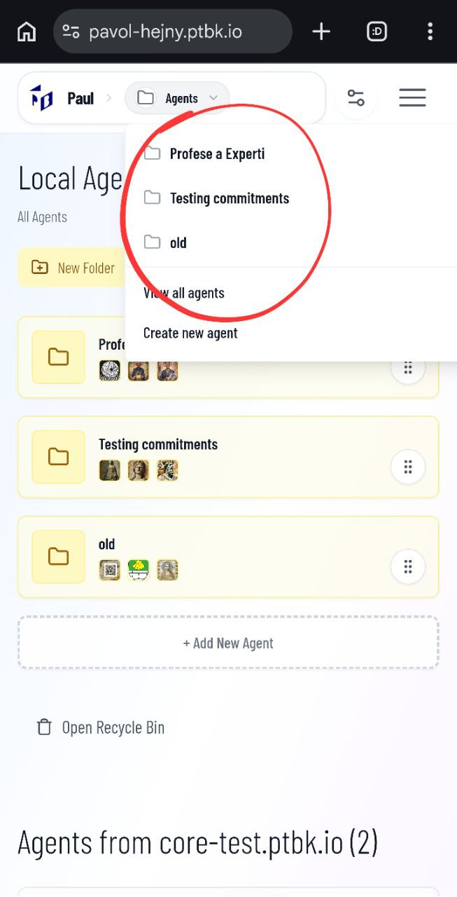
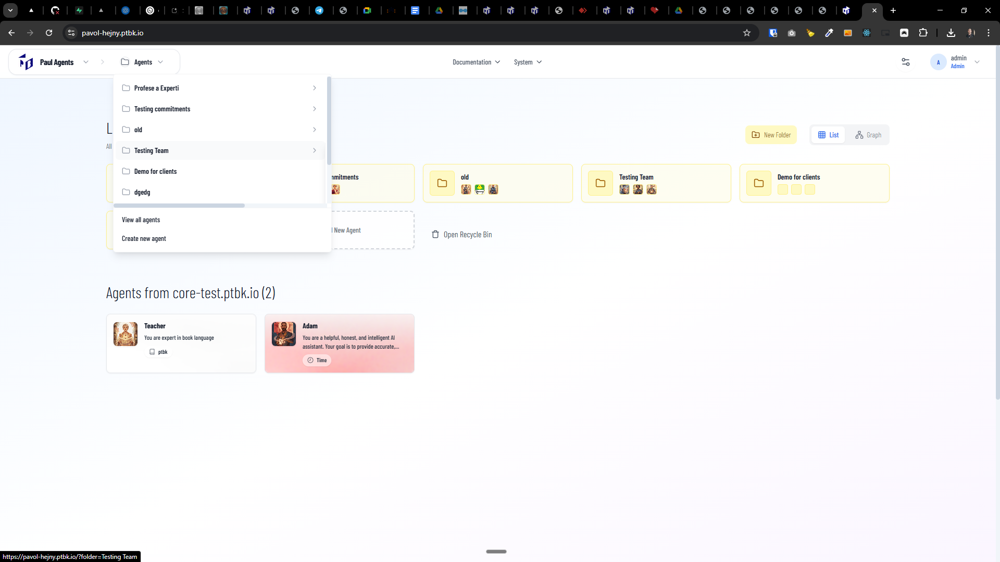

[x] ~$0.42 13 minutes by OpenAI Codex `gpt-5.3-codex`

[✨🦵] Fix the menu sub-items

-   The sub-items in the menu are not working properly, especially on mobile. User has no chance to open them and see the options inside. Fix it.
-   Both on mobile and desktop
-   On desktop, it should work by hovering on the parent item to open the subitems sub-panel. This is working in the menu items, but not in the navigation hierarchy on the desktop.
-   On mobile, it should work by clicking on the parent item to open the subitems sub-panel. By clicking, it should toggle the subitems on or off. The subitems should be indented to be visibly inside the subitem.
-   Keep in mind the DRY _(don't repeat yourself)_ principle.
-   Do a proper analysis of the current functionality before you start implementing.
-   You are working with the [Agents Server](apps/agents-server)

### The Agents Server menu

The menu of the agent server looks like this:

1. The navigation hierarchy **<- HERE ARE MULTILEVEL SUBITEMS TO BE FIXED**
    - Icon and Server name _(for example Promptbook Agents Server)_
    - arrow ">" and Agents or picked agent name (organized in folders)
    - arrow ">" and the view Profile / Chat / Book of the agent or nothing if no agent is picked
2. The menu items **<- HERE ARE MULTILEVEL ITEMS WORKING ON DESKTOP BUT NOT ON MOBILE**
    - Documentation
    - System
3. Control panel and user menu
    - Control panel
    - User menu with the avatar and the name of the user

---

[-]

[✨🦵] foo

-   Keep in mind the DRY _(don't repeat yourself)_ principle.
-   Do a proper analysis of the current functionality before you start implementing.
-   You are working with the [Agents Server](apps/agents-server)
-   Add the changes into the [changelog](changelog/_current-preversion.md)

---

[-]

[✨🦵] foo

-   Keep in mind the DRY _(don't repeat yourself)_ principle.
-   Do a proper analysis of the current functionality before you start implementing.
-   You are working with the [Agents Server](apps/agents-server)
-   Add the changes into the [changelog](changelog/_current-preversion.md)

---

[-]

[✨🦵] foo

-   Keep in mind the DRY _(don't repeat yourself)_ principle.
-   Do a proper analysis of the current functionality before you start implementing.
-   You are working with the [Agents Server](apps/agents-server)
-   Add the changes into the [changelog](changelog/_current-preversion.md)

