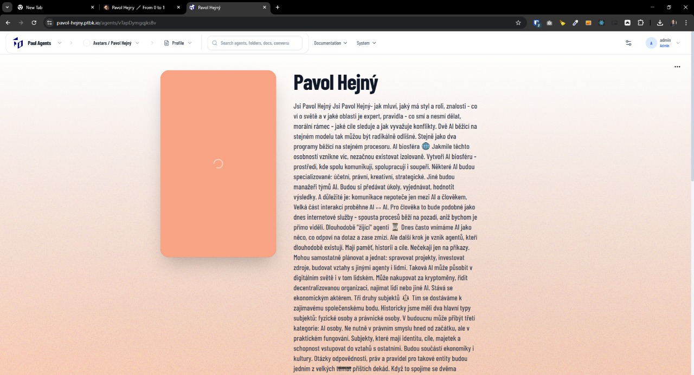

[ ]

[✨🪧] Handle long agent descriptions in the agent profile.

-   Keep in mind the DRY _(don't repeat yourself)_ principle, Try to reuse existing utilities to shorten the text.
-   Do a proper analysis of the current agent profile before you start implementing.
-   You are working with the [Agents Server](apps/agents-server) with a agent profile page

---

[-]

[✨🪧] baz

-   Keep in mind the DRY _(don't repeat yourself)_ principle.
-   Do a proper analysis of the current functionality before you start implementing.
-   You are working with the [Agents Server](apps/agents-server)
-   Add the changes into the [changelog](changelog/_current-preversion.md)

---

[-]

[✨🪧] baz

-   Keep in mind the DRY _(don't repeat yourself)_ principle.
-   Do a proper analysis of the current functionality before you start implementing.
-   You are working with the [Agents Server](apps/agents-server)
-   Add the changes into the [changelog](changelog/_current-preversion.md)

---

[-]

[✨🪧] baz

-   Keep in mind the DRY _(don't repeat yourself)_ principle.
-   Do a proper analysis of the current functionality before you start implementing.
-   You are working with the [Agents Server](apps/agents-server)
-   Add the changes into the [changelog](changelog/_current-preversion.md)
