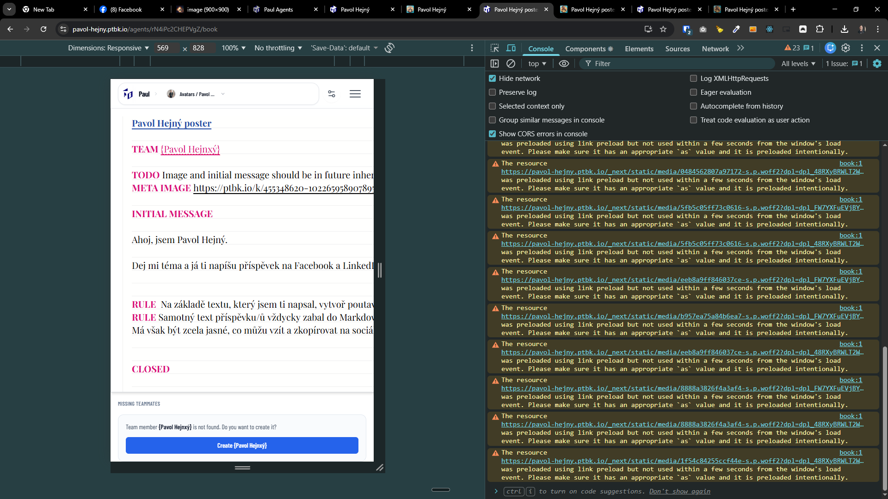

[x] ~$0.41 16 minutes by OpenAI Codex `gpt-5.1-codex-mini`

[✨⛲️] Allow to quickcreate missing agents when you are referencing an agent which doesn't exist.

-   This feature already exists for `TEAM` commitment, but it should work for any type of agent referencing as @Agent, {Agent}
-   Keep in mind the DRY _(don't repeat yourself)_ principle, there should be just one logic reused.
-   Do a proper analysis of the current functionality of `BookEditor`, `TEAM`, `FROM` and `IMPORT` commitments and agent referencing before you start implementing.
-   You are working with the [Agents Server](apps/agents-server)

---

[-]

[✨⛲️] foo

-   Keep in mind the DRY _(don't repeat yourself)_ principle.
-   Do a proper analysis of the current functionality before you start implementing.
-   You are working with the [Agents Server](apps/agents-server)
-   Add the changes into the [changelog](changelog/_current-preversion.md)

---

[-]

[✨⛲️] foo

-   Keep in mind the DRY _(don't repeat yourself)_ principle.
-   Do a proper analysis of the current functionality before you start implementing.
-   You are working with the [Agents Server](apps/agents-server)
-   Add the changes into the [changelog](changelog/_current-preversion.md)

---

[-]

[✨⛲️] foo

-   Keep in mind the DRY _(don't repeat yourself)_ principle.
-   Do a proper analysis of the current functionality before you start implementing.
-   You are working with the [Agents Server](apps/agents-server)
-   Add the changes into the [changelog](changelog/_current-preversion.md)

