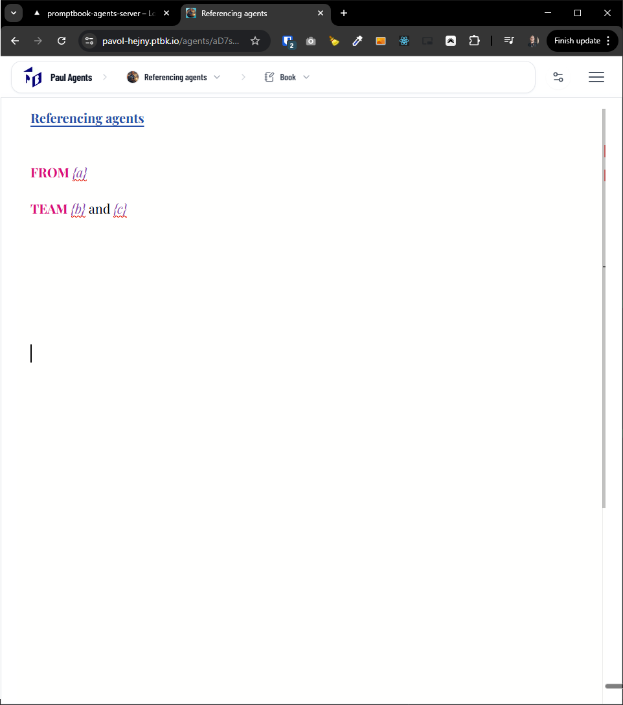

[ ] !

[✨🎬] The Book editor sometimes doesn't show the text lines

-   The lines should be always shown; these should be permanent visual elements of the book editor.
-   This happens only sometimes. I have no clue where or why the bug is happening.
-   Do a proper analysis of the current functionality of `BookEditor` before you start implementing.
-   You are working with the [Agents Server](apps/agents-server)

---

[-]

[✨🎬] brr

-   Keep in mind the DRY _(don't repeat yourself)_ principle.
-   Do a proper analysis of the current functionality before you start implementing.
-   You are working with the [Agents Server](apps/agents-server)
-   Add the changes into the [changelog](changelog/_current-preversion.md)

---

[-]

[✨🎬] brr

-   Keep in mind the DRY _(don't repeat yourself)_ principle.
-   Do a proper analysis of the current functionality before you start implementing.
-   You are working with the [Agents Server](apps/agents-server)
-   Add the changes into the [changelog](changelog/_current-preversion.md)

---

[-]

[✨🎬] brr

-   Keep in mind the DRY _(don't repeat yourself)_ principle.
-   Do a proper analysis of the current functionality before you start implementing.
-   You are working with the [Agents Server](apps/agents-server)
-   Add the changes into the [changelog](changelog/_current-preversion.md)
