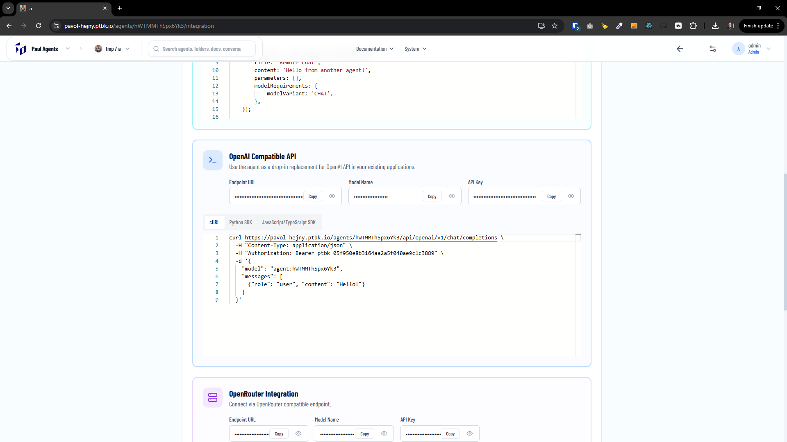
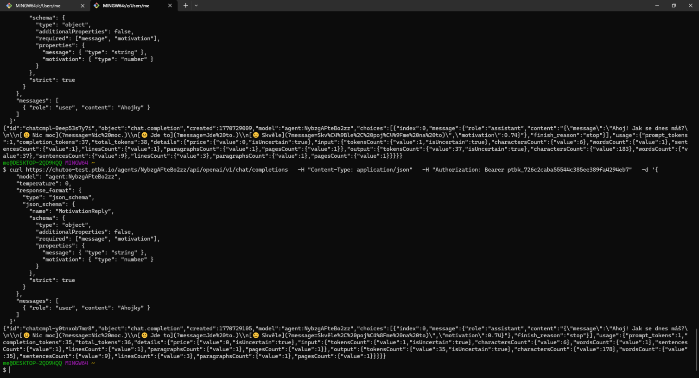

[ ]

[✨🪗] Into the agent integration page, in the section OpenAI Compatible Mode, add `response_format` type `json_schema`, sample.

-   The agent can respond with a JSON schema, and the server will validate the response against this schema. If the response is not valid, it will be rejected and the agent will be asked to try again.
-   This option is already supported by Promptbook alongside the simple text option.
-  You are now just adding example not implementing the JSON schema format. It is already implemented.
-   Keep in mind the DRY _(don't repeat yourself)_ principle.
-   Keep all the existing options, just add another one into the OpenAI Compatible API section.
-   Do a proper analysis of the current functionality of the integration page before you start implementing.
-   You are working with the [Agents Server](apps/agents-server) For example, with page https://pavol-hejny.ptbk.io/agents/hWTMMThSpx6Yk3/integration
-   Add the changes into the [changelog](changelog/_current-preversion.md)

---

[-]

[✨🪗] bar

-   Keep in mind the DRY _(don't repeat yourself)_ principle.
-   Do a proper analysis of the current functionality before you start implementing.
-   You are working with the [Agents Server](apps/agents-server)
-   Add the changes into the [changelog](changelog/_current-preversion.md)

---

[-]

[✨🪗] bar

-   Keep in mind the DRY _(don't repeat yourself)_ principle.
-   Do a proper analysis of the current functionality before you start implementing.
-   You are working with the [Agents Server](apps/agents-server)
-   Add the changes into the [changelog](changelog/_current-preversion.md)

---

[-]

[✨🪗] bar

-   Keep in mind the DRY _(don't repeat yourself)_ principle.
-   Do a proper analysis of the current functionality before you start implementing.
-   You are working with the [Agents Server](apps/agents-server)
-   Add the changes into the [changelog](changelog/_current-preversion.md)
