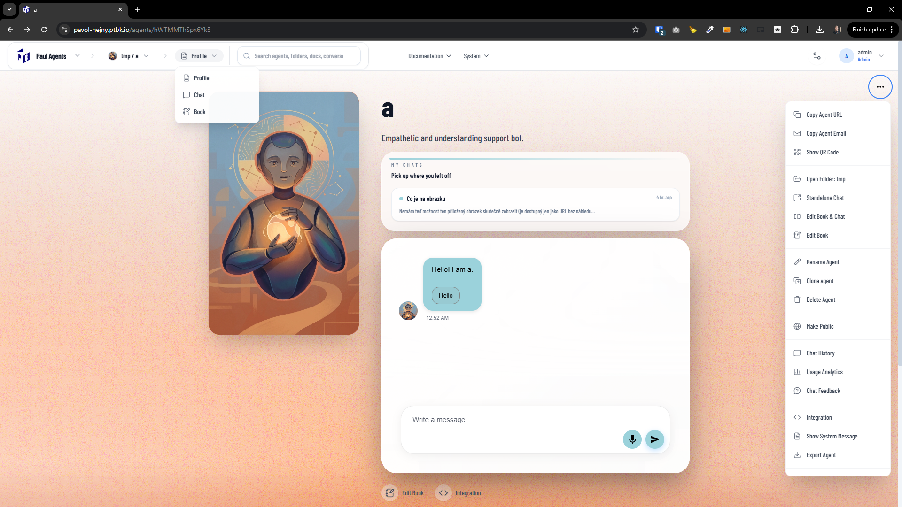

[x] ~$0.47 17 minutes by OpenAI Codex `gpt-5.1-codex-mini` - Not working propperly

---

[x] ~$0.67 21 minutes by OpenAI Codex `gpt-5.2-codex`

[✨🌚] Add all options into the agent navigational hierarchy breadcrumbs

-   In the menu, when you are on the agent, you can switch between profile, chat and book.
-   But agent has a lot more pages like chat history, usage statistics, integration, system message, exporting agent and a lot more. All of them are in the agent context menu.
-   Create there one more item alongside "Profile/Chat/Book" called "More", which will contain everything from the Agent Context menu.
-   So now it will be "Server" > "Agent" > "View" - Inside the "View" you will have "Profile/Chat/Book/More" and inside the "More" you will have all the items that are currently in the agent context menu.
-   Also on a lot of these pages there is an arrow pointing back to the agent profile. Remove this arrow because it is no more needed when you can navigate through the navigational hierarchy.
-   Keep in mind the DRY _(don't repeat yourself)_ principle, All of these items should exist only on one place and should be reused.
-   Keep the agent context menu as is only add these items into the agent navigational hierarchy in the menu.
-   Do a proper analysis of the current functionality before you start implementing.
-   You are working with the [Agents Server](apps/agents-server)

---

[ ]

[✨🌚] DRY

-   @@@
-   Keep in mind the DRY _(don't repeat yourself)_ principle.
-   Do a proper analysis of the current functionality before you start implementing.
-   You are working with the [Agents Server](apps/agents-server)
-   Add the changes into the [changelog](changelog/_current-preversion.md)

---

[-]

[✨🌚] baz

-   Keep in mind the DRY _(don't repeat yourself)_ principle.
-   Do a proper analysis of the current functionality before you start implementing.
-   You are working with the [Agents Server](apps/agents-server)
-   Add the changes into the [changelog](changelog/_current-preversion.md)

---

[-]

[✨🌚] baz

-   Keep in mind the DRY _(don't repeat yourself)_ principle.
-   Do a proper analysis of the current functionality before you start implementing.
-   You are working with the [Agents Server](apps/agents-server)
-   Add the changes into the [changelog](changelog/_current-preversion.md)
