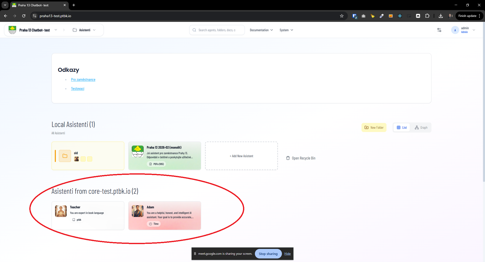

[ ]

[✨🍀] Create metadata `IS_CORE_SERVER_HIDDEN` by default false

-   This would determine if the core federated server is shown on the homepage, menu selector, search and footer links or not.
-   Referencing of the agents from this server should work the same regardless of this setting, and the server should be fully functional, just hidden from the homepage and other places where it is currently shown.
-   Other federated servers are shown normally. This is applied only for the core server, which is a kinda special federated server.
-   `IS_CORE_SERVER_HIDDEN` will by default `false`
-   Keep in mind the DRY _(don't repeat yourself)_ principle.
-   Do a proper analysis of the current functionality federated servers and core server before you start implementing.
-   You are working with the [Agents Server](apps/agents-server)
-   Add the changes into the [changelog](changelog/_current-preversion.md)

---

[-]

[✨🍀] foo

-   @@@
-   Keep in mind the DRY _(don't repeat yourself)_ principle.
-   Do a proper analysis of the current functionality before you start implementing.
-   You are working with the [Agents Server](apps/agents-server)
-   Add the changes into the [changelog](changelog/_current-preversion.md)

---

[-]

[✨🍀] foo

-   @@@
-   Keep in mind the DRY _(don't repeat yourself)_ principle.
-   Do a proper analysis of the current functionality before you start implementing.
-   You are working with the [Agents Server](apps/agents-server)
-   Add the changes into the [changelog](changelog/_current-preversion.md)

---

[-]

[✨🍀] foo

-   @@@
-   Keep in mind the DRY _(don't repeat yourself)_ principle.
-   Do a proper analysis of the current functionality before you start implementing.
-   You are working with the [Agents Server](apps/agents-server)
-   Add the changes into the [changelog](changelog/_current-preversion.md)
