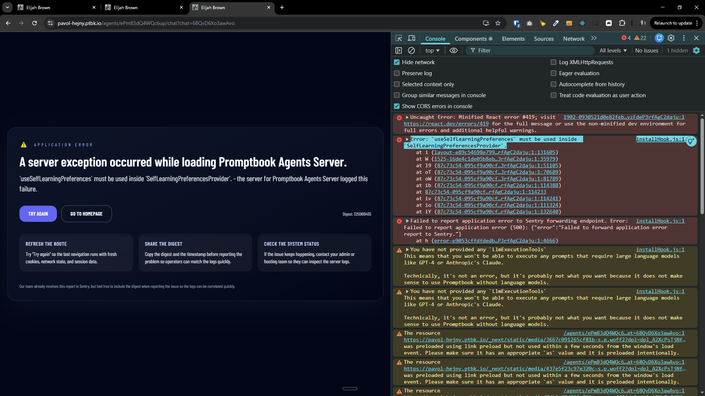
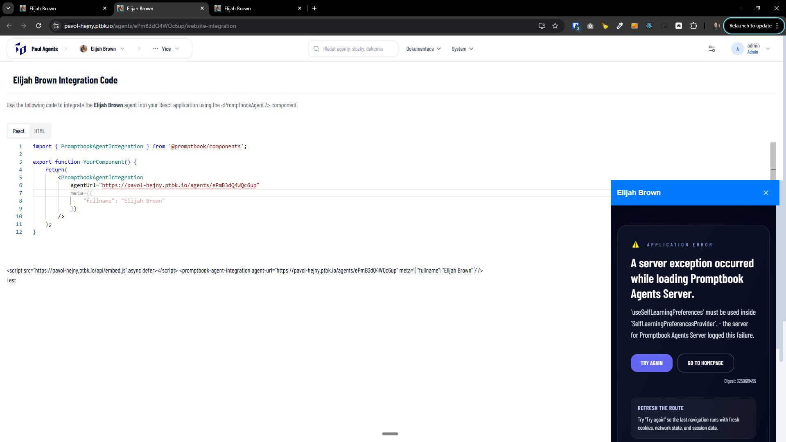

[x] ~$0.1261 10 minutes by OpenAI Codex `gpt-5.1-codex-mini` - _mixed the preview page and the embedded chat page _

---

[x] ~$0.2567 19 minutes by OpenAI Codex `gpt-5.1-codex-mini`

[✨✂️] Ensure that embedding of agents in iframes is propperly allowed or disallowed based on a new `IS_EMBEDDING_ALLOWED` metadata item.

-   Add a new metadata item `IS_EMBEDDING_ALLOWED` for agents server, which can be set to `true` or `false`. By default, it should be `true`
-   When `IS_EMBEDDING_ALLOWED` is `true`, allow embedding the agent in iframes by setting appropriate headers. When `IS_EMBEDDING_ALLOWED` is `false`, disallow embedding the agent in iframes by setting appropriate headers.
-   When allowed, add embedding sample into the agent integrations page, showing how to embed an agent in an iframe - code and sample
-   Keep in mind the DRY _(don't repeat yourself)_ principle.
-   Be aware that there are two different pages:
    -   The page with the actual agent, which can be used directly in the iframe, for example: https://pavol-hejny.ptbk.io/agents/ePmB3dQ4WQc6up/iframe _(needs to be created and used for both iframe embedding and Website Integration)_
    -   The preview page, which shows a preview of the agent as js integration widget, for example: https://pavol-hejny.ptbk.io/embed?agentUrl=https%3A%2F%2Fpavol-hejny.ptbk.io%2Fagents%2FePmB3dQ4WQc6up&meta=%7B%0A%20%20%20%20%22fullname%22%3A%20%22Elijah%20Brown%22%0A%7D
-   Do a proper analysis of the current functionality before you start implementing.
-   You are working with the [Agents Server](apps/agents-server)
-   Add the changes into the [changelog](changelog/_current-preversion.md)

---

[x] ~$0.2938 11 minutes by OpenAI Codex `gpt-5.3-codex`

[✨✂️] Fix the embedded cha and chat integration

-   The link `https://pavol-hejny.ptbk.io/agents/ePmB3dQ4WQc6up/chat?headless` ends up with "A server exception occurred while loading Promptbook Agents Server." "installHook.js:1 Error: `useSelfLearningPreferences` must be used inside `SelfLearningPreferencesProvider`."
-   Also unite `https://pavol-hejny.ptbk.io/agents/ePmB3dQ4WQc6up/iframe` and `https://pavol-hejny.ptbk.io/agents/ePmB3dQ4WQc6up/chat?headless`
    1. `https://pavol-hejny.ptbk.io/agents/ePmB3dQ4WQc6up/iframe` **<- REMOVE AND USE (2) INSTEAD**
    2. `https://pavol-hejny.ptbk.io/agents/ePmB3dQ4WQc6up/chat?headless` **<- FIX ERROR AND USE IN BOTH PLACES**
-   `headless` chat shouldn't have the side panel with chats, But the chat should be recorded, just do not show the panel to pick the chats.
-   Keep in mind the DRY _(don't repeat yourself)_ principle.
-   Do a proper analysis of the current functionality of chat embedding, integration, `IS_EMBEDDING_ALLOWED` and headless mode before you start implementing.
-   Look at `apps/agents-server/src/app/agents/[agentName]/integration/page.tsx`
-   You are working with the [Agents Server](apps/agents-server)
-   Add the changes into the [changelog](changelog/_current-preversion.md)




---

[ ] !

[✨✂️] Enhance the UI and UX of `PromptbookAgentIntegration`

**3rd party integration example:**

```typescript
import { PromptbookAgentIntegration } from '@promptbook/components';

export function YourComponent() {
    return (
        <PromptbookAgentIntegration
            agentUrl="https://pavol-hejny.ptbk.io/agents/ePmB3dQ4WQc6up"
            meta={{
                fullname: 'Elijah Brown',
            }}
        />
    );
}
```

-   This adds a chat directly into the website.
-   But it doesnt feel great, enhance the design and UX of this component, make it more user-friendly and visually appealing, but keep it simple and easy to use.
-   Add animations, transitions, make it look more modern and visually appealing.
-   Do not change the integration code.
-   Keep in mind the DRY _(don't repeat yourself)_ principle.
-   Do a proper analysis of the current functionality of the chat integration before you start implementing.
-   You are working with the [Agents Server](apps/agents-server) with [website integration](apps/agents-server/src/app/agents/[agentName]/website-integration/page.tsx)


---

[-]

[✨✂️] baz

-   @@@
-   Keep in mind the DRY _(don't repeat yourself)_ principle.
-   Do a proper analysis of the current functionality before you start implementing.
-   You are working with the [Agents Server](apps/agents-server)
-   Add the changes into the [changelog](changelog/_current-preversion.md)

