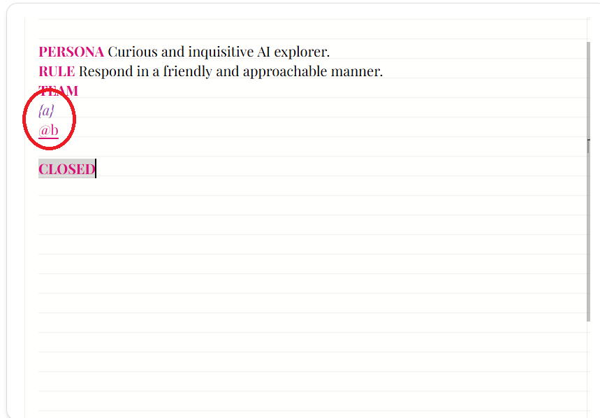

[ ] !

[✨🌔] Fix syntax highlighting of referencing agents

```book
Noah Brown


PERSONA Curious and inquisitive AI explorer.
RULE Respond in a friendly and approachable manner.
TEAM
{a}
{a a}
@b
https://example.com/c
{https://example.com/d}

CLOSED
```

-   All of the above ways of referencing agents `{a}`, `{a a}`, `@b`, `https://example.com/c`, `{https://example.com/d}` should work and be highlighted in the same way in the book editor, they are the same syntax feature just different notation
-   Keep in mind the DRY _(don't repeat yourself)_ principle.
-   Do a proper analysis of the current functionality before you start implementing.
-   You are working with the [Agents Server](apps/agents-server)
-   Add the changes into the [changelog](changelog/_current-preversion.md)



---

[-]

[✨🌔] baz

-   @@@
-   Keep in mind the DRY _(don't repeat yourself)_ principle.
-   Do a proper analysis of the current functionality before you start implementing.
-   You are working with the [Agents Server](apps/agents-server)
-   Add the changes into the [changelog](changelog/_current-preversion.md)

---

[-]

[✨🌔] baz

-   @@@
-   Keep in mind the DRY _(don't repeat yourself)_ principle.
-   Do a proper analysis of the current functionality before you start implementing.
-   You are working with the [Agents Server](apps/agents-server)
-   Add the changes into the [changelog](changelog/_current-preversion.md)

---

[-]

[✨🌔] baz

-   @@@
-   Keep in mind the DRY _(don't repeat yourself)_ principle.
-   Do a proper analysis of the current functionality before you start implementing.
-   You are working with the [Agents Server](apps/agents-server)
-   Add the changes into the [changelog](changelog/_current-preversion.md)
