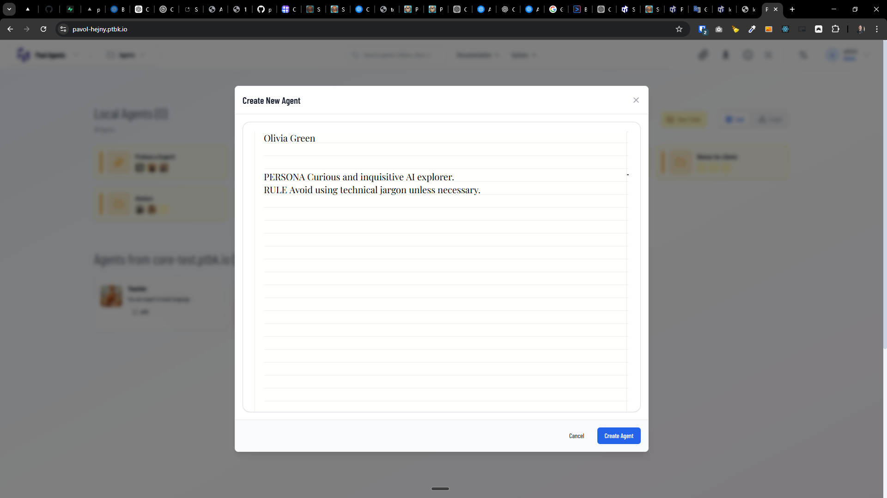
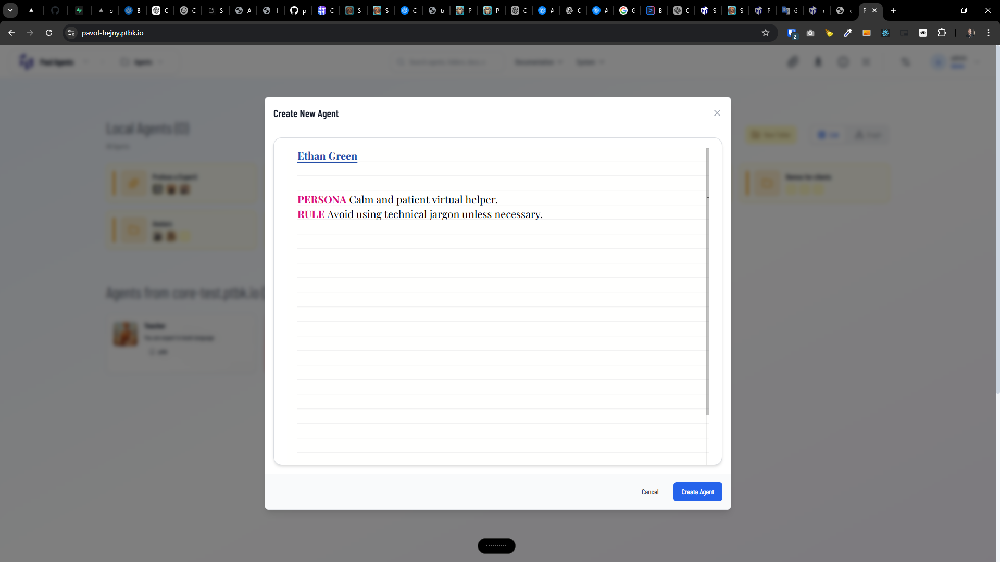

[x] ~$0.0675 4 minutes by OpenAI Codex `gpt-5.1-codex-mini` - _not working_

---

[x] ~$0.4931 13 minutes by OpenAI Codex `gpt-5.3-codex`

[✨𓀐] Book editor is sometimes rendered without highliting, fix it

-   Happens only sometimes.
-   I see a pattern that it happens when the editor is rendered for the second time on the same loaded page without page reload, but I am not sure about it.
-   Do a proper analysis of the current functionality before you start fixing.
-   You are working with the [Agents Server](apps/agents-server)
-   Add the changes into the [changelog](changelog/_current-preversion.md)

---

[-]

[✨𓀐] qux

-   @@@
-   Keep in mind the DRY _(don't repeat yourself)_ principle.
-   Do a proper analysis of the current functionality before you start implementing.
-   You are working with the [Agents Server](apps/agents-server)
-   Add the changes into the [changelog](changelog/_current-preversion.md)

---

[-]

[✨𓀐] qux

-   @@@
-   Keep in mind the DRY _(don't repeat yourself)_ principle.
-   Do a proper analysis of the current functionality before you start implementing.
-   You are working with the [Agents Server](apps/agents-server)
-   Add the changes into the [changelog](changelog/_current-preversion.md)

---

[-]

[✨𓀐] qux

-   @@@
-   Keep in mind the DRY _(don't repeat yourself)_ principle.
-   Do a proper analysis of the current functionality before you start implementing.
-   You are working with the [Agents Server](apps/agents-server)
-   Add the changes into the [changelog](changelog/_current-preversion.md)

