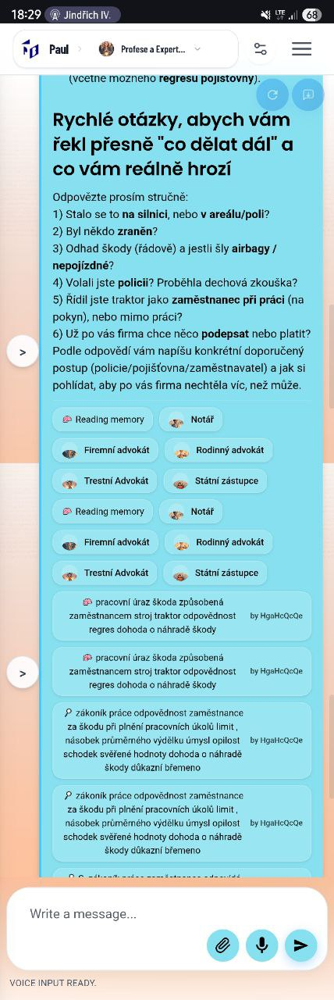
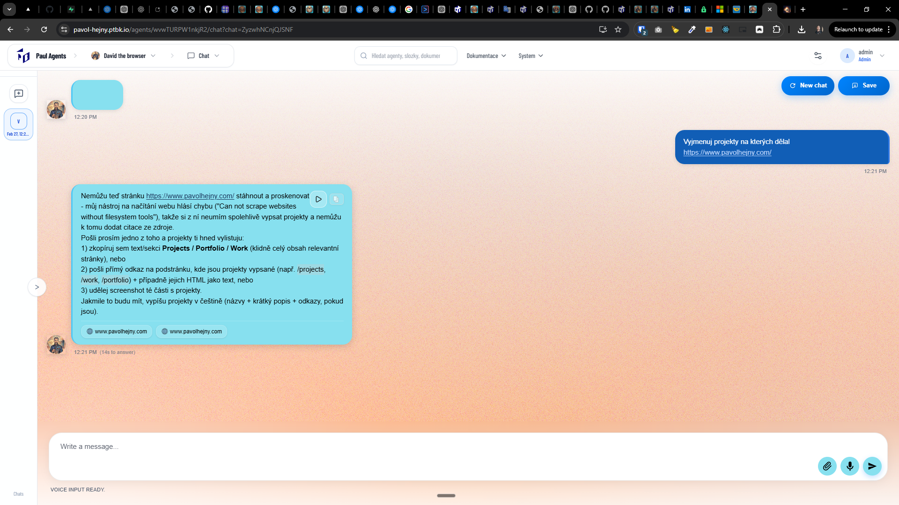

[ ]

[✨😲] Tool calls are broken, fix them

-   There are several problems which occur during the tool calls:
    1. Ongoing tool calls are not shown in the UI, so the user doesn't know that the agent is currently calling a tool, and it looks like the agent is doing nothing.
    -   There is sometimes something shown, but definitely not all the tool calls which are being made in the background.
    2. When there are multiple tool calls, they are not shown separately, so it looks like there is just one tool call, but in reality there are several.
    3. Every tool call, for example asking a team member, ends up with two separate chips:
        1. First is errored _<- Remove this one_
        2. The second one is working _<- Show just this one_
    4. Searches make by a teammembers has message "by xC8f...", just show the name of the agent with its profile picture, not the id, because it is not user friendly.
    5. When the tool call ends with an error, show some ⚠️ in the tool call chip.
-   Transfer the tool calls during the chat streaming. Make some special tokens for this transfer. Look how, for example, white space characters are transferred.
-   Special transfers should occur on the new line when the new line starts with some special indicator. This should indicate that this is not going to the message, but this is some metadata, like to call ending of a message, some keep a live update, etc.
-   From the point of view of the agent and the question + answer, the tool calls are working perfectly; they just need to be shown and shown in the UI in a better way.
-   Do a proper analysis of the current functionality of toolcalling, message streaming, commitments and `TEAM` commitment before you start implementing.
-   You are working with the [Agents Server](apps/agents-server)

---

[-]

[✨😲] bar

-   @@@
-   Keep in mind the DRY _(don't repeat yourself)_ principle.
-   Do a proper analysis of the current functionality before you start implementing.
-   You are working with the [Agents Server](apps/agents-server)
-   Add the changes into the [changelog](changelog/_current-preversion.md)

---

[-]

[✨😲] bar

-   @@@
-   Keep in mind the DRY _(don't repeat yourself)_ principle.
-   Do a proper analysis of the current functionality before you start implementing.
-   You are working with the [Agents Server](apps/agents-server)
-   Add the changes into the [changelog](changelog/_current-preversion.md)

---

[-]

[✨😲] bar

-   @@@
-   Keep in mind the DRY _(don't repeat yourself)_ principle.
-   Do a proper analysis of the current functionality before you start implementing.
-   You are working with the [Agents Server](apps/agents-server)
-   Add the changes into the [changelog](changelog/_current-preversion.md)
