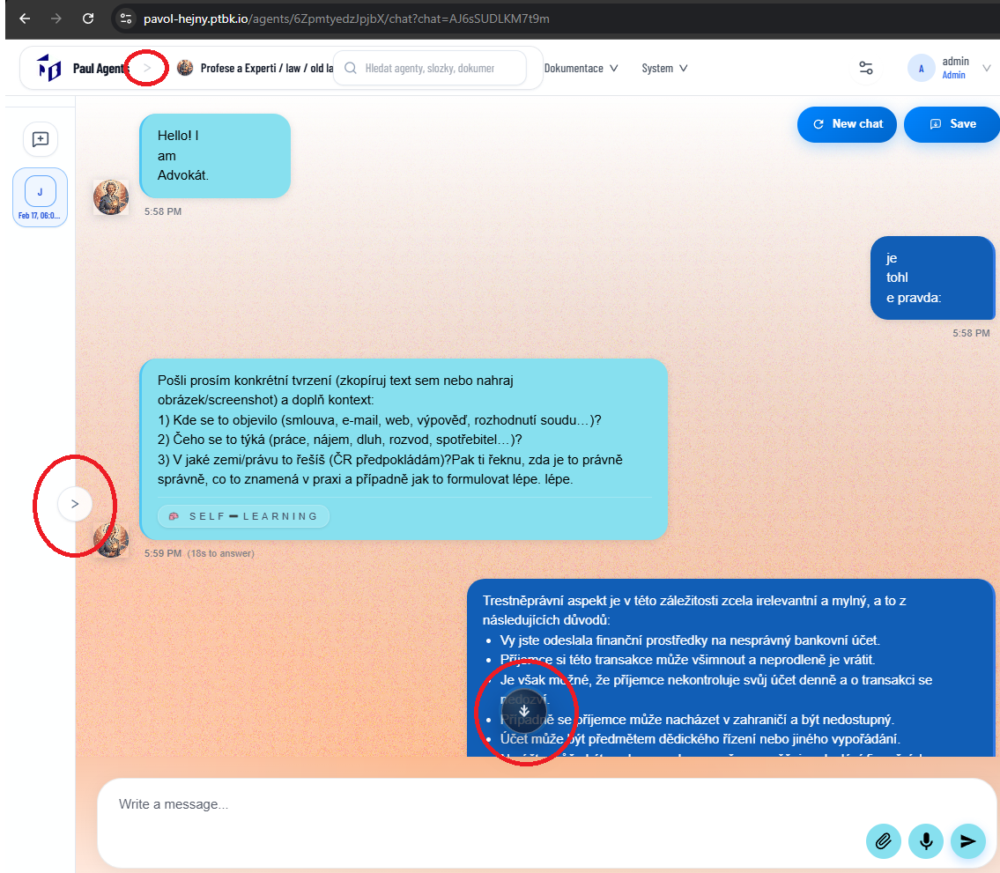

[x] ~$0.4801 12 minutes by OpenAI Codex `gpt-5.3-codex`

---

[ ] !

[✨👌] Enhance the design of arrows in Agent Server app chat.

-   Unite the visual of the arrow which opens and closes the left side bar for chats and the arrow which scrolls down the chat and arrow in menu breadcrumbs. Make them the same and consistent in the whole app.
-   The arrow should be one react and reused component in the whole app. Only modification should be the direction of the arrow and maybe the size, but the visual should be the same.
-   The visual of the arrow should be "▶" a simple solid triangle pointing to the direction of the prop "direction" which can be "up", "down", "left", "right". The color of the arrow should be the same as the text color. Arrow can be in the circle (for example in the left side bar for chats or scroll down arrow) or without the circle (for example in the menu breadcrumbs).
-   Keep in mind the DRY _(don't repeat yourself)_ principle, reuse the same component for all arrows in the app.
-   You are working with the [Agents Server](apps/agents-server)

---

[-]

[✨👌] qux

-   @@@
-   Keep in mind the DRY _(don't repeat yourself)_ principle.
-   Do a proper analysis of the current functionality before you start implementing.
-   You are working with the [Agents Server](apps/agents-server)
-   Add the changes into the [changelog](changelog/_current-preversion.md)

---

[-]

[✨👌] qux

-   @@@
-   Keep in mind the DRY _(don't repeat yourself)_ principle.
-   Do a proper analysis of the current functionality before you start implementing.
-   You are working with the [Agents Server](apps/agents-server)
-   Add the changes into the [changelog](changelog/_current-preversion.md)

---

[-]

[✨👌] qux

-   @@@
-   Keep in mind the DRY _(don't repeat yourself)_ principle.
-   Do a proper analysis of the current functionality before you start implementing.
-   You are working with the [Agents Server](apps/agents-server)
-   Add the changes into the [changelog](changelog/_current-preversion.md)
