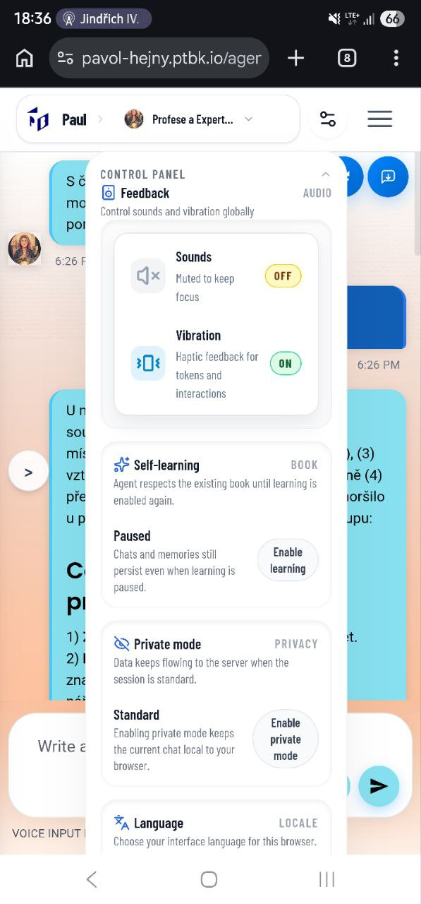

[x] ~$0.2033 9 minutes by OpenAI Codex `gpt-5.3-codex`

[✨🥘] Enhance UX of the control panel

Control panel is getting bigger and bigger, and it is important to keep it user-friendly and intuitive. The design is also a bit outdated, so it would be good to enhance it a bit.

-   Enhance design and UX of the control panel, make it more user-friendly and intuitive
-   Allow scrolling because there are more and more features, and the control panel is getting bigger, so it is important to allow scrolling there.
-   Keep in mind the DRY _(don't repeat yourself)_ principle.
-   Do a proper analysis of the current functionality of the control panel before you start implementing.
-   You are working with the [Agents Server](apps/agents-server)

---

[-]

[✨🥘] brr

-   @@@
-   Keep in mind the DRY _(don't repeat yourself)_ principle.
-   Do a proper analysis of the current functionality before you start implementing.
-   You are working with the [Agents Server](apps/agents-server)
-   Add the changes into the [changelog](changelog/_current-preversion.md)

---

[-]

[✨🥘] brr

-   @@@
-   Keep in mind the DRY _(don't repeat yourself)_ principle.
-   Do a proper analysis of the current functionality before you start implementing.
-   You are working with the [Agents Server](apps/agents-server)
-   Add the changes into the [changelog](changelog/_current-preversion.md)

---

[-]

[✨🥘] brr

-   @@@
-   Keep in mind the DRY _(don't repeat yourself)_ principle.
-   Do a proper analysis of the current functionality before you start implementing.
-   You are working with the [Agents Server](apps/agents-server)
-   Add the changes into the [changelog](changelog/_current-preversion.md)

