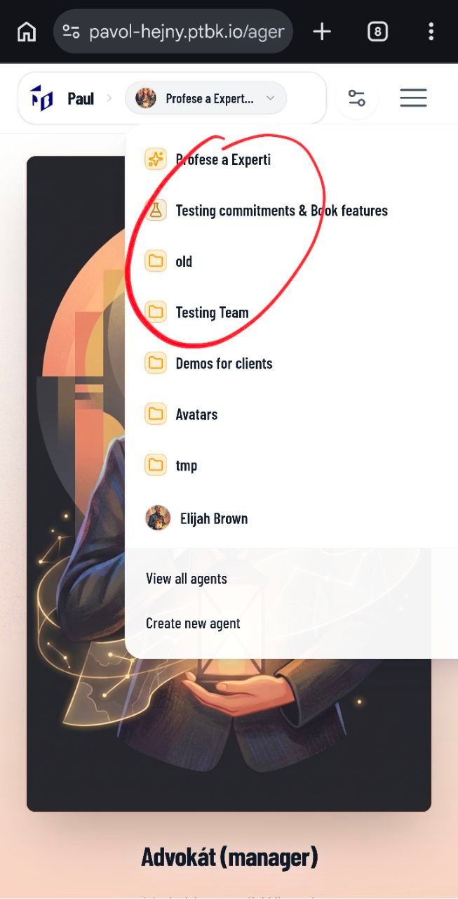

[x] ~$0.2366 15 minutes by OpenAI Codex `gpt-5.3-codex`

---

[ ] !

[✨👀] Fix UX of the menu for touch devices

-   User on the mobile cannot click on the menu sub-item because he can open the top level item, but then, when he clicks on the sub-item, it closes the first level item menu together with the sub-item menu and he cannot click on the sub-item
-   This occures on mobile / touch devices
-   Do a proper analysis of the current functionality of the menu and subitems before you start implementing.
-   After proper analysis, implement the solution which will have great UX for all devices
-   You are working with the [Agents Server](apps/agents-server)

---

[-]

[✨👀] foo

-   @@@
-   Keep in mind the DRY _(don't repeat yourself)_ principle.
-   Do a proper analysis of the current functionality before you start implementing.
-   You are working with the [Agents Server](apps/agents-server)
-   If you need to do the database migration, do it
-   Add the changes into the [changelog](changelog/_current-preversion.md)

---

[-]

[✨👀] foo

-   @@@
-   Keep in mind the DRY _(don't repeat yourself)_ principle.
-   Do a proper analysis of the current functionality before you start implementing.
-   You are working with the [Agents Server](apps/agents-server)
-   If you need to do the database migration, do it
-   Add the changes into the [changelog](changelog/_current-preversion.md)

---

[-]

[✨👀] foo

-   @@@
-   Keep in mind the DRY _(don't repeat yourself)_ principle.
-   Do a proper analysis of the current functionality before you start implementing.
-   You are working with the [Agents Server](apps/agents-server)
-   If you need to do the database migration, do it
-   Add the changes into the [changelog](changelog/_current-preversion.md)
