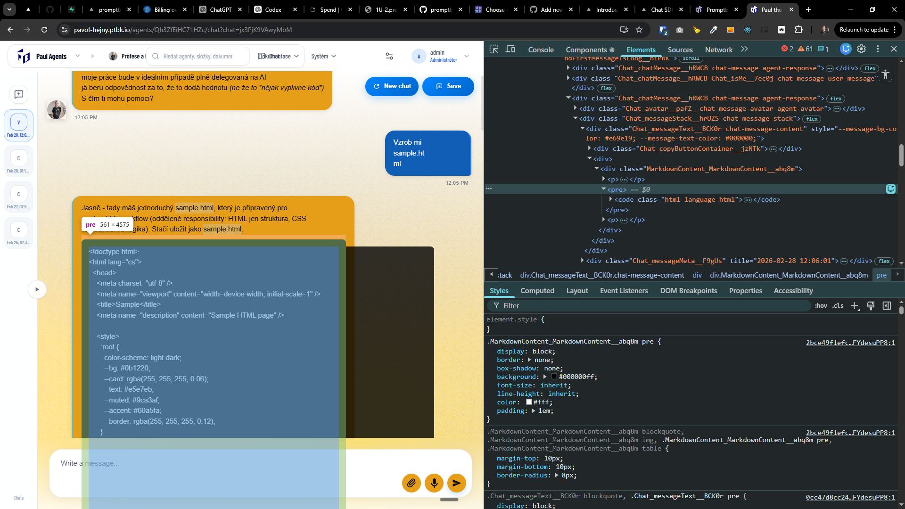
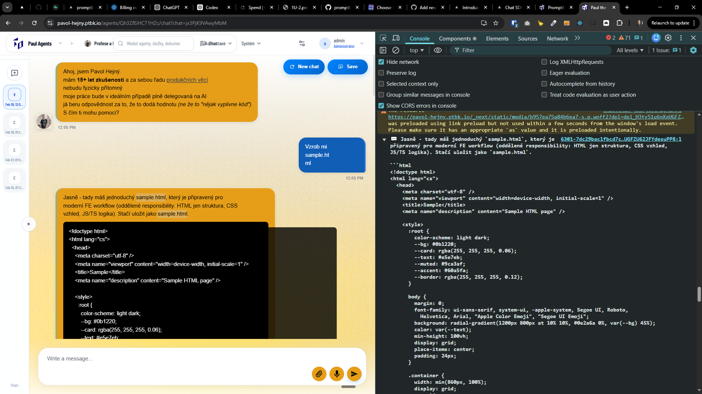

[x] ~$0.2641 26 minutes by OpenAI Codex `gpt-5.3-codex` - _nothing seems to happen, just a lot of files are changed, but the code is not working_
[x] ~$0.3234 17 minutes by OpenAI Codex `gpt-5.3-codex` - _nothing seems to happen, just a lot of files are changed, but the code is not working_

---

[ ]

[✨𓀖] Make syntax highlighting in chat

-   Use the Monaco editor for the code snippets in chat
-   Do syntax highlighting for the most common languages:
    -   JavaScript / TypeScript
    -   HTML / CSS
    -   Python
    -   Shell
    -   JSON
    -   SQL
    -   If there is some other language, just show it as plain text without syntax highlighting
-   Work with multiple language aliases like:

```ts
type foo = 'FOO';
```

```typescript
type foo = 'FOO';
```

-   Now, when there is a code snippet in the chat markdown, it is shown in a simple black box with white text without any syntax highlighting.
-   Be aware that there can be multiple code snippets with multiple languages.
    -   Isolate these Monaco editors to not interfere with one syntax highlighting with other syntax highlighting.
-   Also be aware that we use Monaco editor elsewhere in the app, do not break the existing Monaco editor instances but reuse the existing logic for loading the Monaco editor and languages if possible.
-   Be aware of layout - do not overflow the chat message with the code snippet, but also do not make the code snippet too small.
-   Look for example how maps are rendered and replicate the same logic for the code snippets _(as all rich content in the chat features)_
-   Do a proper analysis of the current functionality before you start implementing.
-   You are working with the [Agents Server](apps/agents-server) with the <Chat/> component and the markdown rendering inside it.
    -   This should be a feature of the markdown rendering on the entire agent server, not only for the chat.
-   Add the changes into the [changelog](changelog/_current-preversion.md)




---

[-]

[✨𓀖] bar

-   @@@
-   Keep in mind the DRY _(don't repeat yourself)_ principle.
-   Do a proper analysis of the current functionality before you start implementing.
-   You are working with the [Agents Server](apps/agents-server)
-   If you need to do the database migration, do it
-   Add the changes into the [changelog](changelog/_current-preversion.md)

---

[-]

[✨𓀖] bar

-   @@@
-   Keep in mind the DRY _(don't repeat yourself)_ principle.
-   Do a proper analysis of the current functionality before you start implementing.
-   You are working with the [Agents Server](apps/agents-server)
-   If you need to do the database migration, do it
-   Add the changes into the [changelog](changelog/_current-preversion.md)

---

[-]

[✨𓀖] bar

-   @@@
-   Keep in mind the DRY _(don't repeat yourself)_ principle.
-   Do a proper analysis of the current functionality before you start implementing.
-   You are working with the [Agents Server](apps/agents-server)
-   If you need to do the database migration, do it
-   Add the changes into the [changelog](changelog/_current-preversion.md)
