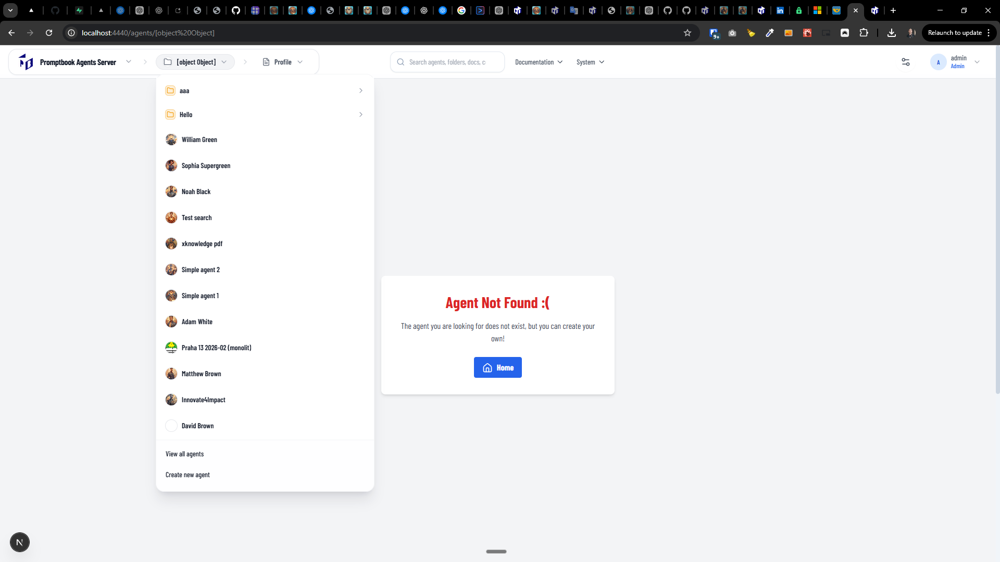

[x] ~$0.8433 21 minutes by OpenAI Codex `gpt-5.3-codex`

[✨🥭] Fix "Create new agent" Button in the menu.

-   Now, clicking on this button just leads into the `http://localhost:4440/agents/[object%20Object]` "Agent Not Found :("
-   Instead, it should open a popup with new book, similar as creating new book from the folder view on main page.
-   This is probably more of a problem of navigation and a missing pop-up because the agent is created from the boilerplate code in the background.
-   The equivalent buttons "Create new agent" and "View all agents" should be in each folder
-   Keep in mind the DRY _(don't repeat yourself)_ principle.
-   Do a proper analysis of the current functionality before you start implementing.
-   You are working with the [Agents Server](apps/agents-server)

---

[-]

[✨🥭] baz

-   @@@
-   Keep in mind the DRY _(don't repeat yourself)_ principle.
-   Do a proper analysis of the current functionality before you start implementing.
-   You are working with the [Agents Server](apps/agents-server)
-   If you need to do the database migration, do it
-   Add the changes into the [changelog](changelog/_current-preversion.md)

---

[-]

[✨🥭] baz

-   @@@
-   Keep in mind the DRY _(don't repeat yourself)_ principle.
-   Do a proper analysis of the current functionality before you start implementing.
-   You are working with the [Agents Server](apps/agents-server)
-   If you need to do the database migration, do it
-   Add the changes into the [changelog](changelog/_current-preversion.md)

---

[-]

[✨🥭] baz

-   @@@
-   Keep in mind the DRY _(don't repeat yourself)_ principle.
-   Do a proper analysis of the current functionality before you start implementing.
-   You are working with the [Agents Server](apps/agents-server)
-   If you need to do the database migration, do it
-   Add the changes into the [changelog](changelog/_current-preversion.md)

