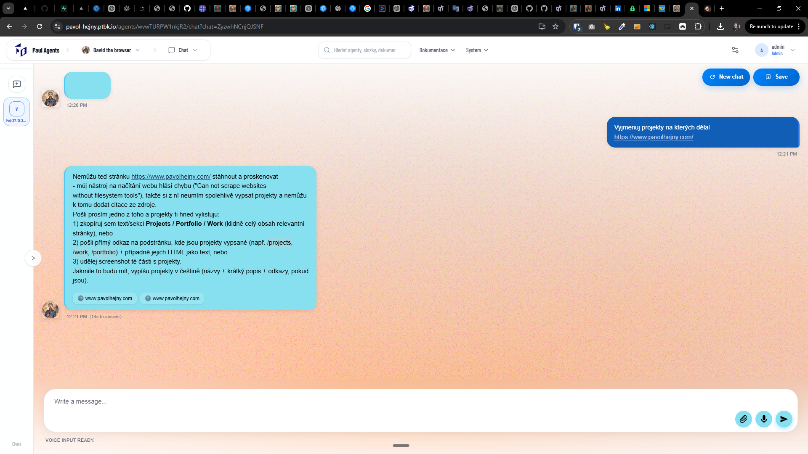
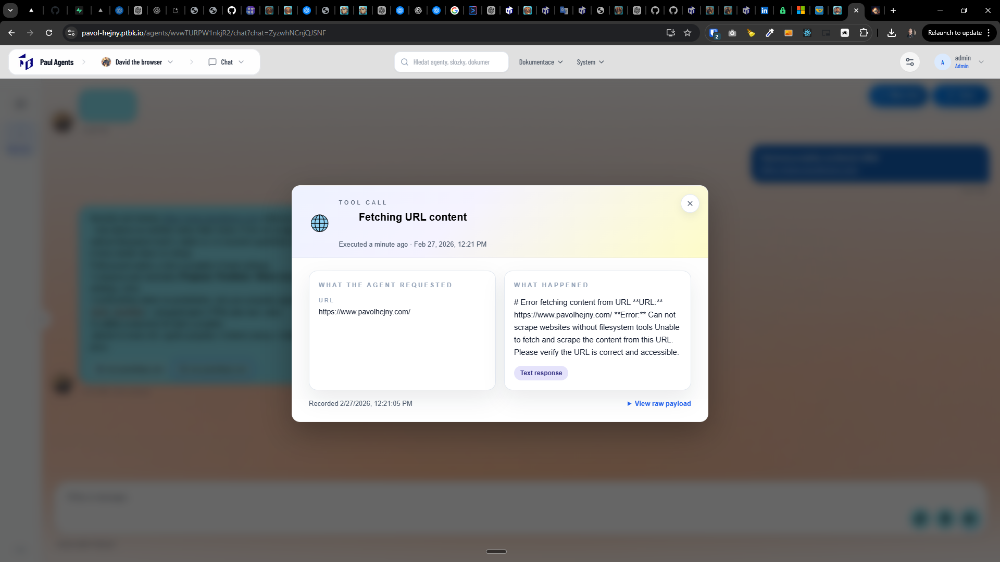

[x] ~$0.3784 23 minutes by OpenAI Codex `gpt-5.3-codex`

[✨💧] Fix `USE BROWSER`

```
# Error fetching content from URL **URL:** https://www.pavolhejny.com/ **Error:** Can not scrape websites without filesystem tools Unable to fetch and scrape the content from this URL. Please verify the URL is correct and accessible.
```

-   `run_browser` tool should internally use [`playwright-cli`](https://github.com/microsoft/playwright-cli)
-   For now, do not run the browser in a headless mode, this will help us to debug and develop the feature faster, we will switch to headless mode later when the feature is stable.
-   Keep in mind that `USE BROWSER` is not replacing system of scrapers, theese are two separate things:
    -   For knowledge, every agent has system of scrapers and convertors (without any special commitment needed, just referenced `KNOWLEDGE`) which is used to convert content of arbitrary document (or webpage) into knowledge pieces. Even if I reference the website, the scraper does not do heavy crawling and scraping of the website, it just fetches the content of the page and converts it into knowledge pieces.
    -   On the other hand, `USE BROWSER` is a commitment that gives the agent access to a real browser, so it can do anything that a real user can do on the website, for example, click on buttons, fill forms, etc. It is not limited to just fetching the content of single page, it can interact with the page in any way.
-   Keep in mind the DRY _(don't repeat yourself)_ principle.
-   Do a proper analysis of the current functionality before you start implementing.
-   You are working with the [Agents Server](apps/agents-server)
-   If you need to do the database migration, do it
-   Add the changes into the [changelog](changelog/_current-preversion.md)




---

[ ]

[✨💧] Remote browser tunnel

-   @@@@
-   Keep in mind the DRY _(don't repeat yourself)_ principle.
-   Do a proper analysis of the current functionality before you start implementing.
-   You are working with the [Agents Server](apps/agents-server)
-   If you need to do the database migration, do it
-   Add the changes into the [changelog](changelog/_current-preversion.md)

---

[-]

[✨💧] qux

-   @@@
-   Keep in mind the DRY _(don't repeat yourself)_ principle.
-   Do a proper analysis of the current functionality before you start implementing.
-   You are working with the [Agents Server](apps/agents-server)
-   If you need to do the database migration, do it
-   Add the changes into the [changelog](changelog/_current-preversion.md)

---

[-]

[✨💧] qux

-   @@@
-   Keep in mind the DRY _(don't repeat yourself)_ principle.
-   Do a proper analysis of the current functionality before you start implementing.
-   You are working with the [Agents Server](apps/agents-server)
-   If you need to do the database migration, do it
-   Add the changes into the [changelog](changelog/_current-preversion.md)

