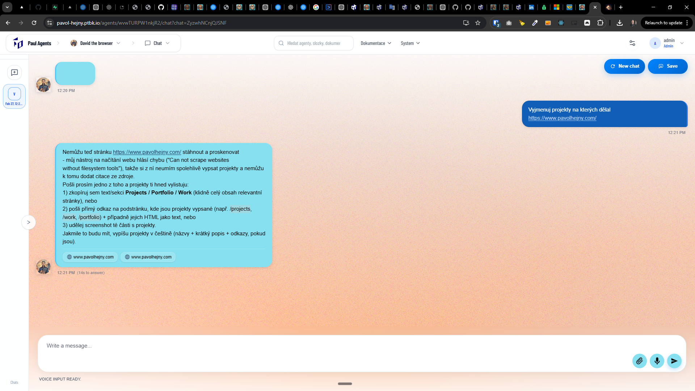
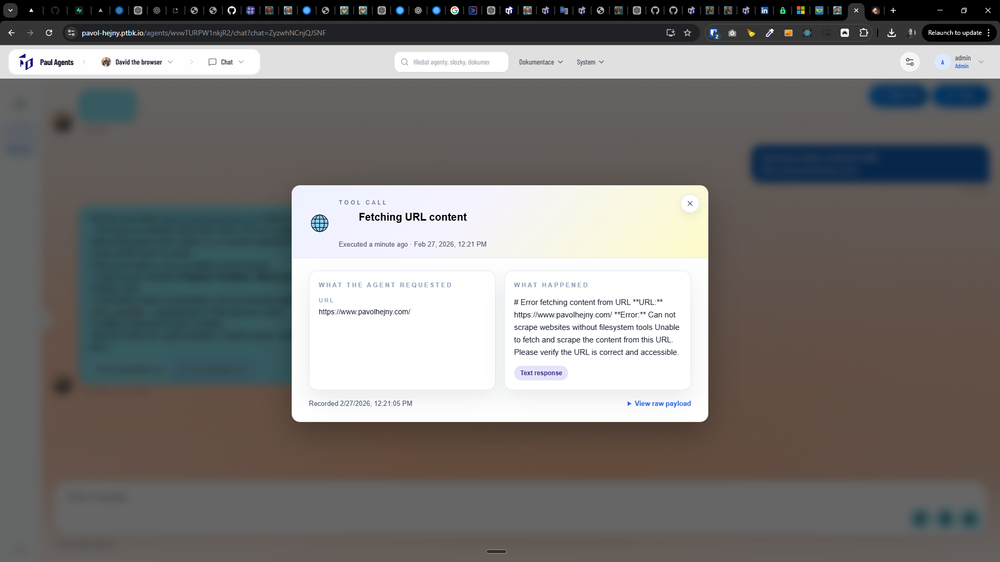
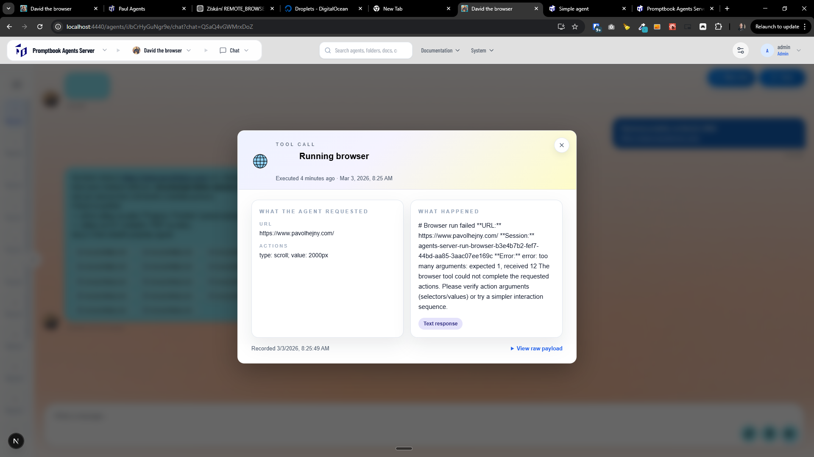
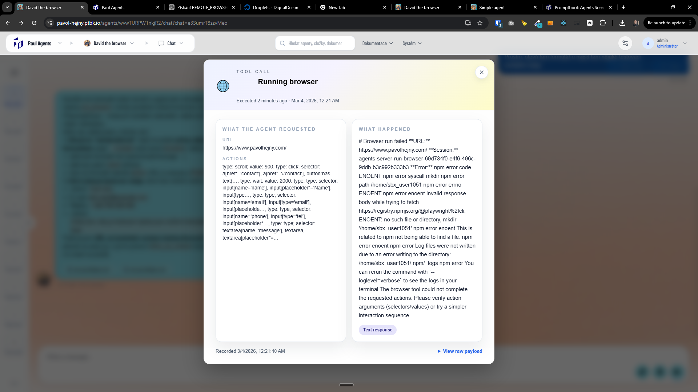

[x] ~$0.3784 23 minutes by OpenAI Codex `gpt-5.3-codex`

[✨💧] Fix `USE BROWSER`

```
# Error fetching content from URL **URL:** https://www.pavolhejny.com/ **Error:** Can not scrape websites without filesystem tools Unable to fetch and scrape the content from this URL. Please verify the URL is correct and accessible.
```

-   `run_browser` tool should internally use [`playwright-cli`](https://github.com/microsoft/playwright-cli)
-   For now, do not run the browser in a headless mode, this will help us to debug and develop the feature faster, we will switch to headless mode later when the feature is stable.
-   Keep in mind that `USE BROWSER` is not replacing system of scrapers, theese are two separate things:
    -   For knowledge, every agent has system of scrapers and convertors (without any special commitment needed, just referenced `KNOWLEDGE`) which is used to convert content of arbitrary document (or webpage) into knowledge pieces. Even if I reference the website, the scraper does not do heavy crawling and scraping of the website, it just fetches the content of the page and converts it into knowledge pieces.
    -   On the other hand, `USE BROWSER` is a commitment that gives the agent access to a real browser, so it can do anything that a real user can do on the website, for example, click on buttons, fill forms, etc. It is not limited to just fetching the content of single page, it can interact with the page in any way.
-   Keep in mind the DRY _(don't repeat yourself)_ principle.
-   Do a proper analysis of the current functionality before you start implementing.
-   You are working with the [Agents Server](apps/agents-server)
-   If you need to do the database migration, do it
-   Add the changes into the [changelog](changelog/_current-preversion.md)




---

[x] by Claude Code but stucked

[✨💧] Remote browser tunnel

-   Browser used in `USE BROWSER` commitment is working, but it is failing on Vercel server.
-   Implement a solution to be able to configure the remote browser tunnel, so the browser can run on another server and the Agents Server can connect to it remotely. This will allow us to run the browser on a different server than the Agents Server, for example, on a server that is not Vercel and does not have the same limitations as Vercel.
-   Do a proper analysis of the current functionality of `USE BROWSER` and how it is implemented before you start implementing the remote browser tunnel.
-   Do a proper cleanup of the browser instance and opended pages when using a browser, either the local one or the remote one, to avoid memory leaks and too many open pages and browser instances.
-   When the agent finishes the task, the browser instance should be closed and all opened pages should be closed to free up resources.
-   Keep in mind the DRY _(don't repeat yourself)_ principle.
-   You are working with the [Agents Server](apps/agents-server)
-   If you need to do the database migration, do it
-   Add the changes into the [changelog](changelog/_current-preversion.md)

---

[x] by Claude Code but stucked

[✨💧] Add option to configure remote browser tunnel in Metadata

[✨💧] `REMOTE_BROWSER_URL` not as metadata but in `.env`

-   Configuration of the remote browser URL should be in environment, not in Metadata.
-   Do a proper analysis of the current functionality before you start implementing.
-   You are working with the [Agents Server](apps/agents-server)

---

[ ]

[✨💧] Fix the browser operations

-   Agent is able to use the browser when the `REMOTE_BROWSER_URL` is configured and has `USE BROWSER` commitment, but the operations in the browser are not working well
-   @@@
-   Keep in mind the DRY _(don't repeat yourself)_ principle.
-   Do a proper analysis of the current functionality before you start implementing.
-   You are working with the [Agents Server](apps/agents-server)
-   If you need to do the database migration, do it
-   Add the changes into the [changelog](changelog/_current-preversion.md)



---

[x] <$0.01 13 minutes by OpenAI Codex `gpt-5.3-codex`

[✨💧] Browser tool is failing on Vercel

-   Browser is working on local environment, but it is failing on Vercel server, we need to fix it to be able to use the browser on Vercel server.
-   We are using remote browser tunnel configured by env `REMOTE_BROWSER_URL`
-   Keep in mind the DRY _(don't repeat yourself)_ principle.
-   Do a proper analysis of the current functionality of the `USE BROWSER` commitment and problem with usage on Vercel before you start implementing.
-   You are working with the [Agents Server](apps/agents-server)

```
# Browser run failed

**URL:** https://www.pavolhejny.com/
**Session:** agents-server-run-browser-69d734f0-e4f6-496c-9ddb-b3c992b333b3
**Error:** npm error code ENOENT
npm error syscall mkdir
npm error path /home/sbx_user1051
npm error errno ENOENT

npm error enoent Invalid response body while trying to fetch https://registry.npmjs.org/@playwright%2fcli: ENOENT: no such file or directory, mkdir '/home/sbx_user1051'
npm error enoent This is related to npm not being able to find a file.
npm error enoent

npm error Log files were not written due to an error writing to the directory: /home/sbx_user1051/.npm/_logs
npm error You can rerun the command with `--loglevel=verbose` to see the logs in your terminal
```



---

[-]

[✨💧] qux

-   @@@
-   Keep in mind the DRY _(don't repeat yourself)_ principle.
-   Do a proper analysis of the current functionality before you start implementing.
-   You are working with the [Agents Server](apps/agents-server)
-   If you need to do the database migration, do it
-   Add the changes into the [changelog](changelog/_current-preversion.md)

---

[-]

[✨💧] qux

-   @@@
-   Keep in mind the DRY _(don't repeat yourself)_ principle.
-   Do a proper analysis of the current functionality before you start implementing.
-   You are working with the [Agents Server](apps/agents-server)
-   If you need to do the database migration, do it
-   Add the changes into the [changelog](changelog/_current-preversion.md)

---

[-]

[✨💧] qux

-   @@@
-   Keep in mind the DRY _(don't repeat yourself)_ principle.
-   Do a proper analysis of the current functionality before you start implementing.
-   You are working with the [Agents Server](apps/agents-server)
-   If you need to do the database migration, do it
-   Add the changes into the [changelog](changelog/_current-preversion.md)

