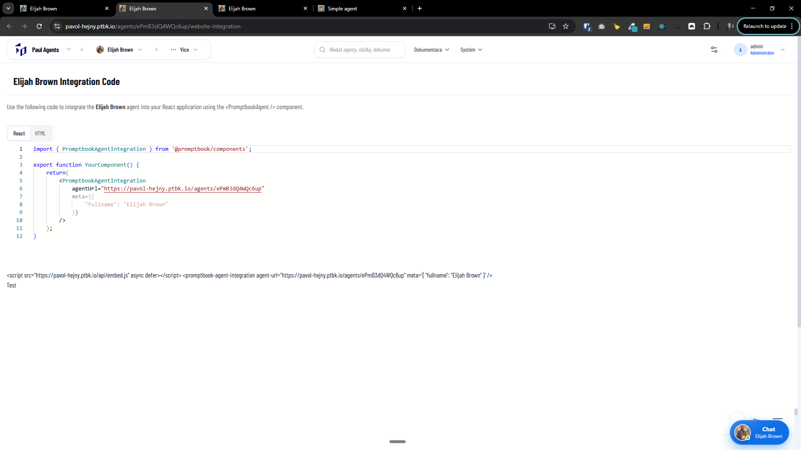
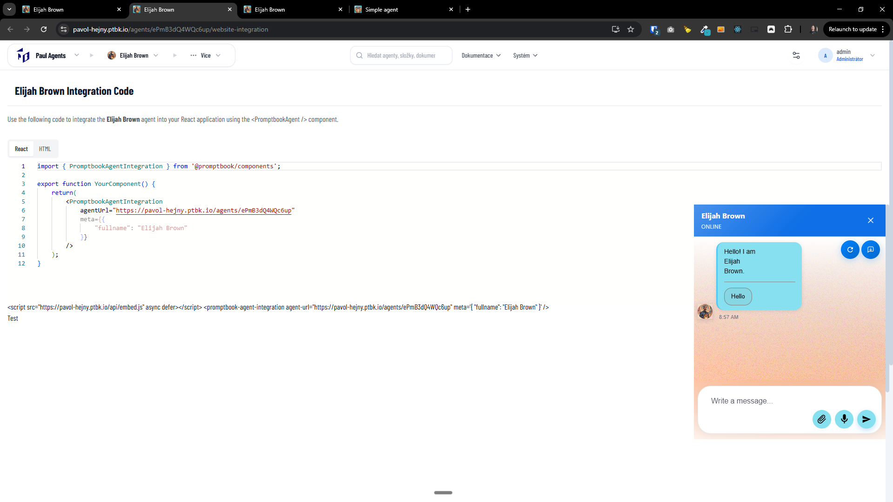
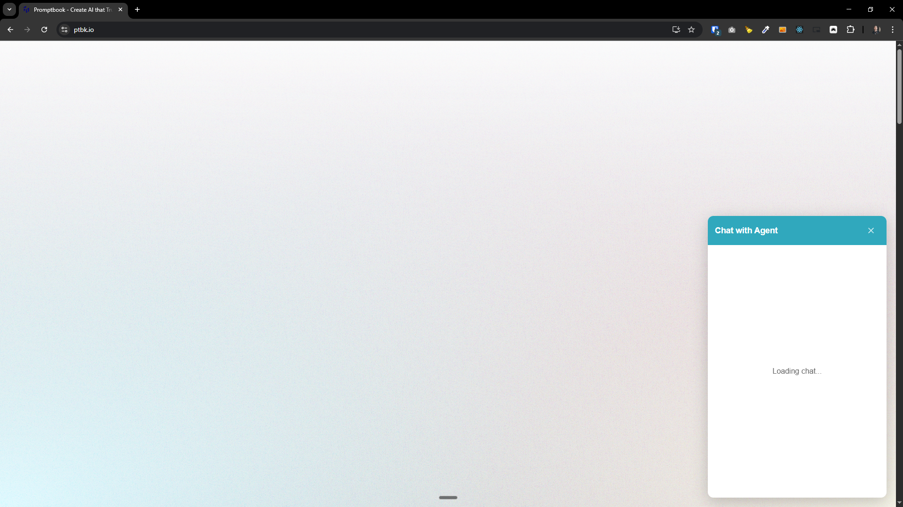
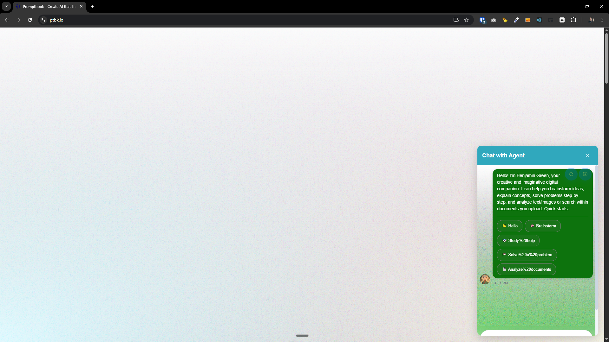
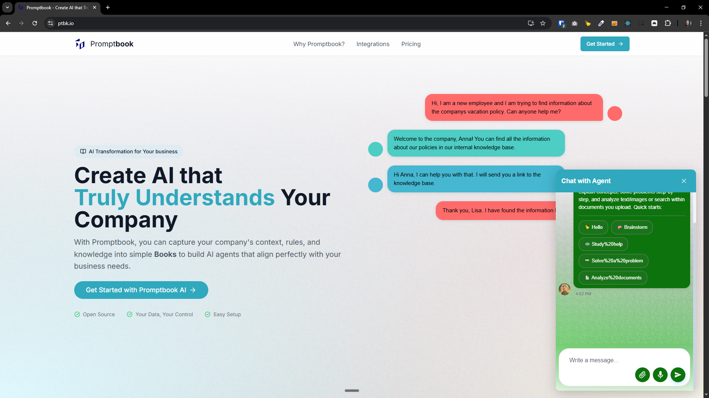
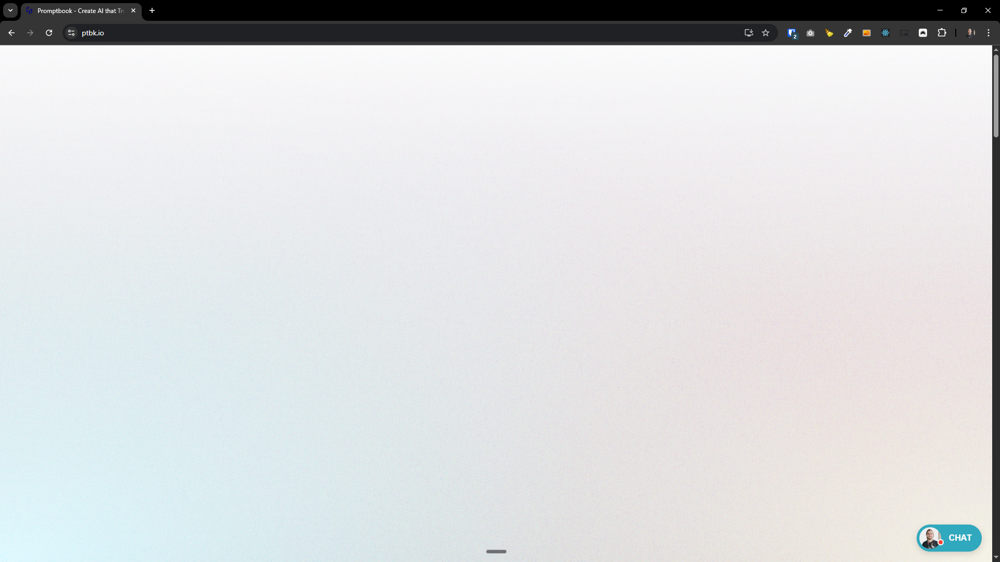

[ ]

[✨🌷] Fix the website integration

-   @@@???
-   Keep in mind the DRY _(don't repeat yourself)_ principle.
-   Do a proper analysis of the current functionality before you start implementing.
-   You are working with the [Agents Server](apps/agents-server)
-   If you need to do the database migration, do it
-   Add the changes into the [changelog](changelog/_current-preversion.md)

---

[x] ~$0.2887 20 minutes by OpenAI Codex `gpt-5.3-codex`

[✨🌷] Enhance design and behavior of website integration

-   Do not show any iframe until the user clicks the chat widget
-   Enhance the design of the chat widget, espetially the opened state
    -   Make there a border radius
    -   Minify by clicking outside of the widget, not only on the close button
    -   Do it UX and UI perfect
-   Keep in mind the DRY _(don't repeat yourself)_ principle.
-   Do a proper analysis of the current functionality of chat integration before you start implementing.
-   You are working with the [Agents Server](apps/agents-server)

---

[x] ~$1.56 23 minutes by OpenAI Codex `gpt-5.3-codex`

[✨🌷] Enhance design and behavior of website integration

-   Enhance the design of the chat widget, espetially the opened state
    -   Fix the width and layout of the opened widget, right now it has several problems:
        -   Loading state should look better 
        -   The input field should be always on the bottom no matter how many of few messages are in the chat
            -   
    -   Add some border and slight shadow to separate the widget from the website content
        -   
    -   Minify by clicking outside of the widget, not only on the close button
    -   Do it UX and UI perfect
-   On the closed state, change the color of the online indicator to green when the chat is connected.
    
-   Keep in mind the DRY _(don't repeat yourself)_ principle.
-   Do a proper analysis of the current functionality of chat integration before you start implementing.
-   You are working with the [Agents Server](apps/agents-server)

---

[-]

[✨🌷] brr

-   @@@
-   Keep in mind the DRY _(don't repeat yourself)_ principle.
-   Do a proper analysis of the current functionality before you start implementing.
-   You are working with the [Agents Server](apps/agents-server)
-   If you need to do the database migration, do it
-   Add the changes into the [changelog](changelog/_current-preversion.md)

---

[-]

[✨🌷] brr

-   @@@
-   Keep in mind the DRY _(don't repeat yourself)_ principle.
-   Do a proper analysis of the current functionality before you start implementing.
-   You are working with the [Agents Server](apps/agents-server)
-   If you need to do the database migration, do it
-   Add the changes into the [changelog](changelog/_current-preversion.md)

