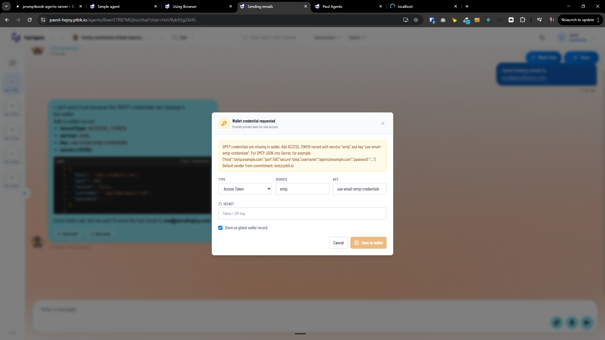

[x] ~$0.9852 40 minutes by OpenAI Codex `gpt-5.3-codex`

[✨😰] Make commitment `USE EMAIL` and allow agent to send emails

**For example, this AI agent can write emails:**

```book
Writing Agent

USE EMAIL agent@example.com
RULE Write emails to customers according to the instructions from user.
```

-   Allow the agent to be using SMTP for sending the emails.
-   These credentials should be stored in a wallet. It should be enable by the commitment `USE EMAIL`.
-   When agent doesn’t have the credentials for sending email, it should ask the user to add the credentials into the wallet, and give instructions on how to do it. _(look how `USE PROJECT` commitment is doing and do something similar for email credentials)_
-   Every email should be saved in the `Message` and `MessageSendAttempt`, look how the tables and the functionality around the sending of the emails _(and messages in general)_ is implemented and align with the current implementation and data model as much as possible.
    -   Sending of the email has two logical steps, first is creating the `Message` with the content of the email, and then creating the `MessageSendAttempt` which will be responsible for actually sending the email and storing the response and status of the sending.
    -   This logic should be abstracted and reusable, and the AI agent when sending the email should just call some tool like `send_email` with the email contents _(use the [type `Message`](src/types/Message.ts) as input object)_ and recieves the response and status of the sending, and all the logic of creating the `Message`, `MessageSendAttempt` and sending the email should be handled inside this tool and its dependencies.
-   Do a proper analysis of the current functionality before you start implementing.
-   You are working with the [Agents Server](apps/agents-server)
-   For inspiration on how to implement this, you can check the implementation of `USE PROJECT` commitment and how the credentials are stored in the wallet and used by the agent, and do something similar for email credentials.
-   If you need to do the database migration, do it
-   Keep in mind the DRY _(don't repeat yourself)_ principle.
-   Keep in mind that you are implementing only the outbound email sending functionality in this task, you are not implementing the receiving email functionality, receiving emails will be implemented in another task.
-   Keep in mind that you are not changing the behavior of the agents, you are just adding a new commitment `USE EMAIL` and related functionality
-   Add the changes into the [changelog](changelog/_current-preversion.md)

---

[ ] !

[✨😰] Allow to receive emails.

IMAP / POP3 credentials

-   Commitment `USE EMAIL agent@example.com` should also allow the agent to receive emails, not only send emails. For this, the agent will need IMAP or POP3 credentials in addition to SMTP credentials for sending emails.
-   Request the user to add the IMAP/POP3 credentials into the wallet together with the SMTP credentials when the agent is using `USE EMAIL` commitment, and give instructions on how to do it, similar to how it is done for SMTP credentials.
-   Agent should be able to check for new emails, and when there are new emails, it should be able to read them and process them according to the rules defined in the book. - - For example, it can have a rule like `RULE When there is a new email, read it and write a response email and summarize to chat` and it should be able to do it.
-   Keep this logic together because they are related
-   Keep in mind the DRY _(don't repeat yourself)_ principle.
-   All the messages in both inbound and outbound should be backed up into the `Message` table.
-   Do a proper analysis of the current functionality @@@ before you start implementing.
-   You are working with the [Agents Server](apps/agents-server)
-   If you need to do the database migration, for example for email receiving queue, do it
-   Add the changes into the [changelog](changelog/_current-preversion.md)

---

[x] ~$0.5552 24 minutes by OpenAI Codex `gpt-5.3-codex`

[✨😰] Make Adding the SMPT credentials into the wallet easier

-   Look how `USE PROJECT` commitment is asking the user to add the Github token into the wallet.
-   Add requested JSON schema alongside the record in the wallet.
-   Allow to toggle visibility of records in the wallet, simmilar to the toggle visibility of the passwords
-   Also allow multiline records in the wallet, because the SMTP credentials JSON can be multiline and it is not user friendly to put it into one line, so allow to put it into multiple lines in the wallet for better readability and usability.
-   Do it overall more user friendly and better from the UX and UI perspective.
-   Keep in mind the DRY _(don't repeat yourself)_ principle.
-   Do a proper analysis of the current functionality of the wallet and `USE EMAIL `before you start implementing.
-   You are working with the [Agents Server](apps/agents-server)
-   If you need to do the database migration (for example for the JSON schemas), do it
-   Add the changes into the [changelog](changelog/_current-preversion.md)

```
SMTP credentials are missing in wallet. Add ACCESS_TOKEN record with service "smtp" and key "use-email-smtp-credentials". Put SMTP JSON into Secret, for example: {"host":"smtp.example.com","port":587,"secure":false,"username":"agent@example.com","password":"..."} Default sender from commitment: test@ptbk.io
```



---

[-]

[✨😰] foo

-   @@@
-   Keep in mind the DRY _(don't repeat yourself)_ principle.
-   Do a proper analysis of the current functionality before you start implementing.
-   You are working with the [Agents Server](apps/agents-server)
-   If you need to do the database migration, do it
-   Add the changes into the [changelog](changelog/_current-preversion.md)
