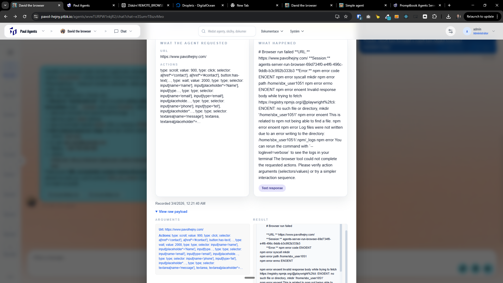
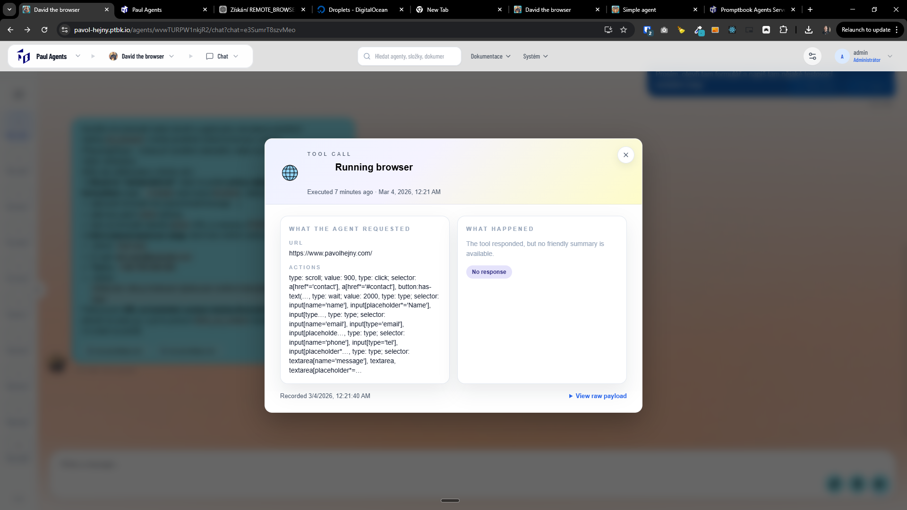

[x] ~$0.4958 14 minutes by OpenAI Codex `gpt-5.3-codex`

[✨👿] Make simple + advanced version of Tool call popup

-   When the agent is calling a tool, there is a popup showing the tool call with the parameters.
-   This popup is currently have two versions, a simple version and View raw payload version.
-   But the simple version is extremely technical and not user friendly and View raw payload doesn’t show the raw payload but some user friendly version of the payload
-   Change the toolcall modal such as:
    1. By default it will be extremely simple and user friendly, do not even use wording like "tool call" or "parameters", just show the information in the most user friendly way possible, for example good sample of this is `USE SEARCH ENGINE` or `TEAM`. Do not even show the time of the tool call _(only exception is `TIME` where it is obvious to show the time)_
    2. Somewhere down show a button "Advanced" and when clicked, the popup will change and show really raw input and output of the tool call, with all the technical details, exactly as it is sent to the tool, without any user friendly formatting, just raw payload, raw response, etc. This will be for advanced users who want to see the raw details of the tool call.
-   You are doing this for all the commitments that can show the chips bellow the message, for example `USE BROWSER`, `USE PROJECT`, `KNOWLEDGE`, `USE SEARCH ENGINE`, `TEAM`,...
-   Keep in mind the DRY _(don't repeat yourself)_ principle, try to make the popups from the chips as much reusable and in similar UI, UX and code as possible, just with different content according to the commitment, the tool call or the information that is shown in the popup.
-   Keep in mind that you are not changing the behavior of the tool calls or agents, you are just changing the way how the information about the tool calls is shown in the popup when clicking on the chips.
-   Do a proper analysis of the current functionality before you start implementing.
-   You are working with the [Agents Server](apps/agents-server)

---

[ ]

[✨👿] Enhance Design of the advanced tool call popups

-   @@@
-   Keep in mind the DRY _(don't repeat yourself)_ principle.
-   Do a proper analysis of the current functionality before you start implementing.
-   You are working with the [Agents Server](apps/agents-server)
-   If you need to do the database migration, do it
-   Add the changes into the [changelog](changelog/_current-preversion.md)

---

[-]

[✨👿] bar

-   @@@
-   Keep in mind the DRY _(don't repeat yourself)_ principle.
-   Do a proper analysis of the current functionality before you start implementing.
-   You are working with the [Agents Server](apps/agents-server)
-   If you need to do the database migration, do it
-   Add the changes into the [changelog](changelog/_current-preversion.md)

---

[-]

[✨👿] bar

-   @@@
-   Keep in mind the DRY _(don't repeat yourself)_ principle.
-   Do a proper analysis of the current functionality before you start implementing.
-   You are working with the [Agents Server](apps/agents-server)
-   If you need to do the database migration, do it
-   Add the changes into the [changelog](changelog/_current-preversion.md)

