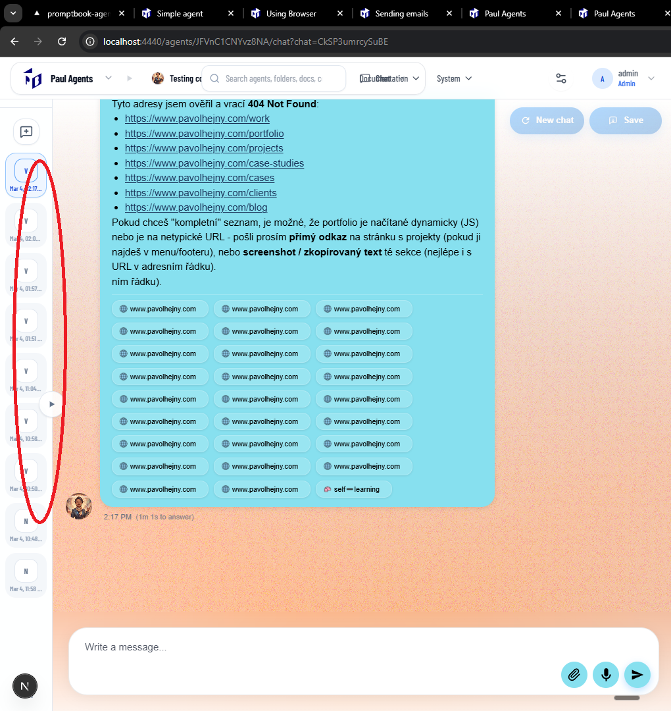

[x] ~$0.2147 9 minutes by OpenAI Codex `gpt-5.3-codex`

[✨💄] Enhance the collapsed version of my chat's left bar

-   Now it shows one letter for each chat, which is not very informative and not very user friendly
-   Change it to show some cool looking mini version of the chat with number of messages in that chat
-   Preserve information about the time, but make it relative. "Mar 24, 2026 12:00" -> "2 hours ago"
-   Keep using `moment.js` for the time formatting, but use the relative time formatting instead of the absolute time formatting
-   Keep in mind the DRY _(don't repeat yourself)_ principle.
-   Do a proper analysis of the current functionality before you start implementing.
-   You are working with the [Agents Server](apps/agents-server)

---

[-]

[✨💄] brr

-   @@@
-   Keep in mind the DRY _(don't repeat yourself)_ principle.
-   Do a proper analysis of the current functionality before you start implementing.
-   You are working with the [Agents Server](apps/agents-server)
-   If you need to do the database migration, do it
-   Add the changes into the [changelog](changelog/_current-preversion.md)

---

[-]

[✨💄] brr

-   @@@
-   Keep in mind the DRY _(don't repeat yourself)_ principle.
-   Do a proper analysis of the current functionality before you start implementing.
-   You are working with the [Agents Server](apps/agents-server)
-   If you need to do the database migration, do it
-   Add the changes into the [changelog](changelog/_current-preversion.md)

---

[-]

[✨💄] brr

-   @@@
-   Keep in mind the DRY _(don't repeat yourself)_ principle.
-   Do a proper analysis of the current functionality before you start implementing.
-   You are working with the [Agents Server](apps/agents-server)
-   If you need to do the database migration, do it
-   Add the changes into the [changelog](changelog/_current-preversion.md)

