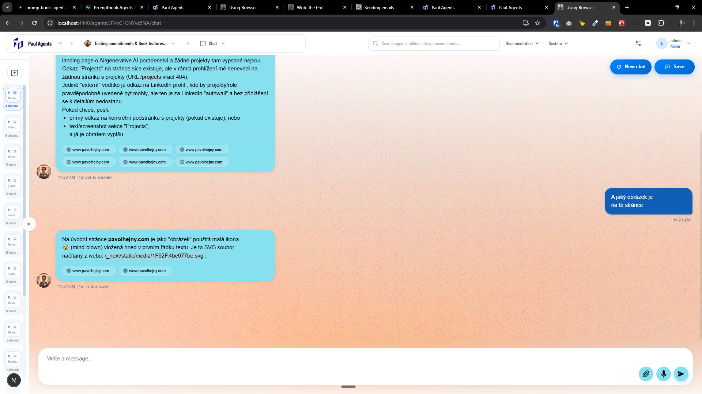
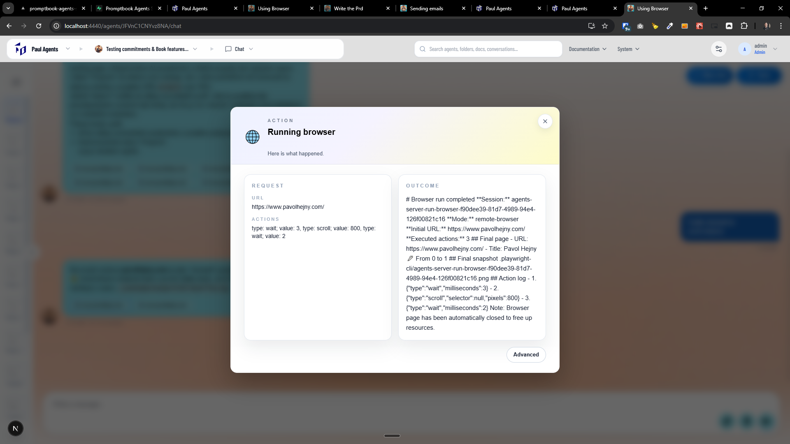

[ ] !

[✨🥕] Put screenshots from the browser into the `USE BROWSER` chip popup

-   When clicking on browser chip, the popup "Running browser" is shown
-   The Pop-up modal is showing technical information about the browser action.
-   Instead show the screenshot or video of what the agent was doing in the browser.
-   User should be able to see agent mouse or actions, what he is doing in the browser
-   Keep in mind the DRY _(don't repeat yourself)_ principle.
-   Do a proper analysis of the current functionality of the browser usage before you start implementing.
-   You are working with the [Agents Server](apps/agents-server)
-   You can use CDN to store screenshots or videos if needed
-   If you need to do the database migration, do it

---

[ ]

[✨🥕] Browser should be able to see graphics

-   @@@
-   Keep in mind the DRY _(don't repeat yourself)_ principle.
-   Do a proper analysis of the current functionality before you start implementing.
-   You are working with the [Agents Server](apps/agents-server)
-   If you need to do the database migration, do it
-   Add the changes into the [changelog](changelog/_current-preversion.md)

---

[-]

[✨🥕] bar

-   @@@
-   Keep in mind the DRY _(don't repeat yourself)_ principle.
-   Do a proper analysis of the current functionality before you start implementing.
-   You are working with the [Agents Server](apps/agents-server)
-   If you need to do the database migration, do it
-   Add the changes into the [changelog](changelog/_current-preversion.md)

---

[-]

[✨🥕] bar

-   @@@
-   Keep in mind the DRY _(don't repeat yourself)_ principle.
-   Do a proper analysis of the current functionality before you start implementing.
-   You are working with the [Agents Server](apps/agents-server)
-   If you need to do the database migration, do it
-   Add the changes into the [changelog](changelog/_current-preversion.md)
