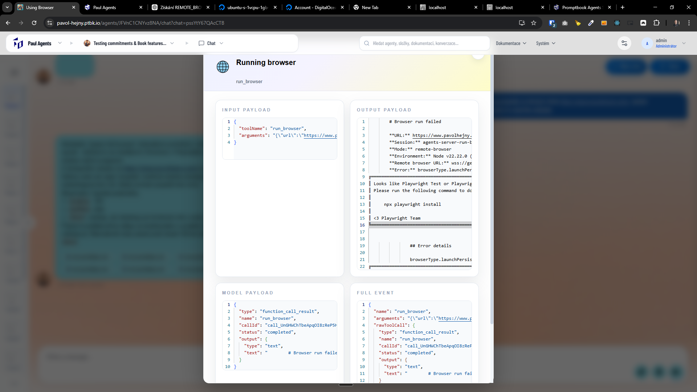

[x] ~$0.1447 6 minutes by OpenAI Codex `gpt-5.3-codex`

[✨🤮] Fix browser usage on Vercel

-   When running locally via `next dev` with `REMOTE_BROWSER_URL` it works
-   When deployed on Vercel with `REMOTE_BROWSER_URL` it doesn't work:

**Input payload**

```json
{
    "toolName": "run_browser",
    "arguments": "{\"url\":\"https://www.pavolhejny.com/\",\"actions\":[{\"type\":\"wait\",\"value\":\"2000\"},{\"type\":\"scroll\",\"value\":\"1200\"},{\"type\":\"wait\",\"value\":\"1000\"},{\"type\":\"scroll\",\"value\":\"1200\"},{\"type\":\"wait\",\"value\":\"1000\"},{\"type\":\"scroll\",\"value\":\"1200\"},{\"type\":\"wait\",\"value\":\"1000\"}]}"
}
```

**Output payload**

```
        # Browser run failed

        **URL:** https://www.pavolhejny.com/
        **Session:** agents-server-run-browser-c9c6af11-5953-423c-866b-2fdd7fafda6e
        **Mode:** remote-browser
        **Environment:** Node v22.22.0 (linux/x64) • production
        **Remote browser URL:** wss://gentle-oranges-guess.loca.lt:3000/962b400fd3a714cab4dcb26e3bcddc80
        **Error:** browserType.launchPersistentContext: Executable doesn't exist at /home/sbx_user1051/.cache/ms-playwright/chromium-1194/chrome-linux/chrome
╔═════════════════════════════════════════════════════════════════════════╗
║ Looks like Playwright Test or Playwright was just installed or updated. ║
║ Please run the following command to download new browsers:              ║
║                                                                         ║
║     npx playwright install                                              ║
║                                                                         ║
║ <3 Playwright Team                                                      ║
╚═════════════════════════════════════════════════════════════════════════╝


                ## Error details

                browserType.launchPersistentContext: Executable doesn't exist at /home/sbx_user1051/.cache/ms-playwright/chromium-1194/chrome-linux/chrome
╔═════════════════════════════════════════════════════════════════════════╗
║ Looks like Playwright Test or Playwright was just installed or updated. ║
║ Please run the following command to download new browsers:              ║
║                                                                         ║
║     npx playwright install                                              ║
║                                                                         ║
║ <3 Playwright Team                                                      ║
╚═════════════════════════════════════════════════════════════════════════╝
    at async m.createLocalBrowserContext (/var/task/apps/agents-server/.next/server/chunks/7866.js:6:2786)
    at async m.createRemoteBrowserContext (/var/task/apps/agents-server/.next/server/chunks/7866.js:6:3337)
    at async m.getBrowserContext (/var/task/apps/agents-server/.next/server/chunks/7866.js:6:1205)
    at async g (/var/task/apps/agents-server/.next/server/chunks/7866.js:48:199)
    at async p (/var/task/apps/agents-server/.next/server/chunks/7866.js:62:734)
    at async y (/var/task/apps/agents-server/.next/server/chunks/7866.js:110:61)
    at async eval (<anonymous>:59:11)
    at async JavascriptEvalExecutionTools.execute (/var/task/apps/agents-server/.next/server/chunks/7866.js:136:68)
    at async Object.execute (/var/task/apps/agents-server/.next/server/chunks/4146.js:1:4589)
    at async l (/var/task/apps/agents-server/.next/server/chunks/8343.js:46:30230)
    at async ec.data.name (/var/task/apps/agents-server/.next/server/chunks/8343.js:50:71920)
    at async /var/task/apps/agents-server/.next/server/chunks/8343.js:50:29920
    at async fG (/var/task/apps/agents-server/.next/server/chunks/8343.js:50:69791)
    at async gh (/var/task/apps/agents-server/.next/server/chunks/8343.js:50:91753)
    at async #Y (/var/task/apps/agents-server/.next/server/chunks/8343.js:50:114706)


        The browser tool could not complete the requested actions.
        Please verify action arguments (selectors/values) or try a simpler interaction sequence.
```

**Model payload**

```json
{
    "type": "function_call_result",
    "name": "run_browser",
    "callId": "call_UnGHWChTbeApqOI8zReP5HLb",
    "status": "completed",
    "output": {
        "type": "text",
        "text": "        # Browser run failed\n\n        **URL:** https://www.pavolhejny.com/\n        **Session:** agents-server-run-browser-c9c6af11-5953-423c-866b-2fdd7fafda6e\n        **Mode:** remote-browser\n        **Environment:** Node v22.22.0 (linux/x64) • production\n        **Remote browser URL:** wss://gentle-oranges-guess.loca.lt:3000/962b400fd3a714cab4dcb26e3bcddc80\n        **Error:** browserType.launchPersistentContext: Executable doesn't exist at /home/sbx_user1051/.cache/ms-playwright/chromium-1194/chrome-linux/chrome\n╔═════════════════════════════════════════════════════════════════════════╗\n║ Looks like Playwright Test or Playwright was just installed or updated. ║\n║ Please run the following command to download new browsers:              ║\n║                                                                         ║\n║     npx playwright install                                              ║\n║                                                                         ║\n║ <3 Playwright Team                                                      ║\n╚═════════════════════════════════════════════════════════════════════════╝\n\n        \n                ## Error details\n\n                browserType.launchPersistentContext: Executable doesn't exist at /home/sbx_user1051/.cache/ms-playwright/chromium-1194/chrome-linux/chrome\n╔═════════════════════════════════════════════════════════════════════════╗\n║ Looks like Playwright Test or Playwright was just installed or updated. ║\n║ Please run the following command to download new browsers:              ║\n║                                                                         ║\n║     npx playwright install                                              ║\n║                                                                         ║\n║ <3 Playwright Team                                                      ║\n╚═════════════════════════════════════════════════════════════════════════╝\n    at async m.createLocalBrowserContext (/var/task/apps/agents-server/.next/server/chunks/7866.js:6:2786)\n    at async m.createRemoteBrowserContext (/var/task/apps/agents-server/.next/server/chunks/7866.js:6:3337)\n    at async m.getBrowserContext (/var/task/apps/agents-server/.next/server/chunks/7866.js:6:1205)\n    at async g (/var/task/apps/agents-server/.next/server/chunks/7866.js:48:199)\n    at async p (/var/task/apps/agents-server/.next/server/chunks/7866.js:62:734)\n    at async y (/var/task/apps/agents-server/.next/server/chunks/7866.js:110:61)\n    at async eval (<anonymous>:59:11)\n    at async JavascriptEvalExecutionTools.execute (/var/task/apps/agents-server/.next/server/chunks/7866.js:136:68)\n    at async Object.execute (/var/task/apps/agents-server/.next/server/chunks/4146.js:1:4589)\n    at async l (/var/task/apps/agents-server/.next/server/chunks/8343.js:46:30230)\n    at async ec.data.name (/var/task/apps/agents-server/.next/server/chunks/8343.js:50:71920)\n    at async /var/task/apps/agents-server/.next/server/chunks/8343.js:50:29920\n    at async fG (/var/task/apps/agents-server/.next/server/chunks/8343.js:50:69791)\n    at async gh (/var/task/apps/agents-server/.next/server/chunks/8343.js:50:91753)\n    at async #Y (/var/task/apps/agents-server/.next/server/chunks/8343.js:50:114706)\n            \n\n        The browser tool could not complete the requested actions.\n        Please verify action arguments (selectors/values) or try a simpler interaction sequence."
    }
}
```

**Full event**

```json
{
    "name": "run_browser",
    "arguments": "{\"url\":\"https://www.pavolhejny.com/\",\"actions\":[{\"type\":\"wait\",\"value\":\"2000\"},{\"type\":\"scroll\",\"value\":\"1200\"},{\"type\":\"wait\",\"value\":\"1000\"},{\"type\":\"scroll\",\"value\":\"1200\"},{\"type\":\"wait\",\"value\":\"1000\"},{\"type\":\"scroll\",\"value\":\"1200\"},{\"type\":\"wait\",\"value\":\"1000\"}]}",
    "rawToolCall": {
        "type": "function_call_result",
        "name": "run_browser",
        "callId": "call_UnGHWChTbeApqOI8zReP5HLb",
        "status": "completed",
        "output": {
            "type": "text",
            "text": "        # Browser run failed\n\n        **URL:** https://www.pavolhejny.com/\n        **Session:** agents-server-run-browser-c9c6af11-5953-423c-866b-2fdd7fafda6e\n        **Mode:** remote-browser\n        **Environment:** Node v22.22.0 (linux/x64) • production\n        **Remote browser URL:** wss://gentle-oranges-guess.loca.lt:3000/962b400fd3a714cab4dcb26e3bcddc80\n        **Error:** browserType.launchPersistentContext: Executable doesn't exist at /home/sbx_user1051/.cache/ms-playwright/chromium-1194/chrome-linux/chrome\n╔═════════════════════════════════════════════════════════════════════════╗\n║ Looks like Playwright Test or Playwright was just installed or updated. ║\n║ Please run the following command to download new browsers:              ║\n║                                                                         ║\n║     npx playwright install                                              ║\n║                                                                         ║\n║ <3 Playwright Team                                                      ║\n╚═════════════════════════════════════════════════════════════════════════╝\n\n        \n                ## Error details\n\n                browserType.launchPersistentContext: Executable doesn't exist at /home/sbx_user1051/.cache/ms-playwright/chromium-1194/chrome-linux/chrome\n╔═════════════════════════════════════════════════════════════════════════╗\n║ Looks like Playwright Test or Playwright was just installed or updated. ║\n║ Please run the following command to download new browsers:              ║\n║                                                                         ║\n║     npx playwright install                                              ║\n║                                                                         ║\n║ <3 Playwright Team                                                      ║\n╚═════════════════════════════════════════════════════════════════════════╝\n    at async m.createLocalBrowserContext (/var/task/apps/agents-server/.next/server/chunks/7866.js:6:2786)\n    at async m.createRemoteBrowserContext (/var/task/apps/agents-server/.next/server/chunks/7866.js:6:3337)\n    at async m.getBrowserContext (/var/task/apps/agents-server/.next/server/chunks/7866.js:6:1205)\n    at async g (/var/task/apps/agents-server/.next/server/chunks/7866.js:48:199)\n    at async p (/var/task/apps/agents-server/.next/server/chunks/7866.js:62:734)\n    at async y (/var/task/apps/agents-server/.next/server/chunks/7866.js:110:61)\n    at async eval (<anonymous>:59:11)\n    at async JavascriptEvalExecutionTools.execute (/var/task/apps/agents-server/.next/server/chunks/7866.js:136:68)\n    at async Object.execute (/var/task/apps/agents-server/.next/server/chunks/4146.js:1:4589)\n    at async l (/var/task/apps/agents-server/.next/server/chunks/8343.js:46:30230)\n    at async ec.data.name (/var/task/apps/agents-server/.next/server/chunks/8343.js:50:71920)\n    at async /var/task/apps/agents-server/.next/server/chunks/8343.js:50:29920\n    at async fG (/var/task/apps/agents-server/.next/server/chunks/8343.js:50:69791)\n    at async gh (/var/task/apps/agents-server/.next/server/chunks/8343.js:50:91753)\n    at async #Y (/var/task/apps/agents-server/.next/server/chunks/8343.js:50:114706)\n            \n\n        The browser tool could not complete the requested actions.\n        Please verify action arguments (selectors/values) or try a simpler interaction sequence."
        }
    },
    "createdAt": "2026-03-05T10:45:18.903Z",
    "idempotencyKey": "raw:call_UnGHWChTbeApqOI8zReP5HLb",
    "result": "        # Browser run failed\n\n        **URL:** https://www.pavolhejny.com/\n        **Session:** agents-server-run-browser-c9c6af11-5953-423c-866b-2fdd7fafda6e\n        **Mode:** remote-browser\n        **Environment:** Node v22.22.0 (linux/x64) • production\n        **Remote browser URL:** wss://gentle-oranges-guess.loca.lt:3000/962b400fd3a714cab4dcb26e3bcddc80\n        **Error:** browserType.launchPersistentContext: Executable doesn't exist at /home/sbx_user1051/.cache/ms-playwright/chromium-1194/chrome-linux/chrome\n╔═════════════════════════════════════════════════════════════════════════╗\n║ Looks like Playwright Test or Playwright was just installed or updated. ║\n║ Please run the following command to download new browsers:              ║\n║                                                                         ║\n║     npx playwright install                                              ║\n║                                                                         ║\n║ <3 Playwright Team                                                      ║\n╚═════════════════════════════════════════════════════════════════════════╝\n\n        \n                ## Error details\n\n                browserType.launchPersistentContext: Executable doesn't exist at /home/sbx_user1051/.cache/ms-playwright/chromium-1194/chrome-linux/chrome\n╔═════════════════════════════════════════════════════════════════════════╗\n║ Looks like Playwright Test or Playwright was just installed or updated. ║\n║ Please run the following command to download new browsers:              ║\n║                                                                         ║\n║     npx playwright install                                              ║\n║                                                                         ║\n║ <3 Playwright Team                                                      ║\n╚═════════════════════════════════════════════════════════════════════════╝\n    at async m.createLocalBrowserContext (/var/task/apps/agents-server/.next/server/chunks/7866.js:6:2786)\n    at async m.createRemoteBrowserContext (/var/task/apps/agents-server/.next/server/chunks/7866.js:6:3337)\n    at async m.getBrowserContext (/var/task/apps/agents-server/.next/server/chunks/7866.js:6:1205)\n    at async g (/var/task/apps/agents-server/.next/server/chunks/7866.js:48:199)\n    at async p (/var/task/apps/agents-server/.next/server/chunks/7866.js:62:734)\n    at async y (/var/task/apps/agents-server/.next/server/chunks/7866.js:110:61)\n    at async eval (<anonymous>:59:11)\n    at async JavascriptEvalExecutionTools.execute (/var/task/apps/agents-server/.next/server/chunks/7866.js:136:68)\n    at async Object.execute (/var/task/apps/agents-server/.next/server/chunks/4146.js:1:4589)\n    at async l (/var/task/apps/agents-server/.next/server/chunks/8343.js:46:30230)\n    at async ec.data.name (/var/task/apps/agents-server/.next/server/chunks/8343.js:50:71920)\n    at async /var/task/apps/agents-server/.next/server/chunks/8343.js:50:29920\n    at async fG (/var/task/apps/agents-server/.next/server/chunks/8343.js:50:69791)\n    at async gh (/var/task/apps/agents-server/.next/server/chunks/8343.js:50:91753)\n    at async #Y (/var/task/apps/agents-server/.next/server/chunks/8343.js:50:114706)\n            \n\n        The browser tool could not complete the requested actions.\n        Please verify action arguments (selectors/values) or try a simpler interaction sequence."
}
```

-   The deployment shouldn't install or run the browser; it should use an instance provided by the `REMOTE_BROWSER_URL` controlled remotely, but it seems that it tries to run or install the browser locally and fails because the browser is not installed (and can not be installed) in the production Vercel serverless environment.
-   We need to get rid of Playwright CLI and use just the Playwright library, do it, but keep the same functionality
-   Keep in mind the DRY _(don't repeat yourself)_ principle.
-   Do a proper analysis of the current functionality before you start implementing.
-   You are working with the [Agents Server](apps/agents-server)



---

[-]

[✨🤮] baz

-   @@@
-   Keep in mind the DRY _(don't repeat yourself)_ principle.
-   Do a proper analysis of the current functionality before you start implementing.
-   You are working with the [Agents Server](apps/agents-server)
-   If you need to do the database migration, do it
-   Add the changes into the [changelog](changelog/_current-preversion.md)

---

[-]

[✨🤮] baz

-   @@@
-   Keep in mind the DRY _(don't repeat yourself)_ principle.
-   Do a proper analysis of the current functionality before you start implementing.
-   You are working with the [Agents Server](apps/agents-server)
-   If you need to do the database migration, do it
-   Add the changes into the [changelog](changelog/_current-preversion.md)

---

[-]

[✨🤮] baz

-   @@@
-   Keep in mind the DRY _(don't repeat yourself)_ principle.
-   Do a proper analysis of the current functionality before you start implementing.
-   You are working with the [Agents Server](apps/agents-server)
-   If you need to do the database migration, do it
-   Add the changes into the [changelog](changelog/_current-preversion.md)

