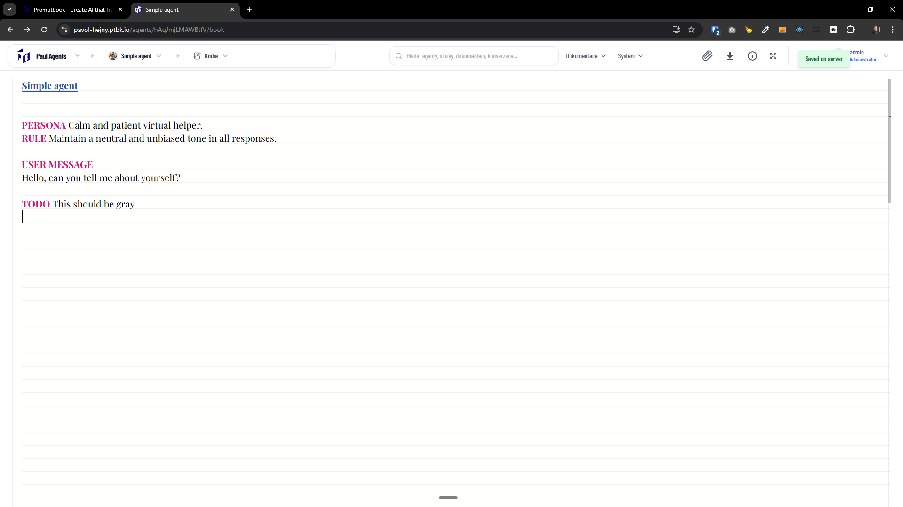

[ ] !

[✨☑️] Make `TODO` commitment gray in the book editor

-   Currently `TODO` looks the same as any other commitment.
-   It should be gray, to visually separate it from other commitments and make it clear that this is a note, simmilar to comment in the code, and not an actual commitment that should be executed by the agent.
-   This is relevant and should be applied for all of these commitments: `TODO`, `NOTE`, `NOTES`, `NONCE` which are aliases of each other.
-   Keep in mind the DRY _(don't repeat yourself)_ principle.
-   Do a proper analysis of the current functionality before you start implementing.
-   You are working with the [Agents Server](apps/agents-server) with a `BookEditor` component
-   Add the changes into the [changelog](changelog/_current-preversion.md)

---

[-]

[✨☑️] brr

-   @@@
-   Keep in mind the DRY _(don't repeat yourself)_ principle.
-   Do a proper analysis of the current functionality before you start implementing.
-   You are working with the [Agents Server](apps/agents-server)
-   If you need to do the database migration, do it
-   Add the changes into the [changelog](changelog/_current-preversion.md)

---

[-]

[✨☑️] brr

-   @@@
-   Keep in mind the DRY _(don't repeat yourself)_ principle.
-   Do a proper analysis of the current functionality before you start implementing.
-   You are working with the [Agents Server](apps/agents-server)
-   If you need to do the database migration, do it
-   Add the changes into the [changelog](changelog/_current-preversion.md)

---

[-]

[✨☑️] brr

-   @@@
-   Keep in mind the DRY _(don't repeat yourself)_ principle.
-   Do a proper analysis of the current functionality before you start implementing.
-   You are working with the [Agents Server](apps/agents-server)
-   If you need to do the database migration, do it
-   Add the changes into the [changelog](changelog/_current-preversion.md)
