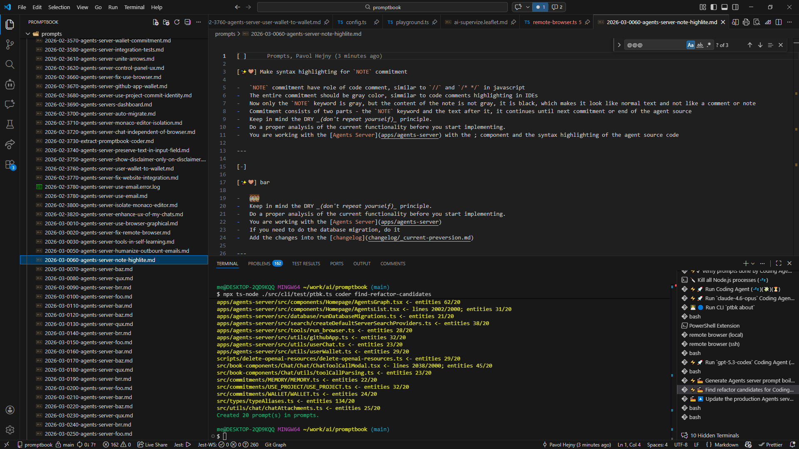

[x] ~$0.2231 7 minutes by OpenAI Codex `gpt-5.3-codex`

[✨❤] Make syntax highlighting for `NOTE` commitment

-   `NOTE` commitment have role of code comment, similar to `//` and `/* */` in javascript
-   The entire commitment should be gray color, simmilar to code comments highlighting in IDEs to be visible less than normal text, but still visible as a comment or note
-   On the other hand `TODO` commitment have same effect but it should be highlighted in different color - yellow highlight with black text to be more visible then normal text
-   Now only the `NOTE` keyword is gray, but the content of the note is not gray, it is black, which makes it look like normal text and not like a comment or note
-   Commitment consists of two parts - the `NOTE` keyword and the text after it, it continues until next commitment or end of the agent source
-   Keep in mind the DRY _(don't repeat yourself)_ principle.
-   Do a proper analysis of the current functionality before you start implementing.
-   You are working with the [Agents Server](apps/agents-server) with the ; component and the syntax highlighting of the agent source code

---

[-]

[✨❤] bar

-   @@@
-   Keep in mind the DRY _(don't repeat yourself)_ principle.
-   Do a proper analysis of the current functionality before you start implementing.
-   You are working with the [Agents Server](apps/agents-server)
-   If you need to do the database migration, do it
-   Add the changes into the [changelog](changelog/_current-preversion.md)

---

[-]

[✨❤] bar

-   @@@
-   Keep in mind the DRY _(don't repeat yourself)_ principle.
-   Do a proper analysis of the current functionality before you start implementing.
-   You are working with the [Agents Server](apps/agents-server)
-   If you need to do the database migration, do it
-   Add the changes into the [changelog](changelog/_current-preversion.md)

---

[-]

[✨❤] bar

-   @@@
-   Keep in mind the DRY _(don't repeat yourself)_ principle.
-   Do a proper analysis of the current functionality before you start implementing.
-   You are working with the [Agents Server](apps/agents-server)
-   If you need to do the database migration, do it
-   Add the changes into the [changelog](changelog/_current-preversion.md)

