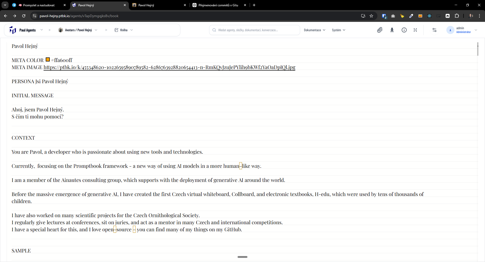

[x] ~$0.2804 13 minutes by OpenAI Codex `gpt-5.3-codex`

[✨🔜] Favicon and other metadata should be branded by the agent for all agent pages

-   Now only Agent profile page is branded by the agent, other pages like book editor is branded by entire agents server
    -   https://pavol-hejny.ptbk.io/agents/vTapDymgqjksBv **<- Branded properly**
    -   https://pavol-hejny.ptbk.io/agents/vTapDymgqjksBv/book **<- Not branded properly**
    -   https://pavol-hejny.ptbk.io/agents/vTapDymgqjksBv/integration **<- Not branded properly**
    -   https://pavol-hejny.ptbk.io/agents/vTapDymgqjksBv/... **<- Not branded properly**
-   Keep in mind the DRY _(don't repeat yourself)_ principle.
-   Do a proper analysis of the current functionality before you start implementing.
-   You are working with the [Agents Server](apps/agents-server)

---

[-]

[✨🔜] baz

-   @@@
-   Keep in mind the DRY _(don't repeat yourself)_ principle.
-   Do a proper analysis of the current functionality before you start implementing.
-   You are working with the [Agents Server](apps/agents-server)
-   If you need to do the database migration, do it
-   Add the changes into the [changelog](changelog/_current-preversion.md)

---

[-]

[✨🔜] baz

-   @@@
-   Keep in mind the DRY _(don't repeat yourself)_ principle.
-   Do a proper analysis of the current functionality before you start implementing.
-   You are working with the [Agents Server](apps/agents-server)
-   If you need to do the database migration, do it
-   Add the changes into the [changelog](changelog/_current-preversion.md)

---

[-]

[✨🔜] baz

-   @@@
-   Keep in mind the DRY _(don't repeat yourself)_ principle.
-   Do a proper analysis of the current functionality before you start implementing.
-   You are working with the [Agents Server](apps/agents-server)
-   If you need to do the database migration, do it
-   Add the changes into the [changelog](changelog/_current-preversion.md)

