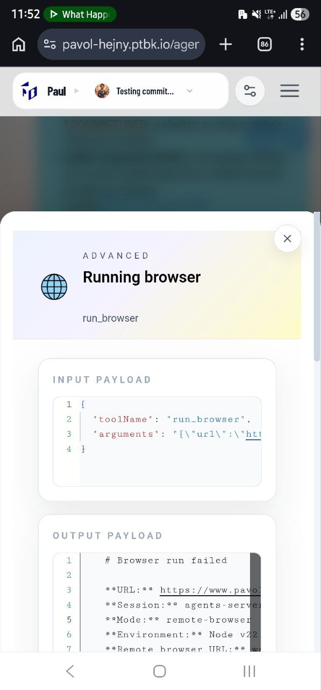

[ ] !

[✨🕞] Add option to save advanced report from a toolcall popup modal from a chip

Together with wider context

-> When some tool is failing, it will be a handful to copy the full report with the entire context and what is happening behind the scenes in the chat, which commitments are used, et cetera, together with the full inputs and outputs and other parts of the advanced report to be copyable as Markdown by one click.

-   This should be **ONLY** in the advanced variant of the toolcall chip popup modal, not in the simple one, because the simple should not expose any technical details
-   There should be 2 options:
    -   Copy - Copy the entire report as markdown to Clipboard
    -   Save - Download the report as file
-   This should be in all possible toolcalls types, for example `USE BROWSER`, `USE SEARCH ENGINE`, `USE PROJECT`, `TEAM`,...
-   Keep in mind the DRY _(don't repeat yourself)_ principle, both options should share same logic
-   Do a proper analysis of the current functionality before you start implementing.
-   You are working with the [Agents Server](apps/agents-server)

---

[ ]

[✨🕞] Add option to trigger error in Agents server app

-   @@@
-   Keep in mind the DRY _(don't repeat yourself)_ principle.
-   Do a proper analysis of the current functionality before you start implementing.
-   You are working with the [Agents Server](apps/agents-server)
-   If you need to do the database migration, do it
-   Add the changes into the [changelog](changelog/_current-preversion.md)

---

[ ]

[✨🕞] Copy the app error

-   @@@
-   This is simmirar to copying advanced report from toolcall popup
-   Keep in mind the DRY _(don't repeat yourself)_ principle.
-   Do a proper analysis of the current functionality before you start implementing.
-   You are working with the [Agents Server](apps/agents-server)
-   If you need to do the database migration, do it
-   Add the changes into the [changelog](changelog/_current-preversion.md)

---

[-]

[✨🕞] qux

-   @@@
-   Keep in mind the DRY _(don't repeat yourself)_ principle.
-   Do a proper analysis of the current functionality before you start implementing.
-   You are working with the [Agents Server](apps/agents-server)
-   If you need to do the database migration, do it
-   Add the changes into the [changelog](changelog/_current-preversion.md)
