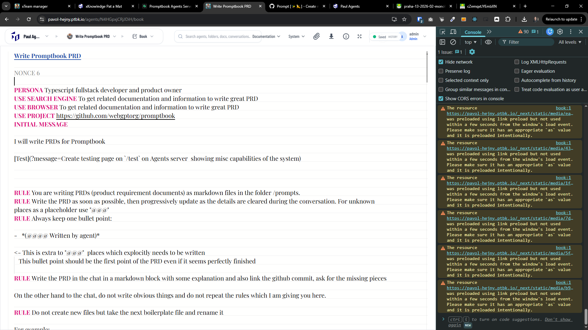
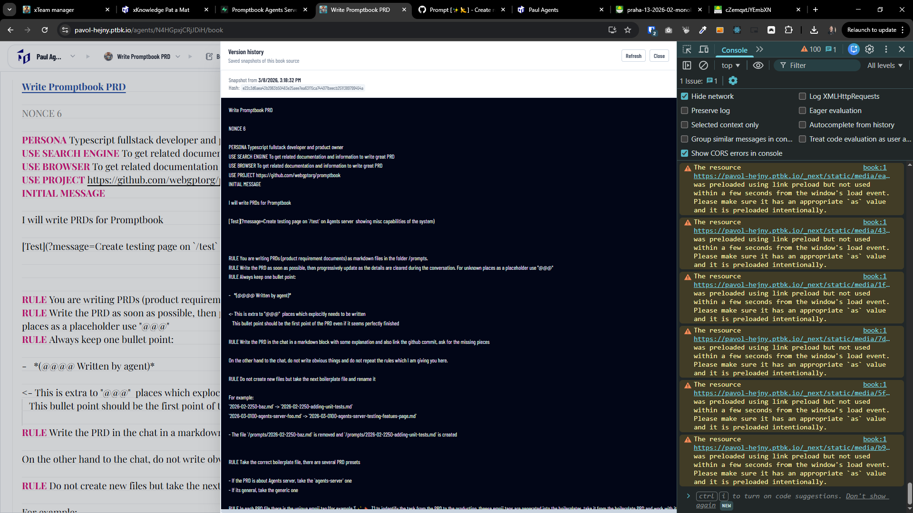

[x] ~$0.3520 30 minutes by OpenAI Codex `gpt-5.3-codex`

[✨⤵️] Allow to see the history of the agent source code book

-   The book editor is doing auto-saving of the changes that you are doing in the book, but currently there is no way to see the history of these changes and revert them if needed.
-   Implement this with simplicity, UI and UX in mind, it shouldn't be some complex git-like history, but rather a simple list of changes with the ability to see the content of the book at that point and revert to it if needed.
-   Take inspiration from Google docs version history
-   The history should be connected with saved indicator, there should be some inconspicuous indicator that the changes are being saved, and when you click on it, it should open the history of the changes
-   Keep in mind the DRY _(don't repeat yourself)_ principle.
-   Do a proper analysis of the current functionality before you start implementing.
-   You are working with the [Agents Server](apps/agents-server)
-   Theese chamges should be already should be recorded in the database in table `AgentHistory`, but it seems broken _(for every agent in `Agent` table there should be one or more records in `AgentHistory`)_
    -   Do the database migration to save the agent history propperly
-   Add the changes into the [changelog](changelog/_current-preversion.md)


**This is the structure of tables in interest from one Agents Server**

```sql
create table public."server_PavolHejny_Agent" (
  id bigint generated by default as identity not null,
  "agentName" text not null,
  "createdAt" timestamp with time zone not null default now(),
  "updatedAt" timestamp with time zone null,
  "agentHash" text not null,
  "agentSource" text not null,
  "agentProfile" jsonb not null,
  "promptbookEngineVersion" text not null,
  usage jsonb null,
  "preparedModelRequirements" jsonb null,
  "permanentId" text null,
  "deletedAt" text null,
  visibility text not null default 'UNLISTED'::text,
  "folderId" bigint null,
  "sortOrder" bigint not null default (
    (
      EXTRACT(
        epoch
        from
          now()
      ) * (1000)::numeric
    )
  )::bigint,
  constraint server_PavolHejny_Agent_pkey primary key (id),
  constraint server_PavolHejny_Agent_folderId_fkey foreign KEY ("folderId") references "server_PavolHejny_AgentFolder" (id) on delete set null,
  constraint server_PavolHejny_Agent_visibility_check check (
    (
      visibility = any (
        array['PUBLIC'::text, 'PRIVATE'::text, 'UNLISTED'::text]
      )
    )
  )
) TABLESPACE pg_default;

create unique INDEX IF not exists "server_PavolHejny_Agent_permanentId_key" on public."server_PavolHejny_Agent" using btree ("permanentId") TABLESPACE pg_default;

create index IF not exists "server_PavolHejny_Agent_folderId_idx" on public."server_PavolHejny_Agent" using btree ("folderId") TABLESPACE pg_default;

create index IF not exists "server_PavolHejny_Agent_sortOrder_idx" on public."server_PavolHejny_Agent" using btree ("sortOrder") TABLESPACE pg_default;

create index IF not exists "server_PavolHejny_Agent_agentName_idx" on public."server_PavolHejny_Agent" using btree ("agentName") TABLESPACE pg_default;


create table public."server_PavolHejny_AgentHistory" (
  id bigint generated by default as identity not null,
  "createdAt" timestamp with time zone not null default now(),
  "agentName" text not null,
  "agentHash" text not null,
  "previousAgentHash" text null,
  "agentSource" text not null,
  "promptbookEngineVersion" text not null,
  "agentId" text not null,
  constraint server_PavolHejny_AgentHistory_pkey primary key (id),
  constraint server_PavolHejny_AgentHistory_agentId_fkey foreign KEY ("agentId") references "server_PavolHejny_Agent" ("permanentId") on delete CASCADE
) TABLESPACE pg_default;

create index IF not exists "server_PavolHejny_AgentHistory_agentName_idx" on public."server_PavolHejny_AgentHistory" using btree ("agentName") TABLESPACE pg_default;

create index IF not exists "server_PavolHejny_AgentHistory_agentHash_idx" on public."server_PavolHejny_AgentHistory" using btree ("agentHash") TABLESPACE pg_default;

create index IF not exists "server_PavolHejny_AgentHistory_agentId_idx" on public."server_PavolHejny_AgentHistory" using btree ("agentId") TABLESPACE pg_default;

```

---

[-] _<- Probbably working_

[✨⤵️] Fix recording of the agent source book history.

-   @@@
-   Keep in mind the DRY _(don't repeat yourself)_ principle.
-   Do a proper analysis of the current functionality before you start implementing.
-   You are working with the [Agents Server](apps/agents-server)
-   If you need to do the database migration, do it
-   Add the changes into the [changelog](changelog/_current-preversion.md)

---

[ ]

[✨⤵️] Enhance UI and UX of how the agent's state and history are shown

-   History of the agent source book is being recorded, but currently the way how it is show is terrible.
-   Do theese UI and UX improvements:
    -   The Saved indicator should not block other UI elements and also should look more natural in the page desig, now it looks like floating foreign element 
    -   When History is opened there is no way to see the versions 
        -   Split the versions and version view
        -   Show the versions in BookEditor
        -   Entire panel should behave simmilar to my chats sidepbar panel
        -   Entire design, UI and feels must feel as part of the Agents Server, not some foreign element, it should be natural to use and navigate through it, not something that looks like an afterthought
-   Keep in mind the DRY _(don't repeat yourself)_ principle.
-   Do a proper analysis of the current functionality before you start implementing.
-   You are working with the [Agents Server](apps/agents-server)
-   If you need to do the database migration, do it
-   Add the changes into the [changelog](changelog/_current-preversion.md)

---

[-]

[✨⤵️] brr

-   @@@
-   Keep in mind the DRY _(don't repeat yourself)_ principle.
-   Do a proper analysis of the current functionality before you start implementing.
-   You are working with the [Agents Server](apps/agents-server)
-   If you need to do the database migration, do it
-   Add the changes into the [changelog](changelog/_current-preversion.md)
