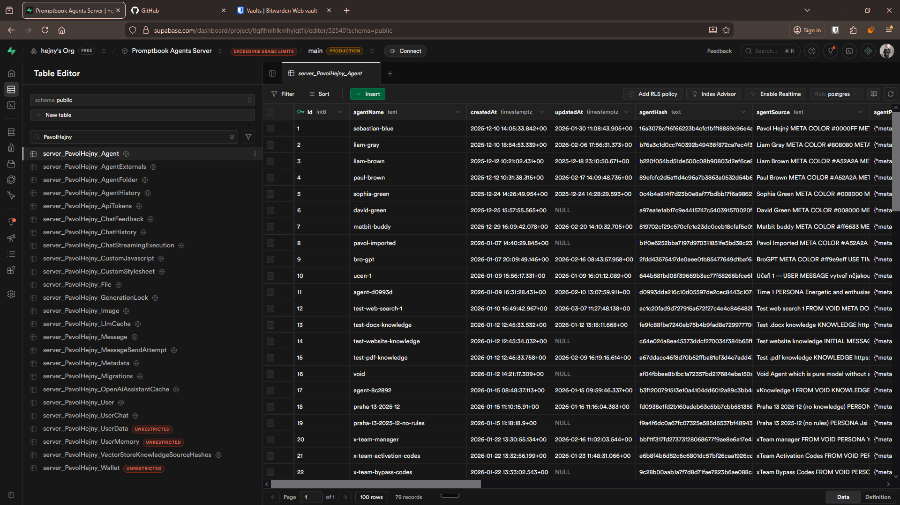
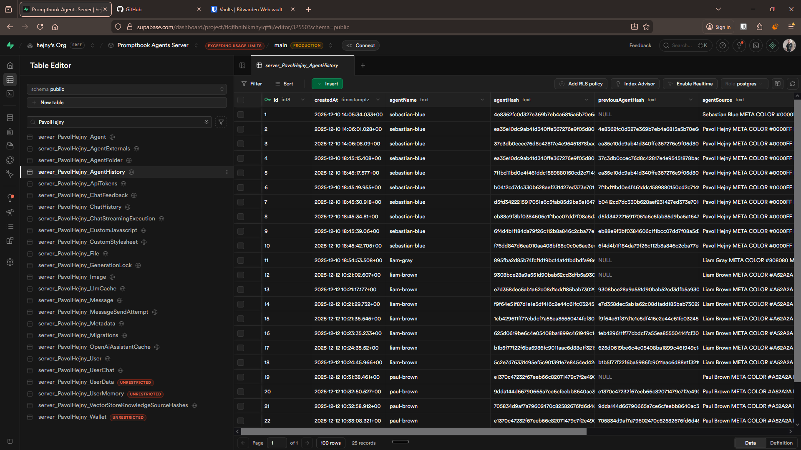

[ ] !

[✨⤵️] Allow to see the history of the agent source code book

-   The book editor is doing auto-saving of the changes that you are doing in the book, but currently there is no way to see the history of these changes and revert them if needed.
-   Implement this with simplicity, UI and UX in mind, it shouldn't be some complex git-like history, but rather a simple list of changes with the ability to see the content of the book at that point and revert to it if needed.
-   Take inspiration from Google docs version history
-   Keep in mind the DRY _(don't repeat yourself)_ principle.
-   Do a proper analysis of the current functionality before you start implementing.
-   You are working with the [Agents Server](apps/agents-server)
-   Theese chamges should be already should be recorded in the database in table `AgentHistory`, but it seems broken _(for every agent in `Agent` table there should be one or more records in `AgentHistory`)_
    -   Do the database migration to save the agent history propperly
-   Add the changes into the [changelog](changelog/_current-preversion.md)

---

[-]

[✨⤵️] brr

-   @@@
-   Keep in mind the DRY _(don't repeat yourself)_ principle.
-   Do a proper analysis of the current functionality before you start implementing.
-   You are working with the [Agents Server](apps/agents-server)
-   If you need to do the database migration, do it
-   Add the changes into the [changelog](changelog/_current-preversion.md)

---

[-]

[✨⤵️] brr

-   @@@
-   Keep in mind the DRY _(don't repeat yourself)_ principle.
-   Do a proper analysis of the current functionality before you start implementing.
-   You are working with the [Agents Server](apps/agents-server)
-   If you need to do the database migration, do it
-   Add the changes into the [changelog](changelog/_current-preversion.md)

---

[-]

[✨⤵️] brr

-   @@@
-   Keep in mind the DRY _(don't repeat yourself)_ principle.
-   Do a proper analysis of the current functionality before you start implementing.
-   You are working with the [Agents Server](apps/agents-server)
-   If you need to do the database migration, do it
-   Add the changes into the [changelog](changelog/_current-preversion.md)
