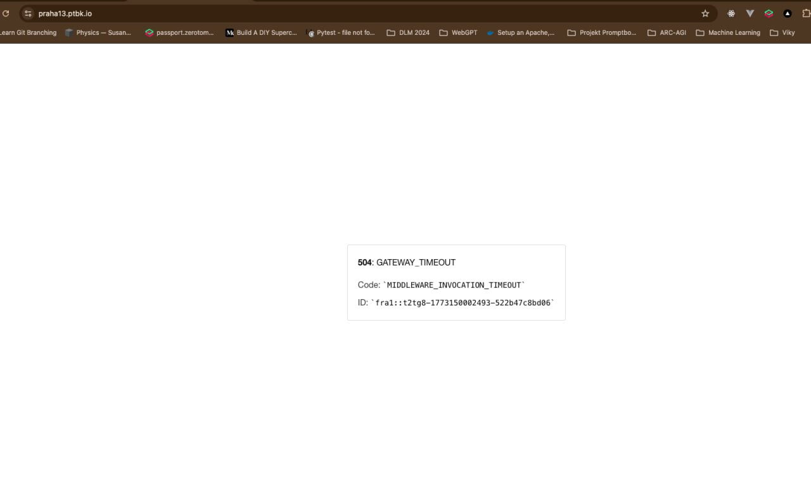

[x] ~$0.2441 15 minutes by OpenAI Codex `gpt-5.4`

[🧯🌩️] Custom 500 page in Next.js on Vercel

-   Goal: Add a custom, branded “500 / Internal Server Error” experience for the Agents server app Next.js app deployed on Vercel, so unexpected server-side failures do not show a default/plain error page.
-   Use the correct Next.js mechanism based on router:
    -   Pages Router: add `pages/500.tsx`.
    -   App Router: implement global error handling via `app/error.tsx` (and optionally `app/global-error.tsx` if applicable) and ensure it covers server/render
    -   Get inspiration from existing Aplication error when wrapping React error boundary, and also from our 404 page.

