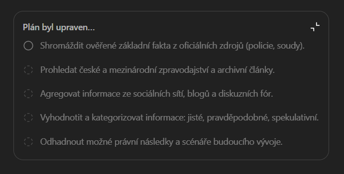

[x] ~$2.28 28 minutes by OpenAI Codex `gpt-5.3-codex`

[🧭📡] Agent web tool for progressive “deep research” style progress updates

-   You are working with [Agents Server](apps/agents-server)
-   When an agent produces a long response in the web UI, the UI currently shows fixed placeholder “thinking” messages; instead we need a generic per-agent tool that can receive structured progress updates and render them in place of the future message (ChatGPT deep research-like UI with bullet points + spinners)
-   Implement a new server-side tool available to the web-launched agent runtime which allows the agent to progressively update the progress panel while it is working
-   The tool API must support:
    -   Creating/initializing a “progress card” for the current agent run
    -   Adding bullet items with pending / completed status
    -   Updating the whole progress card incrementally (multiple calls over time)
    -   A finalization step that replaces the progress card with the real agent response (or at least hides it)
-   Wire the updates from the tool call to the web UI using the existing real-time mechanism used by the agent chat stream (or introduce minimal extra plumbing if required)
-   Ensure the user-visible content:
    -   Shows bullet points and spinners for ongoing tasks
    -   Shows a clear “what I’m doing now” and “what I’ll do next” structure
    -   Uses Markdown formatting from the tool payload where supported (e.g. **bold**, _italic_)
-   Implement constraints:
    -   Keep the tool usage optional; if the agent never calls it, keep the current placeholders
    -   Do not expose internal chain-of-thought; the agent must provide user-facing progress messages only
-   Backend implementation details (placeholders until code inspection):
    -   Find the agent-run / streaming implementation in [Agents Server](apps/agents-server) and add a progress update channel
    -   Create a tool handler that validates payload shape and forwards updates to the UI channel
    -   Keep implementation small and SOLID; reuse existing message rendering / markdown sanitizer if present
-   Frontend implementation details (placeholders until code inspection):
    -   Add a “ProgressPanel” component styled to match existing deep research-like chips/spinners
    -   Ensure the panel occupies the same location where the previous thinking placeholder lived
    -   Support partial updates without re-mounting the whole component
-   Acceptance criteria:
    -   While an agent is producing a long response, the UI updates progressively as the agent calls the tool
    -   Bullet items show spinner while in progress and are replaced with final text when done
    -   Final agent response correctly replaces/hides the progress panel
    -   If tool payload is invalid, it fails gracefully (no crash; logs + keep placeholders)
-   Project entry points to inspect:
    -   [Agents Server](apps/agents-server)

