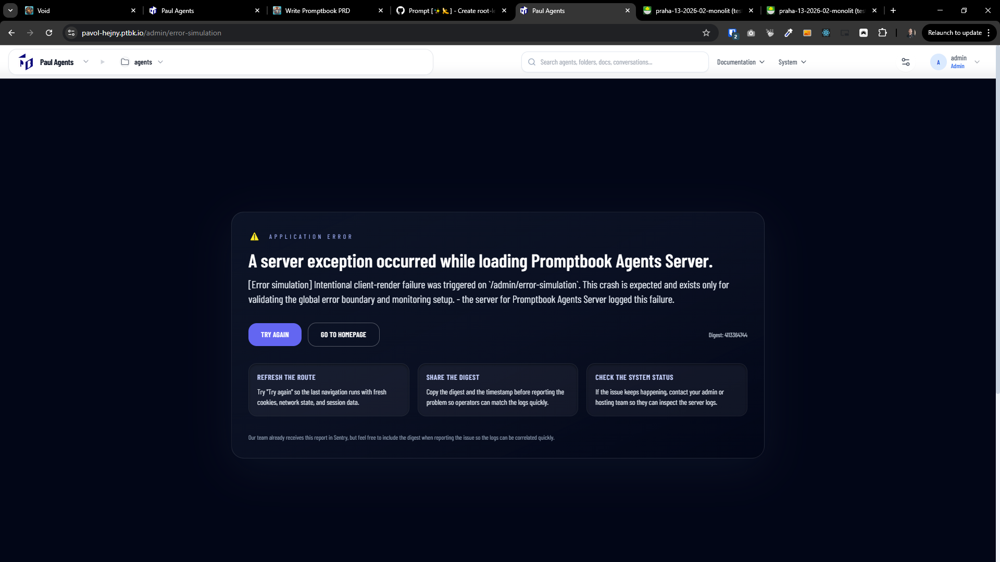

[x] ~$0.2854 30 minutes by OpenAI Codex `gpt-5.3-codex`

[✨🌈] Admin test page for simulating errors on Agents Server

-   We need an internal/testing-only page available in the Agents Server administration UI that allows developers/admins to intentionally trigger (simulate) different kinds of failures.
-   The goal is to be able to quickly verify:
    -   error UI states (toast / inline error / error boundary)
    -   server-side error handling and logging
    -   client-side handling of failed fetches
    -   monitoring/alerting pipeline in staging/production-like environments
-   The page must be located in the [Agents Server](apps/agents-server) admin area (route under `/admin/...`) and must not be publicly accessible via menu

---

[ ]

[✨🌈] Allow to copy "A server exception occurred while loading Promptbook Agents Server."

-> When something is failing, it will be a handful to copy the full report with the entire context and what is happening behind the scenes be copyable as Markdown by one click.

-   There should be 2 options:
    -   Copy - Copy the entire report as markdown to Clipboard
    -   Save - Download the report as file
-   Keep in mind the DRY _(don't repeat yourself)_ principle.
-   Do a proper analysis of the current functionality before you start implementing.
-   You are working with the [Agents Server](apps/agents-server)

---

[-]

[✨🌈] bar

-   @@@
-   Keep in mind the DRY _(don't repeat yourself)_ principle.
-   Do a proper analysis of the current functionality before you start implementing.
-   You are working with the [Agents Server](apps/agents-server)
-   If you need to do the database migration, do it
-   Add the changes into the [changelog](changelog/_current-preversion.md)

---

[-]

[✨🌈] bar

-   @@@
-   Keep in mind the DRY _(don't repeat yourself)_ principle.
-   Do a proper analysis of the current functionality before you start implementing.
-   You are working with the [Agents Server](apps/agents-server)
-   If you need to do the database migration, do it
-   Add the changes into the [changelog](changelog/_current-preversion.md)
