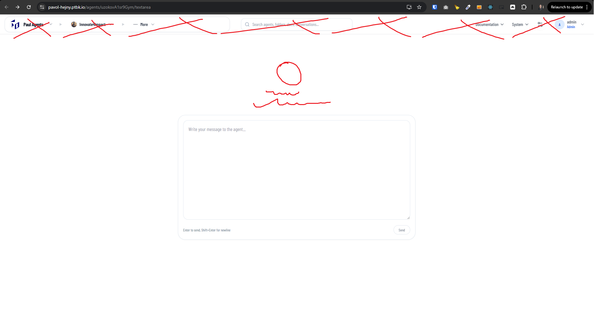
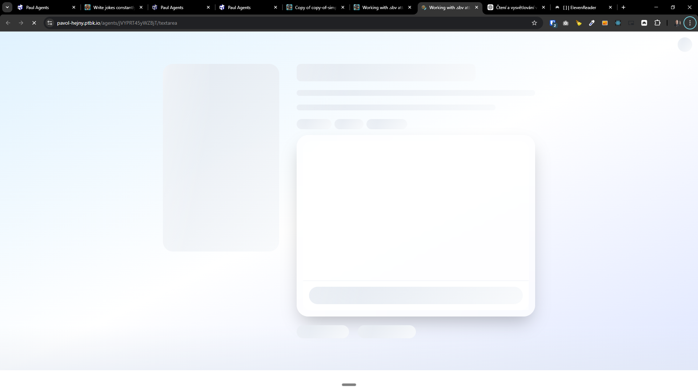
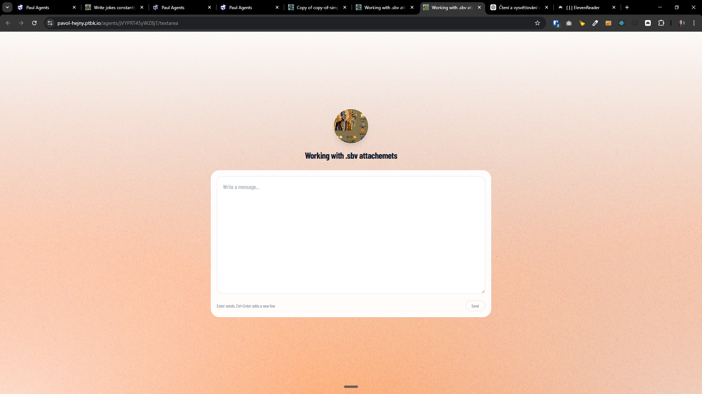

[x] ~$0.2904 21 minutes by OpenAI Codex `gpt-5.3-codex`

[✨🥮] Alternative agent profile page with single centered textarea that sends to agent chat

-   Create an alternative agent profile page (side-by-side option to the current agent profile page; not a replacement).
-   The new page should be extremely simple: one big text area centered on the screen.
-   When user submits text from this text area, it is sent as a message to the existing agent chat (same backend / message pipeline / streaming behavior as standard chat).
-   UI behavior:
    -   The textarea should be focused by default when the page loads.
    -   Enter submits; Shift+Enter adds a newline.
    -   After submit, clear the textarea.
    -   While sending/streaming, disable submit and show subtle sending state (keep design minimal).
-   Navigation / discoverability:
    -   This page should exist alongside the agent profile page.
    -   It should be intentionally “buried” in the agent menu
    -   It is on route `/agents/[agentId]/textarea`
    -   URL/route naming and exact placement in menu is (pick consistent naming with existing routes).
-   Keep in mind the DRY _(don't repeat yourself)_ principle.
-   Do a proper analysis of the current functionality before you start implementing.
-   You are working with the [Agents Server](apps/agents-server)
-   If you need to do the database migration, do it
-   Add the changes into the [changelog](changelog/_current-preversion.md)

---

[x] ~$0.00 19 minutes by OpenAI Codex `gpt-5.3-codex`

[✨🥮] Enhance design of `/agents/[agentId]/textarea` page

-   Do several improvements:
    1. The textarea page shouldn’t have header
    2. Above the textarea, add a profile image of agent in a circle and the name of the agent below it, both centered.
    3. The background of the page should be same as `/agents/[agentId]/` of that agent
-   Keep in mind the DRY _(don't repeat yourself)_ principle.
-   Do a proper analysis of the current functionality before you start implementing.
-   You are working with the [Agents Server](apps/agents-server)

---

[x] ~$0.7527 an hour by OpenAI Codex `gpt-5.3-codex`

[✨🥮] Create commitment `META INPUT PLACEHOLDER`

-   This commitment sets textarea placeholder in a chat
-   This should be used both in `/agents/[agentId]/`, `/agents/[agentId]/chat` and `/agents/[agentId]/textarea`
-   By default, the placeholder should be `Write a message...`
-   Keep in mind the DRY _(don't repeat yourself)_ principle.
-   Do a proper analysis of the current functionality before you start implementing.
-   You are working with the [Agents Server](apps/agents-server)
-   Add the changes into the [changelog](changelog/_current-preversion.md)

---

[x] ~$0.3443 17 minutes by OpenAI Codex `gpt-5.4`

[✨🥮] Enhance skeleton loading of `/agents/[agentId]/textarea` page

-   Skeleton loading of the text area variant page isn't corresponding to the page layout.
-   Do not break skeleton loading, which is shown correctly in a normal chat `/agents/[agentId]/chat` page and also profile `/agents/[agentId]` page, these skeleton loading are working and do not mess with them.
-   You are working with the [Agents Server](apps/agents-server)

