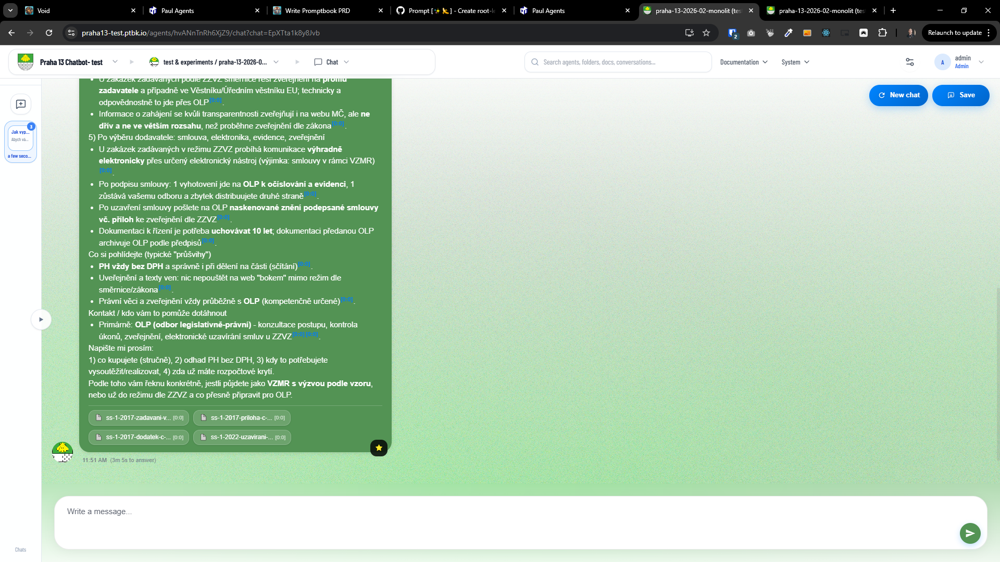
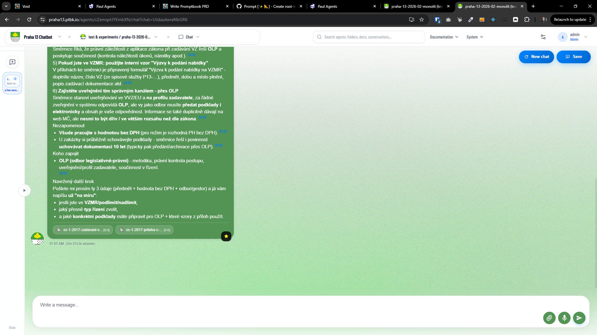

[x] ~$0.6840 24 minutes by OpenAI Codex `gpt-5.3-codex` - _(not working)_

---

[ ]

[✨🍾] Pre-index agent in background on create/update/book write

-   _(@@@ Waiting for better AI agent)_
-   Make it debounced so that rapid changes do not trigger repeated indexing; ensure only one indexing job per agent+version runs at a time.
-   Today the agent’s underlying vector store is created on the first chat message to the agent, which adds latency to the first response and worsens UX.
-   When an agent is created, modified, or its source book/knowledge is written, schedule pre-emptive indexing/preparation of the agent in the background.
-   Add debounce/coalescing so that frequent edits (auto-save in book editor, rapid agent updates) do not trigger repeated indexing work.
    -   Debounce window: 30 seconds after the last change
    -   Coalesce multiple changes into a single latest-index job
-   Ensure only one indexing job per agent+version (or agent+content hash) runs at a time; avoid stampedes when multiple events fire.
-   Define/implement a clear “prepared” state for the agent (vector store exists and is up to date with the latest agent/book content).
    -   Store and compare a content/version fingerprint used for indexing (e.g., `agent.updatedAt` + `book.updatedAt`, or a computed hash).
-   Trigger points to cover:
    -   Agent create
    -   Agent update (name/description/system prompt/settings)
    -   Source book write / knowledge change (including file attachments / scraped sources, if applicable)
-   Background execution:
    -   Use existing background processing mechanism in [Agents Server](apps/agents-server) (queue/worker/cron) or introduce a minimal one if missing.
    -   Must not block the HTTP request that performs the save.
    -   Ensure retries/backoff on transient failures; mark job as failed and re-schedulable.
-   Observability:
    -   Log when a pre-index job is scheduled, started, skipped (already up-to-date), completed, failed.
    -   Add basic metrics/counters if available (scheduled/completed/failed, duration).
-   UX:
    -   The first chat after an edit should typically not need to create the vector store from scratch.
    -   If pre-indexing is still running when a chat starts, chat should proceed (either wait for completion if quick or fall back to on-demand behavior) with minimal perceived delay.
-   Data model:
    -   If needed, add DB fields/tables to store last indexed fingerprint, job status, timestamps.
    -   Do the database migration if needed.
-   Implementation notes:
    -   Keep in mind the DRY _(don't repeat yourself)_ principle.
    -   Do a proper analysis of the current functionality before you start implementing.
    -   You are working with the [Agents Server](apps/agents-server)

---

[x] ~$0.3300 17 minutes by OpenAI Codex `gpt-5.3-codex` - _(not working)_

[✨🍾] You have implemented [Agent preindexing](prompts/2026-03-0170-agents-server-preindex-agent-on-change.md) but it is not wotking

-   Preindexing should be triggered on agent create/update and book write, but it is not working or at least you are not seeing the expected logs/metrics that indicate it is running.
-   This is the commit `593f451d64dbde1aa6cddb65e142d5e61ca4f47c`
-   This is the PRD file `prompts/2026-03-0170-agents-server-preindex-agent-on-change.md`
-   This is the SQL file created `apps/agents-server/src/database/migrations/2026-03-0160-agent-preparation.sql`
-   Keep in mind the DRY _(don't repeat yourself)_ principle.
-   Do a proper analysis of the current functionality of agent preparation and current non-working implementation of preindexing before you start implementing.
-   You are working with the [Agents Server](apps/agents-server)
-   If you need to do the another database migration, do it
-   Add the changes into the [changelog](changelog/_current-preversion.md)

---

[-]

[✨🍾] baz

-   @@@
-   Keep in mind the DRY _(don't repeat yourself)_ principle.
-   Do a proper analysis of the current functionality before you start implementing.
-   You are working with the [Agents Server](apps/agents-server)
-   If you need to do the database migration, do it
-   Add the changes into the [changelog](changelog/_current-preversion.md)

---

[-]

[✨🍾] baz

-   @@@
-   Keep in mind the DRY _(don't repeat yourself)_ principle.
-   Do a proper analysis of the current functionality before you start implementing.
-   You are working with the [Agents Server](apps/agents-server)
-   If you need to do the database migration, do it
-   Add the changes into the [changelog](changelog/_current-preversion.md)

---

[-]

[✨🍾] baz

-   @@@
-   Keep in mind the DRY _(don't repeat yourself)_ principle.
-   Do a proper analysis of the current functionality before you start implementing.
-   You are working with the [Agents Server](apps/agents-server)
-   If you need to do the database migration, do it
-   Add the changes into the [changelog](changelog/_current-preversion.md)
