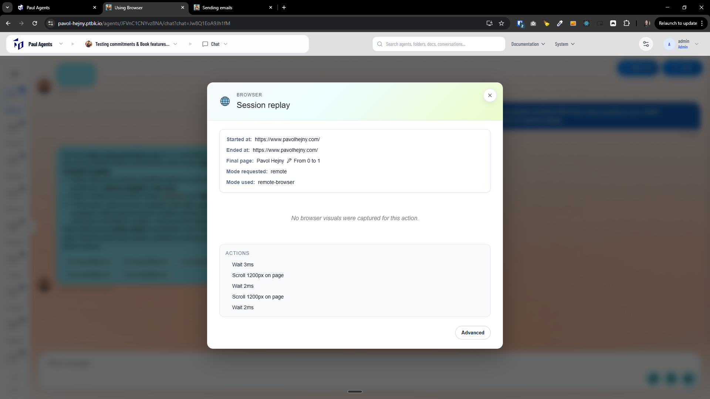

[ ]

[✨🥟] When agent using `run_browser` it should be able to **visually replay** the session and actions made

-   Do a proper analysis of the current functionality before you start implementing.
-   You are working with the [Agents Server](apps/agents-server)
-   If you need to do the database migration, do it
-   Add the changes into the [changelog](changelog/_current-preversion.md)



**Full toolcall report:**

````
# Tool call report

- **Title:** 🌐 Running browser
- **Tool:** `run_browser`
- **Created at:** `2026-03-08T09:42:23.437Z`
- **Idempotency key:** `raw:call_Bmv3tgf5fevFKCtSEFsAEEhu`

## Input payload

~~~json
{
  "toolName": "run_browser",
  "arguments": "{\"url\":\"https://www.pavolhejny.com/\",\"actions\":[{\"type\":\"wait\",\"value\":\"3\"},{\"type\":\"scroll\",\"value\":\"1200\"},{\"type\":\"wait\",\"value\":\"2\"},{\"type\":\"scroll\",\"value\":\"1200\"},{\"type\":\"wait\",\"value\":\"2\"}]}"
}
~~~

## Output payload

~~~text
                # Browser run completed

                **Session:** agents-server-run-browser-d7b73e1a-ed53-4fa2-8bc0-aa9f14dae6aa
                **Mode requested:** remote-browser
                **Mode used:** remote-browser
                **Initial URL:** https://www.pavolhejny.com/
                **Executed actions:** 5

                ## Final page

                - URL: https://www.pavolhejny.com/
                - Title: Pavol Hejny 🖊 From 0 to 1

                ## Timings

                - Connect: 101 ms
                - Initial navigation: 1116 ms
                - Time to first byte: Unknown ms
                - Total: 82233 ms


                ## Playback payload

                ```json
                {
  "schema": "promptbook/run-browser@1",
  "sessionId": "agents-server-run-browser-d7b73e1a-ed53-4fa2-8bc0-aa9f14dae6aa",
  "mode": "remote",
  "modeUsed": "remote-browser",
  "initialUrl": "https://www.pavolhejny.com/",
  "finalUrl": "https://www.pavolhejny.com/",
  "finalTitle": "Pavol Hejny 🖊 From 0 to 1",
  "executedActions": [
    {
      "type": "wait",
      "milliseconds": 3
    },
    {
      "type": "scroll",
      "selector": null,
      "pixels": 1200
    },
    {
      "type": "wait",
      "milliseconds": 2
    },
    {
      "type": "scroll",
      "selector": null,
      "pixels": 1200
    },
    {
      "type": "wait",
      "milliseconds": 2
    }
  ],
  "artifacts": [],
  "warning": null,
  "error": null,
  "fallback": null,
  "timing": {
    "connectDurationMs": 101,
    "initialNavigationDurationMs": 1116,
    "timeToFirstByteMs": null,
    "totalDurationMs": 82233
  }
}
                ```


                                        ## Action log

                                        - 1. {"type":"wait","milliseconds":3}
                - 2. {"type":"scroll","selector":null,"pixels":1200}
                - 3. {"type":"wait","milliseconds":2}
                - 4. {"type":"scroll","selector":null,"pixels":1200}
                - 5. {"type":"wait","milliseconds":2}


                Note: Browser page has been automatically closed to free up resources.
~~~

## Model payload

~~~json
{
  "type": "function_call_result",
  "name": "run_browser",
  "callId": "call_Bmv3tgf5fevFKCtSEFsAEEhu",
  "status": "completed",
  "output": {
    "type": "text",
    "text": "                # Browser run completed\n\n                **Session:** agents-server-run-browser-d7b73e1a-ed53-4fa2-8bc0-aa9f14dae6aa\n                **Mode requested:** remote-browser\n                **Mode used:** remote-browser\n                **Initial URL:** https://www.pavolhejny.com/\n                **Executed actions:** 5\n\n                ## Final page\n\n                - URL: https://www.pavolhejny.com/\n                - Title: Pavol Hejny 🖊 From 0 to 1\n\n                ## Timings\n\n                - Connect: 101 ms\n                - Initial navigation: 1116 ms\n                - Time to first byte: Unknown ms\n                - Total: 82233 ms\n\n                \n\n                \n\n                ## Playback payload\n\n                ```json\n                {\n  \"schema\": \"promptbook/run-browser@1\",\n  \"sessionId\": \"agents-server-run-browser-d7b73e1a-ed53-4fa2-8bc0-aa9f14dae6aa\",\n  \"mode\": \"remote\",\n  \"modeUsed\": \"remote-browser\",\n  \"initialUrl\": \"https://www.pavolhejny.com/\",\n  \"finalUrl\": \"https://www.pavolhejny.com/\",\n  \"finalTitle\": \"Pavol Hejny 🖊 From 0 to 1\",\n  \"executedActions\": [\n    {\n      \"type\": \"wait\",\n      \"milliseconds\": 3\n    },\n    {\n      \"type\": \"scroll\",\n      \"selector\": null,\n      \"pixels\": 1200\n    },\n    {\n      \"type\": \"wait\",\n      \"milliseconds\": 2\n    },\n    {\n      \"type\": \"scroll\",\n      \"selector\": null,\n      \"pixels\": 1200\n    },\n    {\n      \"type\": \"wait\",\n      \"milliseconds\": 2\n    }\n  ],\n  \"artifacts\": [],\n  \"warning\": null,\n  \"error\": null,\n  \"fallback\": null,\n  \"timing\": {\n    \"connectDurationMs\": 101,\n    \"initialNavigationDurationMs\": 1116,\n    \"timeToFirstByteMs\": null,\n    \"totalDurationMs\": 82233\n  }\n}\n                ```\n\n                \n                                        ## Action log\n                \n                                        - 1. {\"type\":\"wait\",\"milliseconds\":3}\n                - 2. {\"type\":\"scroll\",\"selector\":null,\"pixels\":1200}\n                - 3. {\"type\":\"wait\",\"milliseconds\":2}\n                - 4. {\"type\":\"scroll\",\"selector\":null,\"pixels\":1200}\n                - 5. {\"type\":\"wait\",\"milliseconds\":2}\n                                    \n\n                Note: Browser page has been automatically closed to free up resources."
  }
}
~~~

## Full event

~~~json
{
  "name": "run_browser",
  "arguments": "{\"url\":\"https://www.pavolhejny.com/\",\"actions\":[{\"type\":\"wait\",\"value\":\"3\"},{\"type\":\"scroll\",\"value\":\"1200\"},{\"type\":\"wait\",\"value\":\"2\"},{\"type\":\"scroll\",\"value\":\"1200\"},{\"type\":\"wait\",\"value\":\"2\"}]}",
  "rawToolCall": {
    "type": "function_call_result",
    "name": "run_browser",
    "callId": "call_Bmv3tgf5fevFKCtSEFsAEEhu",
    "status": "completed",
    "output": {
      "type": "text",
      "text": "                # Browser run completed\n\n                **Session:** agents-server-run-browser-d7b73e1a-ed53-4fa2-8bc0-aa9f14dae6aa\n                **Mode requested:** remote-browser\n                **Mode used:** remote-browser\n                **Initial URL:** https://www.pavolhejny.com/\n                **Executed actions:** 5\n\n                ## Final page\n\n                - URL: https://www.pavolhejny.com/\n                - Title: Pavol Hejny 🖊 From 0 to 1\n\n                ## Timings\n\n                - Connect: 101 ms\n                - Initial navigation: 1116 ms\n                - Time to first byte: Unknown ms\n                - Total: 82233 ms\n\n                \n\n                \n\n                ## Playback payload\n\n                ```json\n                {\n  \"schema\": \"promptbook/run-browser@1\",\n  \"sessionId\": \"agents-server-run-browser-d7b73e1a-ed53-4fa2-8bc0-aa9f14dae6aa\",\n  \"mode\": \"remote\",\n  \"modeUsed\": \"remote-browser\",\n  \"initialUrl\": \"https://www.pavolhejny.com/\",\n  \"finalUrl\": \"https://www.pavolhejny.com/\",\n  \"finalTitle\": \"Pavol Hejny 🖊 From 0 to 1\",\n  \"executedActions\": [\n    {\n      \"type\": \"wait\",\n      \"milliseconds\": 3\n    },\n    {\n      \"type\": \"scroll\",\n      \"selector\": null,\n      \"pixels\": 1200\n    },\n    {\n      \"type\": \"wait\",\n      \"milliseconds\": 2\n    },\n    {\n      \"type\": \"scroll\",\n      \"selector\": null,\n      \"pixels\": 1200\n    },\n    {\n      \"type\": \"wait\",\n      \"milliseconds\": 2\n    }\n  ],\n  \"artifacts\": [],\n  \"warning\": null,\n  \"error\": null,\n  \"fallback\": null,\n  \"timing\": {\n    \"connectDurationMs\": 101,\n    \"initialNavigationDurationMs\": 1116,\n    \"timeToFirstByteMs\": null,\n    \"totalDurationMs\": 82233\n  }\n}\n                ```\n\n                \n                                        ## Action log\n                \n                                        - 1. {\"type\":\"wait\",\"milliseconds\":3}\n                - 2. {\"type\":\"scroll\",\"selector\":null,\"pixels\":1200}\n                - 3. {\"type\":\"wait\",\"milliseconds\":2}\n                - 4. {\"type\":\"scroll\",\"selector\":null,\"pixels\":1200}\n                - 5. {\"type\":\"wait\",\"milliseconds\":2}\n                                    \n\n                Note: Browser page has been automatically closed to free up resources."
    }
  },
  "createdAt": "2026-03-08T09:42:23.437Z",
  "idempotencyKey": "raw:call_Bmv3tgf5fevFKCtSEFsAEEhu",
  "result": "                # Browser run completed\n\n                **Session:** agents-server-run-browser-d7b73e1a-ed53-4fa2-8bc0-aa9f14dae6aa\n                **Mode requested:** remote-browser\n                **Mode used:** remote-browser\n                **Initial URL:** https://www.pavolhejny.com/\n                **Executed actions:** 5\n\n                ## Final page\n\n                - URL: https://www.pavolhejny.com/\n                - Title: Pavol Hejny 🖊 From 0 to 1\n\n                ## Timings\n\n                - Connect: 101 ms\n                - Initial navigation: 1116 ms\n                - Time to first byte: Unknown ms\n                - Total: 82233 ms\n\n                \n\n                \n\n                ## Playback payload\n\n                ```json\n                {\n  \"schema\": \"promptbook/run-browser@1\",\n  \"sessionId\": \"agents-server-run-browser-d7b73e1a-ed53-4fa2-8bc0-aa9f14dae6aa\",\n  \"mode\": \"remote\",\n  \"modeUsed\": \"remote-browser\",\n  \"initialUrl\": \"https://www.pavolhejny.com/\",\n  \"finalUrl\": \"https://www.pavolhejny.com/\",\n  \"finalTitle\": \"Pavol Hejny 🖊 From 0 to 1\",\n  \"executedActions\": [\n    {\n      \"type\": \"wait\",\n      \"milliseconds\": 3\n    },\n    {\n      \"type\": \"scroll\",\n      \"selector\": null,\n      \"pixels\": 1200\n    },\n    {\n      \"type\": \"wait\",\n      \"milliseconds\": 2\n    },\n    {\n      \"type\": \"scroll\",\n      \"selector\": null,\n      \"pixels\": 1200\n    },\n    {\n      \"type\": \"wait\",\n      \"milliseconds\": 2\n    }\n  ],\n  \"artifacts\": [],\n  \"warning\": null,\n  \"error\": null,\n  \"fallback\": null,\n  \"timing\": {\n    \"connectDurationMs\": 101,\n    \"initialNavigationDurationMs\": 1116,\n    \"timeToFirstByteMs\": null,\n    \"totalDurationMs\": 82233\n  }\n}\n                ```\n\n                \n                                        ## Action log\n                \n                                        - 1. {\"type\":\"wait\",\"milliseconds\":3}\n                - 2. {\"type\":\"scroll\",\"selector\":null,\"pixels\":1200}\n                - 3. {\"type\":\"wait\",\"milliseconds\":2}\n                - 4. {\"type\":\"scroll\",\"selector\":null,\"pixels\":1200}\n                - 5. {\"type\":\"wait\",\"milliseconds\":2}\n                                    \n\n                Note: Browser page has been automatically closed to free up resources."
}
~~~
````

---

[-]

[✨🥟] qux

-   @@@
-   Keep in mind the DRY _(don't repeat yourself)_ principle.
-   Do a proper analysis of the current functionality before you start implementing.
-   You are working with the [Agents Server](apps/agents-server)
-   If you need to do the database migration, do it
-   Add the changes into the [changelog](changelog/_current-preversion.md)

---

[-]

[✨🥟] qux

-   @@@
-   Keep in mind the DRY _(don't repeat yourself)_ principle.
-   Do a proper analysis of the current functionality before you start implementing.
-   You are working with the [Agents Server](apps/agents-server)
-   If you need to do the database migration, do it
-   Add the changes into the [changelog](changelog/_current-preversion.md)

---

[-]

[✨🥟] qux

-   @@@
-   Keep in mind the DRY _(don't repeat yourself)_ principle.
-   Do a proper analysis of the current functionality before you start implementing.
-   You are working with the [Agents Server](apps/agents-server)
-   If you need to do the database migration, do it
-   Add the changes into the [changelog](changelog/_current-preversion.md)
