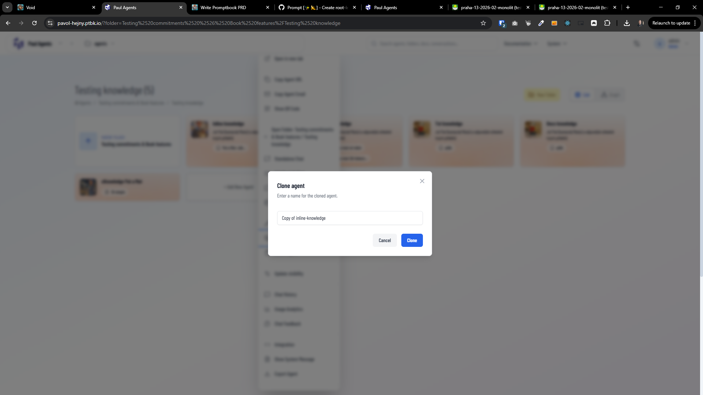

[x] ~$1.21 40 minutes by OpenAI Codex `gpt-5.3-codex`

[✨📱] Prevent accidental closing of text-input modals with unsaved changes

-   When cloning an agent, there is a modal where user inputs the name of the newly cloned agent; it can be dismissed too easily (click outside / ESC) and user can lose typed text.
-   Make this behavior global for all modals across [Agents Server](apps/agents-server) that contain user-editable text inputs (input/textarea/editor-like), so typed text cannot be lost by accidental close.
-   Implement a reusable “dirty modal” guard (shared util/hook/component) that:
    -   Detects whether modal has unsaved/unsubmitted changes.
    -   Blocks closing by overlay click, ESC, or programmatic close unless user explicitly confirms discarding changes.
    -   Allows closing without confirmation when there are no changes (pristine) or after successful submit.
-   Apply this guard to the cloning modal and audit other existing prompt modals with text input to adopt it.
-   Look for existing patterns in Agents Server where we prevent losing user work:
    -   Before-unload browser close prevention.
    -   Existing modal close interception (if any).
    -   Reuse/extend those patterns instead of introducing a parallel approach.
-   Ensure accessibility and UX:
    -   Focus management remains correct.
    -   Keyboard-only users can’t accidentally dismiss and lose text.
    -   Confirmation dialog is clear and not overly intrusive.
-   Add/adjust tests: at least one Playwright test covering the clone-agent modal scenario (type name → attempt to close via overlay/ESC → confirm discard → modal closes / cancel discard → modal stays).
-   You are working with the [Agents Server](apps/agents-server)
-   Add the changes into the [changelog](changelog/_current-preversion.md)

---

[-]

[✨📱] bar

-   @@@
-   Keep in mind the DRY _(don't repeat yourself)_ principle.
-   Do a proper analysis of the current functionality before you start implementing.
-   You are working with the [Agents Server](apps/agents-server)
-   If you need to do the database migration, do it
-   Add the changes into the [changelog](changelog/_current-preversion.md)

---

[-]

[✨📱] bar

-   @@@
-   Keep in mind the DRY _(don't repeat yourself)_ principle.
-   Do a proper analysis of the current functionality before you start implementing.
-   You are working with the [Agents Server](apps/agents-server)
-   If you need to do the database migration, do it
-   Add the changes into the [changelog](changelog/_current-preversion.md)

---

[-]

[✨📱] bar

-   @@@
-   Keep in mind the DRY _(don't repeat yourself)_ principle.
-   Do a proper analysis of the current functionality before you start implementing.
-   You are working with the [Agents Server](apps/agents-server)
-   If you need to do the database migration, do it
-   Add the changes into the [changelog](changelog/_current-preversion.md)
-