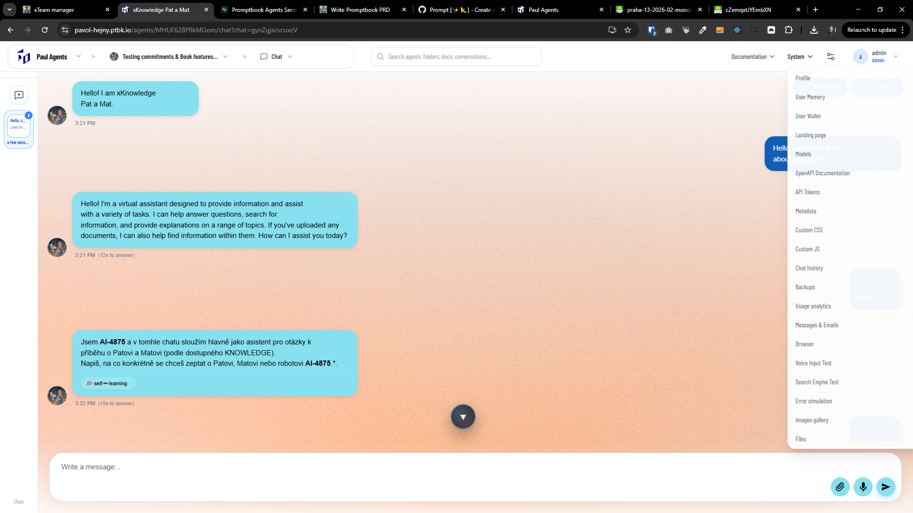

[ ]

[✨📱] Organize the System top-menu into logical submenus

-   In the Agents Server header, the last top-level item `System` currently contains many unrelated pages in a single flat list due to rapid development; reorganize it into a small set of logical submenus so users can quickly find things.
-   Keep the first-level top navigation unchanged (still `System` as the last item), only restructure the contents inside.
-   Do a quick audit of the current items under `System` and propose categories based on _what the user is trying to do_, not based on implementation details.
-   Implement the reorganization using submenus / nested items (whatever the current menu component supports) and keep the interaction simple
-   Preserve deep-linking / routes: existing URLs must keep working; this is a navigation restructure, not a route redesign.
-   Ensure that every existing `System` item is present exactly once in the new structure (no lost links), and avoid duplicate entries.
-   Suggested initial grouping (adjust after audit):
    -   `Administration` (users, access, roles, teams, etc.)
    -   `Monitoring & Usage` (usage, logs, metrics, tracing, etc.)
    -   `Integrations & Keys` (API keys, webhooks, external services, etc.)
    -   `Developer / Debug` (test pages, feature flags, internal tools, experimental pages)
    -   `Legal & About` (privacy, terms, version, changelog links)
    -   Maybe some items don't fit well into any category and create new categories as needed, but try to keep it to a minimum.
-   Validate UX on smaller widths: the System menu must remain usable on narrower screens.
-   Keep in mind the DRY _(don't repeat yourself)_ principle.
-   Do a proper analysis of the current functionality before you start implementing.
-   You are working with the [Agents Server](apps/agents-server)
-   Add the changes into the [changelog](changelog/_current-preversion.md)

---

[-]

[✨📱] bar

-   @@@
-   Keep in mind the DRY _(don't repeat yourself)_ principle.
-   Do a proper analysis of the current functionality before you start implementing.
-   You are working with the [Agents Server](apps/agents-server)
-   If you need to do the database migration, do it
-   Add the changes into the [changelog](changelog/_current-preversion.md)

---

[-]

[✨📱] bar

-   @@@
-   Keep in mind the DRY _(don't repeat yourself)_ principle.
-   Do a proper analysis of the current functionality before you start implementing.
-   You are working with the [Agents Server](apps/agents-server)
-   If you need to do the database migration, do it
-   Add the changes into the [changelog](changelog/_current-preversion.md)

---

[-]

[✨📱] bar

-   @@@
-   Keep in mind the DRY _(don't repeat yourself)_ principle.
-   Do a proper analysis of the current functionality before you start implementing.
-   You are working with the [Agents Server](apps/agents-server)
-   If you need to do the database migration, do it
-   Add the changes into the [changelog](changelog/_current-preversion.md)

---

[-]

[✨📱] bar

-   @@@
-   Keep in mind the DRY _(don't repeat yourself)_ principle.
-   Do a proper analysis of the current functionality before you start implementing.
-   You are working with the [Agents Server](apps/agents-server)
-   If you need to do the database migration, do it
-   Add the changes into the [changelog](changelog/_current-preversion.md)
