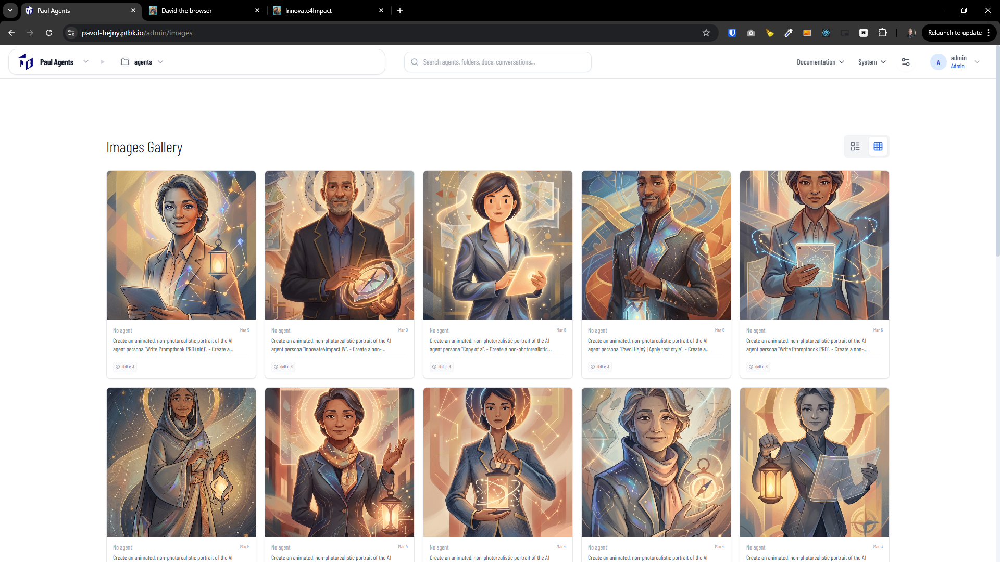
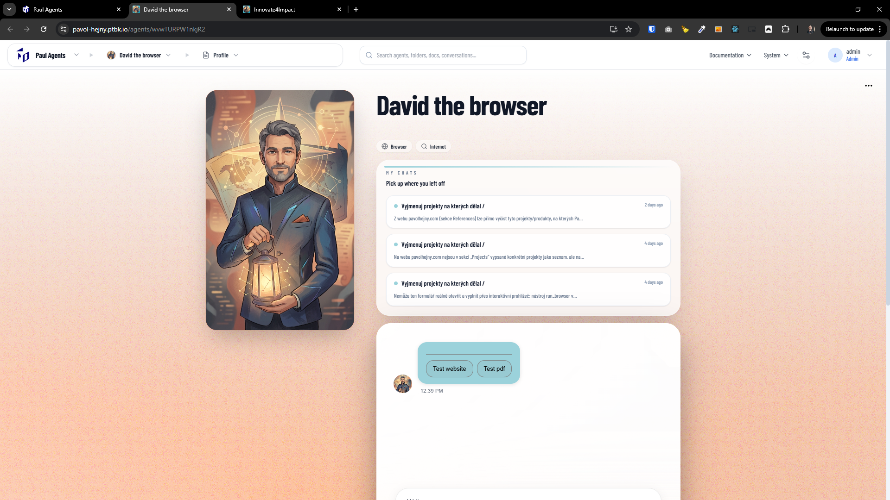
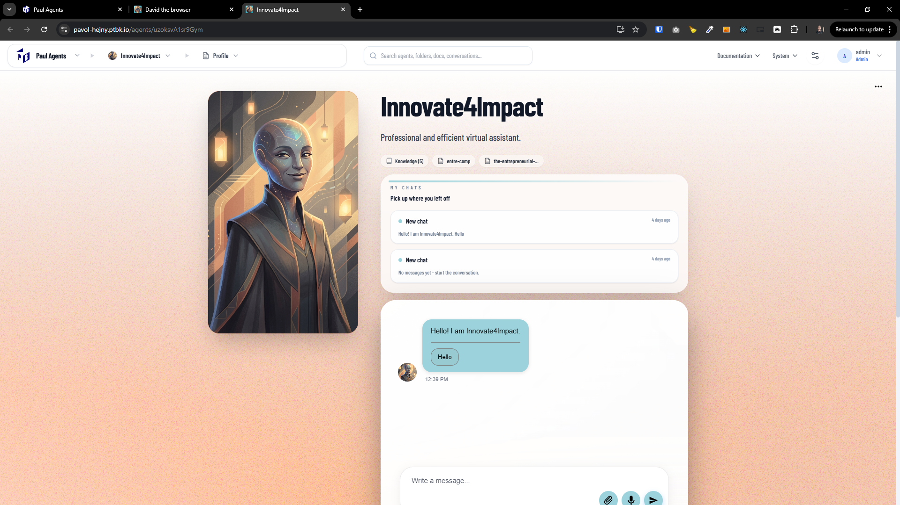

[ ]

[✨🍪] Use NanoBanana instead of Dalle to generate agent profile images

-   @@@ Wait for Google API invalidation
-   Use Google NanoBanana as the image generator for default/generated agent profile images (not OpenAI DALL-E).
-   NanoBanana is already in progress but probbably not yet fully integrated, so the implementation will likely involve finishing the integration
-   Keep in mind the DRY _(don't repeat yourself)_ principle.
-   Do a proper analysis of the current functionality before you start implementing.
-   You are working with the [Agents Server](apps/agents-server)
-   If you need to do the database migration, do it
-   Add the changes into the [changelog](changelog/_current-preversion.md)

---

[ ]

[✨🍪] Enhance generated agent profile images _(use NanoBanana + higher variability)_

-   @@@ Maybe not needed / done by Agent
-   Generated agent profile images are currently "good enough" but too uniform (often cartoonish/fantasy/fancy). Improve the quality and make the generated style vary more depending on the agent purpose (professional/business vs fun/game/etc.).
-   Use Google NanoBanana as the image generator for default/generated agent profile images (not OpenAI DALL-E).
-   NanoBanana is already in progress but probbably not yet fully integrated, so the implementation will likely involve finishing the integration
-   Keep explicit agent profile images unchanged:
    -   If a profile image is explicitly set (by commitment / meta image / user upload), always use it and never overwrite it with generated defaults.
    -   Only generate when no explicit profile image is present.
-   Add a style-selection layer for generation that increases variability and better matches the agent persona:
    -   Derive an `imageStyle` (or similar) from agent metadata: name, description, system prompt, tags/categories, and/or detected "job role".
    -   At minimum support 2 primary buckets:
        -   Professional: realistic photograph look, studio lighting, neutral background, professional attire, subtle job-relevant attributes (e.g. lawyer, accountant).
        -   Fun/creative: allow more playful illustration styles similar to current output.
    -   Add additional styles as feasible (placeholders): @@@
-   Ensure deterministic(ish) variety:
    -   For the same agent (same stable identifier + same relevant metadata), generated image should be stable across reloads.
    -   Across different agents, ensure a broad distribution of styles so lists/chats don’t look monotonous.
    -   Use a stable seed derived from agent id + selected style + small random salt palette (predefined) to avoid accidental convergence.
-   Prompting requirements:
    -   Build NanoBadana prompts with a shared base prompt (composition requirements: centered subject, square crop, head-and-shoulders, consistent framing) + style-specific prompt fragments.
    -   Include negative prompt fragments (or equivalent) to avoid the undesired “cartoonish fantasy” look for professional agents.
    -   Prevent brand/logo generation and avoid sensitive content.
-   Image output requirements:
    -   Generate square images suitable for avatar usage.
    -   Produce at least one canonical size for storage and then serve resized variants (or generate a good size directly): @@@
    -   Keep file size reasonable and format consistent with current storage (e.g. webp/png): @@@
-   Backfill strategy:
    -   Existing agents with generated defaults should be eligible for regeneration only when their current image is a generated default (not explicit).
    -   Avoid mass-regenerating all images automatically on deploy; introduce a gradual migration (e.g. regenerate on next access, background job, or admin-only trigger): @@@
-   UI/UX impact:
    -   Ensure agent avatars in chat and profile load fast and don’t flicker; show placeholder while generating.
    -   Make sure the new variability does not break the visual consistency of the UI (framing and crop must remain consistent).
-   Observability/ops:
    -   Log which provider generated the image (NanoBadana), style chosen, and whether it was generated vs explicit.
    -   Add basic error handling and fallback (if NanoBadana fails, fallback strategy): @@@
-   Do a proper analysis of the current functionality before you start implementing.
-   You are working with the [Agents Server](apps/agents-server)
-   Touchpoints/files to inspect and likely update:
    -   Image generation pipeline used for agent profile images (current DALL\*E integration): @@@
    -   Agent profile image storage / retrieval (DB + blob storage): @@@
    -   UI surfaces that display avatars (chat bubbles, agent profile page): @@@
    -   Configuration for LLM/image providers (env + provider factory): @@@
-   If you need to do the database migration, do it
-   Add the changes into the [changelog](changelog/_current-preversion.md)

---

[-]

[✨🍪] bar

-   @@@
-   Keep in mind the DRY _(don't repeat yourself)_ principle.
-   Do a proper analysis of the current functionality before you start implementing.
-   You are working with the [Agents Server](apps/agents-server)
-   If you need to do the database migration, do it
-   Add the changes into the [changelog](changelog/_current-preversion.md)

---

[-]

[✨🍪] bar

-   @@@
-   Keep in mind the DRY _(don't repeat yourself)_ principle.
-   Do a proper analysis of the current functionality before you start implementing.
-   You are working with the [Agents Server](apps/agents-server)
-   If you need to do the database migration, do it
-   Add the changes into the [changelog](changelog/_current-preversion.md)

---

[-]

[✨🍪] bar

-   @@@
-   Keep in mind the DRY _(don't repeat yourself)_ principle.
-   Do a proper analysis of the current functionality before you start implementing.
-   You are working with the [Agents Server](apps/agents-server)
-   If you need to do the database migration, do it
-   Add the changes into the [changelog](changelog/_current-preversion.md)
